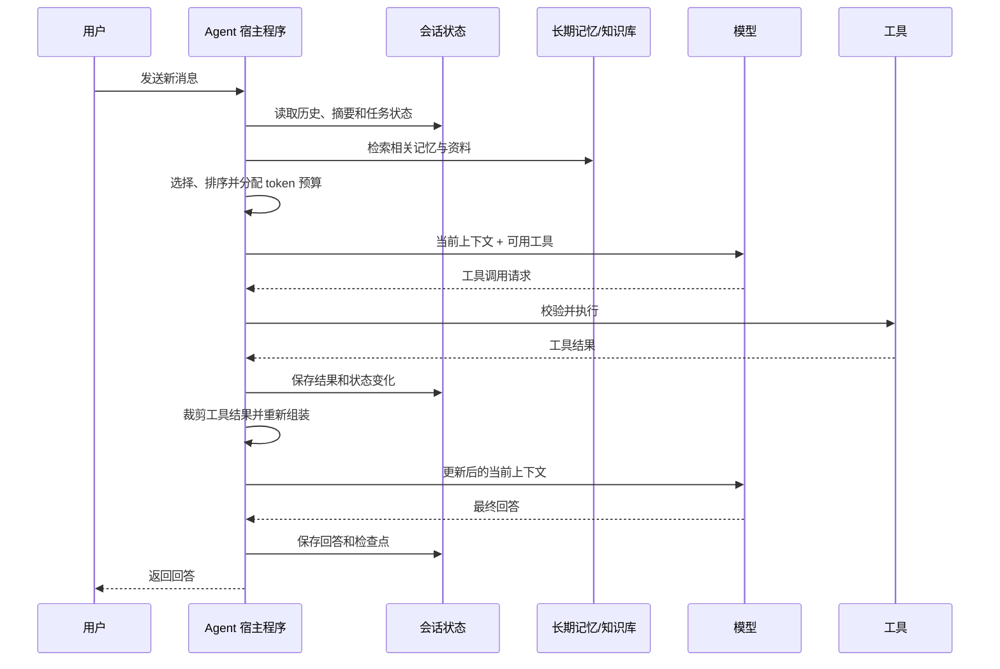

上下文（Context）是模型在一次推理调用中实际能够看到的 token 集合。它可能包含系统指令、当前问题、部分对话历史、工具说明、工具结果、检索资料和记忆。上下文管理负责在每次模型调用前选择和组织这些信息，并在调用后更新会话状态。

模型的 Context Window（上下文窗口）只规定单次调用能容纳多少输入和输出，不会自动形成跨调用的记忆。即使模型服务提供会话 ID 或前序响应 ID，也是服务端代替应用保存和传递会话状态；从 Agent 架构看，仍然需要决定下一次调用使用哪些信息。

## 每一轮都重新建立当前上下文

一个最小多轮对话可以直接保存消息数组，并在收到新消息时再次发送：

```ts
async function reply(threadId: string, userMessage: Message) {
  const state = await loadThread(threadId)
  state.messages.push(userMessage)

  const response = await callModel({
    instructions: SYSTEM_INSTRUCTIONS,
    messages: state.messages
  })

  state.messages.push(response.message)
  await saveThread(threadId, state)
  return response.message
}
```

这里的 `state.messages` 保存在应用或模型平台中，不在模型参数里。下一轮能延续对话，是因为历史消息再次进入了模型上下文，而不是模型在上一次调用结束后仍保留着这段对话。

支持会话状态的模型 API 可以隐藏消息重放过程。例如，应用只发送 `previous_response_id`，由平台关联前序响应。应用自行管理历史时，则需要保存并重新发送所需的消息和工具调用项。两种方式改变了状态由谁保存，没有改变上下文仍受窗口限制这一事实。

## 会话状态与当前上下文

应用保存的状态不必全部发给模型。应把“系统持有什么”和“模型本轮看什么”分开：

| 信息层 | 持续范围 | 示例 | 是否默认进入模型调用 |
| --- | --- | --- | --- |
| 运行时配置 | 当前请求或会话 | 用户 ID、权限、数据库连接 | 否 |
| 会话状态 | 同一线程或任务 | 消息历史、任务阶段、上传文件引用 | 按需选择 |
| 长期记忆 | 跨会话 | 用户偏好、历史经验、稳定事实 | 检索后选择 |
| 当前上下文 | 单次模型调用 | 指令、选中的消息、工具和资料 | 是 |

会话状态也常被称为短期记忆。它可以包含完整消息历史，也可以包含模型不需要直接看到的结构化字段，例如审批状态、重试次数和资源 ID。后者应由宿主程序读取和校验，不需要为方便程序控制而消耗模型上下文。

[LangChain 的上下文模型](https://docs.langchain.com/oss/python/concepts/context)也采用类似边界：State 保存会话范围的短期记忆，Store 保存跨会话的长期记忆，而模型上下文只是一次调用中的临时视图。

## 一次 Agent 循环如何组装上下文

工具型 Agent 会在模型调用和工具执行之间循环。每次调用前，宿主程序都根据最新状态重新组装上下文：



组装过程通常包含以下来源：

1. **行为约束**：系统或开发者指令、输出格式和安全规则。
2. **任务状态**：目标、已完成步骤、待处理事项和不可变约束。
3. **可用能力**：当前步骤允许使用的工具及其参数说明。
4. **对话证据**：与当前任务相关的消息、用户确认和工具结果。
5. **外部信息**：从长期记忆、知识库或文件中检索到的内容。
6. **当前请求**：用户这一轮的消息。

这些内容没有适用于所有模型和任务的固定排列模板。应遵守所用 API 的消息角色和优先级规则，并通过评估确定信息顺序。无论如何排列，都应保留来源边界，避免把检索文本或工具输出误当成高优先级指令。

## 用预算约束上下文

上下文窗口同时容纳输入和输出。应用不能把输入填满窗口后再期望模型生成长回答。一个简单预算可以写成：

```text
输入预算 = 上下文窗口 - 预留输出 - 安全余量

输入预算
├── 固定部分：系统指令、必要工具、输出 Schema
└── 动态部分：历史、工具结果、检索资料、记忆
```

预算不是平均分配。执行代码修改时，当前文件和错误输出可能比早期对话重要；处理客服对话时，用户最近确认的订单和约束可能优先。组装器至少需要知道每个候选片段的 token 数、来源、时间、相关性和优先级。

可使用两个阈值：

- **软阈值**：接近后开始压缩历史、限制检索数量或缩短工具结果；
- **硬阈值**：超过后拒绝组装，避免依赖模型平台不透明的自动截断。

更大的窗口也不意味着应该发送全部可用信息。长上下文会增加成本和延迟，并可能让旧信息或无关信息干扰当前任务。[Anthropic 对上下文工程的定义](https://www.anthropic.com/engineering/effective-context-engineering-for-ai-agents)强调选择能够支持目标行为的高信号 token，而不是追求装满窗口。

## 四类策略如何落到系统中

上下文工程常被归纳为写入、选择、压缩和隔离四类策略。本文只说明它们在系统中的职责，策略来源和业界案例见 [阅读笔记：Context Engineering for Agents](../prompt-engineering/context-engineering-for-agents.md)。

| 策略 | 系统职责 | 关键约束 |
| --- | --- | --- |
| 写入 | 把计划、摘要、结果和产物保存到会话状态、文件或长期记忆 | 保存稳定引用，不依赖模型记住存储位置 |
| 选择 | 从历史、工具、知识和记忆中选择本轮需要的内容 | 保留目标与用户确认，按需读取其余信息 |
| 压缩 | 裁剪重复内容，摘要早期历史，提取结构化状态 | 摘要是有损转换，关键字段和原始证据需要保留 |
| 隔离 | 让大对象、凭据、独立子任务和其他租户的数据留在当前上下文之外 | 隔离边界由宿主程序实施，不能只依赖模型判断 |

按需读取（Just-in-time Retrieval）让 Agent 先看到文件路径、对象 ID 等轻量引用，需要时再展开内容。它能减少无关 token，也会增加工具调用和延迟。子 Agent 则以独立上下文隔离子任务，但会引入额外成本和交接损失，应根据任务评估使用。

## 长任务中的状态恢复

当任务持续时间超过一个上下文窗口，消息历史不再适合作为唯一状态。可恢复的检查点至少应记录：

```yaml
goal: 修复结算接口的重复扣款问题
constraints:
  - 不改变公开 API
completed:
  - 已复现超时后的重复提交
decisions:
  - 使用服务端生成的幂等键
next_steps:
  - 补充并发测试
artifacts:
  - path: tests/checkout/idempotency.test.ts
open_questions:
  - 支付渠道是否支持按幂等键查询
```

新上下文可以从检查点、最近消息和相关文件恢复，而不必重放所有操作轨迹。[Anthropic 的长任务实践](https://www.anthropic.com/engineering/effective-harnesses-for-long-running-agents)同样通过明确的进度和交接产物连接彼此独立的上下文窗口。

## 常见失效方式

| 失效方式 | 表现 | 处理方向 |
| --- | --- | --- |
| 旧信息干扰 | 模型继续使用已经失效的约束或结果 | 标记版本和有效期，优先注入当前状态 |
| 信息冲突 | 用户新要求与摘要、记忆或旧消息不一致 | 保留来源和时间，按明确规则解决冲突 |
| 中间信息丢失 | 长上下文中的关键条件未被使用 | 提取关键约束，在调用前执行确定性检查 |
| 摘要漂移 | 多次摘要后事实逐渐变化 | 从原始证据重新生成，关键字段结构化保存 |
| 工具输出膨胀 | 日志或搜索结果占据大部分窗口 | 分页、过滤、截断，并允许按引用继续读取 |
| 上下文投毒 | 外部文本中的指令影响后续规划或工具调用 | 把外部内容标记为数据，限制写入和执行权限 |

上传文件、网页、工具结果和其他 Agent 的输出都可能包含不可信指令。如果这些内容被写入摘要或长期记忆，影响会跨轮甚至跨会话持续。OWASP 将这种情况归为 [Memory & Context Poisoning](https://genai.owasp.org/2026/05/13/memory-is-a-feature-it-is-also-an-attack-surface/)。防护不能只依赖提示词，应由宿主程序实施来源标记、租户隔离、写入审批、权限检查和高影响操作确认。

## 如何评估上下文管理

上下文管理需要在固定任务集上评估，而不是只观察回答是否流畅：

| 指标 | 要回答的问题 |
| --- | --- |
| 任务成功率 | 模型是否在真实约束下完成任务 |
| 关键信息保留率 | 压缩后是否仍保留目标、否定条件、数字和决策 |
| 无关信息率 | 注入内容中有多少与当前步骤无关 |
| 冲突处理正确率 | 新旧信息冲突时是否采用正确版本 |
| 上下文 token | 每一步为输入和预留输出使用多少 token |
| 延迟与调用次数 | 检索、压缩和按需读取带来多少开销 |
| 安全边界 | 不可信内容能否进入指令、跨越用户范围或触发工具 |

测试集应包含长对话、工具返回大对象、用户修改要求、任务中断后恢复、相似但无关的记忆，以及包含间接提示词注入的外部文档。

## 实现顺序

上下文管理可以按以下顺序逐步增加复杂度：

1. 保存会话消息，并为输出预留明确预算。
2. 将目标、约束和任务进度从消息历史中提取为结构化状态。
3. 对早期历史做一次摘要，保留最近消息原文和原始记录引用。
4. 对工具结果增加分页、过滤和按引用读取。
5. 接入长期记忆或知识检索，并限制每类来源的预算。
6. 用真实失败样本评估选择、压缩、冲突处理和安全边界。

记忆系统负责保存和检索跨轮信息；上下文管理决定其中哪些信息在本轮可见。长期记忆的写入、更新和召回流程见 [Agent 记忆系统](./memory-system.md)。模型窗口本身的限制和长文本处理方式见 [Context Window](../llm-fundamentals/context.md)。

## 参考资料

- [Effective context engineering for AI agents — Anthropic](https://www.anthropic.com/engineering/effective-context-engineering-for-ai-agents)
- [Context engineering in agents — LangChain](https://docs.langchain.com/oss/python/langchain/context-engineering)
- [Conversation state — OpenAI API](https://developers.openai.com/api/docs/guides/conversation-state)
- [阅读笔记：Context Engineering for Agents](../prompt-engineering/context-engineering-for-agents.md)
