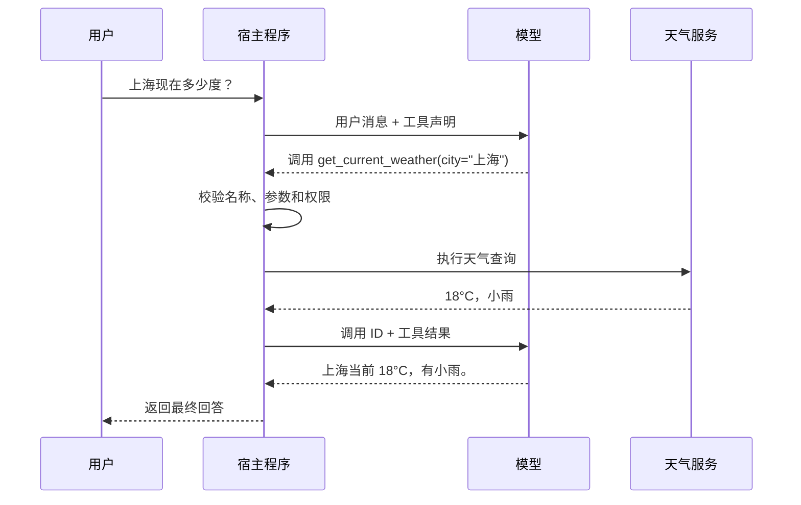

工具调用（Tool Calling）让大语言模型能够请求外部程序读取实时数据、执行计算或改变系统状态。Function Calling 通常指其中一种形式：应用向模型提供函数名称、用途和参数结构，模型返回一个结构化的调用请求。

模型不会因为生成了调用请求就直接执行函数。真正拥有凭据、访问网络并执行代码的是宿主程序（承载模型调用和业务逻辑的应用）。这种边界使应用可以在执行前校验参数、检查权限或要求用户确认。

模型能够选择工具并生成参数，只解决了“提出动作”的问题。一次调用仍可能因为以下情况失败：

- 参数符合 JSON 结构，但资源不存在、状态不允许或当前用户无权操作；
- 请求超时，而下游实际上已经完成扣款、发信或建单；
- 限流、网络中断或依赖服务暂时不可用；
- 批量操作只完成了一部分；
- 模型误读工具结果，或者未经确认执行了高影响操作。

因此，工具调用是一条由模型、宿主程序和外部系统共同组成的工程链路。Schema、业务校验、授权、幂等、重试、人工确认和可观测性都必须由确定性代码实施，不能只依赖模型判断。

## 一个最小闭环

假设用户询问「上海现在多少度」，模型的训练数据无法提供实时天气。应用可以向模型声明一个 `get_current_weather` 工具：

```json
{
  "name": "get_current_weather",
  "description": "查询指定城市的当前天气；仅用于实时天气，不用于历史天气或预报",
  "parameters": {
    "type": "object",
    "properties": {
      "city": {
        "type": "string",
        "description": "城市名称，例如：上海"
      }
    },
    "required": ["city"],
    "additionalProperties": false
  }
}
```

工具声明只是提供给模型的接口说明，不包含天气查询代码。一次完整的客户端工具调用通常需要两次模型交互：



这里的关键步骤是：

1. 应用把用户消息和可用工具声明发送给模型。
2. 模型可以直接回答，也可以返回工具名称、参数和调用 ID。
3. 应用按调用 ID 找到请求，校验后执行对应代码。
4. 应用把执行结果与调用 ID 一起回传给模型。
5. 模型根据工具结果生成面向用户的回答；如果还需要其他数据，也可以继续请求工具。

调用 ID 用于关联一次请求和它的结果。同一轮出现多个调用、请求被并行处理时，不能只依赖工具名称或数组位置匹配结果。

## 工具声明包含什么

不同模型 API 的字段名不完全相同，但自定义工具通常包含以下信息：

| 字段 | 作用 |
| --- | --- |
| `name` | 稳定且唯一的工具标识，供宿主程序分发调用 |
| `description` | 说明工具解决什么问题、何时使用以及边界是什么 |
| `parameters` / `input_schema` | 使用 JSON Schema 或厂商支持的子集描述输入 |
| `required` | 指出执行工具必须提供的参数 |
| `strict` | 某些 API 用它要求模型输出严格符合参数结构 |

JSON Schema（JSON 结构定义规范）描述的是参数形状，不等同于业务校验。例如，`city` 符合字符串类型，不代表它一定是服务支持的城市；订单 ID 格式正确，也不代表当前用户有权操作该订单。宿主程序仍需执行业务校验和授权。

工具说明会进入模型上下文。名称含糊、描述重叠或参数层级过深，都会增加选错工具或填错参数的概率。工具应保持单一职责，并在描述中写清容易混淆的边界。例如，与其只写「查询天气」，不如说明它只查询当前天气，不提供历史数据和未来预报。

设计工具接口时还应遵守以下约束：

- 名称直接表达动作，例如 `search_songs`、`create_playlist`，避免 `manage_everything` 一类万能工具。
- 参数按字段建模，使用枚举、长度、范围和格式约束，避免让模型拼接命令、SQL 或大段约定格式的字符串。
- 宿主程序已经知道的用户 ID、租户 ID 或资源 ID 不要求模型重复填写，应从可信会话状态中注入。
- 读取和写入分成不同工具，例如 `get_playlist` 与 `update_playlist`。这样可以分别配置凭据、重试、审批和审计策略。
- 不把“确认”“执行”和多个互不相关的高风险动作塞进同一个模糊工具；工具边界应让副作用可识别。

例如，`manage_everything(input: string)` 无法约束模型表达的动作和目标。下面两个接口把查询和写入分开，也避免模型自行拼装播放列表内容：

```ts
search_songs(input: { query: string; limit: number })
create_playlist(input: { name: string; songIds: string[] })
```

`idempotencyKey` 等运行时控制字段通常由宿主程序生成并注入，不应要求模型自行构造。严格 Schema 能减少结构错误，但不能保证语义正确，也不能代替权限与业务状态检查。

## 宿主程序中的调用循环

下面的 TypeScript 风格伪代码展示厂商无关的控制流程。`requestModel`、返回字段和消息格式需要替换为实际 SDK 的接口：

```ts
const handlers = {
  get_current_weather: getCurrentWeather
}

const toolByName = new Map(tools.map(tool => [tool.name, tool]))
const maxSteps = 8

for (let step = 0; step < maxSteps; step++) {
  const response = await requestModel({ messages, tools })
  messages.push(response.message)

  if (response.toolCalls.length === 0) {
    return response.text
  }

  for (const call of response.toolCalls) {
    const handler = handlers[call.name]
    const tool = toolByName.get(call.name)

    if (!handler || !tool) {
      messages.push(toolError(call.id, "未知工具"))
      continue
    }

    try {
      const args = validateAgainstSchema(call.arguments, tool.parameters)
      await authorize(currentUser, call.name, args)
      const result = await handler(args)
      messages.push(toolResult(call.id, result))
    } catch (error) {
      messages.push(toolError(call.id, normalizeError(error)))
    }
  }
}

throw new Error("工具调用超过最大步数")
```

这个循环构成了简单 Agent 的执行核心：模型观察当前上下文，选择动作，宿主程序执行动作，再把结果作为新的观察交给模型。完整 Agent 通常还会加入状态持久化、规划、记忆、人工审批和可观测性，但这些能力不改变工具调用的基本闭环。

模型 API 可能允许通过 `tool_choice` 一类配置控制选择方式：

- `auto`：模型可以直接回答，也可以调用零个或多个工具。
- `required`：这一轮必须调用工具。
- 指定工具：要求模型调用某个具体工具。
- `none`：禁止这一轮调用工具。

这些名称和具体行为属于厂商 API，不是跨平台标准。应用需要以所用模型的官方文档为准。

## 顺序调用与并行调用

一次任务可能需要多步调用。例如「查看北京天气，如果下雨就创建提醒」存在数据依赖：

```text
get_current_weather("北京")
  └─ 如果下雨，再执行 create_reminder(...)
```

第二步是否执行取决于第一步结果，因此应顺序处理。相反，查询北京和上海的天气彼此独立，可以并行执行，再把两个结果一起回传。并行调用可以降低延迟，但宿主程序必须保留每个调用 ID，并分别处理超时和错误。

并行执行带有副作用的工具需要更谨慎。如果一组操作要求“要么全部完成，要么全部不做”，普通并行调用无法提供这种原子性，应由下游事务、Saga（长事务拆分与补偿机制）或专用业务接口保证，而不是让模型自行补偿。

## 工具结果应表达什么

工具返回自由文本实现简单，适合展示说明、网页片段等非结构化内容；但模型和宿主程序必须从文本中猜测状态、错误类型或资源 ID，容易产生歧义。需要驱动后续控制流时，应优先返回结构化数据，并使用稳定的状态和错误码。文本可以作为面向用户的补充说明，不能是唯一的机器判断依据。

一个厂商无关的结果结构可以是：

```ts
type ToolResult<T> = {
  status: "succeeded" | "partial" | "failed"
  data?: T
  completed?: Array<{ itemId: string; result: unknown }>
  pending?: Array<{ itemId: string; reason: string }>
  error?: {
    code: string
    message: string
    retryable: boolean
  }
}
```

其中：

- `status` 明确区分成功、部分成功和失败；
- `data` 保存后续步骤需要消费的结构化结果；
- `completed` 与 `pending` 让调用方只处理未完成部分；
- `error.code` 供程序分支判断，`message` 供模型解释，`retryable` 是服务端提供的重试提示，而不是模型的猜测。

如果工具声明了输出 Schema，宿主程序也应验证返回值。MCP 工具可以通过 `structuredContent` 返回结构化结果，并通过 `outputSchema` 描述其形状；`isError` 用于标记工具执行失败。协议级错误和业务执行错误需要保留区别，避免把“工具不存在”和“库存不足”当成同一种故障。

## 失败分类与处理决策

工具失败后不能统一“再试一次”。宿主程序应先把下游异常归一化成稳定的错误类型，再决定由代码重试、让模型修正、换工具还是询问用户。

| 错误类型 | 例子 | 处理方式 |
| --- | --- | --- |
| 参数或校验错误 | 缺少必填字段、枚举非法、日期格式错误 | 根据错误信息修正参数；缺少用户意图时询问用户，不使用原参数重试 |
| 暂时性错误 | 超时、连接中断、`429` 限流、依赖服务暂时不可用 | 仅在操作可安全重试时，执行有次数和总时限的指数退避；遵守服务端的 `Retry-After` 等提示 |
| 权限或认证错误 | Token 过期、权限范围不足 | 停止重试并请求登录、授权或管理员处理 |
| 业务冲突 | 库存变化、日程冲突、版本号过期 | 返回当前状态和可选方案；按预先确定的规则处理，或者让用户选择 |
| 永久性错误 | 资源不存在、功能不支持 | 只有存在语义等价且可信的替代来源时才换工具，否则明确失败 |
| 执行结果未知 | 写请求超时，不确定下游是否成功 | 使用原幂等键查询状态或安全重放，不能生成新请求再次写入 |
| 部分成功 | 十封邮件已发送六封 | 保留已完成项，只对未完成项采取安全动作，并向用户报告两部分 |

决策顺序可以压缩为四个问题：

1. 这次调用是否可能已经改变外部状态？
2. 如果重复调用，工具或下游系统能否保证幂等？
3. 错误是否明确属于暂时性故障，并且仍在重试次数和总时间预算内？
4. 继续执行是否需要新的用户信息、授权或业务取舍？

前三项不能证明可以自动恢复时，应停止重试。换工具只适用于目标、权限和数据语义相同的替代能力；已经发生部分写入时，不能通过换工具重新执行整批操作。需要用户补充参数、授权或选择冲突方案时，应说明当前状态后询问用户。

指数退避会逐次增加等待时间，通常还会加入随机抖动（jitter），避免大量请求同时再次冲击依赖服务。所有重试都应设置最大次数、单次超时和总体截止时间；参数错误、权限错误等非暂时性故障应快速失败。

## 幂等与重复写入

幂等是指同一个业务请求执行一次或多次，最终产生的业务效果与执行一次相同。它解决的典型问题不是模型主动重复调用，而是调用方在超时后无法判断下游是否已经成功。

读取操作通常不改变状态，因此比写入更容易重试；但读取也可能计费、推进游标或触发审计，仍应以实际接口语义为准。创建、支付、发信等写操作不能无条件重试，常见保护方式包括：

- 调用方为一次业务意图生成 `idempotencyKey`，重试时保持相同键和相同参数；用户修改了目标或参数后，应视为新请求并生成新键。
- 服务端以“调用者 + 操作 + 幂等键”为范围，原子地记录处理中状态和最终结果。相同请求再次到达时返回已有结果，而不是再次执行。
- 数据库使用唯一约束、事务或原子条件写入消除并发竞态。单独采用“创建前先查询”仍可能让两个并发请求同时通过检查。
- 更新操作携带版本号、ETag 或其他条件，只有资源仍处于预期版本时才写入；冲突时重新读取并让调用方决定。
- 下游支持状态查询时，使用业务请求 ID 对账，确认未知结果后再决定是否重放。

幂等键只能避免同一业务请求被重复执行，不能证明请求本身正确，也不能代替用户确认、权限检查或事务边界。

## 人工确认与写入边界

是否确认应由操作影响决定，而不是交给模型临场猜测。发送邮件或消息、公开发布、删除数据、支付下单、修改长期偏好和重要配置等操作，通常需要在产生副作用前获得用户确认。

可以采用“计划—确认—执行”三阶段：

1. **计划**：只读取必要信息，生成待执行动作，展示目标、关键参数、预期影响和不可逆部分。
2. **确认**：用户确认具体动作；笼统的“继续”不应授权后来新增的收件人、金额或删除范围。
3. **执行**：宿主程序校验确认仍然有效，再调用写工具；执行后返回真实结果和失败项。

确认前不应预先执行写操作。确认后如果关键参数或资源状态发生变化，应重新展示差异并再次确认。低风险、可撤销且用户已经明确要求的动作可以按产品策略减少确认，但授权和业务校验仍然必须执行。

## Function Calling、MCP 与 Structured Output

Function Calling 和 MCP（Model Context Protocol，模型上下文协议）经常一起出现，但两者处于不同边界：

- **Function Calling 是模型的动作决策接口**：模型根据对话返回「调用哪个工具、传什么参数」。
- **MCP 是外部能力的标准接入协议**：AI 应用通过 MCP 客户端发现、连接并调用 MCP 服务端提供的能力。

Function Calling 不规定工具位于本地函数、REST API、数据库还是 MCP 服务端；MCP 也不规定模型如何决定使用工具。普通程序或界面按钮可以直接调用 MCP 工具，不需要模型参与。

| 维度 | Function Calling | MCP |
| --- | --- | --- |
| 解决的问题 | 模型如何表达调用意图 | 应用如何接入外部能力 |
| 主要参与方 | 模型与宿主程序 | MCP 宿主、客户端与服务端 |
| 工具来源 | 通常由应用传给模型 | 由 MCP 服务端提供并支持动态发现 |
| 发现机制 | 依赖应用或模型厂商 API | 定义能力发现和 `tools/list` 等方法 |
| 调用方式 | 模型返回工具名和参数，由宿主程序处理 | 客户端使用 `tools/call` 请求服务端执行 |
| 通信与传输 | 由模型厂商 API 决定 | 定义基于 JSON 的远程过程调用协议（JSON-RPC）数据层，以及标准输入输出（stdio）、可流式 HTTP 等传输 |
| 是否依赖模型 | 是 | 否，非 AI 程序也能作为 MCP 客户端 |
| 能力范围 | 主要是工具调用 | 还包括资源、提示模板、通知等协议能力 |

### 两者组合时的调用链

接入 MCP 工具的 Agent 通常经过以下步骤：

1. MCP 客户端连接服务端并获取它支持的协议版本和能力。
2. 客户端通过 `tools/list` 获取工具名称、描述和输入结构。
3. 宿主程序把这些信息转换成当前模型 API 的工具声明。
4. 模型通过 Function Calling 返回工具名称和参数。
5. 宿主程序把调用路由到对应的 MCP 客户端，由它发送 `tools/call`。
6. MCP 服务端执行工具，结果经宿主程序回传给模型。

```text
用户
  ↓
模型 -- Function Calling --> 宿主程序 / MCP 客户端
                              ↓
                         MCP tools/call
                              ↓
                         MCP 服务端
                              ↓
                    工具结果返回模型和用户
```

因此，两者可以独立使用：

- 没有 MCP：模型可以通过 Function Calling 调用应用内注册的本地函数。
- 没有 Function Calling：确定性工作流或界面按钮可以直接通过 MCP 客户端调用 MCP 服务端。
- 同时使用：MCP 负责把工具标准化地接入应用，Function Calling 负责让模型决定何时使用它们。

### 与 Structured Output 的区别

Structured Output 用于约束模型的最终输出结构，例如生成符合 schema 的表单数据；它不要求应用执行外部操作。如果目标只是获得固定结构的 JSON，应优先使用 Structured Output，而不是创建一个没有实际动作的工具。

部分模型平台提供内置或服务端工具，会代替应用完成执行与结果回传，因此表面上可能只需要一次 API 请求。这是平台对调用闭环的封装，不会改变 Function Calling 与工具接入协议的职责边界。

## 执行边界与安全约束

模型输出是不可信输入，工具结果也可能包含来自网页、邮件或文档的恶意指令。工具层应独立实施安全控制，不能依赖提示词要求模型「只做安全操作」。

- **使用明确的分发表**：只允许调用预先注册的工具，不根据模型输出动态执行任意函数名、Shell 命令或 URL。
- **校验参数和业务条件**：先做 schema 校验，再检查数据范围、资源归属和当前状态。
- **最小化工具与权限**：只向当前任务暴露必要工具；只读任务使用只读凭据，并按当前用户身份执行授权。
- **确认高影响操作**：发送消息、付款、删除或公开发布前，向用户展示目标和关键参数并获得确认。
- **限制资源消耗**：设置循环步数、超时、并发数、输出大小和速率上限，防止失控调用。
- **隔离不可信内容**：把工具返回值作为数据处理，不允许其中的文本自动取得更高指令优先级或绕过权限。
- **记录可审计事件**：记录调用 ID、工具名、参数摘要、执行结果、耗时和审批人，同时避免日志泄露密钥和敏感正文。

工具执行失败时，应把可处理的错误作为对应调用的结果返回，例如「城市不受支持」或「权限不足」，让模型解释错误或补充信息。不要把失败包装成成功，也不要无限重试。面向用户的错误可以简洁，但服务端日志应保留足够的诊断信息。

## 成功条件与调用轨迹

Agent 的成功不能只看最终回复。至少需要同时检查：

- **最终状态**：外部系统是否确实达到目标状态，而不是模型声称已经完成；
- **最终回复**：是否准确说明成功项、失败项和仍不确定的状态；
- **执行轨迹**：是否选择了允许的工具、使用正确参数并遵守确认、授权和禁止行为；
- **成本与稳定性**：调用次数、重试次数、延迟和费用是否处于预算内。

即使最终结果正确，只要中途调用了禁止使用的工具、越权读取数据，或未经确认执行高影响操作，仍应判定失败。反过来，如果存在多条合法路径，则不应仅因实际调用顺序与参考轨迹不同而判错。更完整的测试方法见 [Agent 评估](../llm-fundamentals/evaluation.md#agent-评估)。

一次运行可以使用统一的 `traceId` 关联模型请求与工具调用，并为每次工具调用分配 `callId`。审计记录通常包括：

- 任务、用户和租户的受控标识；
- 模型版本、工具名及工具 Schema 版本；
- 参数摘要或脱敏后的参数，以及调用结果状态和稳定错误码；
- 开始时间、耗时、重试次数和下游请求 ID；
- 幂等键的哈希或受控标识；
- 审批人、审批时间和被确认的关键参数；
- 最终状态验证结果和终止原因。

日志应记录可观察事件和决策结果，不需要保存模型的隐藏推理过程。密钥、身份凭据和不必要的正文不得进入日志；敏感参数应脱敏、哈希或按受控采样策略保存。

## 实现检查清单

- 工具名称、用途和不适用范围是否明确
- 参数是否使用尽可能简单、严格的 schema
- 读取工具与写入工具是否分离，并使用匹配的权限
- 每次调用是否通过 ID 与结果正确关联
- 宿主程序是否重新校验模型生成的所有参数
- 工具结果是否有稳定状态和错误码，并通过输出 schema 校验
- 授权是否由应用或下游系统强制执行
- 有副作用的操作是否需要确认并支持幂等
- 是否只重试暂时性错误，并设置单次超时、退避、总时限和最大循环步数
- 部分成功是否分别记录已完成项与未完成项
- 工具错误是否作为失败结果回传并可观测
- 工具返回的外部内容是否按不可信数据处理

## 参考资料

- [OpenAI：Function calling](https://developers.openai.com/api/docs/guides/function-calling)
- [Anthropic：Tool use with Claude](https://platform.claude.com/docs/en/agents-and-tools/tool-use/overview)
- [Google：Function calling with the Gemini API](https://ai.google.dev/gemini-api/docs/function-calling)
- [MCP：Architecture overview](https://modelcontextprotocol.io/docs/learn/architecture)
- [MCP：Tools specification](https://modelcontextprotocol.io/specification/latest/server/tools)
- [JSON Schema：What is a schema?](https://json-schema.org/understanding-json-schema/about)
- [AWS：Retry with backoff pattern](https://docs.aws.amazon.com/prescriptive-guidance/latest/cloud-design-patterns/retry-backoff.html)
- [Stripe：Idempotent requests](https://docs.stripe.com/api/idempotent_requests)
- [OWASP：LLM06:2025 Excessive Agency](https://genai.owasp.org/llmrisk/llm062025-excessive-agency/)
