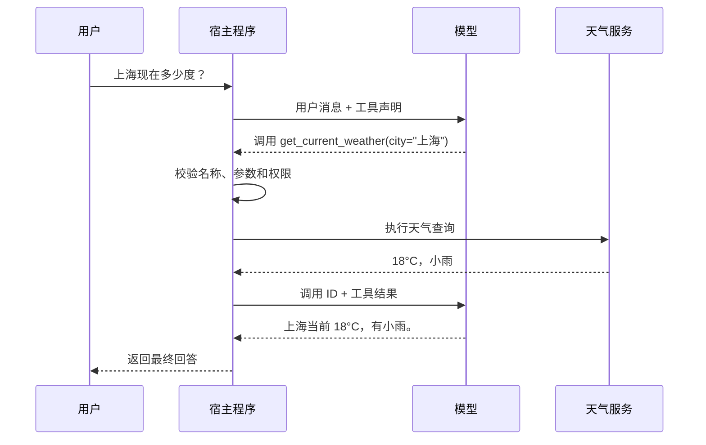

工具调用（Tool Calling）让大语言模型能够请求外部程序读取实时数据、执行计算或改变系统状态。Function Calling 通常指其中一种形式：应用向模型提供函数名称、用途和参数结构，模型返回一个结构化的调用请求。

模型不会因为生成了调用请求就直接执行函数。真正拥有凭据、访问网络并执行代码的是宿主程序（承载模型调用和业务逻辑的应用）。这种边界使应用可以在执行前校验参数、检查权限或要求用户确认。

## 一个最小闭环

假设用户询问「上海现在多少度」，模型的训练数据无法提供实时天气。应用可以向模型声明一个 `get_current_weather` 工具：

```json
{
  "name": "get_current_weather",
  "description": "查询指定城市的当前天气；仅用于实时天气，不用于历史天气或预报",
  "parameters": {
    "type": "object",
    "properties": {
      "city": {
        "type": "string",
        "description": "城市名称，例如：上海"
      }
    },
    "required": ["city"],
    "additionalProperties": false
  }
}
```

工具声明只是提供给模型的接口说明，不包含天气查询代码。一次完整的客户端工具调用通常需要两次模型交互：



这里的关键步骤是：

1. 应用把用户消息和可用工具声明发送给模型。
2. 模型可以直接回答，也可以返回工具名称、参数和调用 ID。
3. 应用按调用 ID 找到请求，校验后执行对应代码。
4. 应用把执行结果与调用 ID 一起回传给模型。
5. 模型根据工具结果生成面向用户的回答；如果还需要其他数据，也可以继续请求工具。

调用 ID 用于关联一次请求和它的结果。同一轮出现多个调用、请求被并行处理时，不能只依赖工具名称或数组位置匹配结果。

## 工具声明包含什么

不同模型 API 的字段名不完全相同，但自定义工具通常包含以下信息：

| 字段 | 作用 |
| --- | --- |
| `name` | 稳定且唯一的工具标识，供宿主程序分发调用 |
| `description` | 说明工具解决什么问题、何时使用以及边界是什么 |
| `parameters` / `input_schema` | 使用 JSON Schema 或厂商支持的子集描述输入 |
| `required` | 指出执行工具必须提供的参数 |
| `strict` | 某些 API 用它要求模型输出严格符合参数结构 |

JSON Schema（JSON 结构定义规范）描述的是参数形状，不等同于业务校验。例如，`city` 符合字符串类型，不代表它一定是服务支持的城市；订单 ID 格式正确，也不代表当前用户有权操作该订单。宿主程序仍需执行业务校验和授权。

工具说明会进入模型上下文。名称含糊、描述重叠或参数层级过深，都会增加选错工具或填错参数的概率。工具应保持单一职责，并在描述中写清容易混淆的边界。例如，与其只写「查询天气」，不如说明它只查询当前天气，不提供历史数据和未来预报。

## 宿主程序中的调用循环

下面的 TypeScript 风格伪代码展示厂商无关的控制流程。`requestModel`、返回字段和消息格式需要替换为实际 SDK 的接口：

```ts
const handlers = {
  get_current_weather: getCurrentWeather
}

const toolByName = new Map(tools.map(tool => [tool.name, tool]))
const maxSteps = 8

for (let step = 0; step < maxSteps; step++) {
  const response = await requestModel({ messages, tools })
  messages.push(response.message)

  if (response.toolCalls.length === 0) {
    return response.text
  }

  for (const call of response.toolCalls) {
    const handler = handlers[call.name]
    const tool = toolByName.get(call.name)

    if (!handler || !tool) {
      messages.push(toolError(call.id, "未知工具"))
      continue
    }

    try {
      const args = validateAgainstSchema(call.arguments, tool.parameters)
      await authorize(currentUser, call.name, args)
      const result = await handler(args)
      messages.push(toolResult(call.id, result))
    } catch (error) {
      messages.push(toolError(call.id, normalizeError(error)))
    }
  }
}

throw new Error("工具调用超过最大步数")
```

这个循环构成了简单 Agent 的执行核心：模型观察当前上下文，选择动作，宿主程序执行动作，再把结果作为新的观察交给模型。完整 Agent 通常还会加入状态持久化、规划、记忆、人工审批和可观测性，但这些能力不改变工具调用的基本闭环。

模型 API 可能允许通过 `tool_choice` 一类配置控制选择方式：

- `auto`：模型可以直接回答，也可以调用零个或多个工具。
- `required`：这一轮必须调用工具。
- 指定工具：要求模型调用某个具体工具。
- `none`：禁止这一轮调用工具。

这些名称和具体行为属于厂商 API，不是跨平台标准。应用需要以所用模型的官方文档为准。

## 顺序调用与并行调用

一次任务可能需要多步调用。例如「查看北京天气，如果下雨就创建提醒」存在数据依赖：

```text
get_current_weather("北京")
  └─ 如果下雨，再执行 create_reminder(...)
```

第二步是否执行取决于第一步结果，因此应顺序处理。相反，查询北京和上海的天气彼此独立，可以并行执行，再把两个结果一起回传。并行调用可以降低延迟，但宿主程序必须保留每个调用 ID，并分别处理超时和错误。

工具产生副作用时还要考虑重复执行。网络超时可能发生在下游已经成功、应用却没有收到响应之后。支付、发信、创建订单等操作应使用幂等键（重复提交时仍只产生一次效果的请求标识）或下游系统提供的去重机制。

## Function Calling、MCP 与 Structured Output

Function Calling 和 MCP（Model Context Protocol，模型上下文协议）经常一起出现，但两者处于不同边界：

- **Function Calling 是模型的动作决策接口**：模型根据对话返回「调用哪个工具、传什么参数」。
- **MCP 是外部能力的标准接入协议**：AI 应用通过 MCP 客户端发现、连接并调用 MCP 服务端提供的能力。

Function Calling 不规定工具位于本地函数、REST API、数据库还是 MCP 服务端；MCP 也不规定模型如何决定使用工具。普通程序或界面按钮可以直接调用 MCP 工具，不需要模型参与。

| 维度 | Function Calling | MCP |
| --- | --- | --- |
| 解决的问题 | 模型如何表达调用意图 | 应用如何接入外部能力 |
| 主要参与方 | 模型与宿主程序 | MCP 宿主、客户端与服务端 |
| 工具来源 | 通常由应用传给模型 | 由 MCP 服务端提供并支持动态发现 |
| 发现机制 | 依赖应用或模型厂商 API | 定义能力发现和 `tools/list` 等方法 |
| 调用方式 | 模型返回工具名和参数，由宿主程序处理 | 客户端使用 `tools/call` 请求服务端执行 |
| 通信与传输 | 由模型厂商 API 决定 | 定义基于 JSON 的远程过程调用协议（JSON-RPC）数据层，以及标准输入输出（stdio）、可流式 HTTP 等传输 |
| 是否依赖模型 | 是 | 否，非 AI 程序也能作为 MCP 客户端 |
| 能力范围 | 主要是工具调用 | 还包括资源、提示模板、通知等协议能力 |

### 两者组合时的调用链

接入 MCP 工具的 Agent 通常经过以下步骤：

1. MCP 客户端连接服务端并获取它支持的协议版本和能力。
2. 客户端通过 `tools/list` 获取工具名称、描述和输入结构。
3. 宿主程序把这些信息转换成当前模型 API 的工具声明。
4. 模型通过 Function Calling 返回工具名称和参数。
5. 宿主程序把调用路由到对应的 MCP 客户端，由它发送 `tools/call`。
6. MCP 服务端执行工具，结果经宿主程序回传给模型。

```text
用户
  ↓
模型 -- Function Calling --> 宿主程序 / MCP 客户端
                              ↓
                         MCP tools/call
                              ↓
                         MCP 服务端
                              ↓
                    工具结果返回模型和用户
```

因此，两者可以独立使用：

- 没有 MCP：模型可以通过 Function Calling 调用应用内注册的本地函数。
- 没有 Function Calling：确定性工作流或界面按钮可以直接通过 MCP 客户端调用 MCP 服务端。
- 同时使用：MCP 负责把工具标准化地接入应用，Function Calling 负责让模型决定何时使用它们。

### 与 Structured Output 的区别

Structured Output 用于约束模型的最终输出结构，例如生成符合 schema 的表单数据；它不要求应用执行外部操作。如果目标只是获得固定结构的 JSON，应优先使用 Structured Output，而不是创建一个没有实际动作的工具。

部分模型平台提供内置或服务端工具，会代替应用完成执行与结果回传，因此表面上可能只需要一次 API 请求。这是平台对调用闭环的封装，不会改变 Function Calling 与工具接入协议的职责边界。

## 执行边界与安全约束

模型输出是不可信输入，工具结果也可能包含来自网页、邮件或文档的恶意指令。工具层应独立实施安全控制，不能依赖提示词要求模型「只做安全操作」。

- **使用明确的分发表**：只允许调用预先注册的工具，不根据模型输出动态执行任意函数名、Shell 命令或 URL。
- **校验参数和业务条件**：先做 schema 校验，再检查数据范围、资源归属和当前状态。
- **最小化工具与权限**：只向当前任务暴露必要工具；只读任务使用只读凭据，并按当前用户身份执行授权。
- **确认高影响操作**：发送消息、付款、删除或公开发布前，向用户展示目标和关键参数并获得确认。
- **限制资源消耗**：设置循环步数、超时、并发数、输出大小和速率上限，防止失控调用。
- **隔离不可信内容**：把工具返回值作为数据处理，不允许其中的文本自动取得更高指令优先级或绕过权限。
- **记录可审计事件**：记录调用 ID、工具名、参数摘要、执行结果、耗时和审批人，同时避免日志泄露密钥和敏感正文。

工具执行失败时，应把可处理的错误作为对应调用的结果返回，例如「城市不受支持」或「权限不足」，让模型解释错误或补充信息。不要把失败包装成成功，也不要无限重试。面向用户的错误可以简洁，但服务端日志应保留足够的诊断信息。

## 实现检查清单

- 工具名称、用途和不适用范围是否明确
- 参数是否使用尽可能简单、严格的 schema
- 每次调用是否通过 ID 与结果正确关联
- 宿主程序是否重新校验模型生成的所有参数
- 授权是否由应用或下游系统强制执行
- 有副作用的操作是否需要确认并支持幂等
- 是否设置超时、重试策略、并发数和最大循环步数
- 工具错误是否作为失败结果回传并可观测
- 工具返回的外部内容是否按不可信数据处理

## 参考资料

- [OpenAI：Function calling](https://developers.openai.com/api/docs/guides/function-calling)
- [Anthropic：Tool use with Claude](https://platform.claude.com/docs/en/agents-and-tools/tool-use/overview)
- [Google：Function calling with the Gemini API](https://ai.google.dev/gemini-api/docs/function-calling)
- [MCP：Architecture overview](https://modelcontextprotocol.io/docs/learn/architecture)
- [JSON Schema：What is a schema?](https://json-schema.org/understanding-json-schema/about)
- [OWASP：LLM06:2025 Excessive Agency](https://genai.owasp.org/llmrisk/llm062025-excessive-agency/)
