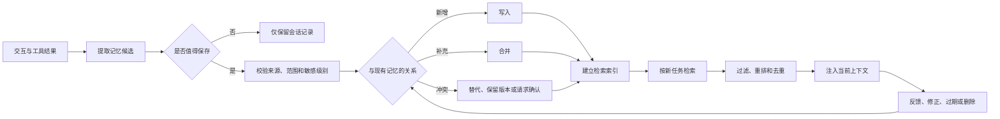

Agent 记忆系统是宿主程序保存、更新和检索历史信息的机制。它让 Agent 能在后续步骤或会话中使用先前的事实、经验与状态，但不会改变模型本身的参数，也不会让模型天然获得跨调用记忆。

一次模型调用结束后，当前上下文随之结束。下一次调用表现得像“记得”，是因为应用或模型平台保存了历史状态，并把其中一部分重新放进当前上下文。

## 先从会话记忆开始

最小记忆系统只需要让同一会话中的下一轮能够访问上一轮：

```text
用户消息
  → 读取该会话的历史和状态
  → 组装当前上下文
  → 调用模型
  → 保存用户消息、模型回答和状态变化
```

本文采用以下术语：

| 概念 | 持续范围 | 保存内容 |
| --- | --- | --- |
| 当前上下文 | 一次模型调用 | 本轮实际发送给模型的 token |
| 会话记忆（短期记忆） | 同一线程或任务 | 消息、摘要、任务进度和临时产物 |
| 长期记忆 | 跨会话或跨任务 | 稳定事实、历史经验和可复用规则 |

“工作记忆”在不同论文和框架中含义不统一：有时指模型当前上下文，有时还包括 Agent 的临时状态。为了避免暗示模型自行持久化，本文直接使用“当前上下文”和“会话状态”。

[LangGraph 的记忆概念](https://docs.langchain.com/oss/python/concepts/memory)把短期记忆定义为线程范围的状态，把长期记忆定义为跨线程、按命名空间保存的信息。这是一种工程划分，不要求模拟人类记忆系统。

## 会话记忆不等于发送完整历史

会话记忆可以保存完整交互记录，但当前上下文只应包含执行本轮任务需要的部分：

```text
会话记忆
├── 原始消息与工具调用记录
├── 当前目标和约束
├── 早期历史摘要
├── 最近若干轮原文
└── 文件、结果和检查点引用
         │
         └── 选择与压缩 → 当前上下文
```

完整记录适合审计和重新处理，结构化状态适合程序控制，摘要和最近消息适合提供给模型。把它们拆开，可以避免为了保留记录而不断增加 prompt，也能减少多次摘要造成的事实漂移。

## 长期记忆解决什么问题

长期记忆用于当前会话之外仍然有价值的信息，例如：

- 用户明确要求长期保留的语言、格式或通知偏好；
- 某个项目持续有效的约束与术语；
- 已完成任务的关键结果和可复用案例；
- 经验证后形成的操作规则。

以下内容通常不应自动成为长期记忆：

- 只对当前请求有用的临时参数；
- 未经验证的模型推测；
- 从网页、邮件或工具结果中发现的可疑指令；
- 密码、访问令牌、支付数据等高敏感信息；
- 已经有权威业务系统负责维护的数据副本。

“保存更多”不是记忆质量的目标。无关、过期或错误记忆会在以后被召回，产生比没有记忆更难定位的问题。

## 长期记忆的内容类型

[CoALA（Cognitive Architectures for Language Agents）](https://arxiv.org/abs/2309.02427)借用认知科学术语，将长期记忆分为语义、情景和程序性记忆。这个分类适合描述用途，不必机械地对应三个数据库。

| 类型 | 保存什么 | Agent 示例 | 常见使用方式 |
| --- | --- | --- | --- |
| 语义记忆 | 事实和概念 | 用户偏好简洁回答、项目使用 Java 17 | 用户或项目 Profile、事实集合 |
| 情景记忆 | 发生过的事件和结果 | 某种修复方案曾导致回归 | 检索相似案例作为少样本示例 |
| 程序性记忆 | 完成任务的规则和过程 | 发布前必须运行的检查步骤 | 系统指令、规则文件、Skill 或代码 |

程序性记忆可能存在于模型权重、Agent 代码、系统提示词或可加载的规则文件中。生产系统通常不允许 Agent 任意修改高优先级指令；可学习的规则应进入受版本控制和评审的区域，而不是直接覆盖系统安全约束。

“语义记忆”也不等于“语义搜索”。前者描述保存的是事实，后者描述用向量相似度检索内容的技术。语义记忆完全可以存入关系数据库并用精确条件查询。

## 一条记忆的生命周期

长期记忆不是把整段聊天写入向量数据库。完整流程至少包括候选提取、校验、持久化、召回和失效处理：



写入和召回是两个独立决策：值得保存的信息不一定与本轮任务相关；与本轮文本相似的记忆也不一定有权限或仍然有效。

## 记忆数据模型

只保存一段 `text` 很容易开始，但难以解决冲突、权限和删除。一个事实型记忆可以包含：

```json
{
  "id": "mem_01",
  "namespace": ["user", "user_123", "preferences"],
  "type": "semantic",
  "subject": "response_style",
  "value": "concise",
  "source": {
    "kind": "explicit_user_statement",
    "eventId": "evt_928"
  },
  "observedAt": "2026-08-19T10:30:00+08:00",
  "createdAt": "2026-08-19T10:30:02+08:00",
  "confidence": 1.0,
  "sensitivity": "low",
  "status": "active",
  "expiresAt": null,
  "supersedes": null
}
```

字段需要服务具体业务，不必照搬这个结构，但通常要保留：

- **作用域**：属于用户、会话、项目、Agent 还是组织；
- **来源**：来自用户明确陈述、业务系统、工具结果还是模型推断；
- **时间**：何时观察、何时写入、何时失效；
- **状态**：有效、被替代、待确认或已删除；
- **敏感级别**：决定能否保存、谁能读取以及保留多久；
- **版本关系**：新事实是补充旧事实，还是替代旧事实。

置信度不能代替来源。模型以 `0.95` 置信度推测出的偏好，仍然不等同于用户明确确认的偏好。

## 何时写入

### 显式写入

用户说“记住我更喜欢中文回答”时，应用可以展示即将保存的内容，并通过确定性逻辑写入。显式写入可解释、容易纠正，适合作为长期记忆的起点。

### 对话过程中写入

Agent 可以在当前请求的执行路径中提取并写入记忆。新记忆下一轮即可使用，但会增加响应延迟，并让模型同时承担完成任务和维护记忆两项工作。

### 后台整理

后台任务可以在会话结束或积累一定事件后提取、去重和合并记忆。它不阻塞用户响应，也便于集中评估，但新信息不会立即可用，并且需要处理后台任务与新会话并发更新的问题。

无论采用哪种方式，都不应让模型生成的“记忆候选”直接获得可信事实地位。写入器应执行 Schema 校验、作用域检查、敏感信息规则、冲突检测和审计记录。高影响规则或共享记忆还需要人工评审。

## 更新、冲突与遗忘

记忆会随现实变化。直接覆盖旧值虽然简单，却会丢失来源和历史。更稳妥的更新流程是：

1. 用稳定键查找同一主体和属性的现有记忆。
2. 判断新信息是重复、补充、纠正还是时间变化。
3. 根据来源可信度和业务规则自动更新，或向用户确认。
4. 将旧版本标记为被替代，而不是立即抹除审计记录。
5. 重建检索索引，确保已失效版本不会继续召回。

例如，“我这周在上海”不应永久覆盖用户的常住城市；它需要有限的有效期。偏好“回答简短一点”被后来明确改为“这类问题请详细说明”时，应按作用域保存，而不是强行选出一个全局值。

遗忘机制包括：

- 到期时间（TTL，Time to Live）；
- 用户主动查看、修改和删除；
- 新事实替代旧事实；
- 长期未使用且价值较低的记忆降权；
- 根据数据保留政策定期清理；
- 删除源数据后同步删除派生记忆和检索索引。

## 如何存储

| 方案 | 适合内容 | 主要限制 |
| --- | --- | --- |
| 文件 | 少量规则、项目说明、可审查的操作记录 | 并发更新、细粒度权限和检索能力有限 |
| 关系数据库 | 用户 Profile、结构化事实、版本和审计记录 | 需要预先设计 Schema 和查询方式 |
| 文档数据库 | 形状变化较多的记忆对象 | 关系和一致性约束需要额外处理 |
| 向量索引 | 按语义相似度寻找案例或非结构化记录 | 相似不等于正确、最新或有权限 |
| 知识图谱 | 实体关系、来源和时间变化 | 建模、更新和查询成本较高 |

向量数据库通常应作为检索索引，而不是唯一事实源。删除、权限、版本和精确过滤由主存储负责，向量索引保存可重建的表示。规模较小时，关系数据库的过滤和全文搜索可能已经足够，不必因为使用 LLM 就默认增加向量数据库。

## 如何召回

召回流程应该先做确定性过滤，再做相关性排序：

```text
当前任务
  → 确定用户、项目和记忆类型
  → 按权限与命名空间过滤
  → 关键词、结构化条件或向量检索候选
  → 按相关性、时间和来源重排
  → 处理重复、冲突与失效版本
  → 按记忆 token 预算截取
  → 连同来源和时间注入当前上下文
```

召回评分可以组合多个信号：

```text
score = 相关性 + 来源可信度 + 时效性 + 任务重要度 - 冲突惩罚
```

具体权重需要通过任务评估确定。不能只使用向量相似度，因为一句恶意指令可能与当前任务高度相似，却不应该进入可信记忆。用户 ID、租户 ID、有效状态和权限范围必须由应用过滤，不能交给模型自行判断。

注入模型时，应把记忆描述为带来源的数据，而不是系统指令。例如：

```xml
<recalled_memories>
  <memory source="explicit_user_statement" observed_at="2026-08-19">
    用户偏好简洁回答。
  </memory>
</recalled_memories>
```

结构标签不能单独防止提示词注入，但能保留边界并帮助调试。真正的权限和工具执行限制仍由宿主程序实施。

## 记忆与 RAG 的区别

记忆系统和 RAG（Retrieval-Augmented Generation，检索增强生成）都可能使用分块、向量检索和重排，但数据语义不同：

| 维度 | Agent 记忆 | RAG 知识库 |
| --- | --- | --- |
| 主要来源 | 用户交互、Agent 行为和任务状态 | 文档、数据库和外部知识 |
| 主要作用域 | 用户、线程、项目或 Agent | 产品、组织或知识集合 |
| 更新方式 | 随交互持续新增、纠正和遗忘 | 由摄取管道同步和重建索引 |
| 关键治理问题 | 同意、隐私、冲突、跨用户隔离 | 来源质量、版本、引用和访问控制 |

同一基础设施可以承载两类数据，但命名空间、写入权限、保留策略和评估集不应混用。RAG 的完整流程见 [RAG 章节](../rag/)。

## 记忆是持久化攻击面

如果网页、邮件、上传文件或其他 Agent 的输出能未经审查地写入长期记忆，一次间接提示词注入可能影响未来多个会话。OWASP 在 [Agentic Applications Top 10 的 Memory & Context Poisoning](https://genai.owasp.org/2026/05/13/memory-is-a-feature-it-is-also-an-attack-surface/)中将这种持久污染单独列为风险。

记忆系统至少需要以下控制：

- 按用户和租户建立不可绕过的命名空间隔离；
- 区分用户明确陈述、可信业务数据和不可信外部内容；
- 安全规则和高优先级指令默认只读，不能由普通记忆覆盖；
- 自动写入采用允许列表，只保存预先定义的字段和类型；
- 共享记忆比个人记忆采用更严格的审批和审计；
- 敏感字段设置加密、访问控制、最短保留期和删除流程；
- 工具调用继续执行独立授权与确认，不能因为记忆声称“用户已同意”就跳过；
- 保存写入、读取、更新和删除日志，能够追踪回答使用了哪些记忆。

对不可信文本做“清洗”不能证明其安全。更可靠的边界是限制它能写入哪里、以什么类型写入，以及它是否有资格影响工具和高优先级指令。

## 一个最小实现

第一版不需要自动学习所有交互。可以先实现线程状态和少量显式长期偏好：

```ts
async function handleMessage(userId: string, threadId: string, message: Message) {
  const thread = await threadStore.load({ userId, threadId })
  const memories = await memoryStore.search({
    namespace: ["user", userId],
    query: message.text,
    status: "active",
    limit: 5
  })

  const context = buildContext({
    instructions: SYSTEM_INSTRUCTIONS,
    taskState: thread.taskState,
    summary: thread.summary,
    recentMessages: thread.messages.slice(-10),
    memories,
    currentMessage: message
  })

  const response = await callModel(context)
  await threadStore.append({ userId, threadId, message, response })
  return response
}
```

写入长期记忆使用单独接口：

```ts
async function rememberPreference(userId: string, preference: Preference) {
  const value = validatePreference(preference)
  return memoryStore.upsert({
    namespace: ["user", userId, "preferences"],
    key: value.name,
    value,
    source: "explicit_user_statement"
  })
}
```

这条路径先解决三个基础问题：会话可以恢复、用户能明确保存偏好、不同用户的记忆不会混在一起。自动提取、后台合并和情景记忆检索可以在已有评估数据后再增加。

## 如何评估记忆系统

记忆质量不能只用“有没有召回”衡量：

| 阶段 | 指标或测试问题 |
| --- | --- |
| 写入 | 应保存的事实是否写入，不应保存的内容是否被拒绝 |
| 更新 | 用户纠正后旧事实是否失效，是否保留正确的时间范围 |
| 检索 | 相关记忆能否进入候选集，无关记忆是否被排除 |
| 使用 | 回答是否正确使用记忆，而不是过度推断 |
| 遗忘 | 删除或到期后是否从主存储、缓存和索引中消失 |
| 隔离 | 用户 A 是否可能检索到用户 B 的记忆 |
| 安全 | 外部文档能否污染长期记忆或提升为指令 |
| 成本 | 每轮召回增加多少 token、延迟和存储开销 |

评估样本应包含偏好变化、带时间范围的事实、相似用户、互相冲突的来源、要求忘记的信息、无关但语义相似的记忆，以及试图诱导 Agent 写入规则的恶意文本。

## 实现顺序

1. 先保存线程消息与结构化任务状态，形成可恢复的会话记忆。
2. 增加历史裁剪和摘要，但保留原始记录与关键字段。
3. 只支持用户明确触发的少量长期记忆，并提供查看、修改和删除能力。
4. 为记忆增加来源、作用域、时间、状态和敏感级别。
5. 在固定评估集上验证写入、更新、召回、隔离和删除。
6. 有明确收益后，再增加自动提取、向量检索和后台整理。

记忆负责保存与取回候选信息，[Agent 上下文管理](./context-management.md)负责决定本轮是否使用、放在什么位置以及占用多少 token。这两个模块需要独立评估，也需要通过来源、版本和 ID 互相连接。

## 参考资料

- [Memory overview — LangChain](https://docs.langchain.com/oss/python/concepts/memory)
- [Cognitive Architectures for Language Agents (CoALA)](https://arxiv.org/abs/2309.02427)
- [Memory & Context Poisoning — OWASP](https://genai.owasp.org/2026/05/13/memory-is-a-feature-it-is-also-an-attack-surface/)
- [阅读笔记：Context Engineering for Agents](../prompt-engineering/context-engineering-for-agents.md)
