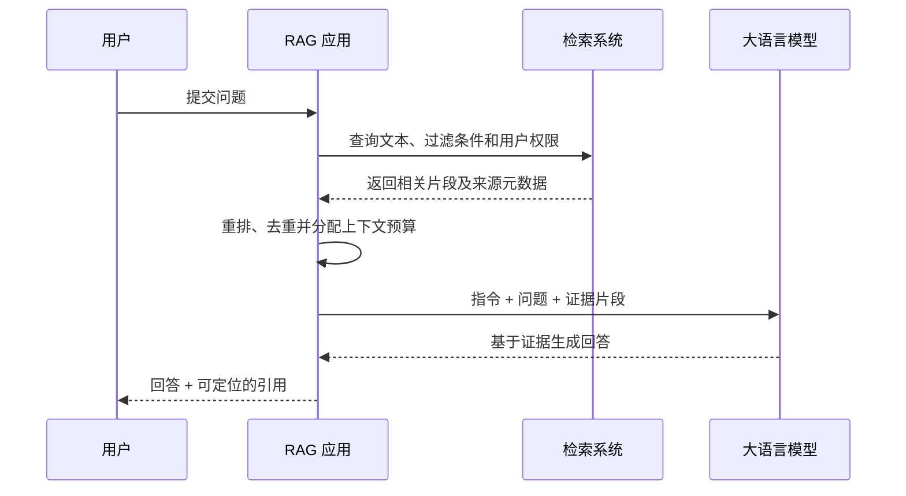

# RAG 检索增强生成

大语言模型只能直接使用模型参数和当前上下文中的信息。企业制度、项目文档和实时数据可能没有进入训练数据，也可能在模型训练后发生变化。RAG（Retrieval-Augmented Generation，检索增强生成）在生成回答前查找外部知识，把与当前问题相关的证据放入上下文。

以内部制度问答为例，模型不需要记住整套制度：

```text
问题：试用期员工有几天年假？

检索：从人事制度中找到“试用期员工年假为 3 天”
生成：依据检索结果回答，并附上制度名称和章节
```

RAG 的目标不是让模型永久学会这些内容，而是让一次回答建立在可更新、可检查的外部证据上。

## 从原始模型到应用架构

2020 年的 RAG 论文把生成模型称为参数化记忆，把稠密向量索引称为非参数化记忆，并联合训练检索器和生成器。现在的工程语境更宽泛：只要应用在推理期间检索外部信息，再将结果交给模型生成回答，通常都会被称为 RAG。检索源不局限于向量数据库，也可以是全文搜索、关系数据库、知识图谱、业务 API 或网页搜索。

因此，RAG 不等于“向量数据库加一个 LLM”。一个可用系统至少要处理数据准备、召回、重排、上下文构造、引用和评估。

## 最小完整链路

RAG 包含离线的索引链路和在线的查询链路。

```text
索引链路：原始文档 → 解析与清洗 → 分块 → 建立检索索引

查询链路：用户问题 → 检索候选 → 选择证据 → 构造上下文 → 生成带引用的回答
```



其中各参与者的职责是：

- 检索系统负责尽可能找到支持回答的证据。
- RAG 应用负责权限过滤、证据选择、上下文组织和结果校验。
- 大语言模型负责理解问题并基于给定证据组织答案，不能代替检索系统保证证据正确。

## 三个工程阶段

### 数据摄取

数据摄取（ingestion）把原始知识转换为可检索对象，包括解析 PDF 或网页、清洗内容、按语义边界分块、生成元数据、建立全文或向量索引，以及同步后续更新。输入质量和分块方式会直接影响能否找回正确证据。

详见[数据摄取与分块](./ingestion-and-chunking.md)。

### 检索与生成

在线查询先理解问题，再从一个或多个索引召回候选。系统可以组合 BM25 关键词检索和向量检索，通过重排模型提高前几条结果的精度，最后把有限数量的证据交给生成模型。

详见[检索与重排](./retrieval-and-reranking.md)和[上下文构造与引用](./generation-and-citations.md)。

### 评估与迭代

最终回答错误可能来自两类问题：检索系统没有找到证据，或者模型没有正确使用已经找到的证据。两部分必须分别测量，再观察端到端正确性、引用质量、延迟和成本。

详见[RAG 评估](./rag-evaluation.md)。

## 何时使用 RAG

| 条件 | 更合适的方式 | 原因 |
| --- | --- | --- |
| 知识经常更新、需要来源或受权限控制 | RAG | 知识可独立更新，并能保留来源与访问规则 |
| 数据量很小，能稳定放入上下文 | 长上下文或提示词缓存 | 省去索引和检索链路，但仍需评估长上下文召回 |
| 需要实时数值或执行确定性查询 | 数据库、搜索或业务 API 工具 | 结构化系统更适合过滤、聚合和精确计算 |
| 需要改变输出格式、语气或稳定行为 | 提示词或微调 | 这类需求主要不是知识检索问题 |
| 需要大量领域知识并同时改变任务行为 | RAG 与微调组合 | 两者分别处理外部知识和模型行为 |

RAG 也会引入额外延迟、索引成本和故障点。如果知识库很小，或者问题可以通过一次确定性 API 调用回答，不必先引入完整 RAG 链路。

## RAG 不能保证什么

- 找到相似片段不代表片段能够回答问题。
- 检索到正确证据不代表模型一定会忠实引用。
- 增加 Top-K 可能提高召回，也可能让无关内容稀释关键信息。
- RAG 可以降低部分事实错误，但不能消除幻觉或 Prompt Injection。
- 向量相似度不是权限边界，查询前后仍需执行访问控制。
- 引用存在不代表引用真的支持对应结论，引用本身也需要评估。

## 学习路径

1. [数据摄取与分块](./ingestion-and-chunking.md)：把原始资料转换成可定位、可更新的检索单元。
2. [检索与重排](./retrieval-and-reranking.md)：理解关键词、向量、混合检索和候选选择。
3. [上下文构造与引用](./generation-and-citations.md)：让模型只使用必要证据并输出可验证引用。
4. [RAG 评估](./rag-evaluation.md)：分开测量检索和生成质量。
5. [生产化与安全](./production-and-security.md)：处理权限、数据新鲜度、监控、成本和攻击面。
6. [高级 RAG 模式](./advanced-rag-patterns.md)：在基础链路不足时引入多跳、路由、图或 Agentic Retrieval。

相关基础知识：

- [Embeddings](../llm-fundamentals/embeddings.md)
- [向量数据库](../llm-fundamentals/vector-databases.md)
- [Context Window](../llm-fundamentals/context.md)
- [Evaluation](../llm-fundamentals/evaluation.md)

## 参考资料

- [Retrieval-Augmented Generation for Knowledge-Intensive NLP Tasks](https://arxiv.org/abs/2005.11401)
- [RAG and Generative AI - Azure AI Search](https://learn.microsoft.com/en-us/azure/search/retrieval-augmented-generation-overview)
- [Build Advanced Retrieval-Augmented Generation Systems](https://learn.microsoft.com/en-us/azure/developer/ai/advanced-retrieval-augmented-generation)
- [Introducing Contextual Retrieval](https://www.anthropic.com/engineering/contextual-retrieval)
