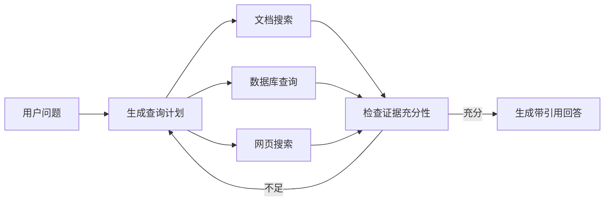

# 高级 RAG 模式

基础 RAG 使用一次查询从一个索引召回片段，再生成回答。只有当评估显示这种链路无法处理特定问题时，才需要增加查询规划、多跳检索或新的知识表示。

高级模式增加模型调用、状态和故障路径。选择模式前应先明确基础链路失败在“没有召回”“无法组合证据”还是“数据本来不适合文本检索”。

## 查询分解与多跳检索

一个问题可能需要多个事实才能回答：

```text
问题：新版报销制度相比旧版调整了哪些额度？

子查询 1：新版报销额度
子查询 2：旧版报销额度
合并：按项目比较两个版本
```

多跳检索会根据前一步结果继续形成下一步查询。例如先找到某产品对应的项目代号，再用代号查询事故记录。它适合证据分散且存在明确依赖关系的问题。

风险在于第一步误解会传播到后续步骤。系统需要限制步骤数、保存查询计划和中间证据，并让最终引用覆盖各个推理步骤。

## Agentic Retrieval

Agentic Retrieval 让模型根据问题动态决定：

- 是否需要检索。
- 把问题拆成哪些子查询。
- 选择哪个知识源或搜索工具。
- 当前证据是否足够，是否继续检索。



它适合复杂、开放式或多来源问题。对单一知识库中的简单问答，固定检索链路通常延迟更低，也更容易评估和复现。

Agentic Retrieval 需要限制总步骤、并发查询、token 和外部调用预算，还要防止检索内容诱导 Agent 改变计划或调用高风险工具。

## Adaptive RAG

Adaptive RAG（自适应 RAG）先判断问题类型，再选择不同成本的路径：

| 问题类型 | 路径示例 |
| --- | --- |
| 闲聊或格式改写 | 不检索，直接生成 |
| 单一事实 | 一次混合检索和重排 |
| 多部分比较 | 查询分解后并行检索 |
| 实时业务数据 | 调用数据库或业务 API |
| 开放式调查 | Agentic Retrieval，多轮搜索 |

路由错误会导致本来需要证据的问题绕过检索。因此路由器本身需要标注集、置信度和安全默认值；不确定时可以选择较保守的检索路径。

## 层级检索

层级检索先定位文档或章节，再在较小范围内检索具体片段：

```text
文档摘要索引 → 选择候选文档 → 章节或 chunk 索引 → 返回原文证据
```

它适合文档很长、主题层级稳定，或者短 chunk 容易脱离全文语境的知识库。父子分块是其简单形式。缺点是上层选错文档后，下层检索无法恢复，需要保留多条候选或与全局召回组合。

## Graph RAG

Graph RAG 把实体及其关系组织成图，再结合文本证据回答跨文档关系问题。例如从“服务依赖数据库”“事故影响数据库”推导哪些服务可能受到同一事故影响。

它适合：

- 问题依赖多实体关系和跨文档连接。
- 需要社区、路径或全局主题分析。
- 数据天然具有稳定实体 ID 和关系。

如果任务只是从手册中查找一段规定，构建图谱通常增加抽取误差和维护成本。图中的实体和关系也应回链到原始文本，最终回答不能只引用模型生成的图关系。

## 多模态 RAG

多模态 RAG 检索文本之外的图片、图表、音频或视频片段。典型文档可能同时包含段落、产品结构图和表格：

```text
文件 → 文本块 + 表格结构 + 图片说明 + 页面坐标
                         ↓
                 多模态索引与检索
```

可以为图片生成说明用于文本召回，也可以使用多模态 Embedding。图片说明会丢失细节，因此涉及图表数值、界面位置或视觉证据时，需要把原始页面或裁剪图一同交给支持视觉输入的模型，并在引用中保留页面位置。

## 结构化数据检索

关系数据库、指标平台和业务 API 不必先转成文本向量。对“过去 30 天订单总额”“状态为待审批的工单”等问题，SQL 或 API 能执行精确过滤和聚合。

组合方式通常是：

1. 路由器识别问题需要结构化数据。
2. 应用生成受约束的查询或调用预定义工具。
3. 权威系统返回结构化结果和查询时间。
4. 模型只负责解释结果，不重新计算或编造数据。

工具参数需要 Schema 校验、权限控制和查询范围限制。自由生成 SQL 时，还需要只读凭据、语句白名单、行数和执行时间上限。

## 模式选择

| 已确认的基础链路缺陷 | 优先考虑 |
| --- | --- |
| 短片段缺少章节语境 | 标题补全、父子或层级检索 |
| 一个问题包含多个独立子问题 | 查询分解和并行检索 |
| 后续查询依赖前一步发现的实体 | 多跳检索 |
| 不同问题需要不同数据源 | 路由或 Adaptive RAG |
| 开放式任务需要反复判断证据是否充分 | Agentic Retrieval |
| 主要问题是跨实体关系和全局主题 | Graph RAG |
| 答案来自图表、图片或视频 | 多模态 RAG |
| 答案需要精确过滤、聚合或实时状态 | SQL 或业务 API 工具 |

每增加一种模式，都应补充对应的评估样本、轨迹记录、成本预算和失败降级路径。高级模式的价值应由基础方案与新方案之间的可重复实验来证明。

## 参考资料

- [RAG and Generative AI - Azure AI Search](https://learn.microsoft.com/en-us/azure/search/retrieval-augmented-generation-overview)
- [Develop a RAG solution: information retrieval phase](https://learn.microsoft.com/en-us/azure/architecture/ai-ml/guide/rag/rag-information-retrieval)
- [GraphRAG - Microsoft Research](https://www.microsoft.com/en-us/research/project/graphrag/)
