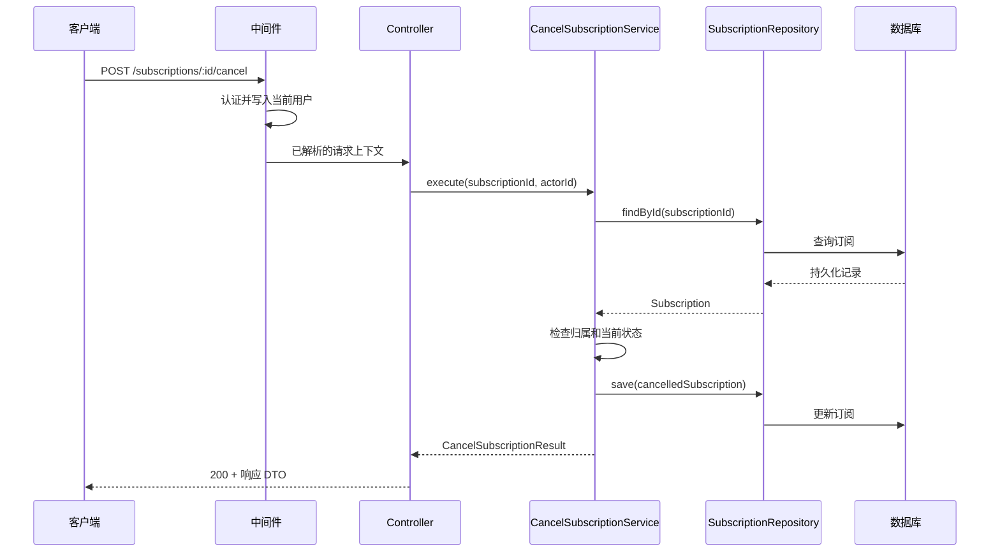

Controller、Service 和 DAO 不是必须同时存在的目录模板，而是隔离变化的逻辑边界。对于同一个后端接口：

- HTTP（Hypertext Transfer Protocol，超文本传输协议）的参数或响应格式变化，主要影响 Controller；
- 业务规则或用例步骤变化，主要影响 Service 或领域模型；
- 数据库、表结构或 ORM（Object-Relational Mapping，对象关系映射）工具变化，主要影响 DAO 或 Repository。

这些层可以运行在同一个 Node.js 进程中。逻辑上的 layer（层）不等于部署上的 tier（层级）：把代码分层不代表要拆成多个服务。

## 一次请求如何穿过各层

以“取消订阅”为例，请求的主线是：



DTO（Data Transfer Object，数据传输对象）是跨边界传递的数据结构。请求 DTO 描述接口允许接收的字段，响应 DTO 描述对外返回的字段；它们不必与数据库记录一一对应。

这条主线中的依赖通常保持单向：

```text
Router / Middleware -> Controller -> Service -> Repository 接口
                                              ^
                                              |
                              Repository 实现 -> ORM / 数据库
```

在使用依赖倒置时，Service 依赖 Repository 接口，数据库适配器实现该接口。这样，核心业务不需要导入 Prisma、TypeORM 等具体工具。

## Router 与 Middleware：进入 Controller 之前

Router 只根据 HTTP 方法和路径选择处理函数，例如把 `POST /subscriptions/:id/cancel` 交给取消订阅的 Controller。它不负责取消条件或数据库查询。

Middleware（中间件）、Guard 或 Pipe 处理可以跨多个接口复用的传输层关注点，例如：

- 解析请求体、Cookie 和身份凭据；
- 认证、限流、跨域、请求追踪和访问日志；
- 校验字段是否存在、类型是否正确、字符串是否符合 UUID 等格式；
- 统一捕获未处理错误并生成 HTTP 响应。

认证回答“请求者是谁”。“该用户是否拥有这份订阅，并且此状态是否允许取消”依赖业务数据，通常应由 Service 或领域模型判断。只有不依赖业务状态的粗粒度权限，例如某个路由仅允许管理员访问，才适合直接放在 Guard 或 Middleware 中。

## Controller：翻译传输协议

Controller 是 HTTP 与应用用例之间的适配器，负责：

- 从路径、查询参数、请求体和认证上下文取得输入；
- 执行传输层校验，把输入转换为用例需要的命令；
- 调用一个应用用例；
- 把用例结果转换为状态码、响应头和响应 DTO；
- 把错误交给统一错误处理器。

```ts
export async function cancelSubscriptionController(
  req: AuthenticatedRequest,
  res: Response,
  next: NextFunction
) {
  try {
    const subscriptionId = parseSubscriptionId(req.params.id)
    const result = await cancelSubscription.execute({
      subscriptionId,
      actorId: req.user.id
    })

    res.status(200).json({
      id: result.id,
      status: result.status
    })
  } catch (error) {
    next(error)
  }
}
```

其中 `parseSubscriptionId` 只判断 ID 的传输格式。下列代码不属于 Controller：

- 使用 ORM 或 SQL（Structured Query Language，结构化查询语言）查询数据；
- 判断订阅状态能否取消；
- 开启数据库事务；
- 发送邮件或调用支付服务；
- 实现会被 HTTP、消息队列任务和命令行入口共同使用的业务规则。

判断方法是：去掉 HTTP 后，这段规则是否仍然成立？如果从 REST 接口改成队列消费者后仍需执行，它就不应只存在于 Controller。

## Service：表达一个应用用例

Service 在这里特指应用服务。一个方法通常对应一个用户可感知的动作，例如 `cancelSubscription`、`placeOrder` 或 `resetPassword`，而不是机械地对应一个数据表。

应用服务负责：

- 编排完成用例所需的 Repository、领域对象和外部服务；
- 执行跨对象的业务规则；
- 决定哪些写操作必须作为一个原子操作完成；
- 返回与 HTTP 无关的结果或应用错误。

```ts
type CancelSubscriptionCommand = {
  subscriptionId: string
  actorId: string
}

export class CancelSubscriptionService {
  constructor(private readonly subscriptions: SubscriptionRepository) {}

  async execute(command: CancelSubscriptionCommand): Promise<Subscription> {
    const subscription = await this.subscriptions.findById(command.subscriptionId)

    if (!subscription) {
      throw new SubscriptionNotFoundError(command.subscriptionId)
    }
    if (subscription.customerId !== command.actorId) {
      throw new SubscriptionAccessDeniedError()
    }
    if (subscription.status !== 'active') {
      throw new SubscriptionCannotBeCancelledError(subscription.status)
    }

    subscription.status = 'cancelled'
    subscription.cancelledAt = new Date()

    return this.subscriptions.save(subscription)
  }
}
```

Service 不应接收 `req`、`res`，也不应返回 `200`、`404` 等 HTTP 状态码。`SubscriptionNotFoundError` 表示应用结果；HTTP 错误处理器可以把它映射为 `404 Not Found`，队列消费者则可以采用不同的重试或死信策略。

当规则逐渐复杂时，可以把“如何取消”移动到 `Subscription.cancel()` 这样的领域对象方法中，Service 仍负责加载对象、调用规则并持久化结果。简单的增删改查项目不必为每个数据结构额外建立领域模型。

### Service 不是所有可注入类的统称

`EmailService`、`PrismaService`、`CacheService` 在部分 Node.js 框架中也叫 Service，但它们更接近基础设施适配器：封装邮件供应商、数据库客户端或缓存。NestJS 的 Provider 表示“可由容器注入的对象”，其中既可以包含应用服务，也可以包含 Repository、工厂和其他基础设施组件；可注入不代表职责相同。

## DAO 与 Repository：隔离数据访问

DAO（Data Access Object，数据访问对象）和 Repository 都属于数据访问边界，但抽象角度不同。

| | DAO | Repository |
| --- | --- | --- |
| 主要视角 | 数据源、表、记录和查询 | 领域对象或聚合 |
| 常见接口 | `findRowById`、`updateStatus` | `findById`、`save`、`findActiveByCustomer` |
| 返回值 | 数据库记录或持久化模型 | 领域实体或用例需要的模型 |
| 适合场景 | 数据模型直接、以 CRUD（Create、Read、Update、Delete，增删改查）为主 | 希望业务模型不依赖持久化结构 |

Repository 的职责包括：

- 封装 ORM、SQL、连接和查询细节；
- 把持久化记录映射为领域对象，并把领域对象映射回持久化结构；
- 将可识别的唯一键冲突等存储错误转换为应用能理解的错误；
- 提供与当前业务查询相匹配的接口，而不是向上层暴露任意查询能力。

```ts
export interface SubscriptionRepository {
  findById(id: string): Promise<Subscription | null>
  save(subscription: Subscription): Promise<Subscription>
}

export class PrismaSubscriptionRepository implements SubscriptionRepository {
  constructor(private readonly prisma: PrismaClient) {}

  async findById(id: string): Promise<Subscription | null> {
    const row = await this.prisma.subscription.findUnique({ where: { id } })
    return row ? toDomainSubscription(row) : null
  }

  async save(subscription: Subscription): Promise<Subscription> {
    const row = await this.prisma.subscription.update({
      where: { id: subscription.id },
      data: {
        status: subscription.status,
        cancelledAt: subscription.cancelledAt
      }
    })
    return toDomainSubscription(row)
  }
}
```

DAO 和 Repository 的名称在实际项目中经常被混用。项目应先确定一种语义并保持一致，不需要为了形式固定建立 `Controller -> Service -> Repository -> DAO -> ORM` 五层调用。只有 DAO 已经是独立数据访问模块，而 Repository 还需要组合多个 DAO 或完成领域映射时，两者同时存在才带来清晰边界。

## 校验、错误和事务放在哪里

### 传输校验与业务校验

传输层校验关注“输入能否被解释”：必填字段、数据类型、长度、日期和 ID 格式。它通常位于请求 DTO、Pipe、Middleware 或 Controller 边界。

业务校验关注“当前操作能否成立”：库存是否充足、订阅是否属于当前用户、订单状态是否允许退款。它需要读取业务状态，应位于 Service 或领域模型。

数据库的唯一键、外键和检查约束仍然需要保留。应用层的预检查可以提供清晰错误，数据库约束则负责在并发请求下守住最终一致性；Repository 应把已知约束错误转换为稳定的应用错误。

### 错误到协议的映射

各层只处理自己能够解释的错误：

| 错误 | 产生或识别的位置 | HTTP 入口的映射示例 |
| --- | --- | --- |
| 请求字段格式错误 | 请求 DTO / Controller | `400 Bad Request` |
| 未认证 | Middleware / Guard | `401 Unauthorized` |
| 订阅不存在 | Service | `404 Not Found` |
| 当前状态禁止取消 | Service / 领域模型 | `409 Conflict` |
| 唯一键冲突 | Repository 识别，转换为应用错误 | `409 Conflict` |
| 未知数据库故障 | Repository 保留原因并向上抛出 | 记录内部详情，对外返回 `500` |

Service 不拼接 HTTP 响应，Repository 也不返回 HTTP 状态码。最终映射可以集中在 Express 错误处理中间件或 NestJS Exception Filter 中，避免每个 Controller 重复 `try/catch` 判断。

### 事务边界跟随用例

“创建订单并扣减库存”是否必须一起成功，是业务用例的决定，因此事务范围由 Service 所代表的用例确定。`begin`、`commit`、`rollback` 和 ORM 事务对象属于基础设施细节，可以由 Unit of Work（工作单元）或事务管理器封装：

```ts
await unitOfWork.run(async ({ orders, products }) => {
  await products.reserve(productId, quantity)
  await orders.create(order)
})
```

Controller 不开启事务，单个 Repository 也不应擅自提交一个本应横跨多个写操作的用例。对于很小的项目，Service 直接使用 ORM 的事务 API 是可以接受的简化，但这会让业务层依赖具体数据库工具，应作为明确的取舍。

## 目录按业务模块组织

小型项目可以先使用少量文件，不需要提前建立空层。项目增长后，优先按业务能力划分顶层目录，再在模块内部体现职责：

```text
src/
  modules/
    subscription/
      subscription.routes.ts
      subscription.controller.ts
      application/
        cancel-subscription.service.ts
      domain/
        subscription.ts
        subscription.repository.ts
      infrastructure/
        prisma-subscription.repository.ts
      dto/
        cancel-subscription.request.ts
        subscription.response.ts
```

这比顶层只有全局 `controllers/`、`services/`、`repositories/` 更容易看出一次业务修改涉及哪些文件。模块很小时也可以先把文件放在同一目录，依赖方向和职责边界比目录深度更重要。

## 是否需要某一层

不是每个接口都必须穿过相同数量的类：

- 纯 CRUD 且没有可复用业务规则时，Controller 直接调用 Repository 可以是合理简化；
- 有独立用例、跨多个数据源的编排或多种入口时，引入 Service；
- 数据库模型与业务模型相同且查询简单时，DAO 和 Repository 选择其一；
- 规则需要维护实体内部不变量时，引入领域对象；
- 只有一个具体实现且测试不需要替换时，不必为每个类都建立接口。

应避免的不是“层数少”，而是职责泄漏：Controller 中出现业务计算，Service 中到处出现 HTTP 对象，或者 Repository 决定业务流程。一个仅把参数原样传给下一层的方法也不自动构成有价值的边界。

## 定位代码的检查表

新增代码时可以依次判断：

1. 是否依赖 HTTP 路径、状态码、请求头或响应格式？放在 Router、Middleware 或 Controller。
2. 是否描述一个用户动作，并需要编排多个依赖？放在应用 Service。
3. 是否是不依赖入口和存储方式的业务规则？放在 Service 或领域模型。
4. 是否包含 ORM、SQL、表字段、缓存键或数据库错误码？放在 Repository、DAO 或基础设施适配器。
5. 是否把数据库记录变成领域对象？放在数据访问边界的 Mapper，而不是 Controller。
6. 换成命令行或队列入口后是否仍需执行？如果需要，就不应只存在于 HTTP 层。

测试边界也应与职责对应：Controller 测试参数和 HTTP 映射，Service 使用替身 Repository 测试业务分支，Repository 使用真实数据库做集成测试，端到端测试覆盖少量完整请求。

## 参考资料

- [Martin Fowler：Presentation Domain Data Layering](https://martinfowler.com/bliki/PresentationDomainDataLayering.html)
- [Martin Fowler：Patterns of Enterprise Application Architecture Catalog](https://martinfowler.com/eaaCatalog/)
- [Microsoft Learn：Common web application architectures](https://learn.microsoft.com/en-us/dotnet/architecture/modern-web-apps-azure/common-web-application-architectures)
- [Microsoft Learn：Design the infrastructure persistence layer](https://learn.microsoft.com/en-us/dotnet/architecture/microservices/microservice-ddd-cqrs-patterns/infrastructure-persistence-layer-design)
- [NestJS：Controllers](https://docs.nestjs.com/controllers)
- [NestJS：Providers](https://docs.nestjs.com/providers)
- [Express：Routing](https://expressjs.com/en/guide/routing/)
- [Express：Using middleware](https://expressjs.com/en/guide/using-middleware/)
