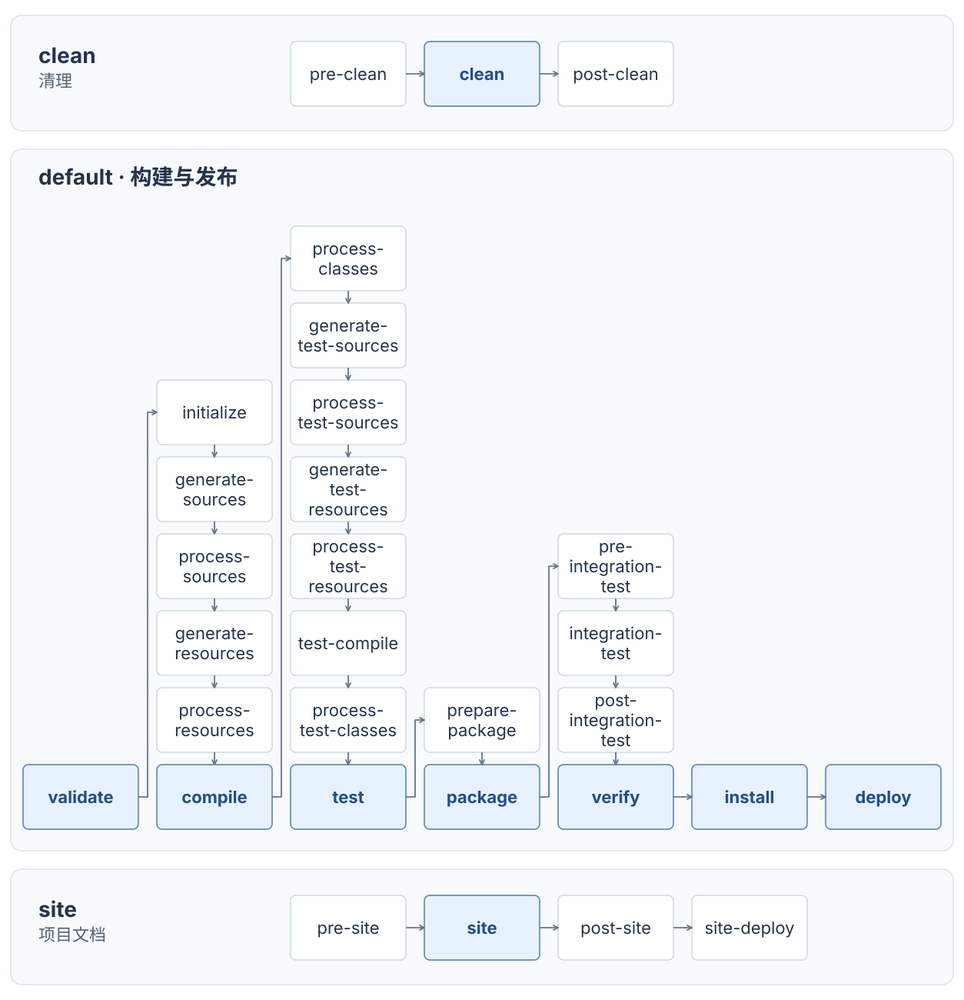

Maven 负责获取项目依赖的库，并组织编译、测试和打包。项目根目录的 `pom.xml` 集中记录这些配置，POM 是 Project Object Model（项目对象模型）的缩写。

## 完成一次构建

以下示例需要已安装 Maven 和 JDK 17 或更高版本。项目目录遵循 Maven 的约定：

```text
hello-maven/
├── pom.xml
└── src/
    ├── main/
    │   ├── java/com/example/App.java
    │   └── resources/
    └── test/
        ├── java/
        └── resources/
```

`main` 保存应用代码和资源，`test` 保存测试代码和资源，构建输出写入 `target/`。

`pom.xml`：

```xml
<project xmlns="http://maven.apache.org/POM/4.0.0">
  <modelVersion>4.0.0</modelVersion>
  <groupId>com.example</groupId>
  <artifactId>hello-maven</artifactId>
  <version>1.0.0-SNAPSHOT</version>

  <properties>
    <maven.compiler.release>17</maven.compiler.release>
    <project.build.sourceEncoding>UTF-8</project.build.sourceEncoding>
  </properties>

  <build>
    <plugins>
      <plugin>
        <groupId>org.apache.maven.plugins</groupId>
        <artifactId>maven-compiler-plugin</artifactId>
        <version>3.16.0</version>
      </plugin>
      <plugin>
        <groupId>org.apache.maven.plugins</groupId>
        <artifactId>maven-surefire-plugin</artifactId>
        <version>3.5.5</version>
      </plugin>
    </plugins>
  </build>
</project>
```

`src/main/java/com/example/App.java`：

```java
package com.example;

public class App {
    public static void main(String[] args) {
        System.out.println("Hello, Maven");
    }
}
```

在项目根目录执行：

```shell
mvn clean verify
java -cp target/hello-maven-1.0.0-SNAPSHOT.jar com.example.App
```

构建成功后，`target/` 中会生成编译后的 class 文件和 `hello-maven-1.0.0-SNAPSHOT.jar`，运行输出 `Hello, Maven`。项目或依赖发布到仓库的 JAR、POM 等文件，在 Maven 中称为构件。

仓库已有 Maven Wrapper（`mvnw`、`mvnw.cmd` 和 `.mvn/wrapper/`）时，使用 `./mvnw clean verify`；Windows 使用 `mvnw.cmd clean verify`。Wrapper 按项目记录的 Maven 版本构建，JDK 仍由启动环境决定。

## POM 常用字段

### 项目标识与属性

`project` 是 POM 的根元素。`modelVersion` 表示 POM 的格式版本，示例中的 `4.0.0` 与 Maven 自身的版本、项目的版本是三件不同的事。

`groupId`、`artifactId`、`version` 合起来标识一个项目，也用于定位它发布的依赖：

| 字段 | 含义 | 示例 |
| --- | --- | --- |
| `groupId` | 组织或项目所属的命名空间 | `com.example` |
| `artifactId` | 这个命名空间下的项目名 | `hello-maven` |
| `version` | 项目版本 | `1.0.0-SNAPSHOT` |

这组标识称为坐标，通常写成 `com.example:hello-maven:1.0.0-SNAPSHOT`。`SNAPSHOT` 表示开发中的可变版本，同一坐标可能下载到更新的内容；正式 Release 版本发布后应保持不变，修改后发布新版本。

`packaging` 表示项目产物的类型，省略时为 `jar`；`war` 用于 Web 应用包，`pom` 用于父项目或聚合项目等以配置为主的项目。

`properties` 保存自定义配置值，可以用 `${属性名}` 引用，让多个依赖复用同一个版本号等配置。`${…}` 也可以读取 Maven 提供的项目属性，例如 `${project.version}` 是当前项目版本。开头示例中的两个属性分别配置：

- `maven.compiler.release`：传给编译器的目标 Java 版本。值为 `17` 时，代码按 Java 17 的语法和标准库 API 编译，生成可在 Java 17 上运行的 class 文件。运行 Maven 的 JDK 由启动环境决定。
- `project.build.sourceEncoding`：源码编码，这里使用 UTF-8。

### `dependencies`：项目使用的库

`dependencies` 包含项目直接使用的库，每个 `dependency` 描述一个库的坐标。在 POM 的 `project` 中加入 JUnit 测试库：

```xml
<dependencies>
  <dependency>
    <groupId>org.junit.jupiter</groupId>
    <artifactId>junit-jupiter</artifactId>
    <version>5.13.4</version>
    <scope>test</scope>
  </dependency>
</dependencies>
```

POM 中写出的库是直接依赖；库自身依赖的其他库会继续被引入，称为传递依赖。例如 `junit-jupiter` 会引入 `junit-jupiter-api`（编写测试的 API）、`junit-jupiter-engine`（执行测试）和 `junit-jupiter-params`（让同一测试方法用多组参数运行）等组件。代码直接使用的库应在自己的 POM 中声明，避免上游调整后失去所需的依赖。

#### `scope`：在哪个环节使用依赖

`scope` 控制这个库是否参与主代码编译、测试编译与运行、应用运行。示例中的 `test` 让 JUnit 只用于测试：`src/test/java` 中能使用它，主代码不能依赖它。常用取值如下：

| scope | 主代码编译 | 测试编译与运行 | 应用运行 | 用途 |
| --- | --- | --- | --- | --- |
| `compile` | 是 | 是 | 是 | 默认范围，主代码使用的库 |
| `provided` | 是 | 是 | 否 | 运行容器提供的 API，如 Servlet API |
| `runtime` | 否 | 是 | 是 | 运行时实现或数据库驱动 |
| `test` | 否 | 是 | 否 | 测试框架与辅助库 |

`provided` 适用于运行容器已提供的库：编译时需要它，但应用运行时由容器提供。`provided`、`test` 依赖不会传递给依赖当前项目的其他项目。

#### `exclusions`：排除一条路径带来的依赖

假设只使用普通 JUnit 测试，不需要参数化测试支持，可以在上面的 `junit-jupiter` 的 `dependency` 内加入：

```xml
<exclusions>
  <exclusion>
    <groupId>org.junit.jupiter</groupId>
    <artifactId>junit-jupiter-params</artifactId>
  </exclusion>
</exclusions>
```

`exclusions` 是排除列表，每个 `exclusion` 用 `groupId` 和 `artifactId` 指定要排除的库，不需要填写版本。这里保留 `junit-jupiter` 及其他组件，只去掉它带来的 `junit-jupiter-params`。

排除只作用于当前依赖路径。如果另一个依赖也引入 `junit-jupiter-params`，它仍可能出现在项目中。修改后可用 `mvn dependency:tree` 确认是否还有其他来源。

### 版本冲突

不同库可能依赖同一个库的不同版本。没有统一版本配置时，Maven 按依赖路径选择版本，优先采用离当前项目最近的版本：

```text
application
├── library-a → common:1.0
└── library-b → helper → common:2.0
```

到 `common:1.0` 经过两条依赖关系，到 `common:2.0` 经过三条，因此选择 `1.0`。路径长度相同时，按依赖声明的顺序，先出现的路径优先。`mvn dependency:tree -Dverbose` 可以显示引入路径和未被选中的版本。

### 统一版本与 BOM

`dependencyManagement` 用于集中填写依赖的版本等配置。它与 `dependencies` 的区别是：前者规定“用到这个库时采用什么配置”，后者声明“项目需要这个库”。只写进管理区，不会让项目获得这个库。

例如，在 `project` 中把前面的 `common` 统一管理为 `2.0`：

```xml
<dependencyManagement>
  <dependencies>
    <dependency>
      <groupId>com.example</groupId>
      <artifactId>common</artifactId>
      <version>2.0</version>
    </dependency>
  </dependencies>
</dependencyManagement>
```

这样，前面两条路径传递引入的 `common` 都使用 `2.0`，不再按路径长度选择 `1.0`。项目直接使用 `common` 时，可以在 `dependencies` 中声明它并省略 `version`，由管理区补上。若直接依赖自己明确写了 `version`，则采用这个显式版本。

BOM（Bill of Materials，物料清单）是集中记录一组库的依赖管理配置的 POM。导入 BOM，相当于复用它提供的版本配置，避免逐个填写。例如导入 JUnit BOM：

```xml
<dependencyManagement>
  <dependencies>
    <dependency>
      <groupId>org.junit</groupId>
      <artifactId>junit-bom</artifactId>
      <version>5.13.4</version>
      <type>pom</type>
      <scope>import</scope>
    </dependency>
  </dependencies>
</dependencyManagement>
```

`type=pom` 表示这里引用的是 POM；`scope=import` 表示把其中的依赖管理配置导入当前管理区。导入后，前面的 `junit-jupiter` 依赖可以省略 `version`，但仍需在 `dependencies` 中声明。

统一配置发生冲突时：

- 当前 POM 直接填写的管理条目优先于导入的 BOM，与条目的书写位置无关。
- 同一管理区导入多个 BOM，且没有其他管理配置指定该库版本时，先导入的 BOM 优先，后导入的冲突条目不会覆盖它。
- 子 POM 直接填写的管理条目可以覆盖从父 POM 继承的配置。

### `build`：构建使用的插件

库供项目代码调用，插件负责执行构建任务。`dependencies` 配置前者，`build/plugins` 配置后者。开头示例中的 Compiler 插件负责编译，Surefire 插件负责运行单元测试，它们各自的 `version` 是插件版本，与项目版本无关。

`plugin` 中还常见以下配置：

- `configuration`：传给插件的参数。参数名由插件决定，例如 Compiler 插件的 `release` 表示编译目标 Java 版本。
- `executions`：配置插件的任务何时运行。每个 `execution` 可用 `id` 标识，用 `phase` 指定构建阶段，用 `goals` 指定执行哪些任务。阶段与任务的关系见下一节。

`build/pluginManagement` 集中保存插件版本和参数，常用于父 POM。它本身不增加构建任务；插件被项目实际使用时，才采用这些配置。比如给一个额外插件写了管理配置，还需要在 `build/plugins` 中声明使用它；编译和测试插件已有默认任务安排。

### `parent` 与 `modules`：共享配置、一起构建

`parent` 指定当前项目继承哪个父 POM。父 POM 中的版本、属性和插件配置可以由子项目复用；`relativePath` 指向本地父 POM 的路径，默认是 `../pom.xml`。

`modules` 列出要一起构建的子项目目录。例如根项目列出 `shop-domain` 和 `shop-api`，执行一次命令就能构建两个模块。继承父配置与参加同一次构建是两件事，具体写法见 [多模块：聚合与继承](#多模块-聚合与继承)。

### 仓库相关字段

`repositories` 指定项目依赖从哪里下载，`pluginRepositories` 指定构建插件从哪里下载。默认配置已提供 Maven Central，使用其中的公共库通常不用额外填写。

`distributionManagement` 指定当前项目产物发布到哪里，其中 `repository` 用于 Release，`snapshotRepository` 用于 Snapshot。它配置上传目的地，与下载仓库的用途不同。

## 构建阶段与插件

Maven 内置三个生命周期：`clean` 清理构建输出，`default` 完成项目构建和产物发布，`site` 生成项目文档站点。每个生命周期都有自己的阶段顺序。下图列出全部阶段，蓝色为常用阶段：



调用一个阶段时，Maven 从它所属生命周期的第一个阶段开始，执行到指定阶段为止。不同生命周期之间的执行顺序由命令决定，例如 `mvn clean package` 先清理，再执行默认生命周期直到打包。

### clean：清理构建输出

`clean` 阶段删除上一次构建生成的文件，通常是 `target/` 目录：

```shell
mvn clean
```

只执行 `mvn package` 不会自动清理；需要从干净的输出目录重新构建时，组合使用 `mvn clean package`。

### default：构建与发布

默认生命周期中常用的阶段按以下顺序执行：

- `validate`：安排构建前的校验，例如通过插件检查 JDK 版本。这个阶段默认没有绑定任务。
- `compile`：编译 `src/main/java` 中的主代码，输出到 `target/classes`。
- `test`：运行单元测试。在到达这个阶段之前，Maven 已编译测试代码；Surefire 插件的测试报告默认写入 `target/surefire-reports`。
- `package`：按 `packaging` 生成 JAR、WAR 等产物，写入 `target/`。
- `verify`：执行已配置的集成测试结果检查和其他质量校验。集成测试、代码规范检查等需要配置相应插件。
- `install`：把产物和 POM 安装到本地仓库，供本机其他项目作为依赖使用。
- `deploy`：把产物和 POM 发布到远程仓库，供其他开发者和构建环境获取；发布地址由 `distributionManagement` 配置。

例如 `mvn package` 会先编译主代码、编译测试代码、运行测试，再打包。只需指定最后要到达的阶段，无需写成 `mvn compile test package`。

需要完整检查时，可以执行：

```shell
mvn clean verify
```

配置了集成测试后，执行到 `verify` 可以完成测试环境准备、测试、清理和结果检查。

### site：生成项目文档

`site` 阶段根据 POM 中的项目信息和配置的报告插件生成文档站点，默认输出到 `target/site/`：

```shell
mvn site
```

生成文档与构建 JAR 是不同的工作，按需要调用对应生命周期。

### 阶段与插件目标的关系

**阶段**决定构建执行到哪一步，**插件目标**完成具体任务。例如 `compile` 是阶段，`compiler:compile` 是 Compiler 插件的编译目标。

`jar` 项目默认在 `compile` 阶段调用 `compiler:compile`，在 `test` 阶段调用 `surefire:test`，在 `package` 阶段调用 `jar:jar`。把某个目标安排到某个阶段执行，称为绑定；没有绑定目标的阶段不会执行实际任务。

插件目标也能直接调用。`mvn dependency:tree` 中，`dependency` 是插件前缀，`tree` 是目标名。这个命令只调用查看依赖树的目标。

## 多模块：聚合与继承

接口代码依赖领域代码时，可以分别放进 `shop-api`、`shop-domain` 两个模块，每个模块有自己的 POM 和 JAR。根 POM 用 `modules` 组织它们一起构建，称为**聚合**；子模块用 `parent` 共享根 POM 的配置，称为**继承**。

```text
shop/
├── pom.xml
├── shop-domain/pom.xml
└── shop-api/pom.xml
```

以开头的 POM 为基础，将 `artifactId` 改为 `shop`，保留坐标、属性和插件配置，在 `project` 中加入：

```xml
<packaging>pom</packaging>
<modules>
  <module>shop-domain</module>
  <module>shop-api</module>
</modules>
```

聚合 POM 使用 `packaging=pom`，`modules` 填写相对于根 POM 的目录路径。`shop-domain/pom.xml`：

```xml
<project xmlns="http://maven.apache.org/POM/4.0.0">
  <modelVersion>4.0.0</modelVersion>
  <parent>
    <groupId>com.example</groupId>
    <artifactId>shop</artifactId>
    <version>1.0.0-SNAPSHOT</version>
    <relativePath>../pom.xml</relativePath>
  </parent>
  <artifactId>shop-domain</artifactId>
</project>
```

子模块继承 `groupId`、`version`、属性和插件配置。`shop-api` 使用相同的父 POM，自己的 `artifactId` 改为 `shop-api`，并在 `project` 中声明对领域模块的依赖：

```xml
<dependencies>
  <dependency>
    <groupId>com.example</groupId>
    <artifactId>shop-domain</artifactId>
    <version>${project.version}</version>
  </dependency>
</dependencies>
```

此例模块统一版本，因此用 `${project.version}` 引用当前模块版本。独立发布的模块需要分别管理版本。聚合与继承是独立关系：列入 `modules` 不会自动继承配置，声明 `parent` 也不会自动加入父项目的模块列表。

根目录执行 `mvn clean verify` 时，Maven 收集模块、按依赖关系排序，再依次构建。这个过程由 Reactor（多模块构建机制）组织：此例先构建 `shop-domain`，再构建依赖它的 `shop-api`；后者可以直接使用前者在本次构建中生成的结果，无需先执行 `install`。

只构建接口模块及其上游依赖：

```shell
mvn -pl :shop-api -am verify
```

`-pl` 选择模块，`-am` 同时加入它依赖的 Reactor 模块。只用 `-pl` 时，上游产物需要能从仓库解析。

父 POM 的普通 `dependencies` 会被子模块继承，所以放在这里的库会成为各子模块的依赖。只想统一版本、让模块自己决定是否引入时，放进 `dependencyManagement`。

## 仓库与机器配置

本地仓库默认位于 `~/.m2/repository`，保存下载的库和插件，也保存 `mvn install` 安装的项目产物。需要下载构件或检查 Snapshot 更新时，Maven 访问远程仓库。其他本机项目可以把本地安装的产物当作依赖使用；`mvn deploy` 则把产物上传到远程仓库，供其他开发者或构建环境获取。

`pom.xml` 随项目共享，用户级 `~/.m2/settings.xml` 保存本机的镜像、代理和认证等配置。镜像是下载仓库的替代地址，例如统一通过公司仓库下载：

```xml
<settings xmlns="http://maven.apache.org/SETTINGS/1.2.0">
  <mirrors>
    <mirror>
      <id>company-mirror</id>
      <url>https://repo.example.com/maven-public</url>
      <mirrorOf>*</mirrorOf>
    </mirror>
  </mirrors>
</settings>
```

`mirrorOf` 指定替代哪些仓库，`*` 表示所有下载仓库。配置后，对 Central 等仓库的请求会发给这里的公司地址；公司仓库需要保存或代理所需构件，缺少时 Maven 不会自动绕过它访问 Central。

需要认证时，在 `settings.xml` 的 `servers` 中添加 `server`，其中 `id` 与镜像的 `company-mirror` 匹配，让 Maven 找到这次请求使用的用户名和密码。

发布时，Maven 使用 `distributionManagement` 中的仓库地址，并按该仓库的 `id` 查找 `servers` 中的凭据。镜像影响下载，发布仍使用自己的目标地址。密码和令牌不应提交到项目中。

## 常用排查

| 问题 | 检查方式 |
| --- | --- |
| IDE、终端与 CI 构建不一致 | `mvn -version` 比较 Maven 和 JDK；`mvn help:effective-pom` 查看当前 POM 与父配置、默认配置合并后的结果 |
| 依赖版本不符合预期 | `mvn dependency:tree -Dverbose` 查看引入路径和版本选择 |
| 依赖下载失败 | 核对坐标、镜像和认证 ID；`mvn help:effective-settings` 查看实际使用的配置 |
| 缺失依赖已发布，或需要检查 Snapshot 更新 | `mvn -U verify` 强制检查缺失的 Release 和更新的 Snapshot |
| 单元测试失败 | 查看 `target/surefire-reports/` |
| 多模块构建失败 | 查看日志末尾的 Reactor Summary（模块构建结果列表），先处理第一个失败模块；后续 `SKIPPED` 表示未继续构建 |
