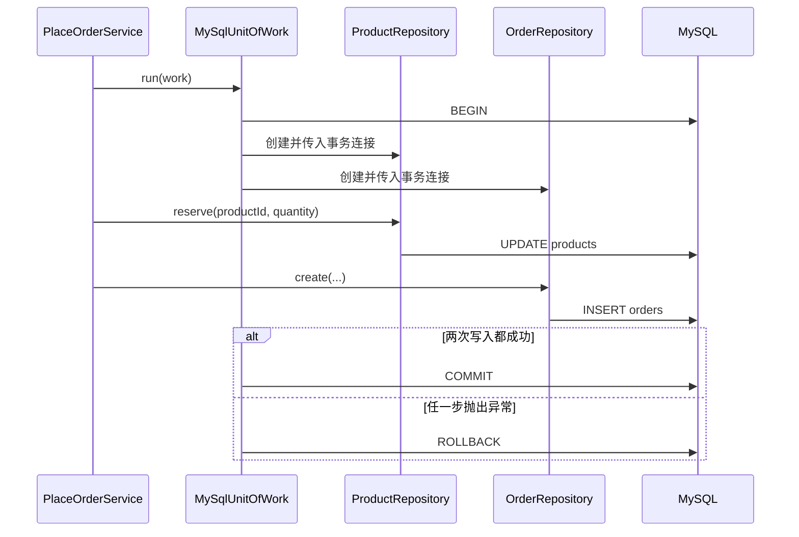

“创建订单并扣减库存”包含两个数据库写操作。如果 MySQL 保持默认的自动提交模式，每条语句会分别提交：库存扣减成功后，创建订单仍然可能失败，数据库由此留下没有订单对应的库存变更。

Unit of Work（工作单元，简称 UoW）把一个业务用例需要的数据库操作放进同一事务。在 Node.js 手写 SQL 的场景中，最小实现需要完成三件事：

1. 从连接池取得一个连接并开启事务；
2. 让参与当前用例的 Repository 共用这个连接；
3. 用例成功时提交，出现异常时回滚，最后归还连接。



`PlaceOrderService` 决定“扣减库存和创建订单必须一起成功”，所以事务边界跟随这个用例。UoW 只实现事务的技术细节，不决定哪些业务操作应该组合。

## 最小调用形式

应用 Service 只在 `run()` 回调中使用当前事务提供的 Repository：

```ts
return unitOfWork.run(async ({ products, orders }) => {
  await products.reserve(productId, quantity)

  const orderId = await orders.create({
    productId,
    quantity
  })

  return { orderId }
})
```

回调正常返回后，UoW 提交事务；任意操作抛出异常时，UoW 回滚事务。

下面使用 Node.js、TypeScript、MySQL 8.4、InnoDB 表和 `mysql2/promise` 展开这个调用。示例只保留事务边界所需的代码，不包含 HTTP Controller、依赖注入容器和日志框架。

## 准备数据表

```sql
CREATE TABLE products (
  id INT UNSIGNED PRIMARY KEY AUTO_INCREMENT,
  name VARCHAR(100) NOT NULL,
  stock INT UNSIGNED NOT NULL
) ENGINE = InnoDB;

CREATE TABLE orders (
  id INT UNSIGNED PRIMARY KEY AUTO_INCREMENT,
  product_id INT UNSIGNED NOT NULL,
  quantity INT UNSIGNED NOT NULL,
  created_at TIMESTAMP NOT NULL DEFAULT CURRENT_TIMESTAMP,
  CONSTRAINT fk_orders_product
    FOREIGN KEY (product_id) REFERENCES products(id)
) ENGINE = InnoDB;

INSERT INTO products (name, stock)
VALUES ('Keyboard', 10);
```

事务只能可靠地回滚支持事务的表。示例显式使用 InnoDB，不能换成不支持事务的存储引擎后仍期待相同结果。

安装 MySQL 驱动：

```bash
pnpm add mysql2
```

## 创建连接池

```ts
// infrastructure/mysql/pool.ts
import mysql from 'mysql2/promise'

export const pool = mysql.createPool({
  host: '127.0.0.1',
  port: 3306,
  user: 'app',
  password: 'password',
  database: 'shop',
  connectionLimit: 10
})
```

连接池负责复用连接。执行一个跨多条语句的事务时，需要使用 `pool.getConnection()` 显式取得一个连接，并在结束后调用 `release()` 将它归还连接池。

## Repository 使用事务连接

两个 Repository 都通过构造函数接收 `PoolConnection`：

```ts
// infrastructure/mysql/product.repository.ts
import type {
  PoolConnection,
  ResultSetHeader
} from 'mysql2/promise'

export class ProductRepository {
  constructor(private readonly connection: PoolConnection) {}

  async reserve(productId: number, quantity: number): Promise<void> {
    const [result] = await this.connection.execute<ResultSetHeader>(
      `UPDATE products
       SET stock = stock - ?
       WHERE id = ?
         AND stock >= ?`,
      [quantity, productId, quantity]
    )

    if (result.affectedRows !== 1) {
      throw new Error('商品不存在或库存不足')
    }
  }
}
```

库存检查和扣减位于同一条 `UPDATE` 中。并发事务竞争同一商品时，MySQL 会在满足 `stock >= quantity` 的情况下完成扣减；`affectedRows` 为 `0` 表示商品不存在或剩余库存不足。先执行 `SELECT stock`，再根据查询结果执行无条件 `UPDATE`，会在两个语句之间留下并发竞争窗口。

```ts
// infrastructure/mysql/order.repository.ts
import type {
  PoolConnection,
  ResultSetHeader
} from 'mysql2/promise'

type CreateOrderInput = {
  productId: number
  quantity: number
}

export class OrderRepository {
  constructor(private readonly connection: PoolConnection) {}

  async create(input: CreateOrderInput): Promise<number> {
    const [result] = await this.connection.execute<ResultSetHeader>(
      `INSERT INTO orders (product_id, quantity)
       VALUES (?, ?)`,
      [input.productId, input.quantity]
    )

    return result.insertId
  }
}
```

`execute()` 使用参数占位符传值，不把用户输入直接拼接进 SQL。

## 封装 MySqlUnitOfWork

```ts
// infrastructure/mysql/mysql-unit-of-work.ts
import type { Pool } from 'mysql2/promise'
import { OrderRepository } from './order.repository'
import { ProductRepository } from './product.repository'

type TransactionRepositories = {
  products: ProductRepository
  orders: OrderRepository
}

export class MySqlUnitOfWork {
  constructor(private readonly pool: Pool) {}

  async run<T>(
    work: (repositories: TransactionRepositories) => Promise<T>
  ): Promise<T> {
    const connection = await this.pool.getConnection()

    try {
      await connection.beginTransaction()

      try {
        const repositories: TransactionRepositories = {
          products: new ProductRepository(connection),
          orders: new OrderRepository(connection)
        }

        const result = await work(repositories)

        await connection.commit()
        return result
      } catch (error) {
        await connection.rollback()
        throw error
      }
    } finally {
      connection.release()
    }
  }
}
```

内层 `try/catch` 管理已经成功开启的事务，外层 `finally` 保证连接最终归还连接池。`beginTransaction()`、`commit()` 和 `rollback()` 分别对应 MySQL 的 `START TRANSACTION`、`COMMIT` 和 `ROLLBACK`。

Repository 必须使用 UoW 传入的 `connection`。下面这种写法绕过了当前事务：

```ts
// 错误：pool.execute() 可能选择另一个连接
await pool.execute('INSERT INTO orders ...')
```

MySQL 事务属于一个数据库会话，也就是这里从连接池取出的单个连接。即使 SQL 在同一个回调或同一个 Node.js 进程中执行，换了连接也不再属于原事务。

## Service 确定业务边界

```ts
// application/place-order.service.ts
import { MySqlUnitOfWork } from '../infrastructure/mysql/mysql-unit-of-work'

type PlaceOrderCommand = {
  productId: number
  quantity: number
}

export class PlaceOrderService {
  constructor(private readonly unitOfWork: MySqlUnitOfWork) {}

  async execute(command: PlaceOrderCommand): Promise<{ orderId: number }> {
    if (!Number.isInteger(command.quantity) || command.quantity <= 0) {
      throw new Error('购买数量必须是正整数')
    }

    return this.unitOfWork.run(async ({ products, orders }) => {
      await products.reserve(command.productId, command.quantity)

      const orderId = await orders.create({
        productId: command.productId,
        quantity: command.quantity
      })

      return { orderId }
    })
  }
}
```

组装并调用 Service：

```ts
import { PlaceOrderService } from './application/place-order.service'
import { MySqlUnitOfWork } from './infrastructure/mysql/mysql-unit-of-work'
import { pool } from './infrastructure/mysql/pool'

const unitOfWork = new MySqlUnitOfWork(pool)
const placeOrder = new PlaceOrderService(unitOfWork)

const result = await placeOrder.execute({
  productId: 1,
  quantity: 2
})

console.log(result)
```

成功后，`products.stock` 减少 `2`，`orders` 增加一行。如果 `orders.create()` 抛出异常，调用会进入 `rollback()`，库存恢复到事务开始前的值。

## 验证回滚

可以在 `orders.create()` 的 `INSERT` 前临时抛出异常：

```ts
throw new Error('模拟创建订单失败')
```

调用 Service 前后分别查询：

```sql
SELECT stock FROM products WHERE id = 1;
SELECT * FROM orders WHERE product_id = 1;
```

预期结果是调用失败，并且库存和订单表都没有发生变化。测试事务代码时应使用真实 MySQL 实例做集成测试；用假的 Repository 只能验证 Service 是否选择了正确的用例边界，不能证明数据库确实完成了回滚。

## 这个实现的范围

Martin Fowler 对 Unit of Work 的经典定义还包括跟踪业务事务中新增、修改和删除的对象，并在结束时协调写入与并发处理。带变更跟踪的 ORM 通常已经实现了这一部分。

本文的手写 SQL 示例没有维护对象变更列表，因此是更窄的实现：它使用 `UnitOfWork` 这个名称表达“共享事务连接、协调多个 Repository 并统一提交或回滚”。在只使用 MySQL 驱动的 Node.js 项目中，这种封装已经能隔离事务生命周期，避免把 `begin`、`commit` 和 `rollback` 散落到应用 Service。

还需要注意以下边界：

- 只有一条原子 SQL 时，通常不需要额外建立 UoW；
- 事务应尽量短，不要在回调中等待用户输入或执行耗时的 HTTP 调用；
- 数据库回滚不能撤销已经发送的邮件、HTTP 请求或消息，跨系统一致性需要 Outbox（事务发件箱）或补偿操作；
- 示例不支持嵌套 `run()`；已有事务中再次开启 UoW，需要明确设计事务传播或保存点；
- 不要在事务中混入会隐式提交的 DDL（Data Definition Language，数据定义语言）语句。

## 参考资料

- [Martin Fowler：Unit of Work](https://martinfowler.com/eaaCatalog/unitOfWork.html)
- [Microsoft Learn：Repository 与 Unit of Work 模式](https://learn.microsoft.com/en-us/aspnet/mvc/overview/older-versions/getting-started-with-ef-5-using-mvc-4/implementing-the-repository-and-unit-of-work-patterns-in-an-asp-net-mvc-application)
- [MySQL 8.4：START TRANSACTION、COMMIT 与 ROLLBACK](https://dev.mysql.com/doc/refman/8.4/en/commit.html)
- [MySQL2：创建连接池](https://sidorares.github.io/node-mysql2/docs/examples/connections/create-pool)
