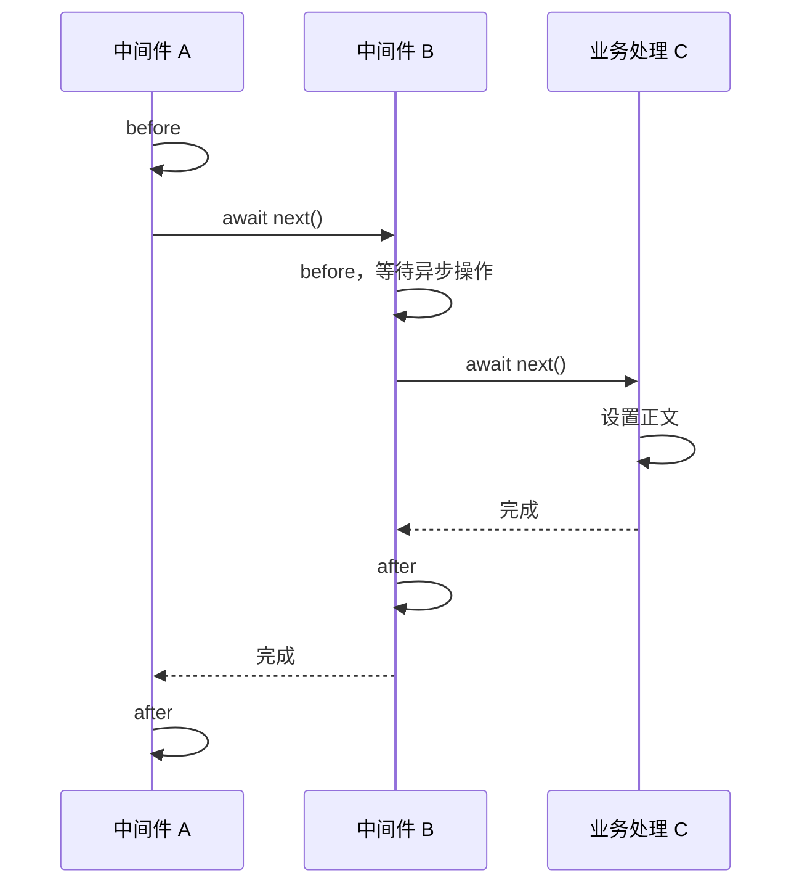

Express 的中间件采用**责任链模式**，Koa 的中间件采用**洋葱模型**。

- **责任链模式**：请求按注册顺序传递，每个中间件决定继续调用 `next()`，还是结束处理。
- **洋葱模型**：外层通过 `await next()` 进入内层，等内层完成后，再逐层返回，执行各层剩下的代码。

## Express：责任链模式

中间件通过 `next()` 把请求交给链上的下一个处理函数。认证通过就继续，认证失败就返回响应，后面的业务逻辑不再执行。

```text
请求 → 日志 → 认证 → 业务处理
                └→ 认证失败，返回 401
```

`next()` 负责推进这条链，但不代表后续处理已经完成。下面三个中间件中，B 包含一次异步等待：

```js
import { setTimeout as delay } from 'node:timers/promises'

app.use((req, res, next) => {
  console.log('A: before')
  next()
  console.log('A: after')
})

app.use(async (req, res, next) => {
  console.log('B: before')
  await delay(50)
  console.log('B: ready')
  next()
  console.log('B: after')
})

app.use((req, res) => {
  console.log('C: handle')
  res.send('ok')
})
```

输出顺序：

```text
A: before
B: before
A: after
B: ready
C: handle
B: after
```

A 调用 `next()`，B 开始执行；B 在 `await` 处暂停，A 的 `next()` 随即返回，继续执行 `A: after`。等 B 的异步操作完成，它才调用自己的 `next()`，交给 C。

因此，B 可以先完成认证或查询，再放行 C。A 若在 `next()` 后写收尾逻辑，却不会自动等到 B、C 完成。Express 的 `next()` 不返回下游完成的 Promise，改写成 `await next()` 也没有这个等待效果。[Express 中间件指南](https://expressjs.com/en/guide/writing-middleware/)

如果 B 的代码全部同步执行，调用顺序也会出现 `A before → B before → C → B after → A after`。这是同步函数调用的返回顺序；异步操作加入后，就不能靠它包围整条处理链。

### 源码中的 next()

下面按 [`Router.handle()`](https://github.com/pillarjs/router/blob/v2.2.0/index.js#L143-L329) 的调用关系裁剪，将 `stack` 视为已匹配的中间件列表，去掉路径匹配、参数处理和嵌套路由：

```js
Router.prototype.handle = function handle(req, res, callback) {
  let idx = 0
  const stack = this.stack

  next()

  function next(err) {
    if (idx >= stack.length) {
      setImmediate(callback, err)
      return
    }

    const layer = stack[idx++]

    if (err) {
      layer.handleError(err, req, res, next)
    } else {
      layer.handleRequest(req, res, next)
    }
  }
}
```

每次 `next()` 都取出下一个处理项：没有错误时调用普通中间件，有错误时寻找错误处理中间件。到达数组末尾后，交给 `callback` 收尾。

[`handleRequest()`](https://github.com/pillarjs/router/blob/v2.2.0/lib/layer.js#L135-L159) 调用普通中间件：

```js
Layer.prototype.handleRequest = function handleRequest(req, res, next) {
  const fn = this.handle

  if (fn.length > 3) {
    return next()
  }

  try {
    const ret = fn(req, res, next)

    if (isPromise(ret)) {
      ret.then(null, function (error) {
        next(error || new Error('Rejected promise'))
      })
    }
  } catch (err) {
    next(err)
  }
}
```

`fn` 收到的 `next` 仍然是外层调度函数。返回的 Promise 只用于监听失败，没有返回给上一层；同步异常和 Promise 失败都会转为 `next(error)`。

[`handleError()`](https://github.com/pillarjs/router/blob/v2.2.0/lib/layer.js#L100-L124) 的处理方式相同，但只调用四参数函数，其他函数继续跳过：

```js
Layer.prototype.handleError = function handleError(error, req, res, next) {
  const fn = this.handle

  if (fn.length !== 4) {
    return next(error)
  }

  try {
    const ret = fn(error, req, res, next)

    if (isPromise(ret)) {
      ret.then(null, function (error) {
        next(error || new Error('Rejected promise'))
      })
    }
  } catch (err) {
    next(err)
  }
}
```

### 错误沿链向后传递

中间件调用 `next(error)` 后，Express 跳过后续普通中间件，寻找四参数的错误处理函数。统一错误处理因此注册在需要覆盖的中间件和路由之后：

```js
app.use((error, req, res, next) => {
  console.error(error)
  if (res.headersSent) return next(error)
  res.status(500).send('Internal Server Error')
})
```

在上面的 B 中，若异步等待后抛错，Express 5 会把返回的 Promise 的失败转入这条错误处理流程，C 不再执行。Express 4 需要显式 `.catch(next)` 或相应包装。[Express 错误处理文档](https://expressjs.com/en/guide/error-handling/)

## Koa：洋葱模型

Koa 的每层中间件都可以分成两部分：`await next()` 之前的前置操作，以及之后的后置操作。外层等待内层，内层结束后才恢复外层。

同样是 A、B、C，Koa 的写法是：

```js
app.use(async (ctx, next) => {
  console.log('A: before')
  await next()
  console.log('A: after')
})

app.use(async (ctx, next) => {
  console.log('B: before')
  await delay(50)
  console.log('B: ready')
  await next()
  console.log('B: after')
})

app.use((ctx) => {
  console.log('C: handle')
  ctx.body = 'ok'
})
```

输出顺序：

```text
A: before
B: before
B: ready
C: handle
B: after
A: after
```

A 等待 B，B 等待 C。C 设置正文后，先恢复 B 的后置操作；B 整个函数结束，才轮到 A。相对当前层，后续被调用的中间件称为“下游”，恢复外层的过程称为“上游”。



这种逐层进入、再逐层返回的结构就是“洋葱”。它由 Promise 的等待关系形成：B 返回的 Promise，要等 B 自己的异步操作、C 的处理和 B 的后置操作全部结束才完成；A 的 `await next()` 等待的正是这个 Promise。[Koa 官方示例](https://koajs.com/#application)、[koa-compose 源码](https://github.com/koajs/compose/blob/4.1.0/index.js)

不调用 `next()` 同样可以停止向内传递。例如 B 认证失败后设置响应并返回，C 不会执行，但等待 B 的 A 仍会恢复，执行自己的后置操作。

### 源码中的 dispatch()

[`koa-compose` 的 index.js](https://github.com/koajs/compose/blob/4.1.0/index.js) 全文：

```js
'use strict'

/**
 * Expose compositor.
 */

module.exports = compose

/**
 * Compose `middleware` returning
 * a fully valid middleware comprised
 * of all those which are passed.
 *
 * @param {Array} middleware
 * @return {Function}
 * @api public
 */

function compose(middleware) {
  if (!Array.isArray(middleware)) throw new TypeError('Middleware stack must be an array!')
  for (const fn of middleware) {
    if (typeof fn !== 'function') throw new TypeError('Middleware must be composed of functions!')
  }

  /**
   * @param {Object} context
   * @return {Promise}
   * @api public
   */

  return function (context, next) {
    // last called middleware #
    let index = -1
    return dispatch(0)
    function dispatch(i) {
      if (i <= index) return Promise.reject(new Error('next() called multiple times'))
      index = i
      let fn = middleware[i]
      if (i === middleware.length) fn = next
      if (!fn) return Promise.resolve()
      try {
        return Promise.resolve(fn(context, dispatch.bind(null, i + 1)))
      } catch (err) {
        return Promise.reject(err)
      }
    }
  }
}
```

`compose(middleware)` 返回一个执行函数。每次请求调用它时，建立独立的 `index`，再从 `dispatch(0)` 开始。

传给中间件的 `next` 是 `dispatch.bind(null, i + 1)`，相当于 `() => dispatch(i + 1)`。它返回下一层的 Promise；当前中间件通过 `await next()` 等待，再把自己的 Promise 返回给外层。同步异常由 `catch` 转成 Promise 失败，沿同一条调用链向外传播。

### 错误沿调用关系向外传播

下游失败会使外层的 `await next()` 抛错，所以统一错误处理放在最外层，也就是最先注册的位置：

```js
app.use(async (ctx, next) => {
  const start = performance.now()

  try {
    await next()
  } catch (error) {
    console.error(error)
    ctx.status = 500
    ctx.body = 'Internal Server Error'
  } finally {
    console.log('处理耗时：', performance.now() - start)
  }
})
```

将它注册在 A、B、C 前面，B 的异步错误就能沿调用关系传到这里。正常完成时直接进入 `finally`，失败时先进入 `catch` 再执行 `finally`。这让计时、错误处理和清理操作可以放在同一个作用域里。[Koa 错误处理说明](https://github.com/koajs/koa/blob/master/docs/error-handling.md)

## 两种模型的使用差别

只有认证、参数处理等前置逻辑时，两种模型的业务顺序可以相同：当前中间件先完成自己的工作，再调用下一层。需要包围后续处理时，Koa 可以直接在 `await next()` 两侧写代码，并用外层 `try/catch` 接住异常。

Express 也能计时，只是要选择另一个结束信号。例如记录响应发送耗时，可以在调用 `next()` 前监听 `finish`：

```js
app.use((req, res, next) => {
  const start = performance.now()
  res.once('finish', () => {
    console.log('响应耗时：', performance.now() - start)
  })
  next()
})
```

Koa 的 `await next()` 等到下游中间件结束；`finish` 等到响应数据交给操作系统发送。前者适合在发送响应前加工结果，后者适合记录响应发送情况。[Node.js 响应事件](https://nodejs.org/api/http.html#event-finish_2)

## 参考资料

### 官方文档

- [Express：Writing middleware](https://expressjs.com/en/guide/writing-middleware/)
- [Express：Using middleware](https://expressjs.com/en/guide/using-middleware/)
- [Express：Error handling](https://expressjs.com/en/guide/error-handling/)
- [Koa：Application / Cascading](https://koajs.com/#application)
- [Koa：Writing middleware](https://github.com/koajs/koa/blob/master/docs/guide.md#writing-middleware)
- [Koa：Error handling](https://github.com/koajs/koa/blob/master/docs/error-handling.md)
- [Node.js：ServerResponse 的 finish 事件](https://nodejs.org/api/http.html#event-finish_2)

### 延伸阅读

- [阮一峰：Koa 框架教程](https://www.ruanyifeng.com/blog/2017/08/koa.html)
- [廖雪峰：koa 入门](https://liaoxuefeng.com/books/javascript/nodejs/web/koa/basic/index.html)
- [Koa for Express users](https://github.com/koajs/koa/blob/master/docs/koa-vs-express.md)：包含 Koa 独立设计的背景。
- [Koa 0.2.0 README](https://github.com/koajs/koa/blob/0.2.0/Readme.md)：早期 Generator（生成器）与 `yield next` 写法。
- [Koa 版本历史](https://github.com/koajs/koa/blob/master/History.md)与 [Releases](https://github.com/koajs/koa/releases)
- [koa-compose 4.1.0](https://github.com/koajs/compose/blob/4.1.0/index.js)与[当前源码](https://github.com/koajs/compose/blob/master/index.js)
- [Koa 3.0.0：请求处理入口](https://github.com/koajs/koa/blob/v3.0.0/lib/application.js)
