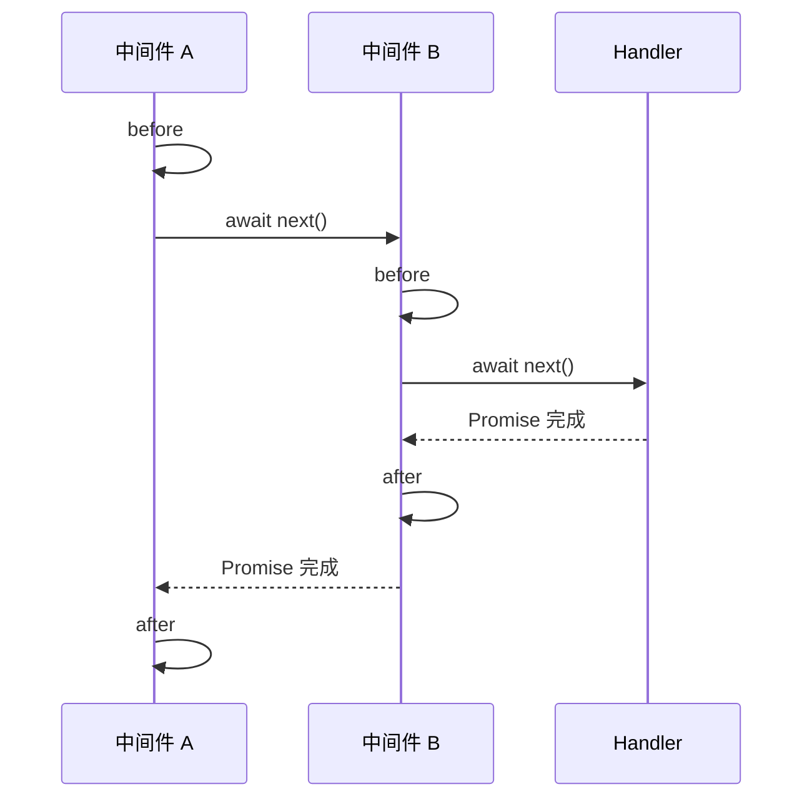

Express 与 Koa 都按注册顺序保存中间件，差异不在“有没有中间件栈”，而在 `next` 的契约：

- Express 的 `next()` 通知路由器继续调度，本身不是一个供当前中间件等待的 Promise。
- Koa 的 `next()` 返回 Promise，`await next()` 明确地把当前中间件分为下游执行前和下游执行后两部分。

因此，“洋葱模型”不是中间件数组的别名，而是由 Promise 链建立的可等待、可回溯控制流。

## 同一个请求的两种控制流

Koa 中间件的标准写法是：

```ts
app.use(async (ctx, next) => {
  console.log('A: before')
  await next()
  console.log('A: after')
})

app.use(async (ctx, next) => {
  console.log('B: before')
  await next()
  console.log('B: after')
})

app.use(async (ctx) => {
  console.log('handler')
  ctx.body = 'ok'
})
```

执行顺序为：

```text
A: before
B: before
handler
B: after
A: after
```



请求先由外向内进入，再由内向外恢复，形状像剖开的洋葱。计时、日志、事务和统一异常处理可以自然包围整个下游生命周期。

## Express 为什么有时也像洋葱

Express 中也可以把代码写在 `next()` 后面：

```ts
app.use((req, res, next) => {
  console.log('A: before')
  next()
  console.log('A: after')
})
```

如果后续中间件全部同步执行，函数调用栈返回时确实会出现“先进入、后退出”的顺序。但这只是同步函数嵌套的结果，不代表 Express 的 `next()` 可以等待下游异步工作：

```ts
app.use((req, res, next) => {
  console.log('A: before')
  next()
  console.log('A: after')
})

app.use(async (req, res) => {
  await saveAuditLog()
  console.log('B: async finished')
  res.send('ok')
})
```

`A: after` 会在 `saveAuditLog()` 完成前执行。把第一段改成 `await next()` 也不能解决，因为 Express 传入的 `next()` 不返回代表下游完成的 Promise。

Express 5 会把中间件或路由处理程序返回的 rejected Promise 自动转交给错误处理流程。这改善了异步错误捕获，但没有把 `next()` 改成 Koa 的可等待契约。

## Koa 式 compose 的核心

Koa 模型可以缩减为一个递归 Promise 调度器：

```ts
type Context = Record<string, unknown>
type Next = () => Promise<void>
type Middleware = (ctx: Context, next: Next) => Promise<void> | void

function compose(middleware: Middleware[]) {
  return function run(ctx: Context) {
    let lastIndex = -1

    function dispatch(index: number): Promise<void> {
      if (index <= lastIndex) {
        return Promise.reject(new Error('next() called multiple times'))
      }

      lastIndex = index
      const current = middleware[index]
      if (!current) return Promise.resolve()

      try {
        return Promise.resolve(current(ctx, () => dispatch(index + 1)))
      } catch (error) {
        return Promise.reject(error)
      }
    }

    return dispatch(0)
  }
}
```

关键不是递归本身，而是把 `dispatch(index + 1)` 返回给当前中间件。当前中间件执行 `await next()` 时，等待的是整个下游 Promise，所以控制流可以沿同一条链向外恢复。`lastIndex` 用来拒绝同一个中间件重复调用 `next()`，否则后续中间件可能重复执行。

## 错误传播

Express 使用单独的错误通道。普通中间件通过 `next(error)` 进入错误处理中间件，后者使用四参数签名：

```ts
app.use((error, req, res, next) => {
  if (res.headersSent) return next(error)
  res.status(500).json({ message: 'Internal Server Error' })
})
```

Express 5 中，`async` 中间件抛错或返回 rejected Promise 时，路由器会自动调用错误流程。回调式异步 API 产生的错误仍需显式传给 `next(error)`。

Koa 的下游执行位于 `await next()` 内，因此外层中间件可以用普通 `try...catch` 覆盖整个内层链：

```ts
app.use(async (ctx, next) => {
  try {
    await next()
  } catch (error) {
    ctx.status = 500
    ctx.body = { message: 'Internal Server Error' }
    ctx.app.emit('error', error, ctx)
  }
})
```

这也是洋葱模型适合实现统一错误边界的原因：异常沿 Promise 链向外冒泡，不需要切换到另一类函数签名。

## 不只是执行顺序

| 维度 | Express 5 | Koa |
| --- | --- | --- |
| 中间件签名 | `(req, res, next)` | `(ctx, next)` |
| `next` 的含义 | 继续路由器调度 | 返回下游执行的 Promise |
| 下游完成后的逻辑 | 不应依赖 `next()` 可等待 | 写在 `await next()` 之后 |
| 错误传递 | `next(error)` 或 rejected Promise | `throw` / rejected Promise |
| 错误处理 | 四参数错误处理中间件 | 外层中间件 `try...catch` |
| 请求与响应对象 | 增强 Node 的 `req`、`res` | `ctx` 统一封装请求、响应和状态 |
| 路由 | 内置 Application 与 Router | 核心不内置，通常安装路由中间件 |
| 典型心智模型 | 有序处理链，可短路或转入错误链 | 可等待的下游/上游洋葱模型 |

`ctx` 的作用不仅是减少参数数量。它为一次请求提供共享上下文，中间件可以在同一个对象上交换状态，框架也可以通过属性访问器统一请求读取和响应写入。Express 通常直接扩展 `req` 与 `res`，或把共享数据附加到它们上面。

## 如何选择模型

判断点应是中间件需要表达的生命周期，而不是代码行数：

- 认证、参数补充、条件短路等主要发生在处理程序之前，Express 的前向链已经足够直观。
- 端到端计时、统一异常捕获、事务提交与回滚等需要包围下游执行，Koa 的 `await next()` 更自然。
- 在 Express 中实现“下游结束后”逻辑时，可以监听响应的 `finish` 或 `close` 事件，或者由明确的应用层函数组合完成；不能假设 `next()` 表示响应已经结束。
- 在 Koa 中忘记 `await next()` 会让外层中间件提前完成；调用多次 `next()` 则破坏单次遍历约束。

掌握这两个模型后，阅读框架源码时应优先寻找三个位置：中间件如何注册、调度器如何推进索引、完成与错误如何回到最外层。Application、Router 和 Context 的大部分 API 都建立在这条控制流之上。

## 参考资料

- [Express 5：Writing middleware](https://expressjs.com/en/5x/guide/writing-middleware.html)
- [Express 5：Error handling](https://expressjs.com/en/5x/guide/error-handling.html)
- [Koa：Cascading middleware](https://koajs.com/#application)
- [koa-compose 源码](https://github.com/koajs/compose/blob/master/index.js)
