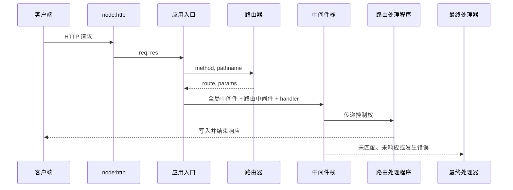

`node:http` 已经完成 TCP 连接管理、HTTP 报文解析和响应写入。应用框架位于它之上，主要负责把一个底层请求变成可组合、可路由、可统一收口的处理流程。

这篇笔记从此前基于 `node:http` 编写的服务器实现中提取通用结构，只讨论可复用的框架原理。

## 从一次 HTTP 事务开始

`http.createServer(requestListener)` 为每个请求调用一次 `requestListener`。传入的 `req` 是 `http.IncomingMessage`，同时也是可读流；`res` 是 `http.ServerResponse`，负责设置状态、响应头并结束响应。

```ts
import { createServer } from 'node:http'

const server = createServer((req, res) => {
  res.writeHead(200, { 'content-type': 'application/json; charset=utf-8' })
  res.end(JSON.stringify({ message: 'ok' }))
})

server.listen(3000)
```

这个例子已经包含最小的端到端流程，但所有请求共享同一个函数。随着接口增加，该函数会同时承担路径判断、输入解析、业务调用、异常处理和响应序列化。框架的核心工作就是拆分这些职责，再按确定的规则重新组合。

一次请求经过最小框架时，可以表示为：



这里有两条不同的路径：路由处理程序可以调用 `res.end()` 终止请求，也可以继续传递控制权；如果整个处理栈都没有生成响应，则必须由最终处理器返回 `404` 或 `500`。

## 框架需要建立的契约

先定义最小 API，再决定内部结构：

```ts
const app = createApp()

app.use(requestLogger)
app.get('/users/:id', requireAuth, getUser)
app.listen(3000)
```

这组 API 隐含四个契约：

- `listen()` 把应用适配为 Node 的请求监听器；
- `get()` 同时注册匹配规则和处理栈；
- `use()` 按注册顺序保存全局中间件；
- 每个中间件必须结束响应，或者通过 `next()` 明确交出控制权。

路由处理程序和中间件可以使用同一种函数签名：

```ts
import type { IncomingMessage, ServerResponse } from 'node:http'

type Next = (error?: unknown) => void

interface AppRequest extends IncomingMessage {
  params: Record<string, string>
}

type Middleware = (
  req: AppRequest,
  res: ServerResponse,
  next: Next
) => void | Promise<void>
```

处理程序只是位于栈末端、通常不再调用 `next()` 的中间件。统一签名后，全局逻辑、路由级逻辑和最终业务处理可以由同一个调度器编排。

## 路由：从请求定位处理栈

路由器至少保存 HTTP 方法、路径模式和处理栈：

```ts
interface Route {
  method: string
  pattern: string
  handlers: Middleware[]
}
```

收到请求后，应用入口需要先构造 URL。服务端的 `req.url` 通常只有路径与查询字符串，因此解析时需要提供一个基准地址：

```ts
function getUrl(req: IncomingMessage) {
  const host = req.headers.host ?? 'localhost'
  return new URL(req.url ?? '/', `http://${host}`)
}
```

一个只支持静态片段和 `:param` 的匹配器已经足以说明路由原理：

```ts
function matchPath(pattern: string, pathname: string) {
  const expected = pattern.split('/').filter(Boolean)
  const actual = pathname.split('/').filter(Boolean)

  if (expected.length !== actual.length) return null

  const params: Record<string, string> = {}

  for (let index = 0; index < expected.length; index += 1) {
    const segment = expected[index]
    const value = actual[index]

    if (segment.startsWith(':')) {
      params[segment.slice(1)] = decodeURIComponent(value)
    } else if (segment !== value) {
      return null
    }
  }

  return params
}
```

路由匹配的结果不只是一个处理函数，还包括从路径中提取的 `params`。真实框架还需要规定尾部斜杠、大小写、通配符、重复参数、无效百分号编码和路由优先级。它们都是匹配契约的一部分，不能由各个 Controller 自行解释。

查询参数不属于路径模式。`/users/42?details=true` 应使用 `url.pathname` 匹配 `/users/:id`，再从 `url.searchParams` 读取查询参数。

## Express 风格的中间件调度器

Express 风格的 `next()` 表示“让调度器继续寻找下一个处理函数”。它是调度器创建的控制函数，不是 Node HTTP API 的一部分。

下面的最小实现支持同步异常和中间件返回的 Promise 拒绝：

```ts
function dispatch(
  stack: Middleware[],
  req: AppRequest,
  res: ServerResponse,
  done: (error?: unknown) => void
) {
  let cursor = 0

  const runNext: Next = (error) => {
    if (error !== undefined) {
      done(error)
      return
    }

    const middleware = stack[cursor]
    cursor += 1

    if (!middleware) {
      done()
      return
    }

    let nextCalled = false
    const next: Next = (nextError) => {
      if (nextCalled) {
        done(new Error('next() called multiple times'))
        return
      }
      nextCalled = true
      runNext(nextError)
    }

    try {
      const pending = middleware(req, res, next)
      Promise.resolve(pending).catch(next)
    } catch (caught) {
      next(caught)
    }
  }

  runNext()
}
```

`cursor` 保存下一次要执行的位置，因此中间件的注册顺序就是执行顺序。某个中间件既不结束响应也不调用 `next()` 时，请求会保持挂起；这是控制权交接契约被破坏后的直接结果。

这个调度器能接收异步中间件的拒绝，但 `next()` 本身不返回 Promise。中间件不能用 `await next()` 等待下游全部完成。需要这种对称控制流时，应采用 Koa 式组合，见[Express 与 Koa 的中间件模型](./express-vs-koa-middleware.md)。

## 应用入口：组合路由与中间件

应用入口负责把前面的部件串起来：

```ts
import {
  createServer,
  type IncomingMessage,
  type ServerResponse
} from 'node:http'

function createApp() {
  const globalMiddleware: Middleware[] = []
  const routes: Route[] = []

  function use(middleware: Middleware) {
    globalMiddleware.push(middleware)
  }

  function get(pattern: string, ...handlers: Middleware[]) {
    routes.push({ method: 'GET', pattern, handlers })
  }

  function handle(rawReq: IncomingMessage, res: ServerResponse) {
    const req = rawReq as AppRequest
    const url = getUrl(req)

    const matched = routes
      .filter((route) => route.method === req.method)
      .map((route) => ({ route, params: matchPath(route.pattern, url.pathname) }))
      .find((result) => result.params !== null)

    req.params = matched?.params ?? {}
    const routeHandlers = matched?.route.handlers ?? []

    dispatch([...globalMiddleware, ...routeHandlers], req, res, (error) => {
      finalHandler(res, error)
    })
  }

  function listen(port: number) {
    return createServer(handle).listen(port)
  }

  return { use, get, listen }
}
```

最终处理器是请求生命周期的兜底边界：

```ts
function finalHandler(res: ServerResponse, error?: unknown) {
  if (res.writableEnded) return

  if (res.headersSent) {
    res.destroy(error instanceof Error ? error : undefined)
    return
  }

  const status = error === undefined ? 404 : 500
  res.writeHead(status, {
    'content-type': 'application/json; charset=utf-8'
  })
  res.end(JSON.stringify({
    code: status,
    message: status === 404 ? 'Not Found' : 'Internal Server Error'
  }))
}
```

`404` 表示处理栈正常走完但没有响应；`500` 表示调度器收到错误。响应头已经发出后，再改写状态和 JSON 错误体已经来不及，只能终止连接或由更上层的流式响应策略处理。

这个实现故意没有完整复刻 Express。路径挂载、错误处理中间件、子路由、内容协商和响应辅助方法都可以继续添加，但不改变核心数据流。

## 请求体解析是流处理

`IncomingMessage` 是可读流，请求体可能分成多个 `Buffer` 到达。最小 JSON 解析器需要处理数据上限、流错误、中止和 JSON 语法错误，而不只是监听 `data` 与 `end`：

```ts
async function readJson(req: IncomingMessage, limit = 1_000_000) {
  const contentType = req.headers['content-type'] ?? ''
  if (!contentType.toLowerCase().startsWith('application/json')) return undefined

  const chunks: Buffer[] = []
  let size = 0

  for await (const chunk of req) {
    const buffer = Buffer.isBuffer(chunk) ? chunk : Buffer.from(chunk)
    size += buffer.length

    if (size > limit) {
      throw new Error('request body too large')
    }

    chunks.push(buffer)
  }

  const body = Buffer.concat(chunks).toString('utf8')
  return body === '' ? undefined : JSON.parse(body)
}
```

生产实现还要把错误映射到明确状态，例如格式错误为 `400 Bad Request`，超过限制为 `413 Content Too Large`，不支持的媒体类型为 `415 Unsupported Media Type`。不能只按 `POST`、`PUT` 判断是否存在请求体；HTTP 方法与消息体是否存在是两个维度。

解析器通常实现为中间件，把解析结果写入请求对象或上下文。此时 TypeScript 类型也必须同步扩展，不能只依赖类型断言隐藏运行时差异。

## 从项目实现提取出的改进点

项目中的 `MiddlewareManager` 已经抓住“数组 + 游标 + `next()`”这个核心，但作为可复用框架还需要补全以下语义：

- `run()` 应正确暴露调度完成或失败的状态。原实现没有返回 `runner(0)`，调用方的 `await mwManager.run()` 会立即得到 `undefined`。
- 回调式 `next()` 与可等待的 `await next()` 是两种契约。只给 `next` 标注 `() => void`，却在内部返回递归 Promise，会让异步执行顺序难以推断。
- `JSON.parse()` 位于异步的 `end` 事件回调中，包围 Promise 构造器的外层 `try...catch` 捕获不到该异常；应在回调内捕获并 `reject`，或使用异步迭代读取流。
- `Content-Type` 可能带参数，例如 `application/json; charset=utf-8`，不应只做完整字符串相等比较。
- 请求体必须限制大小，并处理流的 `error` 与 `aborted` 状态，避免内存无限增长或 Promise 永不结束。
- 响应写入需要以 `headersSent`、`writableEnded` 为边界，避免 Controller、错误处理器和最终处理器重复发送。
- CORS 预检、认证、日志等属于中间件；数据库单例、Service 和 DAO 属于应用层，二者不应被框架调度器耦合。

这些问题比继续添加 `app.post()` 或更多响应辅助方法更接近框架内核：框架必须先定义控制权、完成状态与错误传播，功能扩展才有稳定基础。

## 用测试固定框架语义

手写框架至少应固定以下行为：

| 场景 | 预期结果 |
| --- | --- |
| 静态路由匹配 | 只执行方法和路径都匹配的处理栈 |
| 动态参数 | `/users/42` 得到 `params.id === '42'` |
| 中间件顺序 | 严格按照注册顺序进入 |
| 中间件短路 | 不调用 `next()` 时，后续处理程序不执行 |
| 未匹配路由 | 最终处理器返回 `404` |
| 同步抛错 | 最终处理器返回 `500` |
| Promise 拒绝 | 错误不会变成未处理的 Promise rejection |
| 重复调用 `next()` | 被识别为调度错误，不重复执行后续栈 |
| 响应已发送 | 错误收口不再尝试改写状态和响应体 |
| 请求体超限 | 停止读取并映射为 `413` |

测试的价值不是验证数组遍历，而是明确框架对“谁拥有控制权、何时算完成、错误去哪里”的承诺。

## 参考资料

- [Node.js：Anatomy of an HTTP Transaction](https://nodejs.org/en/learn/modules/anatomy-of-an-http-transaction)
- [Node.js HTTP API](https://nodejs.org/api/http.html)
- [Express 5：Writing middleware](https://expressjs.com/en/5x/guide/writing-middleware.html)
- [Express 5：Error handling](https://expressjs.com/en/5x/guide/error-handling.html)
