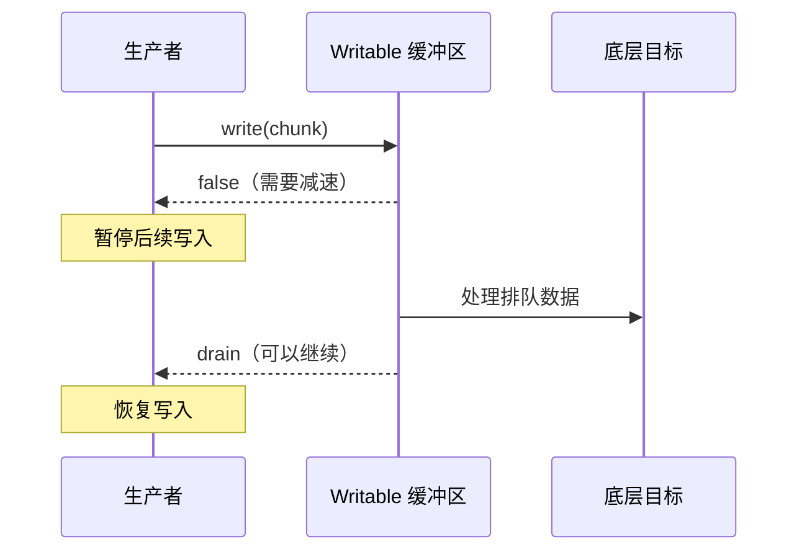

流（Stream）把持续到达的数据表示成一系列数据块（chunk），让程序可以边读取、边处理、边写出。它适合文件、HTTP 请求与响应、TCP Socket、子进程输出等不能或不适合一次性全部加载的数据。

流需要解决两个相互关联的问题：如何只保留当前正在处理的数据，以及下游处理速度跟不上时，如何让上游减速。第二个问题就是背压（Backpressure）。

## 从一次性加载到流式处理

假设需要压缩一个日志文件。一次性处理会依次把完整输入和完整输出放进内存：

```js
import { readFile, writeFile } from 'node:fs/promises'
import { gzip } from 'node:zlib'
import { promisify } from 'node:util'

const gzipAsync = promisify(gzip)
const input = await readFile('access.log')
const output = await gzipAsync(input)
await writeFile('access.log.gz', output)
```

这段代码直观，适合规模明确且较小的数据。输入变大或并发任务增多时，完整输入、处理过程中的中间结果和完整输出会共同占用内存，而且压缩必须等待读取结束后才能开始。

流式版本把三个阶段连成一条处理链：

```js
import { createReadStream, createWriteStream } from 'node:fs'
import { pipeline } from 'node:stream/promises'
import { createGzip } from 'node:zlib'

await pipeline(
  createReadStream('access.log'),
  createGzip(),
  createWriteStream('access.log.gz')
)
```

```text
文件（来源） -> gzip（转换） -> 压缩文件（去向）
   Readable       Transform          Writable
```

文件的第一批数据到达后，压缩和写出就可以开始。内存中主要保留当前处理的数据和各阶段少量排队的数据，而不是完整文件。

Stream 和完整 `Buffer` 不是谁替代谁，而是面向不同约束：

| 约束 | 一次性读取完整 `Buffer` | Stream |
| --- | --- | --- |
| 开始处理的时间 | 完整读取后 | 第一批数据到达后 |
| 内存增长 | 通常随完整数据量增长 | 通常随管道缓冲量增长 |
| 随机访问 | 可以直接访问任意位置 | 主要按顺序处理 |
| 实现复杂度 | 状态少，代码直接 | 需要处理结束、错误、背压和分块边界 |
| 典型场景 | 小配置、需要完整解析的数据 | 大文件、网络响应、持续事件、高并发传输 |

流不保证处理更快，也不是零内存抽象。Node.js 流、业务队列和操作系统各自仍可能缓冲数据。它的主要价值是更早开始处理，并让峰值内存不必与完整数据量直接绑定。

## 四种流表示处理链中的四种角色

数据方向以应用程序为参照：

| 类型 | 解决的问题 | 数据方向 | 常见实例 |
| --- | --- | --- | --- |
| `Readable` | 分批暴露数据来源 | 来源 → 应用 | `fs.ReadStream`、HTTP 请求体、`process.stdin` |
| `Writable` | 分批接收并写向目标 | 应用 → 目标 | `fs.WriteStream`、HTTP 响应、`process.stdout` |
| `Duplex` | 在一个对象上提供两个独立方向 | 应用 ↔ 对端 | TCP Socket |
| `Transform` | 把写入端的数据转换为读取端的数据 | 输入 → 转换 → 输出 | gzip、加密、解析器 |

TCP Socket 是典型的 `Duplex`：应用写入的数据发给远端，应用读取的数据来自远端。读写两边通常没有“写进去就从读取端出来”的关系，并且各自维护缓冲区。

`Transform` 是一种有输入输出关系的 `Duplex`。例如 gzip 的可写端接收原始数据，可读端产生压缩数据。它同样有两个缓冲方向，只是输出由输入计算得到。

大多数业务代码使用 Node.js 已经提供的流实例，不需要继承这些基类。自定义 `Readable`、`Writable` 或 `Transform` 只在封装新数据源、目标或转换过程时使用。

## 背压来自生产与消费的速度差

流式处理不代表数据会自动以相同速度通过所有阶段。假设应用生成数据很快，而磁盘写入较慢：

```text
数据生成器 --快--> Writable 写缓冲区 --慢--> 磁盘
```

`writable.write(chunk)` 的含义通常不是“目标已经消费了这批数据”，而是“可写流接收了这批数据”。底层暂时处理不了的数据会进入写缓冲区。

如果生产者不根据缓冲区状态减速，排队数据会持续增长，带来以下结果：

- 进程常驻内存（Resident Set Size，RSS）上升；
- 垃圾回收需要处理更多对象，停顿增加；
- 新数据排在更长的队列后面，端到端延迟上升；
- 内存最终耗尽；远端 Socket 一直不读取时，还可能形成拒绝服务风险。

背压是一种反向流量控制：下游发出“暂时不要继续发送”的信号，上游暂停生产；下游恢复处理能力后，再通知上游继续。它不是一次写入失败。

## `highWaterMark` 只决定何时发出减速信号

可读流和可写流内部都可能维护缓冲区。`highWaterMark`（高水位线）是流开始发出背压信号的阈值：

- 普通二进制流通常按字节衡量；
- 对象模式（`objectMode`）的流按对象数量衡量；
- `Duplex` 和 `Transform` 的可读端、可写端各有自己的缓冲区和高水位线。

它不是硬性内存上限。假设高水位线为 16 KiB，一次写入 1 MiB 的 `Buffer`，这批数据仍会被接收，只是 `write()` 会返回 `false`。调用方即使继续调用 `write()`，Node.js 通常也会继续排队，而不会把超过阈值的数据自动丢弃。

因此：

```text
highWaterMark = 从这里开始要求上游减速
              ≠ 最多只能占用这些内存
```

单个 chunk 可以超过高水位线，一条管道中的每个流也有自己的缓冲区，业务代码还可能维护额外队列。调低 `highWaterMark` 可能减少排队数据，但也可能增加处理次数、影响吞吐量；它不能替代进程级内存限制和业务队列容量限制。

## `write()`、`false` 和 `drain` 构成可写端的背压协议

手动向 `Writable` 写数据时，协议分为四步：

1. `writable.write(chunk)` 接收当前 chunk。
2. 返回 `true` 表示当前仍可以继续写。
3. 返回 `false` 表示当前 chunk 已接收，但调用方应该暂停后续写入。
4. 排队数据被底层继续处理、缓冲区重新具备容量后，`Writable` 发出 `drain`，调用方再恢复写入。



下面的程序逐行生成换行分隔 JSON（Newline-Delimited JSON，NDJSON）。只有 `write()` 返回 `false` 时才等待 `drain`：

```js
import { once } from 'node:events'
import { createWriteStream } from 'node:fs'
import { finished } from 'node:stream/promises'

const output = createWriteStream('records.ndjson')

for (let id = 0; id < 1_000_000; id += 1) {
  const line = `${JSON.stringify({ id })}\n`

  if (!output.write(line)) {
    await once(output, 'drain')
  }
}

output.end()
await finished(output)
```

不需要在每次 `write()` 后等待 `drain`。`drain` 是对之前 `false` 信号的恢复通知；如果 `write()` 始终返回 `true`，就没有需要恢复的暂停状态。

`drain` 也不是端到端送达回执。它表示流内部先前积压的写入已经得到处理，可以接收更多数据；对于 Socket，它不代表远端应用已经读取，对于文件，它也不等同于已经执行持久化同步。

忽略返回值会绕过流量控制：

```js
for (const record of records) {
  output.write(`${JSON.stringify(record)}\n`)
}
```

这段代码可以运行，但当生产者长期快于消费者时，Node.js 会在内存中继续积累写入。

## `write()` 可能由业务代码调用，也可能由管道调用

直接生成数据时，业务代码会显式调用 `write()`：

```js
output.write(chunk)
```

使用 `pipe()` 时，业务代码看不到 `write()`：

```js
readable.pipe(writable)
```

但连接逻辑仍会把上游 chunk 交给 `writable.write()`。`pipe()` 的控制过程可以近似理解为：

```js
readable.on('data', (chunk) => {
  const canContinue = writable.write(chunk)

  if (!canContinue) {
    readable.pause()
    writable.once('drain', () => readable.resume())
  }
})
```

这只是机制示意，不是 `pipe()` 源码。可写端通过 `false` 表达压力，连接逻辑暂停可读端；可写端发出 `drain` 后，再恢复可读端。

自行连接 `data` 和 `write()` 时很容易遗漏这段控制：

```js
readable.on('data', (chunk) => {
  writable.write(chunk) // 返回 false 后仍继续接收 data
})
```

监听 `data` 会让 `Readable` 进入流动模式，而事件系统不会等待监听器返回。上面的代码会持续从来源读取，并把压力转移为 Writable 中不断增长的排队数据。

因此，在现成流之间传输数据时，`pipe()` 通常比手写 `data -> write` 安全。它会自动协调背压，并在来源正常结束时默认结束目标流。

## `pipeline()` 在背压之外统一处理失败和清理

`pipe()` 负责连接流并传递背压，但它不会替整条链统一完成所有错误传播和资源清理。转换流失败后，来源或目标可能仍然需要关闭。

Promise 版本的 `pipeline()` 同时处理完成、背压、错误和销毁：

```js
import { createReadStream, createWriteStream } from 'node:fs'
import { pipeline } from 'node:stream/promises'
import { createBrotliCompress } from 'node:zlib'

try {
  await pipeline(
    createReadStream('archive.tar'),
    createBrotliCompress(),
    createWriteStream('archive.tar.br')
  )
} catch (error) {
  console.error('压缩失败：', error)
}
```

对于固定的 Node.js 流处理链，`pipeline()` 通常应作为默认组合方式。它返回的 Promise 在整条链完成时兑现，在任一阶段失败时拒绝。

## 异步迭代适合逐块执行业务逻辑

`Readable` 可以作为异步可迭代对象，通过 `for await...of` 逐块消费：

```js
import { createReadStream } from 'node:fs'

const input = createReadStream('events.ndjson', {
  encoding: 'utf8'
})

for await (const chunk of input) {
  await persistChunk(chunk)
}
```

循环体中的 `await` 完成后才会进入下一次迭代。对于支持按需拉取的来源，这会自然限制上游读取速度；底层文件系统、网络和 SDK 仍可能维护各自的有限缓冲区。

相反，`data` 事件不会等待异步监听器返回的 Promise：

```js
input.on('data', async (chunk) => {
  await persistChunk(chunk)
})
```

如果数据持续到达，这段代码可能同时启动大量 `persistChunk()`，在流之外形成没有容量上限的 Promise 队列。串行异步处理优先使用异步迭代；需要并发时，应另外设置明确的并发数和等待队列上限。

同一个 `Readable` 不应混用 `data`、`readable`、`pipe()` 和异步迭代器。它们代表不同的消费方式，混用会改变流的读取状态，使数据流向难以推断。

## chunk 不等于业务消息

流保证数据顺序，不保证一次读取对应一行、一个 JSON 对象或一条协议消息。例如文本可能这样到达：

```text
chunk 1: "hel"
chunk 2: "lo\nwor"
chunk 3: "ld\n"
```

因此，下面的代码不能可靠地解析 NDJSON：

```js
for await (const chunk of input) {
  await save(JSON.parse(chunk))
}
```

按行处理需要保存上一个 chunk 遗留的不完整内容：

```js
let pending = ''

for await (const chunk of input) {
  pending += chunk
  const lines = pending.split('\n')
  pending = lines.pop()

  for (const line of lines) {
    if (line !== '') await save(JSON.parse(line))
  }
}

if (pending !== '') {
  await save(JSON.parse(pending))
}
```

UTF-8 等多字节编码还可能在字符中间分块。为 `createReadStream()` 设置 `encoding`，或使用 `StringDecoder`，可以避免对每个 `Buffer` 单独调用 `toString()` 时破坏跨 chunk 字符。

## 案例：LLM token 流快于 IM 网关

大语言模型（Large Language Model，LLM）可能快速产生 token 增量，即时通信（Instant Messaging，IM）网关却受到请求延迟和接口限流约束。此时如果把一个 token 映射成一次网关请求，会产生大量在途请求和无界排队。

这条链需要的不只是字节级背压，还需要业务级聚合：

```text
LLM 增量 -> 有最大长度的文本聚合 -> 限速器 -> IM 网关
```

对于以异步迭代器提供增量的 SDK，可以先按长度、句子边界或时间窗口合并，再等待网关发送完成：

```js
let pending = ''

for await (const delta of llmStream) {
  pending += delta

  if (!shouldFlush(pending)) continue

  await rateLimiter.wait()
  await imGateway.send(pending)
  pending = ''
}

if (pending !== '') {
  await rateLimiter.wait()
  await imGateway.send(pending)
}
```

这里没有另外创建发送队列：同一时刻最多有一次网关发送正在进行，`await` 完成后才继续消费 LLM 增量。`shouldFlush()` 避免每个 token 都成为一次外部请求，并且必须包含最大长度条件，不能只等待标点，否则没有标点的长输出仍会使 `pending` 持续增长。

如果发送和读取必须解耦，中间队列也必须设置容量上限；队列满时应暂停读取或进入降级策略，不能只限制发送并发数。

实际系统通常还需要以下约束：

- 每个会话只允许一个发送请求进行中，保证消息顺序；
- 队列设置容量上限，不能只设置并发上限；
- 网关返回限流响应时遵循其重试时间，并使用带随机抖动的退避；
- 用户取消、连接断开或超过总等待时间时，使用 `AbortSignal` 中止上游请求；
- 限制模型最大输出，防止最终内容本身没有边界。

如果 IM 支持编辑已发送消息，可以只保留“最新文本”，定期覆盖同一条消息：

```text
不要排队："Hel" -> "Hello" -> "Hello wor" -> "Hello world"
只保留：latestText = "Hello world"
```

中间展示状态可以被更新版本覆盖，但最终内容不能静默丢失。网关持续过慢时，可以降低编辑频率，退化为按段发送或只发送最终结果；如果最终结果必须可靠送达，则需要持久化待发送内容，而不是继续堆在进程内存里。

暂停读取 HTTP 响应并不保证模型服务端同步停止生成。压力是否能穿过 SDK、网络和服务端缓冲区传到生成端，取决于具体 API。因此还需要输出上限、超时和取消机制，不能只依靠本地 `await`。

## 自定义流必须继续传递背压信号

只有封装新的数据源、目标或转换过程时，才通常需要实现自定义流。实现代码必须把底层处理能力正确反映给 Node.js 流机制。

### 自定义 `Readable`

在 `_read()` 中调用 `push(chunk)`。`push()` 返回 `false` 表示读取缓冲区已经达到阈值，应停止从底层来源继续取数；消费者重新需要数据时，Node.js 会再次调用 `_read()`。

```js
import { Readable } from 'node:stream'

class CounterStream extends Readable {
  #value = 0

  _read() {
    while (this.#value < 1_000_000) {
      const chunk = `${this.#value++}\n`

      if (!this.push(chunk)) return
    }

    this.push(null)
  }
}
```

`push(null)` 表示可读端结束，不是一个数据 chunk。

### 自定义 `Writable` 和 `Transform`

`_write(chunk, encoding, callback)` 必须在当前 chunk 真正处理完成后调用 `callback`。过早调用会让上游误以为下游已经腾出容量；不调用则会让处理链永久停住。失败时调用 `callback(error)`。

`_transform(chunk, encoding, callback)` 遵循相同规则。转换结果可以通过 callback 或 `push()` 交给可读端。

流控制解决的是数据供需速度，不会把同步计算自动移到其他线程。CPU 密集型工作即使包装成 `Transform`，仍可能阻塞事件循环。

## 按数据形态选择接口

| 场景 | 合适的接口 |
| --- | --- |
| 小数据，必须完整解析或随机访问 | `readFile()` 等一次性 API |
| 文件、压缩器等现成流组成固定处理链 | `stream/promises.pipeline()` |
| 逐块执行串行异步业务逻辑 | `for await...of` |
| 主动生成数据并写入现成 `Writable` | 检查 `write()`，必要时等待 `drain` |
| 封装新的流式来源、目标或转换器 | 实现 `Readable`、`Writable` 或 `Transform` 约定 |
| 慢速外部 API 消费持续事件 | 聚合、限速、有界队列、取消和必要的持久化 |

背压只有沿着完整处理链逐级传递才有效。某一层即使正确暂停了 Node.js Stream，如果下一层又创建无界 Promise 队列，或者上游服务仍在无限生成，内存与延迟问题只是换了位置。

## 参考资料

- [Node.js Stream API](https://nodejs.org/api/stream.html)
- [Node.js：How To Use Streams](https://nodejs.org/learn/modules/how-to-use-streams)
- [Node.js：Backpressuring in Streams](https://nodejs.org/learn/modules/backpressuring-in-streams)
- [MDN：Streams API concepts](https://developer.mozilla.org/en-US/docs/Web/API/Streams_API/Concepts)
