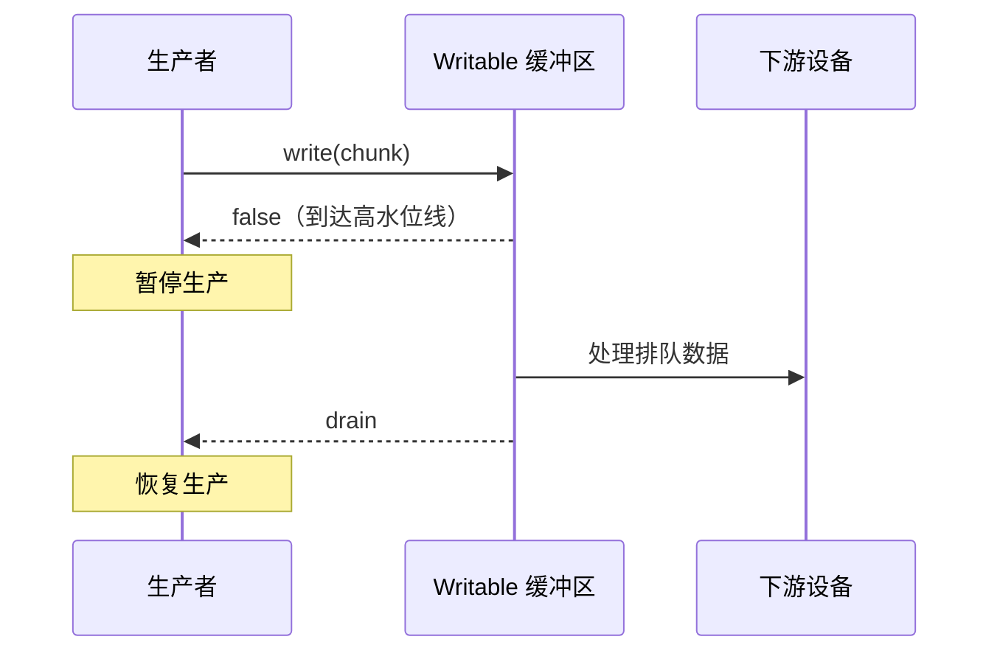

流（Stream）把一段持续到达的数据抽象成可以逐块读取、转换和写出的序列。文件、HTTP 请求与响应、TCP Socket、子进程的标准输出，都可能提供 Node.js 流接口。

流解决的不只是“大文件不能一次读入内存”。它还规定了数据如何分块、上下游如何连接、错误如何传播，以及消费端跟不上生产端时如何让生产端减速。最后一个问题就是背压（Backpressure）。

## 从完整加载改为逐块处理

假设需要压缩一个可能很大的日志文件。完整加载会先让整个文件进入进程内存：

```js
import { readFile, writeFile } from 'node:fs/promises'
import { gzip } from 'node:zlib'
import { promisify } from 'node:util'

const gzipAsync = promisify(gzip)
const input = await readFile('access.log')
const output = await gzipAsync(input)
await writeFile('access.log.gz', output)
```

这段代码只有在输入规模明确受控时才合适。输入越大，`input`、压缩过程中的中间数据和 `output` 占用的内存越多，而且必须等到读取完成后才能开始后续步骤。

流式版本只在内存中保留当前正在处理和少量排队的数据块：

```js
import { createReadStream, createWriteStream } from 'node:fs'
import { pipeline } from 'node:stream/promises'
import { createGzip } from 'node:zlib'

await pipeline(
  createReadStream('access.log'),
  createGzip(),
  createWriteStream('access.log.gz')
)
```

这个处理链包含三个参与者：

```text
文件（来源） -> gzip（转换） -> 压缩文件（去向）
   Readable       Transform          Writable
```

读取到一个数据块（chunk）后，压缩器就可以处理它，压缩结果也可以立即写入目标文件。这里的 chunk 是一次交给应用处理的数据片段，不等同于文件中的一行、一个 JSON 对象或一条业务消息；一次读取可能截断一行，也可能同时包含多行。

## 四种流对应四种角色

Node.js 提供四种基础流类型：

| 类型 | 数据方向 | 常见实例 |
| --- | --- | --- |
| `Readable` | 应用从中读取 | `fs.ReadStream`、服务端的 HTTP 请求、`process.stdin` |
| `Writable` | 应用向其写入 | `fs.WriteStream`、服务端的 HTTP 响应、`process.stdout` |
| `Duplex` | 可独立读取和写入 | TCP Socket |
| `Transform` | 写入数据，并从可读端得到转换结果 | gzip、加密、解析器 |

`Duplex` 有彼此独立的读缓冲区和写缓冲区。`Transform` 是一种输出由输入计算得到的 `Duplex`，但它仍然包含可写端和可读端两个方向。

大多数业务代码使用 Node.js 已经提供的流实例，不需要继承 `Readable` 或 `Writable`。`node:stream` 中的类主要用于实现新的流类型，`pipeline()` 等工具函数则适合日常组合流。

## 背压来自上下游速度差

在一个数据处理链中，上游是生产者，下游是消费者。生产速度小于或等于消费速度时，数据可以持续向前移动；生产速度大于消费速度时，尚未处理的数据会在缓冲区中积累。

例如，程序快速生成数据并写入较慢的磁盘：

```text
数据生成器 --快--> 可写流缓冲区 --慢--> 磁盘
```

如果生成器不根据缓冲区状态减速，队列会继续增长。结果可能包括：

- 进程常驻内存（Resident Set Size，RSS）持续上升；
- 垃圾回收需要扫描和移动更多对象，停顿变长；
- 延迟增加，因为新数据排在越来越长的队列后面；
- 内存耗尽，或者面对不读取数据的远端 Socket 时形成拒绝服务风险。

背压是下游把“暂时不要继续发送”的信号反向传给上游，由上游暂停生产；下游恢复处理能力后，再通知上游继续。它是一种流量控制，不是错误。

## `highWaterMark` 是发出减速信号的阈值

可读流和可写流内部都可能维护缓冲区。创建流时的 `highWaterMark`（高水位线）决定何时发出背压信号：

- 对普通二进制流，它通常按字节衡量；
- 对对象模式（`objectMode`）的流，它按对象数量衡量；
- `Duplex` 和 `Transform` 的可读端、可写端各有自己的缓冲区和高水位线。

`highWaterMark` 是阈值，不是严格的内存上限。可写流即使已经到达高水位线，仍会接收本次传给 `write()` 的 chunk；单个 chunk 也可能大于阈值。此外，一条处理链中的每一段都有自己的缓冲区，业务代码还可能维护额外队列。

因此，调低 `highWaterMark` 不等于为进程设置内存上限。它通常会减少排队数据，但也可能增加系统调用或降低吞吐量。只有经过测量并明确吞吐量、延迟和内存之间的目标后，才需要调整它。

## `write()`、`false` 和 `drain`

手动向 `Writable` 写数据时，背压协议体现在 `write()` 的返回值和 `drain` 事件上：

1. `writable.write(chunk)` 先接收当前 chunk。
2. 返回 `true` 表示内部缓冲区仍低于高水位线，可以继续写。
3. 返回 `false` 表示应停止写入；这不表示当前 chunk 写入失败。
4. 缓冲数据得到处理后，可写流发出 `drain` 事件，上游再继续写。



下面的程序逐行生成 JSON。只有 `write()` 返回 `false` 时才等待 `drain`：

```js
import { once } from 'node:events'
import { createWriteStream } from 'node:fs'
import { finished } from 'node:stream/promises'

const output = createWriteStream('records.ndjson')

for (let id = 0; id < 1_000_000; id += 1) {
  const line = `${JSON.stringify({ id })}\n`

  if (!output.write(line)) {
    await once(output, 'drain')
  }
}

output.end()
await finished(output)
```

忽略返回值的写法虽然能运行，却会绕过流量控制：

```js
for (const record of records) {
  output.write(JSON.stringify(record)) // 不检查返回值
}
```

Node.js 会继续缓存这些写入，而不是自动丢弃数据。输入足够大或目标足够慢时，内存占用仍然可能失控。

## `pipe()` 如何自动传递背压

`readable.pipe(writable)` 会连接上下游，并在普通情况下自动执行以下控制：

```js
const canContinue = writable.write(chunk)

if (!canContinue) {
  readable.pause()
  writable.once('drain', () => readable.resume())
}
```

这段代码是机制示意，不是 `pipe()` 的源码。关键点是：可写端用 `false` 表达压力，可读端暂停取数；可写端发出 `drain` 后，可读端恢复。

单独使用 `pipe()` 时，流之间的错误不会自动沿整条链完成统一清理。例如转换流失败后，来源流可能仍然打开。需要可靠处理完成、错误和资源释放时，优先使用 Promise 版本的 `pipeline()`：

```js
import { createReadStream, createWriteStream } from 'node:fs'
import { pipeline } from 'node:stream/promises'
import { createBrotliCompress } from 'node:zlib'

try {
  await pipeline(
    createReadStream('archive.tar'),
    createBrotliCompress(),
    createWriteStream('archive.tar.br')
  )
} catch (error) {
  console.error('压缩失败：', error)
}
```

`pipeline()` 会协调背压，返回整条链完成或失败的结果，并在错误发生时销毁仍需清理的流。将 HTTP 请求或响应直接放进 `pipeline()` 时需要额外留意：错误可能导致底层 Socket 在应用发送自定义错误响应前就被销毁。

## 异步处理可读流

`Readable` 可以作为异步可迭代对象，通过 `for await...of` 逐块消费。循环体中的 `await` 完成后才会进入下一次迭代，适合每个 chunk 都需要异步处理的场景：

```js
import { createReadStream } from 'node:fs'

const input = createReadStream('events.ndjson', {
  encoding: 'utf8'
})

for await (const chunk of input) {
  await persistChunk(chunk)
}
```

相反，`data` 事件不会等待异步监听器返回的 Promise：

```js
input.on('data', async (chunk) => {
  await persistChunk(chunk)
})
```

如果数据持续到达，这段代码可能同时启动大量 `persistChunk()` 调用，在流之外形成一个没有上限的任务队列。需要串行处理时使用异步迭代；需要并发处理时，应另外设计有明确并发上限的任务池。

同一个 `Readable` 不应混用 `data` 事件、`readable` 事件、`pipe()` 和异步迭代器。它们代表不同的消费方式，混用会改变流的读取状态并产生难以推断的结果。

## chunk 不携带业务边界

以下代码假设每个 chunk 恰好是一行，因此不可靠：

```js
for await (const chunk of input) {
  const record = JSON.parse(chunk)
  await save(record)
}
```

文件系统和网络只保证字节顺序，不保证一次读取对应一条记录。处理换行分隔 JSON（Newline-Delimited JSON，NDJSON）时，需要保留上一次未结束的内容：

```js
let pending = ''

for await (const chunk of input) {
  pending += chunk
  const lines = pending.split('\n')
  pending = lines.pop()

  for (const line of lines) {
    if (line !== '') await save(JSON.parse(line))
  }
}

if (pending !== '') {
  await save(JSON.parse(pending))
}
```

UTF-8 等多字节编码还可能在字节中间分块。为 `createReadStream()` 设置 `encoding`，或使用 `StringDecoder`，可以避免直接对每个 `Buffer` 单独调用 `toString()` 时破坏跨 chunk 的字符。

## 实现自定义流时的背压约定

只有封装新的数据源、目标或转换过程时，才通常需要实现自定义流。背压能否生效取决于实现是否遵守以下约定：

### 自定义 `Readable`

在 `_read()` 中调用 `push(chunk)`。如果 `push()` 返回 `false`，应停止从底层来源继续取数；当消费者再次需要数据时，Node.js 会重新调用 `_read()`。

```js
import { Readable } from 'node:stream'

class CounterStream extends Readable {
  #value = 0

  _read() {
    while (this.#value < 1_000_000) {
      const chunk = `${this.#value++}\n`

      if (!this.push(chunk)) return
    }

    this.push(null)
  }
}
```

`push(null)` 表示可读端结束，不是一个数据 chunk。

### 自定义 `Writable` 或 `Transform`

`_write(chunk, encoding, callback)` 必须在当前 chunk 真正处理完成后调用 `callback`。过早调用会让上游误以为下游已有处理能力；不调用则会让处理链永久停住。失败时把错误传给 `callback(error)`。

同理，`_transform(chunk, encoding, callback)` 的 callback 表示本次转换结束。CPU 密集型工作即使被包装成流，仍会阻塞事件循环；流控制解决的是数据供需速度，不会把同步计算自动移到其他线程。

## 选择处理方式

| 场景 | 合适的接口 |
| --- | --- |
| 文件、压缩器等现成流组成固定处理链 | `stream/promises.pipeline()` |
| 逐块执行串行异步业务逻辑 | `for await...of` |
| 主动生成数据并写入现成 `Writable` | 检查 `write()`，必要时等待 `drain` |
| 封装新的流式来源、目标或转换器 | 实现 `Readable`、`Writable` 或 `Transform` 约定 |
| 数据规模很小且必须完整解析后才能处理 | `readFile()` 等一次性 API 可能更简单 |

流降低的是峰值内存需求，并允许处理更早开始；它不是所有数据操作的性能捷径。数据已经完整位于内存中或规模很小时，引入流可能只会增加状态管理和错误处理成本。

## 参考资料

- [Node.js Stream API](https://nodejs.org/api/stream.html)
- [Node.js：How To Use Streams](https://nodejs.org/learn/modules/how-to-use-streams)
- [Node.js：Backpressuring in Streams](https://nodejs.org/learn/modules/backpressuring-in-streams)
- [MDN：Streams API concepts](https://developer.mozilla.org/en-US/docs/Web/API/Streams_API/Concepts)
