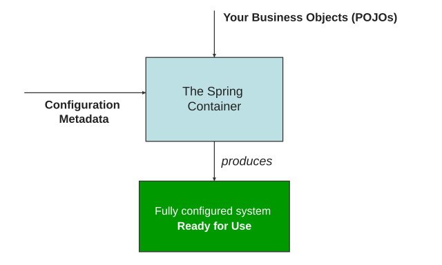

一个用户查询功能通常需要请求处理、业务逻辑和数据访问等对象协作。除了实现各自的方法，应用还要创建这些对象、连接它们的依赖，并在适当的时候初始化和释放资源。

Spring 的 IoC 容器承担对象的创建、配置与组装工作。应用提供组件类和配置，容器据此构建可协作的对象。

## 组件、Bean 与容器

组件是承担某项功能的对象，例如处理请求的 Controller、实现业务逻辑的 Service、访问数据的 DAO（Data Access Object，数据访问对象），以及数据库连接池。

这些对象交给 Spring 容器管理后，称为 **Bean**。例如，`UserService` 是组件类，容器管理的 `UserService` 实例是 Bean。用户、订单等业务数据对象，通常由业务逻辑或数据访问层按需要创建和加载。

容器的职责可以分为三个方面：

- **创建与配置对象**：根据配置选择对象类型、创建方式和所需的属性值。
- **组装依赖关系**：将一个对象需要的协作对象提供给它，例如把 `UserDao` 交给 `UserService`。
- **管理生命周期**：按照对象的配置和作用域，在适当的阶段执行初始化、销毁等回调。

集合可以保存对象引用；Spring 容器还要知道对象如何创建、依赖谁、如何管理。应用因此需要提供**配置元数据**，也就是描述这些规则的信息。

## IoC 与 DI 的关系

手动组装一个服务时，应用入口可以这样创建对象：

```java
UserDao userDao = new UserDao();
UserService userService = new UserService(userDao);
```

这里包含两项工作：创建对象，以及将 `userDao` 传给依赖它的 `userService`。交给 Spring 后，这些工作由容器依据配置完成。

**控制反转**（Inversion of Control，IoC）是一种设计思想，描述控制权的转移。在 Spring 容器管理对象的场景中，业务对象的创建、配置和依赖组装交由容器控制，业务代码使用已组装好的对象。

**依赖注入**（Dependency Injection，DI）描述依赖的提供方式：对象声明自己需要哪些协作对象，由外部通过构造器、工厂方法参数或属性设置提供。它是 Spring 实现控制反转的主要方式。

以 `UserService` 为例，它通过构造器声明需要 `UserDao`；容器创建服务时，将配置中引用的 `UserDao` 实例传入。服务仍然依赖数据访问对象，但无需在内部决定如何创建它。

IoC 关注对象的创建和组装由谁控制，DI 关注依赖如何交给对象，IoC 容器则是执行这些管理工作的设施。前面的手动代码也使用了构造器注入；依赖注入这个设计方式本身不要求 Spring。

## 从配置到可用的 Bean

容器需要两类输入：**组件类**描述对象能做什么，**配置元数据**描述容器应该管理哪些对象、怎样创建和连接它们。容器读取配置并完成组装后，应用可以获取 Bean 并调用业务方法。



### 三种常见配置方式

配置方式决定这些管理规则写在哪里。Spring 中常见的方式有三种：

- **XML 配置**：在 XML 文件中声明 Bean 的类型、创建方式和依赖关系，容器读取文件完成组装。
- **[注解配置](./annotation-config-and-di.md)**：在组件类上添加注解，配合组件扫描注册 Bean；依赖通过构造器或标注的注入点提供。
- **[Java 配置类](./java-config.md)**：在专门的配置类中，用工厂方法声明 Bean，集中描述对象的创建和组装规则。

注解配置与 Java 配置类都使用 Java 注解。两者的区别在于 Bean 的声明位置：前者通过组件类上的标记发现组件，后者通过配置类中的方法显式声明对象。它们可以配合使用，例如扫描业务组件，再用配置类注册数据库连接池。

### 示例组件类

XML 示例使用 `UserDao` 和 `UserService`：容器创建 `UserDao`，把它交给 `UserService`，应用获取服务并查询姓名。

示例使用 Spring Framework 7.0.9，需要 JDK 17 或更高版本；[Maven 项目](../engineering/maven.md)的 `<dependencies>` 中添加：

```xml
<dependency>
  <groupId>org.springframework</groupId>
  <artifactId>spring-context</artifactId>
  <version>7.0.9</version>
</dependency>
```

`UserDao` 用固定数据模拟查询，`UserService` 通过构造器接收它。代码放在 `src/main/java/com/example/` 下。

```java
// UserDao.java
package com.example;

public class UserDao {
    public String findName() {
        return "Ada";
    }
}
```

```java
// UserService.java
package com.example;

public class UserService {
    private final UserDao userDao;

    public UserService(UserDao userDao) {
        this.userDao = userDao;
    }

    public String findName() {
        return userDao.findName();
    }
}
```

这两个类只描述业务行为和对象依赖。选择怎样创建它们、使用哪个对象满足依赖，是配置的职责。

## XML 配置

XML 配置把 Bean 的声明和依赖关系写在组件类之外。容器读取 `<bean>` 元素确定要管理的对象，通过参数或属性配置确定对象之间的关系。

### 声明 Bean 与构造器注入

在 `src/main/resources/beans.xml` 中声明两个 Bean：

```xml
<?xml version="1.0" encoding="UTF-8"?>
<beans xmlns="http://www.springframework.org/schema/beans"
       xmlns:xsi="http://www.w3.org/2001/XMLSchema-instance"
       xsi:schemaLocation="http://www.springframework.org/schema/beans
           https://www.springframework.org/schema/beans/spring-beans.xsd">

  <bean id="userDao" class="com.example.UserDao"/>

  <bean id="userService" class="com.example.UserService">
    <constructor-arg ref="userDao"/>
  </bean>
</beans>
```

`<bean>` 声明需要容器管理的对象：`id` 是 Bean 的标识，`class` 是组件类的全限定名。`<constructor-arg ref="userDao"/>` 表示使用名为 `userDao` 的 Bean 作为构造器参数。

仅声明两个 Bean，只能让容器知道要管理哪些对象。`ref` 进一步描述它们如何协作，使容器能够为 `UserService` 提供所需的 `UserDao`。

### 创建容器并获取 Bean

`ClassPathXmlApplicationContext` 从类路径读取 XML 配置。Maven 将 `src/main/resources/beans.xml` 复制到运行时类路径，因此构造器中使用 `"beans.xml"`。

```java
// App.java
package com.example;

import org.springframework.context.support.ClassPathXmlApplicationContext;

public class App {
    public static void main(String[] args) {
        try (var context = new ClassPathXmlApplicationContext("beans.xml")) {
            UserService service = context.getBean("userService", UserService.class);
            System.out.println(service.findName());
        }
    }
}
```

在项目根目录运行：

```bash
mvn compile exec:java -Dexec.mainClass=com.example.App
```

程序输出 `Ada`。本例没有配置延迟初始化，两个 Bean 都采用默认的单例作用域，容器初始化时会创建并组装它们。`getBean()` 获取已经可用的服务，随后由应用调用业务方法；`try` 块结束时关闭容器，触发适用的销毁回调。

容器管理的是对象的创建与协作关系。`UserService` 的查询行为仍由业务类实现，调用查询方法仍由应用发起。

### Setter 注入

Setter 注入在对象创建之后调用属性的设置方法。将 `UserService` 替换为下面的版本，`UserDao` 和 `App.java` 保持原样：

```java
// UserService.java
package com.example;

public class UserService {
    private UserDao userDao;

    public void setUserDao(UserDao userDao) {
        this.userDao = userDao;
    }

    public String findName() {
        return userDao.findName();
    }
}
```

这个类没有显式声明构造器，使用编译器提供的无参构造器。保留 `userDao` 定义，把 `userService` 的定义替换为：

```xml
<bean id="userService" class="com.example.UserService">
  <property name="userDao" ref="userDao"/>
</bean>
```

`name="userDao"` 对应 `setUserDao(...)`，`ref="userDao"` 引用容器中的 Bean。容器先创建服务，再调用 Setter 注入依赖；沿用前面的运行命令，输出仍为 `Ada`。若省略这项配置，字段保持 `null`，调用查询方法时会失败。

构造器注入在创建对象时提供依赖，适合必须具备的协作对象，也允许把引用声明为 `final`。Setter 注入在创建后提供依赖，适合可选依赖或只暴露 Setter 的第三方组件。本例用于对照两种注入过程，业务查询实际仍需要 `UserDao`。

### Bean 的创建方式

<details>
<summary>构造器、静态工厂与实例工厂（参考）</summary>

XML 中可以配置三种创建方式：构造器、静态工厂方法和实例工厂方法。以下示例使用构造器注入版本的 `UserService`；对于已有工厂方法的组件，可以通过 XML 属性指定调用方式，将方法返回的对象作为 Bean 管理。

#### 构造器

XML 示例中的 `class="com.example.UserService"` 指定要创建的组件类，`<constructor-arg ref="userDao"/>` 指定构造器参数，相当于调用 `new UserService(userDao)`。这里使用有参构造器，`UserService` 无需再提供无参构造器。

#### 静态工厂方法

使用前面的构造器注入版本 `UserDao`、`UserService`，在 `com.example` 包中新增工厂类：

```java
// StaticUserServiceFactory.java
package com.example;

public class StaticUserServiceFactory {
    public static UserService create(UserDao userDao) {
        return new UserService(userDao);
    }
}
```

保留 `beans.xml` 中的 `userDao` 定义，将原来的 `userService` 定义替换为：

```xml
<bean id="userService"
      class="com.example.StaticUserServiceFactory"
      factory-method="create">
  <constructor-arg ref="userDao"/>
</bean>
```

此时 `class` 指定包含静态工厂方法的类，`factory-method` 指定方法名，容器调用 `StaticUserServiceFactory.create(userDao)`。`<constructor-arg>` 在工厂方法配置中用于提供方法参数。工厂方法也可以定义在组件类自身中。

名为 `userService` 的 Bean 是方法返回的 `UserService` 对象，因此仍通过 `getBean("userService", UserService.class)` 获取它；无需将静态工厂类另行注册为 Bean。

#### 实例工厂方法

实例工厂使用普通实例方法创建对象，需要先把工厂对象注册为 Bean。在 `com.example` 包中新增：

```java
// InstanceUserServiceFactory.java
package com.example;

public class InstanceUserServiceFactory {
    public UserService create(UserDao userDao) {
        return new UserService(userDao);
    }
}
```

同样保留 `userDao` 定义，将原来的 `userService` 定义替换为以下两个定义：

```xml
<!-- 将工厂类进行ioc配置 -->
<bean id="userServiceFactory"
      class="com.example.InstanceUserServiceFactory"/>

<!-- 根据工厂对象的实例工厂方法进行实例化组件对象 -->
<bean id="userService"
      factory-bean="userServiceFactory"
      factory-method="create">
  <constructor-arg ref="userDao"/>
</bean>
```

`factory-bean` 引用工厂 Bean 的名称，`factory-method` 指定该对象上的实例方法。容器先创建工厂 Bean，再调用它的 `create(userDao)`；返回的对象作为 `userService` Bean 管理，这个定义无需填写 `class`。

两种工厂配置分别运行，每次替换原来的 `userService` 定义；沿用 XML 示例中的 `App.java` 和运行命令，输出仍为 `Ada`。

| 创建方式 | XML 中的创建规则                                            | 对应调用                                   |
| -------- | ----------------------------------------------------------- | ------------------------------------------ |
| 构造器   | `class` 指定组件类                                          | `new UserService(userDao)`                 |
| 静态工厂 | `class` 指定工厂类，`factory-method` 指定静态方法           | `StaticUserServiceFactory.create(userDao)` |
| 实例工厂 | `factory-bean` 引用工厂 Bean，`factory-method` 指定实例方法 | `userServiceFactory.create(userDao)`       |

工厂方法可以每次创建新对象，也可以返回已有对象，由方法实现决定；`static` 本身不表示单例。以上两个方法每次执行都会创建新对象，容器是否复用获取到的 Bean 则由作用域等配置决定。

</details>

## Bean 定义与 Bean 实例

配置描述的是创建和管理对象的规则，容器内部用 `BeanDefinition`（Bean 定义）保存这些规则。Bean 定义可以记录类型、构造器参数、作用域和生命周期方法等信息；根据定义创建出的对象是 Bean 实例。

XML 示例中的 `userService` 定义描述了“创建 `UserService`，构造器参数引用 `userDao`”。它既描述对象本身，也描述对象之间的关系。

默认的 `singleton`（单例）作用域意味着：**同一个容器中，同一份 Bean 定义对应一个共享实例**。在前面的 `try` 块中重复获取 `userService`，会得到同一个对象：

```java
UserService first = context.getBean("userService", UserService.class);
UserService second = context.getBean("userService", UserService.class);
System.out.println(first == second); // true
```

单例的范围由容器和 Bean 定义共同决定。同一个类也可以配置成不同名称的多个 Bean。前面的构造器和工厂示例会为不同容器创建各自的实例；若工厂方法返回共享的已有对象，不同容器也可能引用同一个对象。

## 容器接口与 Bean 获取

`BeanFactory` 是 Spring 的基础容器接口，定义了获取 Bean 等能力。`ApplicationContext` 继承它，并提供资源访问、应用事件和国际化消息等功能。应用通常使用 `ApplicationContext` 的具体实现。

常见实现按配置来源区分：

| 实现类                               | 配置来源                                    |
| ------------------------------------ | ------------------------------------------- |
| `ClassPathXmlApplicationContext`     | 类路径中的 XML 文件                         |
| `FileSystemXmlApplicationContext`    | 文件系统中的 XML 文件                       |
| `AnnotationConfigApplicationContext` | Java 配置类或组件类，也支持按指定包扫描组件 |

容器提供三种常用的获取方式：

| 调用                                        | 含义                                   |
| ------------------------------------------- | -------------------------------------- |
| `getBean("userService")`                    | 按名称获取，返回类型是 `Object`        |
| `getBean(UserService.class)`                | 按类型获取，需要能够确定一个候选 Bean  |
| `getBean("userService", UserService.class)` | 按名称定位，并检查对象是否符合指定类型 |

名称不存在、类型不匹配，或按类型获取时无法确定一个候选 Bean，都会抛出相应异常。组件之间已经声明的依赖由容器注入，业务对象直接使用这些依赖。
