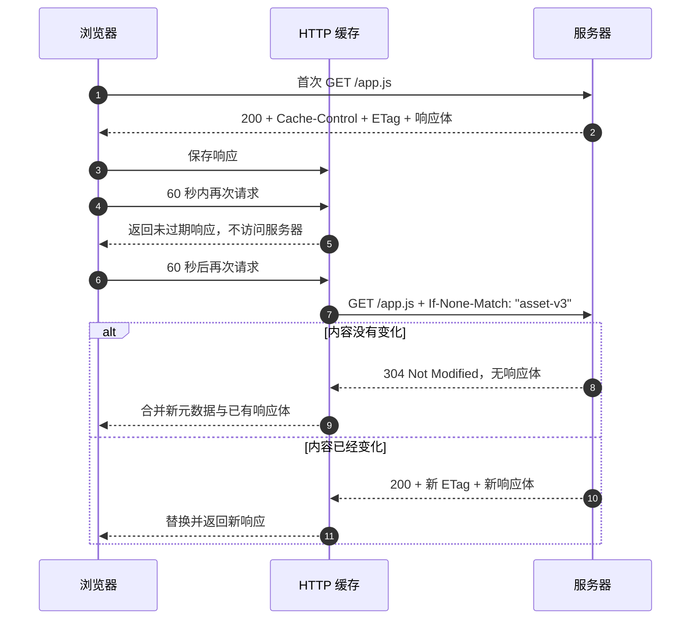

HTTP 缓存保存已经取得的响应，并在后续请求中复用它。复用未过期的缓存响应可以省去网络请求；验证过期响应仍需访问服务器，但在内容未变化时只传输响应头，从而减少延迟、流量和服务器工作量。

浏览器既是 HTTP 的客户端，也维护一种 private cache（私有缓存）。内容分发网络（Content Delivery Network，CDN）和代理还可能维护供多个用户使用的 shared cache（共享缓存）。两者遵循相同的 HTTP 缓存语义，但 `private`、`public` 和 `s-maxage` 等指令会区分它们。

本文讨论 HTTP 缓存。它与浏览器中的其他缓存机制并不相同：

- memory cache 和 disk cache 是浏览器保存 HTTP 响应的实现位置，不是两套独立的协议规则；
- 后退/前进缓存（Back/Forward Cache，BFCache）保存的是可恢复的完整页面状态；
- Service Worker 可以拦截请求，Cache API 则由应用代码显式读写；
- DNS 缓存保存域名解析结果，不保存 HTTP 响应。

## 一次完整的缓存流程

服务器返回下面的 JavaScript 文件，并允许缓存使用 60 秒：

```http
HTTP/1.1 200 OK
Date: Fri, 17 Jul 2026 02:00:00 GMT
Content-Type: text/javascript
Cache-Control: public, max-age=60
ETag: "asset-v3"

console.log('v3')
```

浏览器保存的是整个响应，包括状态、响应头和响应体。随后对相同缓存键发起请求时，主要有三条路径：



第一条复用路径一般称为“强缓存”，第二条验证路径一般称为“协商缓存”。过期响应不会立即被删除，通常需要向源站验证后才能复用。

## 缓存键决定能否找到响应

缓存必须先找到与当前请求匹配的已存响应，才能判断它是否过期。缓存键至少受请求方法和目标 URI 影响；响应中的 `Vary` 还可以把指定请求头加入匹配条件。

例如服务器按语言返回不同内容时，需要声明：

```http
Vary: Accept-Language
```

缓存随后会分别保存中文和英文响应。遗漏 `Vary` 可能把一种响应错误地复用于另一种请求；在共享缓存中，这还可能造成跨用户数据泄漏。个性化响应通常应使用 `private` 或 `no-store`，不能只依赖默认缓存键。

URL 不同也会产生不同的缓存项。构建工具利用这一点给静态资源添加内容指纹，例如 `/app.a81f3c.js`：内容改变时 URL 也改变，浏览器自然取得新文件。

## 缓存有效期与过期

响应的 **freshness lifetime（新鲜度寿命，也就是缓存有效期）** 表示它可以不经验证直接复用多久。缓存会计算响应的当前年龄；当年龄没有超过有效期时，规范称响应为 `fresh`（未过期），否则为 `stale`（过期）。

### Cache-Control

`Cache-Control` 是控制缓存行为的主要响应头，可以组合多个指令：

```http
Cache-Control: public, max-age=3600
```

常用响应指令如下：

| 指令 | 含义 |
| --- | --- |
| `max-age=3600` | 响应年龄超过 3600 秒后变为过期 |
| `s-maxage=3600` | 只用于共享缓存，并覆盖其中的 `max-age` 或 `Expires` |
| `private` | 共享缓存不得存储；浏览器私有缓存仍可存储 |
| `public` | 明确允许共享缓存存储，即使响应通常不能由共享缓存存储 |
| `no-cache` | 可以存储，但每次复用前必须成功验证 |
| `no-store` | 私有和共享缓存都不得有意存储该请求或响应 |
| `must-revalidate` | 响应过期后必须成功验证；断网时也不能直接复用旧响应 |
| `immutable` | 响应未过期期间内容不会变化，不必因刷新操作而验证 |

`no-cache` 不是“不缓存”。需要禁止存储时使用 `no-store`；需要保存响应体、但每次使用前确认内容是否变化时使用 `no-cache`。

`must-revalidate` 也不是“每次都验证”。未过期响应仍可直接使用，只有过期后才强制验证。

### max-age、Date 和 Age

`max-age` 的起点不是“浏览器收到响应的时刻”。缓存计算当前年龄时会考虑源站的 `Date`、上游缓存提供的 `Age`、传输时间以及响应在缓存中停留的时间。因此，经过 CDN 20 秒后到达浏览器的 `max-age=60` 响应，并不一定还能保持 60 秒新鲜。

```http
Date: Fri, 17 Jul 2026 02:00:00 GMT
Age: 20
Cache-Control: public, max-age=60
```

`Age` 表示响应自源站生成或上次验证以来的估算秒数，常用于观察共享缓存已经持有响应多久。

### Expires

`Expires` 使用绝对时间表达过期时刻：

```http
Expires: Fri, 17 Jul 2026 03:00:00 GMT
```

绝对时间容易受到时钟偏差影响。响应同时包含 `Cache-Control: max-age` 和 `Expires` 时，接收方按 `max-age` 计算；共享缓存收到 `s-maxage` 时按 `s-maxage` 计算。现代服务应优先发送 `Cache-Control`，`Expires` 主要用于兼容旧实现。

即使响应没有显式过期时间，规范也允许缓存根据 `Last-Modified` 等信息估算有效期。因此，“没有缓存头”不等于“不会缓存”；需要确定行为时应显式设置策略。

## 过期后的条件请求

缓存拥有 validator（验证器）时，可以把普通 `GET` 转为条件请求。服务器据此判断表示形式是否变化：没有变化时返回 `304 Not Modified`，发生变化时返回带新响应体的 `200 OK`。

`304` 不包含新的响应体。缓存会用 `304` 中的元数据更新已存响应，再把元数据和旧响应体组合为完整响应。

### ETag 和 If-None-Match

`ETag`（entity tag，实体标签）标识所选资源表示形式的版本。它的生成方式由服务器决定，不保证一定是内容哈希：

```http
ETag: "asset-v3"
```

缓存验证该响应时，把标签放入请求头 `If-None-Match`，不是请求体：

```http
GET /app.js HTTP/1.1
Host: static.example.com
If-None-Match: "asset-v3"
```

对于 `GET` 或 `HEAD`，当前表示形式的标签匹配时，服务器返回 `304`；不匹配时返回 `200` 和完整的新表示形式。

强 ETag 可用于要求字节级一致的比较。以 `W/` 开头的是弱 ETag，例如 `W/"article-v3"`，只表示语义等价，不保证字节完全相同。`If-None-Match` 的缓存验证使用弱比较，因此两种 ETag 都能用于普通的 `GET` 重验证；范围请求等场景可能要求强验证器。

### Last-Modified 和 If-Modified-Since

`Last-Modified` 表示源站认为资源最后一次修改的时间：

```http
Last-Modified: Fri, 17 Jul 2026 01:50:00 GMT
```

没有 ETag 时，缓存可以把该值放入 `If-Modified-Since`：

```http
GET /app.js HTTP/1.1
Host: static.example.com
If-Modified-Since: Fri, 17 Jul 2026 01:50:00 GMT
```

如果当前修改时间早于或等于请求中的时间，条件不成立，服务器返回 `304`；如果当前修改时间更晚，则返回 `200` 和新响应体。

HTTP 日期的精度有限，时钟也可能不一致，因此 `Last-Modified` 通常不如 ETag 准确，但它容易由文件系统或服务器自动生成。

### 两种验证器的关系

服务器可以同时返回 `ETag` 和 `Last-Modified`。浏览器可能在条件请求中同时携带两组请求头，但当 `If-None-Match` 存在时，接收方必须忽略 `If-Modified-Since`，以实体标签的判断为准。

因此，这不是浏览器先后尝试两套验证器的流程，而是服务器按 HTTP 条件请求的优先级求值。

## 按资源类型配置

缓存策略需要与资源更新方式匹配。下面是常见起点，不是所有站点都必须使用的固定值。

### 带内容指纹的静态资源

```http
Cache-Control: public, max-age=31536000, immutable
```

适用于 `/app.a81f3c.js`、`/styles.72b9.css` 等内容改变时 URL 也会改变的文件。部署新版本时，HTML 引用新的 URL；旧文件可以安全地继续长期缓存。服务器需要保留仍可能被旧 HTML 引用的文件，避免部署瞬间出现 `404`。

没有版本标识的 URL 不应盲目使用一年缓存，否则服务器替换文件后，已有客户端仍可能长期使用旧内容。

### HTML 入口

```http
Cache-Control: no-cache
ETag: "index-v42"
```

HTML 的稳定 URL 通常不能像子资源一样添加内容指纹。`no-cache` 允许浏览器保存响应，但每次使用前验证，从而及时取得引用了新资源版本的 HTML。若页面按用户个性化且仍允许浏览器保存，可增加 `private`：

```http
Cache-Control: private, no-cache
```

### API 响应

公开且允许短暂过期的数据可以设置较短的缓存有效期，并让 CDN 保存更久：

```http
Cache-Control: public, max-age=60, s-maxage=300
ETag: "catalog-v18"
```

包含账户、支付、令牌等敏感信息的响应应避免进入浏览器或共享缓存：

```http
Cache-Control: no-store
```

`no-store` 是缓存行为指令，不是完整的隐私或传输安全机制。敏感响应仍需使用 HTTPS，并控制认证、授权、日志和客户端代码中的数据暴露。

## 可选的过期响应策略

某些业务允许短时间使用旧响应，以换取低延迟或故障可用性。扩展指令 `stale-while-revalidate` 允许缓存先返回过期响应，同时在后台验证：

```http
Cache-Control: public, max-age=60, stale-while-revalidate=30
```

这里的响应在 60 秒内新鲜；随后 30 秒窗口内可以先返回旧响应并触发验证。该策略不适合必须立即一致的账户余额、权限或交易状态。

`stale-if-error` 则允许缓存仅在源站错误或不可用时使用一定时间内的过期响应。部署前需要确认实际缓存实现支持这些扩展指令，并定义业务可以接受的陈旧窗口。

## Fetch API 的请求缓存模式

服务端响应头定义可复用策略；客户端还可以通过 Fetch API 的 `cache` 选项控制单次请求如何使用浏览器 HTTP 缓存：

| 模式 | 主要行为 |
| --- | --- |
| `default` | 按标准的有效期与验证规则处理 |
| `no-cache` | 有缓存项也向服务器验证，验证成功后可复用 |
| `no-store` | 不查缓存，也不把取得的响应写入缓存 |
| `reload` | 不查缓存，但把网络响应写入缓存 |
| `force-cache` | 优先返回匹配项，包括过期项；没有时访问网络 |
| `only-if-cached` | 只使用缓存；仅可与 `same-origin` 模式组合，未命中时返回 `504` |

```js
const response = await fetch('/api/catalog', {
  cache: 'no-cache',
})
```

这些模式不会修复错误的服务端缓存策略。业务代码通常使用默认模式，由服务器明确响应头；只有确实需要改变单次请求行为时才覆盖它。

## 调试缓存行为

### 浏览器开发者工具

在 Chrome DevTools 的 Network 面板中观察同一 URL 的连续请求：

- `Size` 或传输信息显示 `(memory cache)`、`(disk cache)`，通常表示没有访问网络；
- 请求包含 `If-None-Match` 或 `If-Modified-Since` 且网络状态为 `304`，表示发生了验证；
- 响应为 `200` 且传输了完整内容，可能是首次请求、缓存未命中、验证器不匹配或缓存被绕过；
- 检查 `Cache-Control`、`Age`、`ETag`、`Last-Modified` 和 `Vary`，不要只看状态码。

Network 面板的 **Disable cache** 只适合模拟首次访问和排查问题，并且仅在 DevTools 打开时生效。测试生产策略时需要关闭该选项，再用相同 URL 重复请求。

如果页面由 Service Worker 控制，还需要在 Application 面板检查 Service Worker 和 Cache Storage；否则 Cache API 的命中可能被误认为 HTTP 缓存命中。

### 验证服务器的条件请求

`curl` 默认不会像浏览器一样维护 HTTP 缓存，但可以手动发送验证器，检查服务器是否正确返回 `304`：

```bash
curl -i https://static.example.com/app.js
curl -i https://static.example.com/app.js \
  -H 'If-None-Match: "asset-v3"'
```

还应确认 `304` 响应会返回更新缓存所需的 `Date`、`ETag`、`Cache-Control` 和 `Vary` 等元数据。

## 常见故障

| 现象 | 检查项 |
| --- | --- |
| 发布后仍加载旧静态资源 | URL 是否带内容指纹；HTML 是否被长期缓存；旧 HTML 引用的文件是否仍存在 |
| 每次都下载完整响应 | 是否缺少验证器；多个服务器是否为同一内容生成了不一致的 ETag |
| 设置 `no-cache` 后仍看到缓存 | 这是预期行为；它允许存储，但要求复用前验证 |
| CDN 没有缓存公开响应 | 是否存在 `private`、`no-store`、`Set-Cookie`、`Authorization` 或 CDN 自身规则 |
| 不同用户或语言得到错误内容 | 是否错误缓存了个性化响应；`private`、`no-store` 或 `Vary` 是否缺失 |
| DevTools 中看不到真实缓存行为 | 是否勾选了 Disable cache；是否由 Service Worker 返回响应 |

HTTP 允许一些响应在没有显式指令时被缓存，也允许部分缓存实现应用启发式规则。明确声明每类资源的缓存策略，比依赖浏览器或 CDN 的默认值更容易预测和调试。

## 参考资料

- [RFC 9111：HTTP Caching](https://www.rfc-editor.org/rfc/rfc9111.html)
- [RFC 9110：HTTP Semantics，Conditional Requests](https://www.rfc-editor.org/rfc/rfc9110.html#name-conditional-requests)
- [RFC 8246：HTTP Immutable Responses](https://www.rfc-editor.org/rfc/rfc8246.html)
- [RFC 5861：HTTP Cache-Control Extensions for Stale Content](https://www.rfc-editor.org/rfc/rfc5861.html)
- [MDN：HTTP caching](https://developer.mozilla.org/en-US/docs/Web/HTTP/Guides/Caching)
- [web.dev：Prevent unnecessary network requests with the HTTP Cache](https://web.dev/articles/http-cache)
- [Chrome DevTools：Network features reference](https://developer.chrome.com/docs/devtools/network/reference/)
- [OWASP：Testing for Browser Cache Weaknesses](https://owasp.org/www-project-web-security-testing-guide/latest/4-Web_Application_Security_Testing/04-Authentication_Testing/06-Testing_for_Browser_Cache_Weaknesses)
