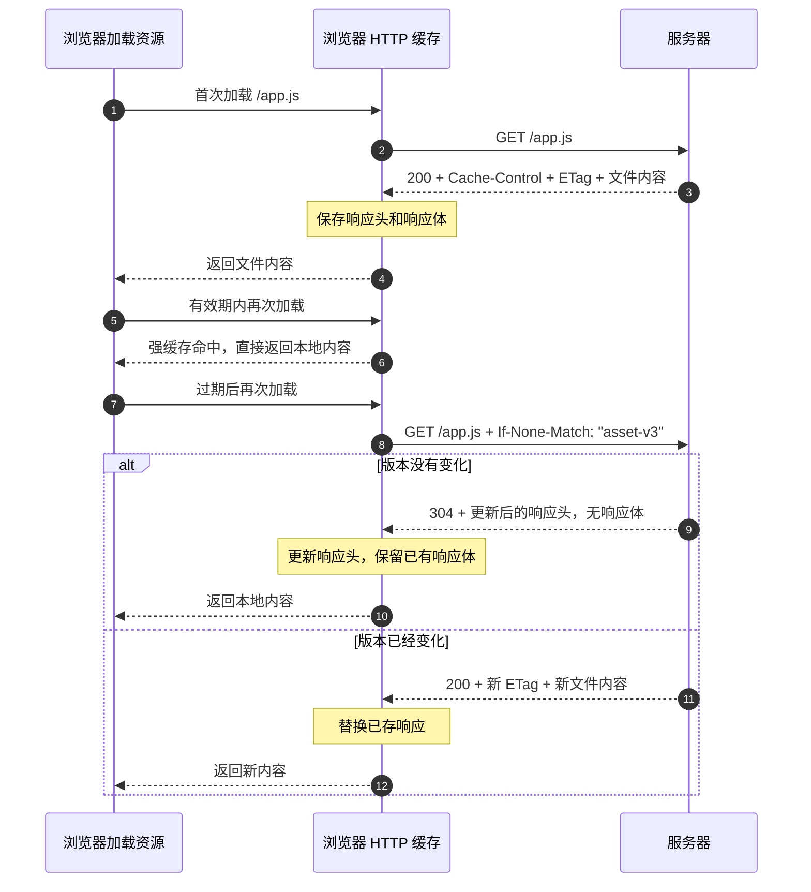

HTTP 缓存保存已经取得的响应，供后续请求复用。以浏览器缓存为例，复用有两条常见路径：

- **强缓存**：浏览器判断缓存仍在有效期内，且策略允许直接使用，就读取本地响应，不发送网络请求。
- **协商缓存**：浏览器把已保存内容的版本标识或修改时间发给服务器验证。内容未变化时，服务器返回 `304 Not Modified`，浏览器继续使用本地响应体；内容变化时，服务器返回 `200 OK` 和新内容。

两者可以配合使用：先按有效期判断能否直接复用，需要验证时再向服务器确认。

## 一次完整的缓存流程

浏览器第一次请求 `/app.js`，服务器返回：

```http
HTTP/1.1 200 OK
Date: Fri, 17 Jul 2026 02:00:00 GMT
Content-Type: text/javascript
Cache-Control: max-age=60
ETag: "asset-v3"

console.log('v3')
```

这里的两个**响应头**分别承担不同职责：`Cache-Control: max-age=60` 规定缓存有效期为 60 秒；`ETag: "asset-v3"` 是服务器给这份内容的版本标识，供之后验证时使用。浏览器会把它们与响应体一起保存。

假设浏览器直接访问源站、忽略传输耗时，且使用默认缓存策略：

1. 02:00:30 再次加载同一文件，缓存仍未过期，浏览器直接读取本地文件，命中强缓存。
2. 02:01:10 再次加载，缓存已经过期。浏览器发出请求，把先前收到的 ETag 值放进 **`If-None-Match` 请求头**：

   ```http
   GET /app.js HTTP/1.1
   Host: static.example.com
   If-None-Match: "asset-v3"
   ```

3. 服务器比较当前版本与 `"asset-v3"`。相同则返回 `304`，不传文件内容；不同则返回 `200`、新的 ETag 和完整文件。

下图中的 HTTP 缓存位于浏览器内部。强缓存命中时，流程停在本地缓存；需要协商验证时，才访问服务器：


```mermaid
sequenceDiagram
  autonumber
  participant Browser as 浏览器加载资源
  participant Cache as 浏览器 HTTP 缓存
  participant Server as 服务器

  Browser->>Cache: 首次加载 /app.js
  Cache->>Server: GET /app.js
  Server-->>Cache: 200 + Cache-Control + ETag + 文件内容
  Note over Cache: 保存响应头和响应体
  Cache-->>Browser: 返回文件内容

  Browser->>Cache: 有效期内再次加载
  Cache-->>Browser: 强缓存命中，直接返回本地内容

  Browser->>Cache: 过期后再次加载
  Cache->>Server: GET /app.js + If-None-Match: "asset-v3"
  alt 版本没有变化
    Server-->>Cache: 304 + 更新后的响应头，无响应体
    Note over Cache: 更新响应头，保留已有响应体
    Cache-->>Browser: 返回本地内容
  else 版本已经变化
    Server-->>Cache: 200 + 新 ETag + 新文件内容
    Note over Cache: 替换已存响应
    Cache-->>Browser: 返回新内容
  end
```

缓存过期不代表文件已经改变，也不代表本地文件立即被删除；它表示不能再仅凭原来的有效期直接复用。

## 强缓存：用响应头确定有效期

### Cache-Control: max-age

服务器通过响应头声明有效期：

```http
Cache-Control: max-age=3600
```

`max-age` 的单位是秒。缓存计算出的响应年龄小于 3600 秒时，响应未过期；达到有效期时，响应变为过期。规范将这两种状态分别称为 `fresh` 和 `stale`。

**命中浏览器强缓存时，不会发送用于验证的请求头，因为根本没有网络请求。** 判断依据来自上一次保存的响应头。

### Expires

`Expires` 也是响应头，使用绝对时间表达过期时刻：

```http
Expires: Fri, 17 Jul 2026 03:00:00 GMT
```

响应同时包含 `Cache-Control: max-age` 和 `Expires` 时，按 `max-age` 计算有效期。`Expires` 容易受到时钟偏差影响，主要用于兼容旧实现。

## 协商缓存：用请求头携带旧版本信息

缓存需要验证时，可以携带服务器之前返回的版本标识或修改时间。这类信息称为**验证器**（validator），带有验证条件的请求称为**条件请求**。

### ETag 响应头 → If-None-Match 请求头

服务器通过 `ETag`（实体标签）标识资源内容的版本：

```http
ETag: "asset-v3"
```

浏览器验证时，把保存的值放入 `If-None-Match` 请求头：

```http
GET /app.js HTTP/1.1
Host: static.example.com
If-None-Match: "asset-v3"
```

`If-None-Match` 表达的是“当前版本与这个标签不匹配时，才发送完整内容”。对于正常的 `GET` 请求：

- 标签匹配：返回 `304 Not Modified`，没有响应体，浏览器复用已有内容。
- 标签不匹配：返回 `200 OK`、新 ETag 和新响应体，浏览器更新缓存。

ETag 的生成方式由服务器决定，可以使用版本号或内容哈希，但不保证一定是哈希值。

### Last-Modified 响应头 → If-Modified-Since 请求头

服务器也可以通过 `Last-Modified` 返回资源最后修改的时间：

```http
Last-Modified: Fri, 17 Jul 2026 01:50:00 GMT
```

浏览器可以把这个时间放入 `If-Modified-Since` 请求头：

```http
GET /app.js HTTP/1.1
Host: static.example.com
If-Modified-Since: Fri, 17 Jul 2026 01:50:00 GMT
```

服务器检查资源是否在这个时间之后被修改：没有则返回 `304`；有则返回 `200` 和新内容。这里发送的是之前收到的修改时间，不是浏览器当前时间。

HTTP 日期精确到秒，同一秒内的多次修改可能无法区分；ETag 可以根据实际内容或版本区分变化。

### 两组头的优先级与验证结果

服务器可以同时返回 `ETag` 和 `Last-Modified`，浏览器也可能同时发送 `If-None-Match` 和 `If-Modified-Since`。两者同时存在时，服务器按 `If-None-Match` 判断，忽略 `If-Modified-Since`。

收到 `304` 后，缓存会用其中的响应头更新已存响应，并保留原响应体。例如，更新后的策略仍为 `max-age=60`，后续请求就可能再次命中强缓存；如果策略为 `no-cache`，下次复用前仍需验证。

如果没有可用的验证器，需要重新获取资源时通常只能发送普通请求，接收完整响应。

## 请求头与响应头对照

| 机制 | 服务器返回的响应头 | 浏览器之后发送的请求头 | 作用 |
| --- | --- | --- | --- |
| 强缓存 | `Cache-Control: max-age=…`、`Expires` | 命中时不发送网络请求 | 判断缓存是否仍在有效期内 |
| 协商缓存：版本标识 | `ETag` | `If-None-Match` | 比较当前版本与已保存版本 |
| 协商缓存：修改时间 | `Last-Modified` | `If-Modified-Since` | 判断资源是否在指定时间之后修改 |

`Cache-Control` 控制整个缓存流程，并不只用于强缓存；它也可以出现在请求头中。

## Cache-Control：控制存储、直接复用与验证

### 响应头定义缓存策略

除了浏览器缓存，内容分发网络（Content Delivery Network，CDN）和代理也可能保存响应。浏览器维护的是供单个用户使用的**私有缓存**，CDN 和代理通常维护供多个用户使用的**共享缓存**。

服务器可以组合多个响应指令：

```http
Cache-Control: public, max-age=3600
```

| 响应指令 | 含义 |
| --- | --- |
| `max-age=3600` | 缓存有效期为 3600 秒 |
| `s-maxage=3600` | 只用于共享缓存，并覆盖其中的 `max-age` 或 `Expires` |
| `private` | 共享缓存不得存储；浏览器私有缓存仍可存储 |
| `public` | 明确允许共享缓存存储，即使响应通常不能由共享缓存存储 |
| `no-cache` | 可以存储，但每次复用前必须成功验证 |
| `no-store` | 私有和共享缓存都不得有意存储该响应 |
| `must-revalidate` | 响应过期后必须成功验证；断网时也不能直接复用旧响应 |
| `immutable` | 响应未过期期间内容不会变化，不必因刷新操作而验证 |

`no-cache` 与 `no-store` 的区别是**保存后验证**与**禁止保存**。例如下面的响应允许保存内容，但每次复用前都需要携带 ETag 验证，不能直接命中强缓存：

```http
Cache-Control: no-cache
ETag: "asset-v3"
```

`must-revalidate` 则只在过期后要求验证，未过期时仍可直接复用。

### 请求头表达本次请求的缓存要求

客户端也可以在请求中发送 `Cache-Control`：

```http
GET /app.js HTTP/1.1
Host: static.example.com
Cache-Control: no-cache
If-None-Match: "asset-v3"
```

这里，`Cache-Control: no-cache` 表达“这次使用缓存前需要向源站验证”，即使缓存尚未过期；`If-None-Match` 提供要验证的旧版本。两者职责不同。

同一个指令在请求和响应中的含义也需要区分：响应中的 `max-age=60` 设定有效期，请求中的 `max-age=60` 则表示客户端希望收到年龄不超过 60 秒的响应，不会把服务器原有的有效期延长。

请求缓存指令的定义见 [RFC 9111 §5.2.1](https://www.rfc-editor.org/rfc/rfc9111.html#section-5.2.1)。浏览器刷新操作或 Fetch API 的缓存选项可能改变本次请求的缓存行为，不能只看服务端的 `max-age`。

## 按资源类型配置

缓存策略需要与资源更新方式匹配。下面是常见起点，不是所有站点都必须使用的固定值。

### 带内容指纹的静态资源

```http
Cache-Control: public, max-age=31536000, immutable
```

适用于 `/app.a81f3c.js`、`/styles.72b9.css` 等内容改变时 URL 也会改变的文件。部署新版本时，HTML 引用新的 URL；旧文件可以安全地继续长期缓存。服务器需要保留仍可能被旧 HTML 引用的文件，避免部署瞬间出现 `404`。

没有版本标识的 URL 不应盲目使用一年缓存，否则服务器替换文件后，已有客户端仍可能长期使用旧内容。

### HTML 入口

```http
Cache-Control: no-cache
ETag: "index-v42"
```

HTML 的稳定 URL 通常不能像子资源一样添加内容指纹。`no-cache` 允许浏览器保存响应，但每次使用前验证，从而及时取得引用了新资源版本的 HTML。若页面按用户个性化且仍允许浏览器保存，可增加 `private`：

```http
Cache-Control: private, no-cache
```

### API 响应

公开且允许短暂过期的数据可以设置较短的缓存有效期，并让 CDN 保存更久：

```http
Cache-Control: public, max-age=60, s-maxage=300
ETag: "catalog-v18"
```

包含账户、支付、令牌等敏感信息的响应应避免进入浏览器或共享缓存：

```http
Cache-Control: no-store
```

`no-store` 是缓存行为指令，不是完整的隐私或传输安全机制。敏感响应仍需使用 HTTPS，并控制认证、授权、日志和客户端代码中的数据暴露。

## 进阶：缓存匹配与实现细节

### 缓存键与 Vary

缓存必须先找到与当前请求匹配的已存响应，才能判断它是否过期。缓存键至少受请求方法和目标 URI 影响；响应中的 `Vary` 还可以把指定请求头加入匹配条件。

例如服务器按语言返回不同内容时，需要声明：

```http
Vary: Accept-Language
```

缓存随后会分别保存中文和英文响应。遗漏 `Vary` 可能把一种响应错误地复用于另一种请求；在共享缓存中，这还可能造成跨用户数据泄漏。个性化响应通常应使用 `private` 或 `no-store`，不能只依赖默认缓存键。

URL 不同也会产生不同的缓存项。构建工具利用这一点给静态资源添加内容指纹，例如 `/app.a81f3c.js`：内容改变时 URL 也改变，浏览器自然取得新文件。

### max-age、Date 和 Age

`max-age` 的起点不是“浏览器收到响应的时刻”。缓存计算当前年龄时会考虑源站的 `Date`、上游缓存提供的 `Age`、传输时间以及响应在缓存中停留的时间。因此，经过 CDN 20 秒后到达浏览器的 `max-age=60` 响应，并不一定还能保持 60 秒新鲜。

```http
Date: Fri, 17 Jul 2026 02:00:00 GMT
Age: 20
Cache-Control: public, max-age=60
```

`Age` 表示响应自源站生成或上次验证以来的估算秒数，常用于观察共享缓存已经持有响应多久。

### 没有显式有效期时的估算

即使响应没有显式过期时间，规范也允许缓存在满足条件时根据 `Last-Modified` 等信息估算有效期。因此，“没有缓存头”不等于“不会缓存”；需要确定行为时应显式设置策略。

### 强 ETag 与弱 ETag

强 ETag 可用于要求字节级一致的比较。以 `W/` 开头的是弱 ETag，例如 `W/"article-v3"`，只表示语义等价，不保证字节完全相同。`If-None-Match` 的缓存验证使用弱比较，因此两种 ETag 都能用于普通的 `GET` 重验证；范围请求等场景可能要求强验证器。

这里的“强、弱”描述的是版本比较方式，与是否命中“强缓存”无关。

### HTTP 缓存与其他浏览器缓存

- memory cache 和 disk cache 是浏览器保存 HTTP 响应的实现位置，不是两套独立的协议规则；
- 后退/前进缓存（Back/Forward Cache，BFCache）保存的是可恢复的完整页面状态；
- Service Worker 可以拦截请求，Cache API 则由应用代码显式读写；
- DNS 缓存保存域名解析结果，不保存 HTTP 响应。

### 可选的过期响应策略

某些业务允许短时间使用旧响应，以换取低延迟或故障可用性。扩展指令 `stale-while-revalidate` 允许缓存先返回过期响应，同时在后台验证：

```http
Cache-Control: public, max-age=60, stale-while-revalidate=30
```

这里的响应在 60 秒内新鲜；随后 30 秒窗口内可以先返回旧响应并触发验证。该策略不适合必须立即一致的账户余额、权限或交易状态。

`stale-if-error` 则允许缓存仅在源站错误或不可用时使用一定时间内的过期响应。部署前需要确认实际缓存实现支持这些扩展指令，并定义业务可以接受的陈旧窗口。

## Fetch API 的请求缓存模式

服务端响应头定义可复用策略；客户端还可以通过 Fetch API 的 `cache` 选项控制单次请求如何使用浏览器 HTTP 缓存：

| 模式 | 主要行为 |
| --- | --- |
| `default` | 按标准的有效期与验证规则处理 |
| `no-cache` | 有缓存项也向服务器验证，验证成功后可复用 |
| `no-store` | 不查缓存，也不把取得的响应写入缓存 |
| `reload` | 不查缓存，但把网络响应写入缓存 |
| `force-cache` | 优先返回匹配项，包括过期项；没有时访问网络 |
| `only-if-cached` | 只使用缓存；仅可与 `same-origin` 模式组合，未命中时返回 `504` |

```js
const response = await fetch('/api/catalog', {
  cache: 'no-cache',
})
```

这些模式不会修复错误的服务端缓存策略。业务代码通常使用默认模式，由服务器明确响应头；只有确实需要改变单次请求行为时才覆盖它。

## 调试缓存行为

### 浏览器开发者工具

在 Chrome DevTools 的 Network 面板中观察同一 URL 的连续请求：

- `Size` 或传输信息显示 `(memory cache)`、`(disk cache)`，通常表示没有访问网络；
- 请求包含 `If-None-Match` 或 `If-Modified-Since` 且网络状态为 `304`，表示发生了验证；
- 响应为 `200` 且传输了完整内容，可能是首次请求、缓存未命中、验证器不匹配或缓存被绕过；
- 检查 `Cache-Control`、`Age`、`ETag`、`Last-Modified` 和 `Vary`，不要只看状态码。

Network 面板的 **Disable cache** 只适合模拟首次访问和排查问题，并且仅在 DevTools 打开时生效。测试生产策略时需要关闭该选项，再用相同 URL 重复请求。

如果页面由 Service Worker 控制，还需要在 Application 面板检查 Service Worker 和 Cache Storage；否则 Cache API 的命中可能被误认为 HTTP 缓存命中。

### 验证服务器的条件请求

`curl` 默认不会像浏览器一样维护 HTTP 缓存，但可以手动发送验证器，检查服务器是否正确返回 `304`：

```bash
curl -i https://static.example.com/app.js
curl -i https://static.example.com/app.js \
  -H 'If-None-Match: "asset-v3"'
```

还应确认 `304` 响应会返回更新缓存所需的 `Date`、`ETag`、`Cache-Control` 和 `Vary` 等元数据。

## 常见故障

| 现象 | 检查项 |
| --- | --- |
| 发布后仍加载旧静态资源 | URL 是否带内容指纹；HTML 是否被长期缓存；旧 HTML 引用的文件是否仍存在 |
| 每次都下载完整响应 | 是否缺少验证器；多个服务器是否为同一内容生成了不一致的 ETag |
| 设置 `no-cache` 后仍看到缓存 | 这是预期行为；它允许存储，但要求复用前验证 |
| CDN 没有缓存公开响应 | 是否存在 `private`、`no-store`、`Set-Cookie`、`Authorization` 或 CDN 自身规则 |
| 不同用户或语言得到错误内容 | 是否错误缓存了个性化响应；`private`、`no-store` 或 `Vary` 是否缺失 |
| DevTools 中看不到真实缓存行为 | 是否勾选了 Disable cache；是否由 Service Worker 返回响应 |

## 参考资料

- [RFC 9111：HTTP Caching](https://www.rfc-editor.org/rfc/rfc9111.html)
- [RFC 9110：HTTP Semantics，Conditional Requests](https://www.rfc-editor.org/rfc/rfc9110.html#name-conditional-requests)
- [RFC 8246：HTTP Immutable Responses](https://www.rfc-editor.org/rfc/rfc8246.html)
- [RFC 5861：HTTP Cache-Control Extensions for Stale Content](https://www.rfc-editor.org/rfc/rfc5861.html)
- [MDN：HTTP caching](https://developer.mozilla.org/en-US/docs/Web/HTTP/Guides/Caching)
- [web.dev：Prevent unnecessary network requests with the HTTP Cache](https://web.dev/articles/http-cache)
- [Chrome DevTools：Network features reference](https://developer.chrome.com/docs/devtools/network/reference/)
- [OWASP：Testing for Browser Cache Weaknesses](https://owasp.org/www-project-web-security-testing-guide/latest/4-Web_Application_Security_Testing/04-Authentication_Testing/06-Testing_for_Browser_Cache_Weaknesses)
