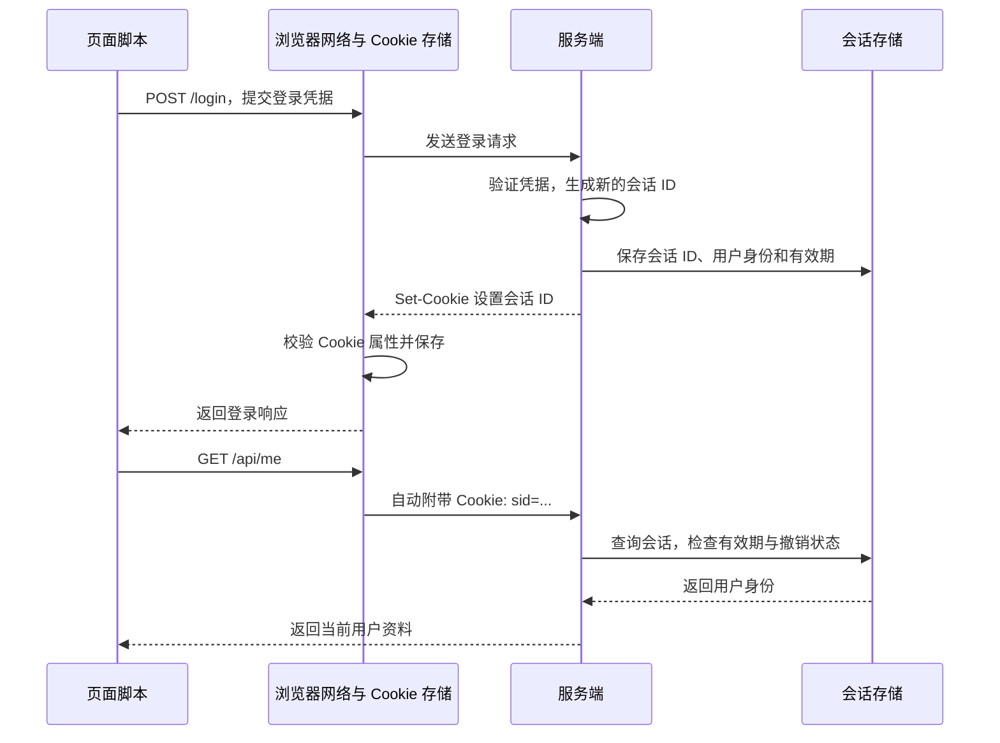

HTTP 请求本身不会说明它与之前的登录请求属于同一个用户。Cookie 让浏览器保存少量键值数据，并在后续符合条件的请求中自动带回；服务端可以用其中的会话 ID 找到登录状态，也可以用它保存语言偏好等信息。

## 从登录到下一次请求

假设页面和接口都位于 `https://app.example.com`，采用服务端会话方案。Session（会话）保存用户身份、有效期等状态，浏览器只保存一个随机、不可预测的 Session ID。



登录成功的响应可以包含：

```http
HTTP/1.1 200 OK
Set-Cookie: sid=<random-session-id>; Path=/; HttpOnly; Secure; SameSite=Lax; Max-Age=1800
Set-Cookie: theme=dark; Path=/; Secure; SameSite=Lax
Content-Type: application/json

{"ok":true}
```

之后请求 `/api/me` 时，浏览器根据保存的规则生成请求头：

```http
GET /api/me HTTP/1.1
Host: app.example.com
Cookie: sid=<random-session-id>; theme=dark
```

`Set-Cookie` 是服务端设置 Cookie 的响应头；`Cookie` 是浏览器回传键值对的请求头。设置多个 Cookie 要分别发送多个 `Set-Cookie`，不能用逗号合成一个字段。`Path`、`HttpOnly` 等属性由浏览器保存，不会随着 `Cookie` 请求头回传，服务端仍需验证值是否有效。

页面不需要读取 `sid` 再拼接请求头；这也是 `HttpOnly` Cookie 可以维持登录态的原因。Cookie 的收发机制见 [MDN：Using HTTP cookies](https://developer.mozilla.org/en-US/docs/Web/HTTP/Guides/Cookies)。

## 属性决定保存多久、发送给谁

### Domain 与 Path：请求的目标范围

省略 `Domain` 时，Cookie 仅属于设置它的主机，称为 **host-only Cookie**。例如 `api.example.com` 设置的 Cookie 只发给该主机，不发给 `app.example.com` 或 `v2.api.example.com`。

显式设置 `Domain=example.com` 后，`example.com` 及其子域都在范围内。服务器只能指定自己的域名或合法父域，不能替其他网站设置 Cookie，也不能使用 `com`、`co.uk` 这样的公共后缀。开头的点没有额外作用，`.example.com` 与 `example.com` 的含义相同。

`Path` 进一步限制请求路径。`Path=/api` 匹配 `/api`、`/api/me`，不匹配 `/apix`。省略时，默认路径由设置 Cookie 的请求路径推导：`/auth/login` 对应 `/auth`，不一定是 `/`。因此登录接口设置会话 Cookie 时常显式写 `Path=/`。

Cookie 不按端口隔离：同一主机不同端口的服务，不能依靠端口隔离 Cookie。`Path` 也不是可靠的安全隔离边界，只用于筛选请求。基础匹配规则见 [RFC 6265 §5.1.3–5.1.4 与 §8.5](https://www.rfc-editor.org/rfc/rfc6265.html#section-5.1.3)。

### Max-Age 与 Expires：浏览器端的生命周期

- `Max-Age=1800`：从接收时起最多保留 1800 秒；`0` 或负数表示立即过期。
- `Expires=Wed, 23 Sep 2026 00:00:00 GMT`：指定绝对过期时间。
- 两者同时存在时，`Max-Age` 优先。
- 两者都没有时，是**会话 Cookie**，由浏览器定义会话何时结束。会话恢复功能可能恢复它，不能承诺“关闭浏览器就退出登录”。

到期前，用户清理、存储配额和隐私策略也可能移除 Cookie。服务端 Session 的有效期独立于 Cookie：浏览器还带着 `sid`，服务端会话也可能已经失效。时间属性和恢复行为见 [MDN：Set-Cookie](https://developer.mozilla.org/en-US/docs/Web/HTTP/Reference/Headers/Set-Cookie#expiresdate_optional)。

### Secure 与 HttpOnly：传输和脚本访问

`Secure` 要求通过安全连接发送 Cookie，生产环境按 HTTPS 配置；本地 `localhost` 的开发例外取决于浏览器。它不负责加密 Cookie 的存储内容，也不阻止页面脚本读取未设置 `HttpOnly` 的 Cookie。

`HttpOnly` 禁止页面通过 `document.cookie` 等 API 读取或修改该 Cookie，但浏览器仍可随 `fetch`、表单等请求发送它。`HttpOnly` 并不是“只通过 HTTP 明文传输”，它和 `Secure` 经常同时使用。[属性定义](https://developer.mozilla.org/en-US/docs/Web/HTTP/Reference/Headers/Set-Cookie#httponly_optional)

## SameSite：先区分同源和同站

**同源（same-origin）**要求协议、主机和端口都相同，主要用于浏览器的同源策略和跨源资源共享（CORS）。**同站（same-site）**在现代浏览器中按协议和可注册域判断；可注册域是公共后缀之上可由组织注册的域，例如 `example.com`、`example.co.uk`。端口不参与同站判断。

以顶层页面 `https://app.example.com` 为基准，考虑它直接发起的请求：

| 目标 | 同源 | 同站 | 原因 |
| --- | --- | --- | --- |
| `https://app.example.com/api` | 是 | 是 | 协议、主机、端口相同 |
| `https://api.example.com` | 否 | 是 | 主机不同，协议和可注册域相同 |
| `https://app.example.com:8443` | 否 | 是 | 端口不同 |
| `http://app.example.com` | 否 | 否 | 协议不同；请求还可能受到混合内容限制 |
| `https://example.net` | 否 | 否 | 可注册域不同 |

不能机械地取“域名最后两段”：公共后缀还包括 `github.io`，因此 `alice.github.io` 与 `bob.github.io` 不同站。协议参与站点判断的说明见 [web.dev：Schemeful Same-Site](https://web.dev/articles/schemeful-samesite)。

`SameSite` 控制跨站上下文中 Cookie 是否发送。先假设 Domain、Path、Secure、请求的凭据模式和浏览器隐私策略都已满足，再比较它的作用：

| 请求情形 | `Strict` | 显式 `Lax` | `None; Secure` |
| --- | --- | --- | --- |
| 同站请求 | 允许 | 允许 | 允许 |
| 从外站点击链接，以 GET 打开本站顶层页面 | 不发送 | 允许 | 允许 |
| 外站表单 POST 到本站 | 不发送 | 不发送 | 允许 |
| 外站通过图片、iframe 或 fetch 请求本站 | 不发送 | 不发送 | 允许 |

这里的**顶层导航**指打开或切换浏览器的顶层页面，不包括 iframe 内部导航。`Lax` 的跨站例外还要求使用 GET 等安全方法；“安全”是指 HTTP 语义上不应改变业务状态，不代表使用 GET 就没有漏洞。图片和 `fetch` 即使用 GET，也不满足顶层导航条件。

`None` 表示不施加 SameSite 的跨站限制，并要求同时设置 `Secure`。省略 `SameSite` 时，现代主流浏览器通常按 Lax 类规则处理，但部分实现对刚设置不超过两分钟的 Cookie 有跨站顶层 POST 兼容例外；显式 `Lax` 不包含这个例外。行为比较见 [web.dev：SameSite cookies explained](https://web.dev/articles/samesite-cookies-explained)，规范机制见 [HTTPbis Cookie 草案：SameSite](https://httpwg.org/http-extensions/draft-ietf-httpbis-rfc6265bis.html#section-4.1.2.7)。

## 前后端分离时如何携带 Cookie

页面位于 `https://app.example.com`，接口位于 `https://api.example.com`：这是**跨源但同站**的部署。API 可以设置只属于 `api.example.com` 的 Cookie，不需要为了前端调用而扩大到 `Domain=example.com`。

### 登录和后续请求都指定凭据模式

浏览器端 `fetch` 的 `credentials` 默认是 `same-origin`，只对同源请求使用 Cookie；跨源请求使用 `include`。该选项也影响浏览器是否处理响应中的 `Set-Cookie`，因此不能只给登录后的业务请求配置。

```js
// 在 https://app.example.com 页面中执行；username、password 来自登录表单。
const login = await fetch('https://api.example.com/login', {
  method: 'POST',
  credentials: 'include',
  headers: { 'Content-Type': 'application/json' },
  body: JSON.stringify({ username, password }),
})
if (!login.ok) throw new Error(`登录失败：${login.status}`)

const response = await fetch('https://api.example.com/me', {
  credentials: 'include',
})
if (!response.ok) throw new Error(`获取用户失败：${response.status}`)
const user = await response.json()
```

`credentials: 'omit'` 则不使用 Cookie。浏览器端 Axios 对应 `withCredentials: true`，原生 XMLHttpRequest 对应 `xhr.withCredentials = true`。这些配置都不能绕过 Cookie 本身的发送规则。

### 服务端允许指定来源读取响应

API 实际响应需要包含以下 CORS 响应头；登录响应另外设置 Cookie：

```http
Access-Control-Allow-Origin: https://app.example.com
Access-Control-Allow-Credentials: true
Vary: Origin
Set-Cookie: sid=<random-session-id>; Path=/; HttpOnly; Secure; SameSite=Lax; Max-Age=1800
```

`Access-Control-Allow-Origin` 必须是允许的具体源，不能是 `*`。如果按请求的 `Origin` 动态返回，必须先检查来源白名单，并用 `Vary: Origin` 告知缓存响应随来源变化。

上面的 JSON 登录请求会先触发 OPTIONS 预检，浏览器在正式发送之前询问服务器是否允许该方法、请求头和凭据模式。预检响应除来源和凭据头外，还需要允许 `POST` 和 `Content-Type`：

```http
Access-Control-Allow-Origin: https://app.example.com
Access-Control-Allow-Credentials: true
Access-Control-Allow-Methods: POST
Access-Control-Allow-Headers: Content-Type
Vary: Origin
```

预检请求不带 Cookie，因此不能要求 OPTIONS 先通过登录校验；实际业务请求仍需鉴权。CORS 决定页面脚本能否读取跨源响应，也决定预检后能否继续发送；对不需要预检的请求，即使响应被 CORS 阻止读取，请求仍可能已经带着 Cookie 到达服务端，不能把“CORS 报错”当作“操作没有发生”。[Fetch 标准：CORS 与凭据](https://fetch.spec.whatwg.org/#cors-protocol-and-credentials)

若前端改为 `https://app.example.net`，API 仍在 `example.com`，就变成跨站调用，需要评估 `SameSite=None; Secure` 和浏览器的第三方 Cookie 策略。同源、同站、Cookie 目标匹配和 CORS 是不同检查，不能用一个 `include` 或 `None` 代替全部配置。

## JavaScript 读写与删除

偏好设置可以由页面写入；下面示例假定页面使用 HTTPS：

```js
document.cookie = `theme=${encodeURIComponent('dark')}; Path=/; Max-Age=86400; SameSite=Lax; Secure`
document.cookie = 'language=zh-CN; Path=/; SameSite=Lax; Secure'

console.log(document.cookie)
// 可以包含 theme=dark; language=zh-CN，顺序不保证，也可能有其他可见 Cookie。

document.cookie = 'theme=; Path=/; Max-Age=0; SameSite=Lax; Secure'
```

给 `document.cookie` 赋值一次，只设置一个 Cookie，不会覆盖整个 Cookie 集合。读取只能得到当前页面可访问且非 `HttpOnly` 的键值对，不包含过期时间等属性。需要保存中文或特殊字符时，可约定写入使用 `encodeURIComponent`、读取使用 `decodeURIComponent`。[MDN：Document.cookie](https://developer.mozilla.org/en-US/docs/Web/API/Document/cookie)

覆盖或删除时，需要匹配原 Cookie 的名称、域作用域和路径：原来省略 `Domain` 就继续省略，设置过则使用相同配置。同名但路径不同的 Cookie 可以共存，请求还可能同时发送多个同名值，服务端不应靠固定顺序识别它们。删除时只把值设为空不够，还要让 Cookie 过期。

`HttpOnly` 会话 Cookie 应由服务端通过响应删除，例如删除开头示例的 `sid`：

```http
Set-Cookie: sid=; Path=/; Max-Age=0; HttpOnly; Secure; SameSite=Lax
```

浏览器页面不能手工设置 `Cookie` 请求头，也不能通过 `response.headers.get('Set-Cookie')` 读取响应中的该字段；即使使用 `Access-Control-Expose-Headers` 也不能将它暴露给页面。查看收发情况应使用开发者工具。[MDN：Set-Cookie 的访问限制](https://developer.mozilla.org/en-US/docs/Web/HTTP/Reference/Headers/Set-Cookie)

## 登录态与安全边界

### Cookie、Session、Token 各自负责什么

Session 是服务端维护的会话状态；Token 是客户端提交的凭据；Cookie 是浏览器保存并自动发送数据的机制。JWT 是一种 Token 格式，可以放进 Cookie，也可以由代码放进 `Authorization` 请求头。因此“Cookie 和 JWT 哪个更安全”要先明确凭据如何保存、发送、验证和撤销。

| 对象 | 解决的问题 | 在登录流程中的例子 |
| --- | --- | --- |
| Cookie | 浏览器如何保存和携带数据 | 自动发送 `sid=...` |
| Session | 多次请求如何关联到登录状态 | 根据 `sid` 查询会话存储 |
| Token / JWT | 服务端收到什么凭据、如何验证 | 查询随机 Token 或验证 JWT 签名与声明 |
| localStorage / sessionStorage | 页面脚本如何保存本地数据 | 保存偏好；其中的值不会自动随 HTTP 请求发送 |

Cookie 单条容量通常约 4 KiB，数量和计量方式随实现变化；匹配的请求会反复携带它。大块业务数据更适合其他[浏览器存储](./web-storage.md)。Token 验证、刷新和撤销见 [JWT](../../security/auth/jwt.md)。

### HttpOnly 和 SameSite 不能代替完整防护

**XSS（跨站脚本攻击）**使攻击脚本在本站页面中执行。`HttpOnly` 能限制它直接窃取 Cookie，但脚本仍可能发起带 Cookie 的请求、读取业务数据，因此还需要输出编码等 XSS 防护。

**CSRF（跨站请求伪造）**利用浏览器自动携带凭据的行为：用户已登录本站时，攻击站点诱导浏览器向本站提交操作。攻击者往往不需要知道 Cookie 的值，`HttpOnly` 因此不能阻止这类攻击。

对于依赖 Cookie 的状态变更接口，可使用框架提供的 CSRF 防护：服务端生成与会话关联、不可预测的 CSRF Token，合法页面在表单或自定义请求头中显式提交，服务端进行校验；再结合 `Origin`/`Referer` 来源校验和合适的 `SameSite` 配置。GET 不应承担转账、删除等操作，因为 `Lax` 允许跨站顶层 GET；同站子域被攻陷时，SameSite 也无法区分其是否可信。[OWASP：CSRF Prevention](https://cheatsheetseries.owasp.org/cheatsheets/Cross-Site_Request_Forgery_Prevention_Cheat_Sheet.html)

### 登录、注销与会话过期

登录成功、权限提升时应更换会话 ID，避免攻击者预先植入的 ID 在登录后继续有效，这类问题称为**会话固定攻击**。服务端还应独立限制空闲时间和总有效期，不能只信任 Cookie 的过期设置。

注销要同时撤销服务端会话、让浏览器 Cookie 过期。只删除浏览器 Cookie，已泄露的会话 ID 可能仍能使用；只删除服务端会话，浏览器则可能持续发送一个失效值。对于 JWT，客户端删除也不等于已签发 Token 立即失效，需要结合具体撤销设计。[OWASP：Session Management](https://cheatsheetseries.owasp.org/cheatsheets/Session_Management_Cheat_Sheet.html)

## Cookie 不生效时按链路排查

在开发者工具的 Network 查看响应 `Set-Cookie`、请求 `Cookie` 及阻止原因，再在 Application / Storage 查看已保存的属性。区分“没有存下来”“没有发出去”和“发出后服务端不认可”：

| 现象 | 优先检查 |
| --- | --- |
| 响应有 `Set-Cookie`，存储中没有 | Domain 是否合法、HTTPS / Secure 是否匹配、`None` 是否带 Secure、跨源请求是否启用凭据、第三方策略是否阻止 |
| 已存储，但业务请求不带 | 请求目标的 Domain / Path、有效期、SameSite 上下文、`credentials`、分区和隐私策略 |
| Network 中有 Cookie，`document.cookie` 中没有 | 是否为 HttpOnly；页面主机或路径是否与 API Cookie 的范围不同 |
| Cookie 已发送，却出现 CORS 错误 | 实际响应是否包含具体的允许源和 `Allow-Credentials: true`；包括错误响应 |
| OPTIONS 返回 401，业务请求没发出 | 预检是否误入登录鉴权；预检是否允许所需方法和请求头 |
| 删除后仍看到同名 Cookie | 是否存在不同域作用域或路径的同名项；分区 Cookie 是否在原分区中操作 |
| 带着 `sid` 仍返回 401 | 服务端会话是否过期或撤销、多实例是否能访问同一会话存储 |

## 进阶：第三方 Cookie、分区与名称前缀

页面嵌入另一个站点的资源时，该资源在第三方上下文中使用 Cookie。例如 `shop.example` 嵌入 `chat.example` 的客服 iframe，涉及的是发给 `chat.example` 的 Cookie，不是把商店的 Cookie 交给客服域名。

`SameSite=None; Secure` 只放开 SameSite 限制，浏览器设置、扩展和隐私策略仍可能阻止第三方 Cookie。需要嵌入式会话时，可以评估 **CHIPS（独立分区 Cookie）**：使用 `Partitioned` 属性，让 Cookie 额外按顶层站点隔离，并要求 `Secure`。

```http
Set-Cookie: __Host-widget_session=<random-id>; Path=/; Secure; HttpOnly; SameSite=None; Partitioned
```

同一个客服组件嵌入两个不同顶层站点时，会使用不同分区的 Cookie，因此它不能直接充当跨站共享登录态。兼容范围和分区机制见 [MDN：CHIPS](https://developer.mozilla.org/en-US/docs/Web/Privacy/Guides/Third-party_cookies/Partitioned_cookies)。

示例中的 `__Host-` 是 Cookie 名称前缀。支持它的浏览器要求通过安全连接设置、带 `Secure`、`Path=/`，并且不能有 `Domain`；服务端收到的名称仍包含前缀。它可用于把会话 Cookie 限制在单一主机，但不会自动启用 `HttpOnly`，也不会实现端口隔离。[HTTPbis Cookie 草案：名称前缀](https://httpwg.org/http-extensions/draft-ietf-httpbis-rfc6265bis.html#section-4.1.3)

## 相关笔记

- [浏览器存储](./web-storage.md)：Cookie、Web Storage、IndexedDB 和 Cache Storage 的定位。
- [跨域](./cross-origin.md)：同源策略、CORS 与预检。
- [认证与授权](../../security/auth/README.md)：身份认证、会话和接口权限的分工。
- [JWT](../../security/auth/jwt.md)：Token 结构、校验、刷新和撤销。
