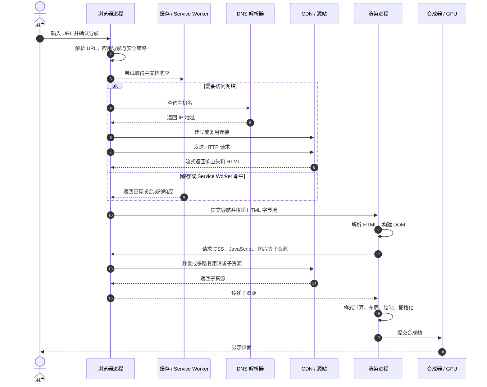

以访问 `https://www.example.com/products?id=42#reviews` 为例，浏览器需要取得主文档及其依赖资源，再把 HTML、CSS 和 JavaScript 转换成屏幕上的像素。

这不是一条固定的串行流水线。缓存命中、连接复用、Service Worker、HTTP/2 或 HTTP/3 都可能跳过步骤或让多个步骤并行。下面先给出首次访问时的主线，再说明常见分支。

## 端到端主线



图中的“浏览器进程、渲染进程、GPU 进程”采用 Chromium 的多进程架构帮助区分职责，不是 Web 标准强制的进程划分。不同浏览器的进程和线程组织可能不同，但网络获取、文档解析和渲染这几个阶段基本相同。

## 1. 解析输入并开始导航

地址栏输入既可能是 URL，也可能是搜索词。浏览器先根据自身规则判断输入类型；确定是 URL 后，再解析出各组成部分：

| 部分 | 示例 | 作用 |
| --- | --- | --- |
| scheme（方案） | `https` | 决定访问资源所用的协议和默认端口 |
| host（主机） | `www.example.com` | 用于定位服务器，并参与同源判断 |
| port（端口） | 默认 `443` | 标识服务器上的网络服务；默认端口通常不显示 |
| path（路径） | `/products` | 标识目标资源 |
| query（查询） | `?id=42` | 随 HTTP 请求发送给服务器 |
| fragment（片段） | `#reviews` | 由客户端定位文档内部位置，不进入 HTTP 请求目标 |

scheme、host 和 port 共同组成 **origin（源）**，例如 `https://www.example.com:443`。源是浏览器同源策略和许多安全边界的基础。

浏览器还可能在发出请求前完成这些处理：

- 根据 HTTP Strict Transport Security（HSTS）记录把 `http` 升级为 `https`；
- 对当前页面运行必要的离开页面检查；
- 如果只是同一文档的 fragment 改变，则更新历史记录和滚动位置，不重新请求主文档；
- 如果是后退或前进导航，尝试直接恢复后退/前进缓存（Back/Forward Cache，BFCache）中的完整页面。

## 2. 确定响应来自哪里

解析 URL 不代表一定要访问网络。浏览器的获取流程可能从以下位置得到 `Response`：

- **Service Worker**：页面受 Service Worker 控制时，`fetch` 事件可以返回缓存内容、合成响应，或继续访问网络；
- **HTTP 缓存**：新鲜响应可以直接复用；过期响应可以携带 `If-None-Match` 或 `If-Modified-Since` 向服务器验证，收到 `304 Not Modified` 后复用已有响应体；
- **网络**：缓存不能满足请求时，访问代理、内容分发网络（Content Delivery Network，CDN）或源站。

缓存、Service Worker 和网络不是三套彼此隔离的机制。例如 Service Worker 内部可以调用 `fetch()` 进入 HTTP 缓存/网络流程，也可以使用 Cache API 管理自己的缓存。HTTP 缓存的具体规则见[HTTP 缓存](../../computer-science/networking/http-caching.md)。

浏览器也会优先考虑复用现有连接。连接可复用时，DNS 查询、TCP 握手和 TLS 握手都可能不再出现。

## 3. DNS 把主机名解析为地址

没有可用地址或连接时，浏览器需要把 `www.example.com` 解析为服务器可以路由的 IP 地址。常见查询结果包括 IPv4 的 `A` 记录、IPv6 的 `AAAA` 记录，也可能先经过 `CNAME` 别名。

一次典型的解析过程是：

1. 浏览器、操作系统或本地网络组件先检查各自的 DNS 缓存；
2. 未命中时，请求递归 DNS 解析器；
3. 递归解析器再次检查缓存，必要时依次查询根域名服务器、顶级域名服务器和权威域名服务器；
4. 权威服务器给出记录后，递归解析器把结果和生存时间（Time To Live，TTL）返回给客户端并缓存。

浏览器通常不会亲自逐级查询根域名服务器。DNS 也不等于“只使用 UDP”：传统 DNS 可以使用 UDP 或 TCP，浏览器和系统还可能配置基于 HTTPS 的 DNS（DNS over HTTPS，DoH）或基于 TLS 的 DNS（DNS over TLS，DoT）。

返回的地址可能属于 CDN、反向代理或负载均衡器，而不是业务源站本身。浏览器只需要与当前解析结果对应的入口服务建立连接；入口服务再决定是否向业务源站转发请求。

## 4. 建立安全连接

浏览器根据服务器能力、已有连接和网络环境选择 HTTP 版本：

| HTTP 版本 | 常见传输方式 | 连接特点 |
| --- | --- | --- |
| HTTP/1.1 | TCP；HTTPS 再运行 TLS | 没有应用层多路复用，浏览器可能建立多个连接 |
| HTTP/2 | 通常是 TCP + TLS | 在一个连接上多路复用多个流 |
| HTTP/3 | QUIC（基于 UDP，集成 TLS 1.3） | 在 QUIC 流上多路复用，单个流丢包不会阻塞其他流 |

HTTPS 使用 TLS（Transport Layer Security，传输层安全协议）建立受保护的通道。握手期间主要完成：

- 协商 TLS 参数和会话密钥；
- 服务器发送证书，并证明自己持有对应私钥；
- 浏览器校验证书的主机名、有效期和信任链；
- 通过应用层协议协商（Application-Layer Protocol Negotiation，ALPN）选择 `http/1.1`、`h2` 或 `h3` 等协议。

HTTP/1.1 和 HTTP/2 通常先完成 TCP 握手，再进行 TLS 握手。HTTP/3 使用 QUIC，把传输层建连与 TLS 1.3 握手结合在一起。因此“浏览器一定先建立 TCP 连接”只适用于基于 TCP 的 HTTP 版本。

应用数据最终由操作系统协议栈封装为网络包。网卡负责收发链路上的信号；在以太网或 Wi-Fi 局域网中，ARP（IPv4）或 Neighbor Discovery（IPv6）用于找到下一跳的链路层地址，路由器再逐跳转发 IP 包。网络分层见[计算机网络体系结构](../../computer-science/networking/network-model.md)。

## 5. 交换 HTTP 请求与响应

下面用 HTTP/1.1 文本形式表示请求，便于观察语义：

```http
GET /products?id=42 HTTP/1.1
Host: www.example.com
Accept: text/html,application/xhtml+xml
Accept-Encoding: gzip, br
```

实际请求还可能按 Cookie 的 Domain、Path、Secure 和 SameSite 等规则携带 `Cookie`，也可能携带缓存验证、内容协商和来源信息。fragment `#reviews` 不会出现在请求行中。

HTTP/2 和 HTTP/3 使用二进制帧，并用 `:method`、`:scheme`、`:authority` 和 `:path` 等伪首部表达相同语义，不会在线路上发送上述文本请求行。

请求可能先到 CDN 或反向代理，再由应用服务器读取缓存、调用服务或查询数据库。响应包含状态码、响应头和可选响应体：

```http
HTTP/1.1 200 OK
Content-Type: text/html; charset=utf-8
Cache-Control: max-age=60
Content-Security-Policy: default-src 'self'

<!doctype html>
<html>...</html>
```

浏览器根据状态码和响应头决定下一步：

- `3xx` 与 `Location`：解析新 URL 并继续重定向；
- `304`：使用已缓存的响应体，并用响应头更新缓存元数据；
- `Content-Encoding`：解压缩响应体；
- `Content-Type`：决定按 HTML、图片、PDF 等格式处理，或交给下载流程；
- `Content-Security-Policy` 等安全策略：限制后续脚本和子资源的加载与执行。

浏览器不必等完整 HTML 下载完再开始处理。收到可用的响应头和一部分响应体后，就可以提交导航并把字节流交给渲染进程。

## 6. 提交导航并解析 HTML

以 Chromium 为例，浏览器进程确认响应可用于导航后，会选择或创建合适的渲染进程，通过进程间通信（Inter-Process Communication，IPC）提交导航。此时地址栏、安全状态和会话历史被更新，渲染进程开始持续接收 HTML 数据。

HTML 解析不是把字符串直接转换为一棵树，而是以下增量过程：

```text
HTML 字节流
  → 根据字符编码解码为字符
  → tokenizer（标记化器）生成 token
  → tree builder（树构造器）处理 token
  → 持续扩展 Document Object Model（DOM，文档对象模型）
```

token 包括开始标签、结束标签、字符和注释等。树构造器根据当前插入模式和已打开元素栈创建节点。HTML 规范还定义了错误恢复规则，所以标签缺失或错误嵌套通常不会抛出解析异常，而是得到一棵经过修正的 DOM 树。

解析器收到一部分 HTML 就能生成节点，不需要等待整个文件。现代浏览器通常还运行预加载扫描器，提前发现 `<link>`、`<script>`、`` 等引用并请求子资源，减少主解析器稍后遇到这些标签时的等待时间。

### CSS、JavaScript 和 HTML 解析的关系

DOM 和 CSS Object Model（CSSOM，CSS 对象模型）不是严格串行构建的。HTML 解析、CSS 下载、脚本下载和子资源发现经常并行发生，但不同资源会在关键点阻塞解析或首次渲染。

| 资源 | 对解析与渲染的主要影响 |
| --- | --- |
| `<link rel="stylesheet">` | CSS 通常不停止 HTML 标记化，但适用于当前媒体条件的样式表会阻塞首次渲染；某些脚本还需要等待前面的样式表 |
| 普通经典脚本 `<script src>` | 解析器暂停，等待脚本下载并执行；因为脚本可能用 `document.write()` 或 DOM API 改变后续解析结果 |
| `<script async>` | 与 HTML 并行下载，下载完成后尽快执行，执行时可能打断解析，脚本间不保证顺序 |
| `<script defer>` | 与 HTML 并行下载，文档解析完成后按文档顺序执行，并先于 `DOMContentLoaded` |
| `<script type="module">` | 加载模块依赖图，默认采用类似 `defer` 的执行时机；跨源模块请求受 CORS 约束 |
| 图片和字体 | 通常不阻塞 HTML 解析，但尺寸或字体变化可能触发后续布局和绘制 |

脚本加载方式的完整对比见 [`defer`、`async` 与 `type="module"`](../html/defer-async-module.md)，资源提示见[预加载、预获取与预连接](../html/preload-prefetch-preconnect.md)。

## 7. 从 DOM 和 CSSOM 到屏幕像素

当浏览器取得足够的 DOM 和 CSSOM 信息后，就可以开始渲染。这里的“足够”不表示所有 HTML、图片和脚本都已经下载完成；浏览器会渐进显示内容，并在新资源到达或 JavaScript 修改页面后重复部分流水线。

### 样式计算

浏览器解析 CSS 规则形成 CSSOM，根据选择器匹配、层叠、继承和默认样式，为 DOM 元素计算最终样式。教学资料常把 DOM 与 CSSOM 结合后的可视结构称为 **render tree（渲染树）**；具体浏览器实现使用的树和命名并不完全相同。

### 布局

布局（layout，也称 reflow）根据计算样式、视口和字体等信息，确定盒子的尺寸与坐标，形成布局树。布局树与 DOM 不一一对应：

- `display: none` 的元素不产生布局盒；
- `visibility: hidden` 的元素仍占据布局空间；
- `::before` 等伪元素不在 DOM 中，但可能产生布局盒。

### 绘制

绘制（paint）把背景、边框、文字、阴影等视觉操作记录为有正确前后顺序的绘制指令。绘制顺序需要考虑层叠上下文、`z-index` 和裁剪，不能简单等同于 DOM 顺序。

### 分层、栅格化与合成

浏览器可能把页面拆成多个合成层。栅格化（rasterization）把绘制指令转换为纹理或位图像素；合成器再按位置、变换、透明度和裁剪关系组合各层，生成一帧并交给 GPU 显示。

最终主线可以压缩为：

```text
HTML → DOM ─┐
            ├→ 样式计算 → 布局 → 绘制 → 栅格化 → 合成 → 屏幕
CSS  → CSSOM┘
                 ↑
JavaScript 可修改 DOM 和 CSSOM，并使部分阶段重新执行
```

这些阶段的性能影响和重排、重绘规则可结合 [CSS 合成与 `will-change`](../css/will-change-and-compositing.md) 继续分析。

## 8. 页面可见与加载完成不是同一时刻

浏览器首次把像素显示出来时，HTML 解析和子资源下载可能仍在继续。常见事件与视觉时刻没有简单的一一对应关系：

- `DOMContentLoaded`：DOM 解析完成，且 `defer` 脚本和模块脚本已经执行；通常不等待图片、子框架和 `async` 脚本；
- `load`：文档及样式表、脚本、子框架、图片等依赖资源完成加载后触发，不等待延迟加载资源；
- First Paint（FP）：浏览器第一次绘制任何内容；
- First Contentful Paint（FCP）：第一次绘制来自 DOM 的文本、图片、Canvas 或 SVG 等内容。

FP 或 FCP 可能早于 `DOMContentLoaded`，也可能因为阻塞样式、脚本或主线程繁忙而更晚。`load` 触发后，JavaScript 仍然可以继续请求数据、修改 DOM 并产生新的帧，因此它也不代表页面永远不再变化。

浏览器事件循环以及 JavaScript、微任务与渲染机会的关系见[浏览器事件循环](../javascript/event-loop.md)。

## 常见的非完整流程

| 场景 | 被跳过或改变的步骤 |
| --- | --- |
| HTTP 强缓存命中 | 不访问服务器，可跳过 DNS、建连和请求传输 |
| 协商缓存命中 | 仍访问服务器，但 `304` 响应不传输新的响应体 |
| 已有连接可复用 | 可能跳过 DNS、TCP 和 TLS 握手 |
| Service Worker 返回响应 | 可以完全离线，也可以采用自定义缓存与网络策略 |
| BFCache 恢复 | 通常不重新请求、解析和执行页面，而是恢复冻结的页面状态 |
| 同文档 fragment 导航 | 不请求主文档，只更新历史、目标位置和相关事件 |
| 单页应用内部跳转 | 客户端路由修改历史和 DOM，通常不发生新的文档导航 |
| `file:`、`data:` 等 URL | 不经过常规 HTTP 网络流程 |
| 非 HTML 响应 | 进入图片、PDF、媒体或下载处理流程，不构建 HTML DOM |
| HTTP 重定向 | 对新 URL 重复解析、缓存判断和可能的网络连接 |

## 用开发者工具观察

Chrome DevTools 的 Network 面板可以查看每个请求的 Queueing、DNS、Initial connection、SSL、Request sent、Waiting for server response（TTFB）和 Content download。缓存或连接复用后，某些阶段会消失或接近零。

Performance 面板可以继续观察 `Parse HTML`、脚本执行、样式重算、布局、绘制与合成。Navigation Timing API 则提供程序化时间点：

```js
const navigation = performance.getEntriesByType('navigation')[0]

console.table({
  dns: navigation.domainLookupEnd - navigation.domainLookupStart,
  connect: navigation.connectEnd - navigation.connectStart,
  tls: navigation.secureConnectionStart
    ? navigation.connectEnd - navigation.secureConnectionStart
    : 0,
  ttfb: navigation.responseStart - navigation.requestStart,
  download: navigation.responseEnd - navigation.responseStart,
  domInteractive: navigation.domInteractive - navigation.startTime,
  domContentLoaded:
    navigation.domContentLoadedEventEnd - navigation.startTime,
  load: navigation.loadEventEnd - navigation.startTime,
})
```

这些区间用于定位等待发生在哪个阶段，不能直接解释全部原因。例如 TTFB 同时受网络往返、代理/CDN 和服务端处理时间影响；跨源子资源的详细时间还可能受 `Timing-Allow-Origin` 限制。

## 容易混淆的结论

- **“输入 URL 后一定先查 DNS”**：缓存命中、已有连接、Service Worker 或 BFCache 都可能跳过 DNS。
- **“客户端会依次查询根、顶级域和权威 DNS”**：通常由递归 DNS 解析器完成逐级查询。
- **“DNS 使用 UDP，网页使用 TCP”**：DNS 也可以使用 TCP、DoH 或 DoT；HTTP/3 使用基于 UDP 的 QUIC。
- **“一个页面对应一个 HTTP 请求”**：主文档解析后通常还会请求 CSS、JavaScript、字体、图片和接口数据。
- **“HTML 下载完成后才开始解析和显示”**：响应、解析和渲染都可以增量进行。
- **“DOM 构建完成就能显示页面”**：首次渲染还需要关键 CSS、样式计算、布局、绘制、栅格化和合成。
- **“`load` 就是页面第一次显示”**：首次内容绘制通常与 `load` 不是同一时刻。

## 参考资料

### 入门顺序与实现说明

- [MDN: How the web works](https://developer.mozilla.org/en-US/docs/Learn_web_development/Getting_started/Web_standards/How_the_web_works)
- [MDN: How browsers load websites](https://developer.mozilla.org/en-US/docs/Learn_web_development/Getting_started/Web_standards/How_browsers_load_websites)
- [MDN: Populating the page — how browsers work](https://developer.mozilla.org/en-US/docs/Web/Performance/Guides/How_browsers_work)
- [Chrome for Developers: Inside look at modern web browser, part 2](https://developer.chrome.com/blog/inside-browser-part2/)
- [Chrome for Developers: Inside look at modern web browser, part 3](https://developer.chrome.com/blog/inside-browser-part3/)
- [web.dev: Understand the critical path](https://web.dev/learn/performance/understanding-the-critical-path)

### 标准

- [WHATWG URL Standard](https://url.spec.whatwg.org/)
- [WHATWG Fetch Standard](https://fetch.spec.whatwg.org/)
- [WHATWG HTML Standard: Parsing HTML documents](https://html.spec.whatwg.org/multipage/parsing.html)
- [RFC 9110: HTTP Semantics](https://www.rfc-editor.org/rfc/rfc9110.html)
- [RFC 9111: HTTP Caching](https://www.rfc-editor.org/rfc/rfc9111.html)
- [RFC 9114: HTTP/3](https://www.rfc-editor.org/rfc/rfc9114.html)
- [RFC 8446: TLS 1.3](https://www.rfc-editor.org/rfc/rfc8446.html)
