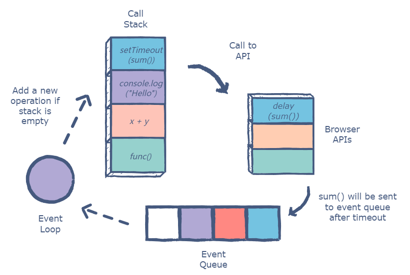

事件循环描述的是宿主环境如何调度 JavaScript 代码、回调、微任务、I/O 和渲染。JavaScript 语言本身只定义执行上下文、调用栈、Promise Job 等机制；浏览器事件循环由 HTML Standard 描述，Node.js 事件循环由 Node 运行时和 libuv 共同实现。

这篇笔记按三层模型区分：

- ECMAScript 层：执行上下文栈、Job、Promise Job、agent。语言规范不定义浏览器任务队列，也不使用“同步任务 / 异步任务”这组分类。
- 浏览器层：HTML Standard 定义 event loop、task、task queue、task source、microtask queue 和 rendering opportunity。浏览器里的“宏任务”通常是 task 的教学称呼。
- Node.js 层：Node 事件循环围绕 libuv 阶段运行，包括 `timers`、`poll`、`check` 等阶段，同时还有 `process.nextTick()` 队列和 V8 微任务队列。Node 不使用浏览器的 task source 模型。

“一个宏任务队列 + 一个微任务队列”只适合作为入门简化图。更精确的边界：

- 浏览器可以有多个任务队列，队列来自不同 task source。浏览器可以按策略选择队列，例如提高用户输入事件的优先级。
- 微任务队列不是任务队列。每次执行完一个任务后，浏览器会执行一次 microtask checkpoint，把当前可执行的微任务清空。
- Node 的“取任务”不是从 HTML task queue 中选择，而是按 libuv 阶段推进，在不同阶段执行对应回调。
- 渲染是浏览器事件循环的一部分，不属于 Node 事件循环。

## 术语边界

### 同步代码与任务

规范里没有“同步任务”这个正式类别。同步代码是当前 execution context 或当前 task/job 内部正在执行的普通语句。

```js
console.log('A')

setTimeout(() => {
  console.log('B')
}, 0)

Promise.resolve().then(() => {
  console.log('C')
})

console.log('D')
```

上面代码里，初始 script 作为一个浏览器 task 执行。`console.log('A')` 和 `console.log('D')` 不是两个“同步任务”，只是这个 task 内部的同步语句。`setTimeout` 回调会在之后成为另一个 task；`then` 回调对应 Promise Job，在浏览器里通常作为 microtask 执行。

### 异步不等于其他线程

异步描述的是“结果或回调不在当前调用栈继续执行，而是在之后被调度回来”。它不等于“委托给其他线程”。

- `Promise.then()`：创建 Promise Job，不代表启动新线程。
- `queueMicrotask()`：把回调放入 microtask queue，不代表启动新线程。
- `setTimeout()`：由宿主环境维护 timer，到期后排队执行回调，不是每个 timer 一个线程。
- DOM 事件：监听器记录在 `EventTarget` 上，事件发生后派发，不是注册后常驻一个线程等待。
- 网络 I/O：浏览器或 Node 可能交给网络进程、系统内核、I/O 线程或线程池，属于宿主实现细节。
- Web Worker / Node Worker Threads：明确创建另一个 JavaScript 执行线程或 agent。

### Event Table

`Event Table` 不是 HTML、ECMAScript 或 Node 规范术语。它是一些教程用来解释“宿主环境暂存异步注册信息”的教学图示。

更贴近规范的说法：

- `addEventListener()` 把监听器记录到 `EventTarget` 的事件监听器列表。
- `setTimeout()` 初始化 timer，到期后 queue a task。
- Promise 通过 `HostEnqueuePromiseJob` 把 Promise Job 交给宿主调度。
- 网络请求完成后，相关规范按自己的流程 queue a task、resolve promise 或触发事件。

## 浏览器事件循环

浏览器主线程同一时间只能执行一段 JavaScript。同步代码进入调用栈执行；异步 API 由浏览器宿主环境处理，完成后把回调调度回事件循环。

一次简化的浏览器循环：

1. 从某个任务队列中选择一个可执行任务。
2. 执行这个任务中的 JavaScript，直到调用栈清空。
3. 执行 microtask checkpoint：不断取出最早入队的微任务并执行，直到微任务队列为空。
4. 如果到了渲染时机，执行 `requestAnimationFrame` 回调、样式计算、布局、绘制等渲染相关步骤。
5. 进入下一轮循环。



### 浏览器常见任务

这些回调通常作为任务调度：

- 初始 script 执行。
- `setTimeout()`、`setInterval()`。
- 用户交互事件，例如 `click`、`input`。
- 网络、文件、消息等宿主 API 的回调。
- `MessageChannel`、`postMessage` 相关回调。

任务之间没有一个跨来源的全局 FIFO 保证。来自同一任务源的任务通常按入队顺序处理，但浏览器可以在不同任务源之间做选择。

`setTimeout(fn, 0)` 也不是“立刻执行”。它表示 timer 到达最小延迟阈值后，回调才有资格作为任务运行。主线程正在执行同步代码、微任务链很长、浏览器对后台页面限流，都会让它更晚执行。

### 浏览器如何选择任务队列

浏览器事件循环不是从一个全局“宏任务队列”里取任务。更接近下面的模型：

```js
while (eventLoop.alive) {
  const taskQueue = chooseOneTaskQueue(eventLoop.taskQueues)

  if (taskQueue) {
    const task = taskQueue.firstRunnableTask()
    taskQueue.remove(task)

    run(task)
    performMicrotaskCheckpoint()
  }

  if (hasRenderingOpportunity()) {
    updateRendering()
  }
}
```

`chooseOneTaskQueue()` 由浏览器调度策略决定。规范不要求所有任务来源共享一个全局 FIFO 顺序：

```js
function chooseOneTaskQueue(taskQueues) {
  const runnableQueues = taskQueues.filter((queue) => {
    return queue.hasRunnableTask()
  })

  return browserSchedulingPolicy(runnableQueues)
}
```

例如浏览器为了保持输入响应，可以优先选择用户交互队列：

```js
function browserSchedulingPolicy(queues) {
  if (queues.userInteraction.hasRunnableTask() && shouldKeepInputResponsive()) {
    return queues.userInteraction
  }

  if (queues.timer.hasRunnableTask()) {
    return queues.timer
  }

  if (queues.networking.hasRunnableTask()) {
    return queues.networking
  }

  return queues.firstNonEmptyQueue()
}
```

微任务不参与 `chooseOneTaskQueue()`。普通任务执行完后，事件循环进入 microtask checkpoint，把微任务队列清空：

```js
function performMicrotaskCheckpoint() {
  while (microtaskQueue.length > 0) {
    const microtask = microtaskQueue.shift()
    run(microtask)
  }
}
```

因此执行结构更像：

```txt
run one task
clear all microtasks
maybe render
run next task
clear all microtasks
maybe render
```

### 常见微任务

这些回调通常作为微任务调度：

- `Promise.prototype.then()`、`catch()`、`finally()`。
- `queueMicrotask()`。
- `MutationObserver`。
- `async/await` 中 `await` 之后的继续执行。

微任务有两个重要特征：

- 当前任务结束后、浏览器尝试渲染前，会清空微任务队列。
- 微任务执行过程中继续入队的微任务，会在同一次 checkpoint 内继续执行。

这意味着递归创建微任务可能让页面长时间无法处理输入、timer 和渲染：

```js
function loop() {
  queueMicrotask(loop)
}

loop()
```

上面的代码不会让出主线程。长任务拆片要回到任务队列，例如 `setTimeout()`、`MessageChannel`，或框架/平台提供的调度器。

### 渲染与微任务

DOM 修改发生在 JavaScript 执行期间，但布局和绘制通常要等到当前任务及其后续微任务结束后才有机会发生。

```js
button.onclick = () => {
  box.textContent = 'loading'

  Promise.resolve().then(() => {
    heavyWork()
  })
}
```

如果 `heavyWork()` 很慢，用户可能看不到 `loading`，因为微任务会在渲染机会之前执行。让浏览器先绘制的做法，是把耗时工作放到后续任务，或使用更适合动画帧/空闲期的调度方式。

`requestAnimationFrame()` 不是微任务，也不是普通 timer。它的回调在一次渲染更新中执行，适合读取/写入下一帧相关的动画状态。`requestIdleCallback()` 则依赖浏览器判断是否有空闲时间，不适合承载必须立即执行的业务逻辑。

## `async/await` 的调度

`async` 函数在遇到第一个 `await` 之前都是同步执行。`await` 会把后续代码放到 Promise 相关的微任务中继续执行，即使等待的是一个非 Promise 值，也会产生异步边界。

```js
async function run() {
  console.log('A')
  await 1
  console.log('B')
}

console.log('C')
run()
console.log('D')
```

输出：

```txt
C
A
D
B
```

`await` 后面的 `B` 等当前同步代码结束后，作为微任务继续执行。

## Node.js 事件循环

Node.js 的事件循环服务于非阻塞 I/O。JavaScript 默认仍在单个主线程执行；文件 I/O、DNS、部分加密压缩任务可能使用 libuv 线程池，网络 I/O 通常由操作系统内核能力驱动。异步操作完成后，Node 把对应回调放入事件循环的某个阶段。

Node 文档中常用的阶段模型是：

1. `timers`：执行 `setTimeout()`、`setInterval()` 到期回调。
2. `pending callbacks`：执行部分延迟到下一轮的系统 I/O 回调。
3. `idle, prepare`：Node 内部使用。
4. `poll`：获取新的 I/O 事件，执行 I/O 回调；必要时在这里阻塞等待。
5. `check`：执行 `setImmediate()` 回调。
6. `close callbacks`：执行部分 close 回调，例如 socket 的 `'close'`。

### Node 阶段如何取回调

Node 不是在多个 HTML task queue 之间选择一个队列。libuv 的模型是阶段推进，每个阶段有自己的回调队列。进入某个阶段后，执行该阶段队列中的回调，直到队列耗尽或达到实现限制。

简化模型：

```js
while (nodeIsAlive) {
  const phase = advanceToNextLibuvPhase()

  if (phase.isInternal) {
    runInternalPhase(phase)
  } else {
    runPhase(phase)
  }
}

function runPhase(phase) {
  while (phase.queue.hasCallback() && !phaseLimitReached(phase)) {
    const callback = phase.queue.shift()

    callback()
    drainProcessNextTickQueue()
    drainV8MicrotaskQueue()
  }
}
```

这段伪代码只表达 Node 的阶段队列模型：回调来自不同阶段，而不是来自浏览器的 task source。`process.nextTick()` 和 V8 微任务队列也不属于 libuv 阶段，它们在 JavaScript 回调边界被处理。

Node 20 起使用 libuv 1.45.0 之后的行为：timer 只在 poll 阶段之后运行，而不是像旧版本那样在 poll 前后都可能运行。这个变化会影响某些场景下 `setTimeout()` 与 `setImmediate()` 的相对时机。跨版本判断题必须标注 Node 版本。

### timer 不是精确时间

`setTimeout(callback, delay)` 的 `delay` 是阈值，不是精确执行时间。到达阈值后，回调还要等当前阶段、当前回调、`process.nextTick()` 队列和微任务处理完成。

```js
const started = Date.now()

setTimeout(() => {
  console.log(Date.now() - started)
}, 10)

while (Date.now() - started < 100) {
  // blocking
}
```

输出通常大于等于 `100`，不会接近 `10`。主线程被同步代码阻塞时，事件循环无法进入 timer 回调。

### `setTimeout()` 与 `setImmediate()`

`setImmediate()` 在 `check` 阶段执行，设计目标是在当前 poll 阶段完成后运行。`setTimeout(fn, 0)` 在 timer 阈值到达后进入 timers 阶段。

在主模块顶层同时调度二者，顺序不应作为稳定行为依赖：

```js
setTimeout(() => {
  console.log('timeout')
}, 0)

setImmediate(() => {
  console.log('immediate')
})
```

在 I/O 回调内部同时调度时，`setImmediate()` 会先于 `setTimeout()`：

```js
const fs = require('node:fs')

fs.readFile(__filename, () => {
  setTimeout(() => {
    console.log('timeout')
  }, 0)

  setImmediate(() => {
    console.log('immediate')
  })
})
```

输出：

```txt
immediate
timeout
```

原因是代码已经处在 I/O 相关的 poll 阶段中，poll 完成后先进入 check 阶段执行 `setImmediate()`，之后再进入 timers。

### `process.nextTick()` 与微任务

Node 里有两个容易混淆的队列：

- `process.nextTick()` 队列：由 Node 管理，不属于 libuv 事件循环阶段。
- V8 微任务队列：执行 Promise reaction、`queueMicrotask()`、`await` continuation。

在 CommonJS 的普通执行上下文中，当前 JavaScript 操作完成后，Node 会先清空 `process.nextTick()` 队列，再清空 V8 微任务队列。

```js
console.log('start')

process.nextTick(() => console.log('nextTick'))
Promise.resolve().then(() => console.log('promise'))
queueMicrotask(() => console.log('microtask'))

console.log('end')
```

CommonJS 输出：

```txt
start
end
nextTick
promise
microtask
```

递归使用 `process.nextTick()` 会阻止事件循环继续进入 poll 阶段，从而饿死 I/O：

```js
function loop() {
  process.nextTick(loop)
}

loop()
```

普通业务代码优先使用 `queueMicrotask()` 或 Promise。`process.nextTick()` 更适合 Node 内部风格的 API 一致性：让回调在当前调用栈展开后、事件循环继续前执行。

ESM 里有一个额外差异：模块顶层执行本身已经处在微任务上下文中。因此在 ESM 顶层，`Promise.then()` 和 `queueMicrotask()` 可能先于 `process.nextTick()` 执行。

```js
// node example.mjs
import { nextTick } from 'node:process'

Promise.resolve().then(() => console.log('promise'))
queueMicrotask(() => console.log('microtask'))
nextTick(() => console.log('nextTick'))
```

ESM 输出：

```txt
promise
microtask
nextTick
```

## 经典顺序题

### Promise 链与 `queueMicrotask`

```js
console.log('script start')

setTimeout(() => console.log('setTimeout'), 0)

Promise.resolve()
  .then(() => console.log('promise1'))
  .then(() => console.log('promise2'))

queueMicrotask(() => console.log('queueMicrotask'))

console.log('script end')
```

输出：

```txt
script start
script end
promise1
queueMicrotask
promise2
setTimeout
```

同步代码先执行。第一个 `then` 和 `queueMicrotask` 都进入微任务队列，按入队顺序执行。`promise2` 是第一个 `then` 执行完成后才入队，所以排在 `queueMicrotask` 后面。

### `async/await` 与 Promise

```js
async function async1() {
  console.log('async1 start')
  await async2()
  console.log('async1 end')
}

async function async2() {
  console.log('async2')
}

console.log('script start')

setTimeout(() => console.log('timeout'), 0)

async1()

new Promise((resolve) => {
  console.log('promise1')
  resolve()
}).then(() => console.log('promise2'))

console.log('script end')
```

输出：

```txt
script start
async1 start
async2
promise1
script end
async1 end
promise2
timeout
```

`async1()` 在 `await` 前同步执行，`async2()` 也同步打印。`await async2()` 的后续代码先入微任务队列，随后才创建 `promise2` 对应的微任务，所以 `async1 end` 先于 `promise2`。

### 微任务嵌套

```js
console.log('A')

setTimeout(() => console.log('B'), 0)

Promise.resolve().then(() => {
  console.log('C')
  queueMicrotask(() => console.log('D'))
})

queueMicrotask(() => {
  console.log('E')
  Promise.resolve().then(() => console.log('F'))
})

console.log('G')
```

输出：

```txt
A
G
C
E
D
F
B
```

初始微任务队列是 `C`、`E`。执行 `C` 时追加 `D`；执行 `E` 时追加 `F`。同一次 checkpoint 会继续清空新入队的 `D`、`F`，最后才轮到 timer 任务。

### Node CommonJS 顺序

```js
console.log('start')

process.nextTick(() => console.log('nextTick'))
Promise.resolve().then(() => console.log('promise'))
queueMicrotask(() => console.log('microtask'))
setImmediate(() => console.log('immediate'))
setTimeout(() => console.log('timeout'), 0)

console.log('end')
```

稳定部分：

```txt
start
end
nextTick
promise
microtask
```

`immediate` 与 `timeout` 在主模块顶层没有稳定顺序。Node 20+ 中常见输出可能是 `immediate` 再 `timeout`，但官方文档仍要求不依赖主模块顶层二者的相对顺序。

## 顺序推导

事件循环输出题的拆解顺序：

1. 先执行所有同步代码，记录同步输出。
2. 同步执行过程中，标出哪些回调进入任务队列，哪些进入微任务队列。
3. 当前调用栈清空后，清空微任务队列。微任务里新创建的微任务追加到队尾，并在同一次 checkpoint 内继续执行。
4. 浏览器环境中，微任务结束后才可能进入渲染；是否真的渲染由浏览器决定。
5. Node CommonJS 或普通回调中，先处理 `process.nextTick()`，再处理 V8 微任务；然后再看当前所处 libuv 阶段。ESM 顶层要单独判断。
6. 遇到 `setTimeout()` 与 `setImmediate()`，先判断是否在 I/O 回调内，再判断 Node 版本；主模块顶层顺序不写死。

## 实践判断

- “当前同步代码之后、渲染之前”的少量逻辑，可以用 `queueMicrotask()`。
- 让出主线程、允许输入/timer/渲染推进，使用后续任务或专门调度器，避免微任务递归。
- 浏览器动画优先使用 `requestAnimationFrame()`，不使用 `setTimeout()` 模拟帧循环。
- Node 业务代码里谨慎使用 `process.nextTick()`；除非明确要求在事件循环继续前执行，否则优先使用 `queueMicrotask()`、Promise 或 `setImmediate()`。
- 事件循环无法解决 CPU 密集型同步阻塞。浏览器用 Web Worker，Node 用 Worker Threads、子进程或把任务拆片。

## 参考

- [HTML Standard: Event loops](https://html.spec.whatwg.org/multipage/webappapis.html#event-loops)
- [ECMA-262: Jobs and Job Queues](https://tc39.es/ecma262/#sec-jobs-and-job-queues)
- [Node.js: The Node.js Event Loop](https://nodejs.org/learn/asynchronous-work/event-loop-timers-and-nexttick)
- [Node.js: When to use queueMicrotask() vs. process.nextTick()](https://nodejs.org/api/process.html#when-to-use-queuemicrotask-vs-processnexttick)
- [libuv: Design overview](https://docs.libuv.org/en/v1.x/design.html#the-i-o-loop)
