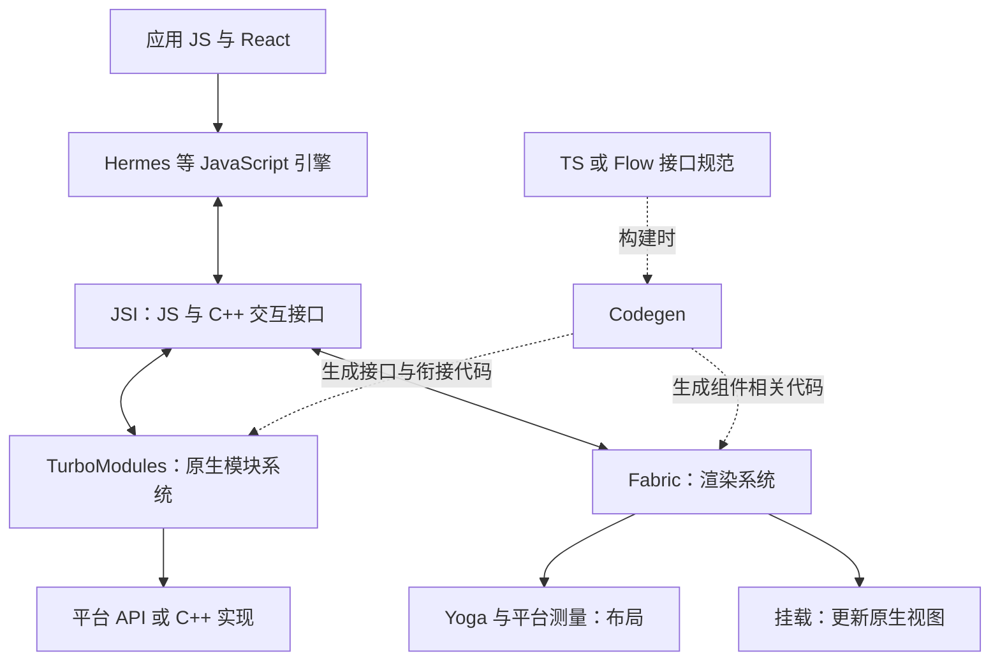

# 整体架构与线程模型

React Native 用 JavaScript 描述业务与 React 组件，由渲染系统把界面更新落实为 Android、iOS 的原生视图操作。设备、存储等能力则通过原生模块提供。

## 从一次点击到文字变化

```tsx
import { useState } from 'react';
import { Pressable, Text } from 'react-native';

export function Counter() {
  const [count, setCount] = useState(0);
  return (
    <Pressable onPress={() => setCount(value => value + 1)}>
      <Text>{count}</Text>
    </Pressable>
  );
}
```

这次更新依次涉及：

1. 原生视图接收触摸，事件系统把按压交给 JS 处理函数。
2. `setCount` 请求状态更新，React 计算受影响组件的新输出。
3. 渲染器更新界面节点并处理布局，确定需要修改哪些原生视图。
4. UI 线程将变更应用到视图，平台完成后续绘制与合成。

组件函数执行完毕不等于像素已经显示；React 也可能合并或调度多次状态更新。

## 原生模块与界面更新

读取设备信息、保存数据属于模块调用；显示 `View`、`Text` 属于界面渲染。一个相机库可能同时包含设备控制接口和预览视图，两条路径各自承担不同职责。

旧架构主要依赖批量异步 [Bridge](./legacy-bridge.md) 组织 JS 与原生交互。新架构使用 JSI 作为交互基础，由 TurboModules 组织原生模块，Fabric 负责渲染系统。

## 新架构组件的关系

JS 由 Hermes 等引擎执行。JSI 是 C++ 操作 JS 运行时、值、对象和函数的接口，TurboModules 与 Fabric 利用它连接 JS 和原生实现。Codegen 在构建时生成模块与组件的接口代码。



这张图表示职责与依赖，节点不是一组依次经过的线程或消息队列。

| 部分 | 职责 |
| --- | --- |
| [Hermes](./hermes.md) | 执行 JS，提供字节码、对象管理与垃圾回收能力 |
| [JSI](./jsi.md) | 提供 JS 引擎与 C++ 的交互接口 |
| [TurboModules](./turbo-modules-codegen.md) | 管理原生模块的接口、查找、加载与调用 |
| [Fabric 与 Yoga](./fabric-yoga.md) | 处理界面树、布局、提交与原生视图挂载 |
| [Codegen](./turbo-modules-codegen.md) | 根据类型规范生成接口和衔接代码 |

Hermes 实现引擎能力，JSI 抽象交互接口，两者不是替代关系；使用 Hermes 本身也不意味着应用已采用 Fabric。

## 线程分工

**JS 线程**主要执行应用 JS、React 组件计算及事件处理。**UI 线程**是平台主线程，实际修改原生视图必须遵守它的线程要求。原生模块还可以使用自己的后台队列。

组件计算、布局与挂载是工作阶段，并不各自对应一条固定线程。Fabric 使用不可变节点与结构共享来协调不同线程和优先级的工作：常见渲染路径由 JS 线程开始，高优先级场景可采用同步路径，最终视图挂载仍受 UI 线程约束。

旧项目中常见的“JS、Shadow、UI 三线程图”描述特定历史实现，不能作为所有平台和版本的固定线程清单。Fabric 的阶段划分见[渲染流水线](./fabric-yoga.md)。

## 调度与阻塞

跨语言调用和切换线程是两件事。JSI 同步调用中的慢操作会继续占用调用路径；`async` 和 Promise 也不会自动把同步计算放到后台。

原生滚动仍流畅、点击后的业务反馈却延迟时，需要检查 JS 工作；原生动画和滚动都掉帧时，再检查 UI、布局、绘制和资源处理。具体取证方法见[性能分析与调试工具](./performance-tools.md)。

## 打包与架构版本

Metro 解析和打包 JS，原生构建系统将 JS 产物、平台代码、资源与配置组合成应用。Expo 提供项目、模块和构建工作流，见[Expo 应用开发工作流](../expo/README.md)。

RN 0.76 默认启用新架构，0.82 起只运行新架构。兼容层可支持部分旧模块，但不代表应用仍运行旧 Bridge。旧架构资料用于理解历史实现和迁移约束。

## 参考资料

- [核心组件与原生组件](https://reactnative.dev/docs/intro-react-native-components)
- [新架构发布说明](https://reactnative.dev/blog/2024/10/23/the-new-architecture-is-here)
- [架构术语](https://reactnative.dev/architecture/glossary)
- [线程模型](https://reactnative.dev/architecture/threading-model)
- [渲染流水线](https://reactnative.dev/architecture/render-pipeline)
- [React Native 0.82](https://reactnative.dev/blog/2025/10/08/react-native-0.82)
