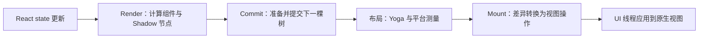

# Fabric 与 Yoga：渲染、布局、提交与挂载

Fabric 是 React Native 新架构的渲染系统，负责把 React 的界面更新转换为平台视图更新。Yoga 是布局引擎，计算节点尺寸和位置，不负责执行 React 组件，也不负责把像素绘制到屏幕。

## 同一界面的三种表示

组件返回的 JSX 描述 React 元素。渲染器为需要落到宿主界面的组件维护 C++ Shadow 节点，其中保存属性、布局等信息。最终 Android / iOS 中真正显示和交互的是宿主视图。

例如一个自定义 `TaskRow` 返回 `View` 和 `Text`，不意味着平台上还会多出一个名为 `TaskRow` 的原生视图。

## 从更新到显示

图中的布局是提交过程相关的工作，单独画出便于理解其职责，不代表它总在一个固定独立线程执行。

**Render** 阶段，React 计算受影响组件，渲染器创建或克隆相应 Shadow 节点。通过 JSI，JS 中的 React 工作可以与 C++ 渲染核心交互。

**Commit** 阶段，将完成的树作为待挂载版本，并进行所需的布局处理。Yoga 依据样式和父子约束计算布局；文本等节点可能需要调用平台测量能力。

**Mount** 阶段，比较已挂载与下一版本的树，生成创建、更新、移动、删除等视图操作。实际操作原生视图在 UI 线程执行，平台继续完成绘制与合成。

## 不可变树与结构共享

Fabric 的 Shadow Tree 使用不可变数据结构。更新时克隆受影响节点，未变部分可以共享，而不是就地修改所有已有节点。这样可以协调不同优先级和线程上的渲染工作。

这不是“每次 setState 都深拷贝整棵树”，也不是“并发渲染让所有组件在多个 JS 线程同时运行”。执行位置见[线程模型](./architecture-overview.md#线程分工)。

## 视图扁平化

仅用于布局、没有需要独立原生视图承载行为的部分节点，可能在挂载处理中被合并或消除，减少宿主视图数量。是否能扁平化受样式、事件、无障碍、引用等需求影响，不能只数 JSX 标签来推断原生视图数量。

视图数量减少通常能降低挂载与平台 UI 工作，但文本测量、图片处理和绘制成本仍需分别观察。连续动画若每帧都触发整页 React 更新，还会重复经过组件计算与渲染管线。

## 与旧渲染系统的差异

Fabric 将更多渲染核心放在跨平台 C++ 中，配合类型化组件接口和 JSI，支持更紧密的 React 调度、同步测量与高优先级更新路径。它改变的是界面更新管线，不会替代所有原生模块，也不会自动解决复杂视图带来的绘制成本。

## 参考资料

- [Fabric](https://reactnative.dev/architecture/fabric-renderer)
- [Render, Commit, Mount](https://reactnative.dev/architecture/render-pipeline)
- [视图扁平化](https://reactnative.dev/architecture/view-flattening)
- [Yoga](https://www.yogalayout.dev/docs/about-yoga)
