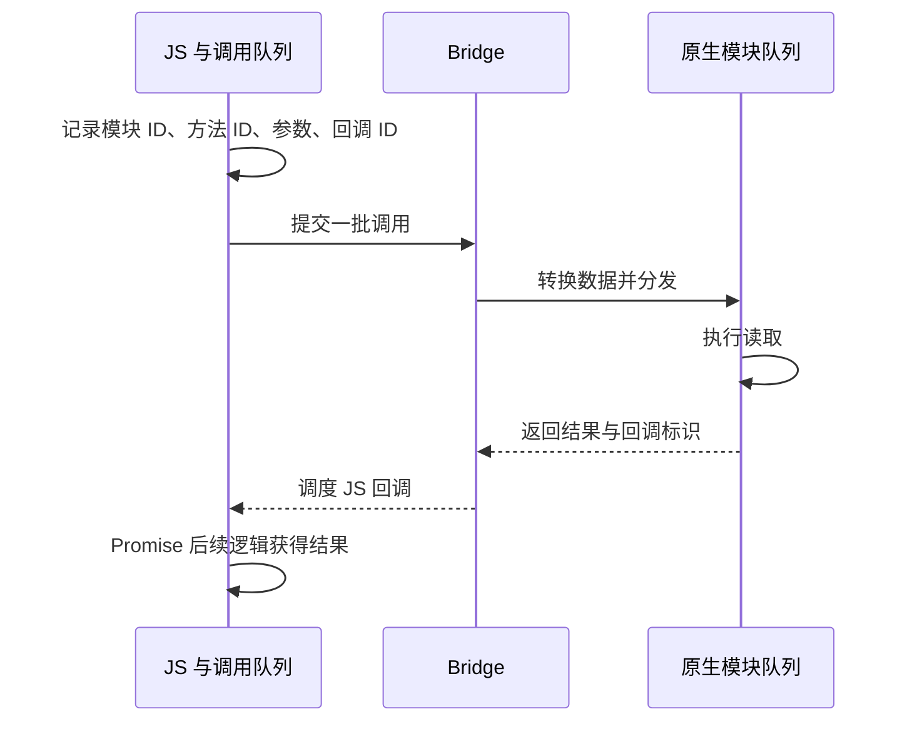

# 旧架构：Bridge 的工作方式与局限

旧架构的 Bridge 把 JavaScript 与原生侧连接为消息调用系统。JS 通常先描述要调用的模块、方法和参数，再由原生侧分发执行，结果通过回调或事件回到 JS。

本文讨论传统 Batched Bridge。React Native 0.82 起只运行新架构，这一模型用于理解旧项目与架构演进。

## 一次原生模块调用

假设 JS 请求读取一项设置，模块暴露 Promise 接口：

批处理可以摊薄跨边界调用开销，但也会引入等待批次提交和对方队列执行的时间。原生模块执行完成后，结果仍可能等待 JS 线程空闲。

## 消息组织和序列化

以 0.76 的 `MessageQueue` 源码为例，队列维护模块 ID、方法 ID 和参数等数组，通过 `enqueueNativeCall` 加入调用，再交给原生入口刷新队列。

传统 Bridge 要求参数能转换成受支持的数据表示，涉及封装、类型转换和可能的复制。常见解释将其概括为“JSON 序列化”，但不能据此断言每个平台、每个本地调用都执行一次 `JSON.stringify` 并传递 JSON 文本。源码中的调试输出也不能当成实际传输格式的证据。

## 性能瓶颈

**高频交互**会生成密集消息，排队后使事件与反馈之间的延迟增加。**大数据传输**会增加转换、复制和内存压力，例如反复把图像数据搬到 JS。**同步依赖**则难以用多轮异步往返满足，例如需要在同一帧读取布局再调整界面。

Bridge 并非所有卡顿的来源：JS 本身的长任务、原生模块的慢操作、复杂布局都会阻塞各自路径。旧架构也存在受限制的同步原生方法等例外，不能把“所有调用绝对异步”当作完整 API 事实。

## 新架构对应的变化

[JSI](./jsi.md)提供更直接的 JS / C++ 交互基础，[TurboModules](./turbo-modules-codegen.md)组织模块接口与加载，[Fabric](./fabric-yoga.md)重构渲染系统。它们共同改变调用与渲染路径，不能把整个新架构简化为“换了一个更快的队列”。

## 参考资料

- [MessageQueue 源码（0.76）](https://github.com/facebook/react-native/blob/v0.76.0/packages/react-native/Libraries/BatchedBridge/MessageQueue.js)
- [新架构发布说明](https://reactnative.dev/blog/2024/10/23/the-new-architecture-is-here)
- [0.82 的架构范围](https://reactnative.dev/blog/2025/10/08/react-native-0.82)
