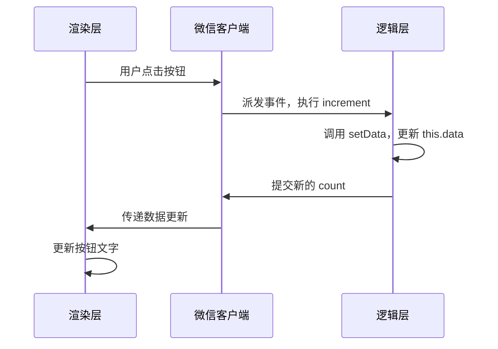

微信客户端为小程序提供运行环境，这个环境称为**宿主环境**。小程序的脚本执行、页面展示，以及网络、存储等能力，都需要宿主环境的支持。

## 逻辑层与渲染层

普通网页中，JavaScript 执行和布局等渲染工作通常占用同一个主线程。脚本长时间运行时，会推迟界面更新和事件处理。小程序将业务脚本执行与页面渲染分开，分别交给逻辑层和渲染层。

**逻辑层（AppService）** 在独立的 JavaScript 运行时中执行应用和页面脚本，负责业务计算、数据处理、生命周期和事件回调。它不运行在页面的浏览器环境中，因此不能通过 `window`、`document` 等浏览器 API 操作界面。

**渲染层（也称视图层，View）**根据 WXML 模板、WXSS 样式和页面数据生成界面，并接收用户输入。这里的页面由 WebView 渲染；WebView 是微信客户端内嵌的网页渲染组件。渲染层也会执行框架代码，处理逻辑层传来的数据更新。

逻辑层与渲染层分别由不同线程承担工作，这种分工称为**双线程模型**。一个小程序可以有多个页面及对应的 WebView 执行环境，所以“双线程”描述的是主要分工，而不是整个进程只有两个线程。

## 两层通过微信客户端通信

逻辑层与渲染层处于不同的执行环境，不能直接共享普通 JavaScript 对象。两层之间的事件和数据由微信客户端中转：

- 用户在界面上操作后，渲染层把事件传给逻辑层，由页面或组件的处理函数响应。
- 逻辑层处理数据后，通过 `setData` 提交变化，渲染层据此更新界面。

文档中的 Native 指微信客户端的原生实现。除了中转两层通信，它还承接 `wx.request` 等平台 API 的调用。

以点击按钮使计数加一为例，页面模板如下：

```xml
<button bindtap="increment">{{count}}</button>
```

对应的页面脚本：

```js
Page({
  data: { count: 0 },
  increment() {
    this.setData({ count: this.data.count + 1 })
  }
})
```

`increment` 在逻辑层执行，按钮文字由渲染层更新。中间的事件传递和数据同步由框架与微信客户端完成：



`setData` 会同步修改逻辑层中的 `this.data`，界面更新则需要等待数据传输和渲染层处理。修改逻辑层数据与完成界面渲染是两个不同的时刻。

## 分离执行带来的影响

业务脚本与页面渲染分开后，不再全部竞争同一条主线程的执行时间。但两层仍需要协作：逻辑层长时间繁忙，会延迟点击事件的处理；数据更新过于频繁或单次数据量过大，会增加通信与渲染工作。

因此，双线程模型不能消除所有卡顿。具体的更新过程和性能影响见 [setData 更新机制与性能](./setdata-performance.md)。

## WebView 与 Skyline

上面介绍的是由 AppService 和 WebView 协作的运行模型。微信小程序还提供 Skyline 渲染器，它重新安排了框架执行上下文、渲染线程和通信路径，见 [WebView 与 Skyline](./renderers.md)。

与 React Native 的线程和渲染方式对比，见[运行模型对比](../runtime-models.md)。

## 参考资料

- [小程序简介：与普通网页开发的区别](https://developers.weixin.qq.com/miniprogram/dev/framework/quickstart/)
- [小程序宿主环境](https://developers.weixin.qq.com/miniprogram/dev/framework/quickstart/framework.html)
- [小程序代码构成](https://developers.weixin.qq.com/miniprogram/dev/framework/quickstart/code.html)
- [逻辑层 App Service](https://developers.weixin.qq.com/miniprogram/dev/framework/app-service/)
- [Skyline 简介与架构](https://developers.weixin.qq.com/miniprogram/dev/framework/runtime/skyline/introduction.html)
