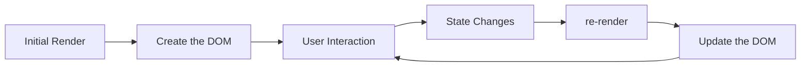

React 组件的状态更新会请求重新渲染；如果新旧状态相同，React 可以跳过这次渲染：



## 基本用法

在组件最顶层调用 `useState` 可以给组件添加状态变量。它返回一个包含两个元素的数组，通常用数组解构接收，例如 `[something, setSomething]`。

- 当前状态。第一次渲染时，它等于传入的初始状态 `initialState`。
- `set` 函数。它为下一次渲染安排状态更新，并请求 React 重新渲染组件。

```js
import { useState } from 'react'

function MyComponent() {
  const [age, setAge] = useState(28)
  const [name, setName] = useState('Taylor')
  const [todos, setTodos] = useState(() => createTodos())
}
```

## useState(initialState)

`initialState` 是初始状态，可以是任意类型的值。初始渲染之后，React 会忽略这个参数。

如果传递一个函数作为 `initialState`，它会被视为初始化函数。React 只会在初始化组件时调用它，并将返回值保存为初始状态。

### 直接传入值

下面的例子没有传递初始化函数，因此 `createInitialTodos()` 会在每次渲染时运行。比如在输入框中输入内容时，组件重新渲染，控制台会反复打印 `render`。

```js
const { useState } = React

function createInitialTodos() {
  const initialTodos = []
  for (let i = 0; i < 10; i++) {
    initialTodos.push({
      id: i,
      text: 'Item ' + (i + 1)
    })
  }
  console.log('render')

  return initialTodos
}

export default function TodoList() {
  const [todos, setTodos] = useState(createInitialTodos())
  const [text, setText] = useState('')

  return (
    <>
      <input value={text} onChange={(e) => setText(e.target.value)} />
      <button
        onClick={() => {
          setText('')
          setTodos([
            {
              id: todos.length,
              text
            },
            ...todos
          ])
        }}
      >
        Add
      </button>
      <ul>
        {todos.map((item) => (
          <li key={item.id}>{item.text}</li>
        ))}
      </ul>
    </>
  )
}
```

### 传入初始化函数

传入初始化函数时，`createInitialTodos` 只会在初始化期间运行。组件因为输入框变化而重新渲染时，它不会再次运行。

```js
const { useState } = React

function createInitialTodos() {
  const initialTodos = []
  for (let i = 0; i < 10; i++) {
    initialTodos.push({
      id: i,
      text: 'Item ' + (i + 1)
    })
  }
  console.log('render')

  return initialTodos
}

export default function TodoList() {
  const [todos, setTodos] = useState(createInitialTodos)
  const [text, setText] = useState('')

  return (
    <>
      <input value={text} onChange={(e) => setText(e.target.value)} />
      <button
        onClick={() => {
          setText('')
          setTodos([
            {
              id: todos.length,
              text
            },
            ...todos
          ])
        }}
      >
        Add
      </button>
      <ul>
        {todos.map((item) => (
          <li key={item.id}>{item.text}</li>
        ))}
      </ul>
    </>
  )
}
```

> [!WARNING]
> - 即使 `createInitialTodos()` 的结果只用于初始渲染，函数调用本身仍会在每次渲染时发生。如果它会创建大数组或执行昂贵计算，应传入初始化函数，而不是传入函数调用结果。
> - `useState` 是 Hook，只能在组件顶层或自定义 Hook 中调用，不能在循环或条件分支中调用。
> - 在 Strict Mode 下，React 会调用两次初始化函数，其中一次结果会被忽略。这个检查只发生在开发环境，用来帮助发现不纯的初始化逻辑。

## setSomething(nextState)

`set` 函数会为下一次渲染安排状态更新。它可以直接接收下一个状态，也可以接收一个更新函数。`set` 函数没有返回值。

> [!NOTE]
> 不要把 `set` 函数理解为 Promise 意义上的异步函数。它不会返回 Promise，也不能通过 `await` 等待状态变量变更；所谓“异步”通常指它不会同步修改当前这次渲染中的状态变量，而是把更新加入 React 的队列。这个设计和 props、state、refs 的一致性以及并发调度有关，参见 React 讨论：[RFClarification: why is `setState` asynchronous?](https://github.com/react/react/issues/11527)

调用 `set` 函数不会同步改变当前这次渲染中的状态变量。下面的 `handleClick1` 点击一次后，年龄会变为 `43`，而不是 `45`：

```js
function handleClick1() {
  setAge(age + 1) // setAge(42 + 1)
  setAge(age + 1) // setAge(42 + 1)
  setAge(age + 1) // setAge(42 + 1)
}
```

每次调用 `setAge(age + 1)` 读取到的都是当前渲染中的 `age`，所以这三次调用都等价于 `setAge(43)`。

如果传递一个函数作为 `nextState`，它会被视为更新函数。更新函数必须是纯函数，接收待处理状态作为唯一参数，并返回下一个状态。

React 会将更新函数放入队列，然后重新渲染组件。在下一次渲染中，React 会按顺序把队列中的更新函数应用到上一个状态，计算出最终状态。

```js
function handleClick2() {
  setAge((a) => a + 1) // setAge(42 => 43)
  setAge((a) => a + 1) // setAge(43 => 44)
  setAge((a) => a + 1) // setAge(44 => 45)
}
```

处理过程如下：

1. `a => a + 1` 接收 `42` 作为待处理状态，并返回 `43`。
2. `a => a + 1` 接收 `43` 作为待处理状态，并返回 `44`。
3. `a => a + 1` 接收 `44` 作为待处理状态，并返回 `45`。

没有其他队列更新，所以 React 会将 `45` 作为当前状态保存。

> [!TIP]
> 按照惯例，通常以状态变量名称的首字母命名待处理状态参数，如年龄的 `a`；也可以使用更清晰的名称，例如 `prevAge`。

## 对象和数组状态

状态可以保存对象和数组，但更新时需要创建新值，而不是直接修改原对象。React 使用 [`Object.is`](https://developer.mozilla.org/zh-CN/docs/Web/JavaScript/Reference/Global_Objects/Object/is) 比较新旧状态；如果原地修改后再传回同一个引用，React 可能会跳过渲染。

```js
// 更新对象
setForm({
  ...form,
  firstName: nextFirstName
})

// 追加数组项
setTodos([
  ...todos,
  {
    id: nextId,
    text: nextText
  }
])

// 替换数组项
setTodos(
  todos.map((todo) =>
    todo.id === changedTodo.id ? changedTodo : todo
  )
)
```

## 注意点

- `set` 函数只更新下一次渲染中的状态变量。如果在调用 `set` 后立即读取状态变量，仍然会得到当前渲染中的旧值。
- 如果新状态与当前状态相同，React 会跳过组件及其子组件的重新渲染，比较方式是 `Object.is`。
- React 会批量处理状态更新。它通常会等到事件处理函数执行完，再统一更新屏幕，避免一次事件触发多次渲染。
- 在少数需要提前访问更新后的 DOM 的场景，可以使用 `flushSync` 强制同步刷新。
- 与初始化函数类似，在 Strict Mode 下，React 会调用更新函数两次，用来验证它是否为纯函数。这个行为只发生在开发环境。

## 参考

- [useState](https://react.dev/reference/react/useState)
- [Adding state to a component](https://react.dev/reference/react/useState#adding-state-to-a-component)
- [Updating state based on the previous state](https://react.dev/reference/react/useState#updating-state-based-on-the-previous-state)
- [Updating objects and arrays in state](https://react.dev/reference/react/useState#updating-objects-and-arrays-in-state)
- [Avoiding recreating the initial state](https://react.dev/reference/react/useState#avoiding-recreating-the-initial-state)
- [Resetting state with a key](https://react.dev/reference/react/useState#resetting-state-with-a-key)
- [Storing information from previous renders](https://react.dev/reference/react/useState#storing-information-from-previous-renders)
