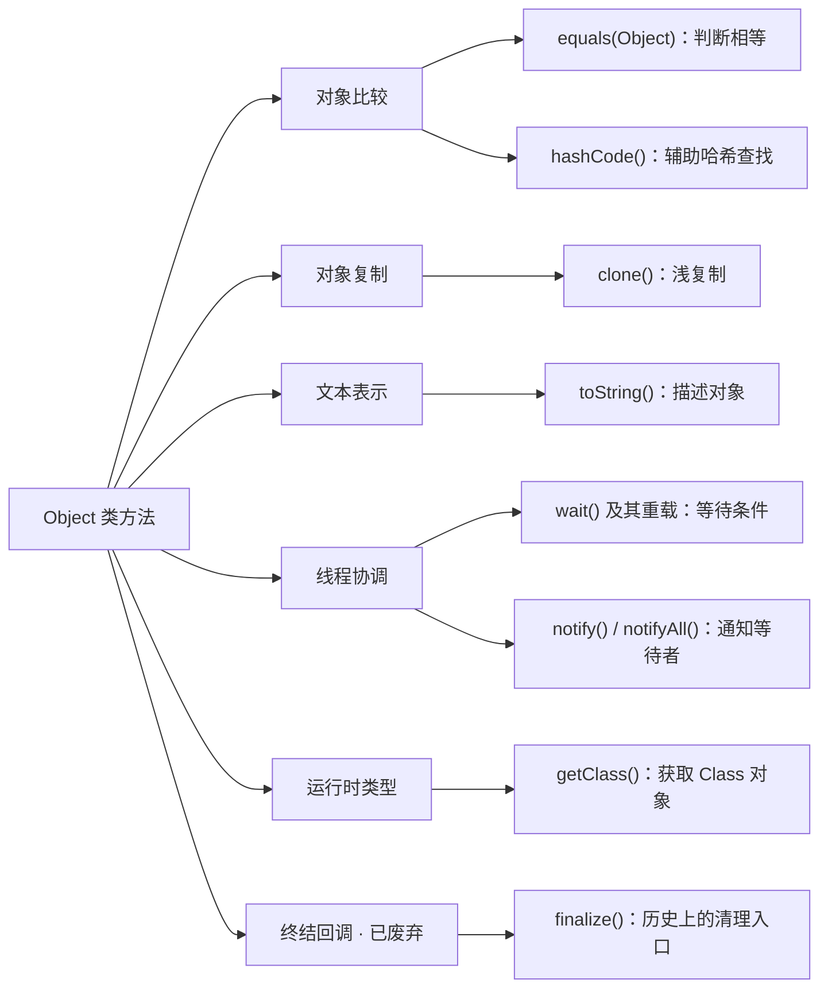

`Object` 是 Java 类层次的根，其他类直接或间接继承它，数组对象也支持它提供的方法。即使一个类没有声明任何方法，它的对象也能进行相等比较、转换为字符串、获取运行时类型。

这些通用方法可以按用途分成六组：比较、复制、文本表示、线程协调、类型信息，以及已经废弃的终结回调。



## 对象比较：equals 与 hashCode

两个分别创建的用户对象，可能代表同一个用户。比较时需要先确定：关注的是不是同一个对象，还是是否代表同一份业务数据。

### 身份相等与逻辑相等

`==` 比较引用时，判断它们是否指向同一个对象，这称为**身份相等**。`equals()` 则允许类定义自己的相等规则，例如用户编号相同就认为相等，这称为**逻辑相等**。

没有重写时，`Object.equals()` 也只比较身份：

```java
class Note {}

Note first = new Note();
Note second = new Note();
System.out.println(first == second);      // false
System.out.println(first.equals(second)); // false
System.out.println(first.equals(first));  // true
```

因此，调用 `equals()` 不代表自动比较字段；按编号、内容或其他数据比较，都需要类提供相应实现。`String` 就重写了这个方法，按字符串内容判断相等。

### 重写 equals 时也要重写 hashCode

`HashSet`、`HashMap` 等哈希容器需要快速找到对象。它们利用 `hashCode()` 返回的整数缩小候选范围，再通过身份或 `equals()` 确认匹配。

**`hashCode()` 决定到哪里找，`equals()` 决定找到的是不是目标。** 两者必须满足：

> `a.equals(b)` 为 `true` ⇒ `a.hashCode() == b.hashCode()`。

反过来不成立。不同对象可能得到相同哈希值，这称为**哈希冲突**，所以不能用哈希值相同代替相等判断。

**重写 `equals()` 定义逻辑相等时，也要配套重写 `hashCode()`。** `Object` 默认的两个方法按对象身份配合工作；只把 `equals()` 改为按用户编号比较，继承的 `Object.hashCode()` 并不会自动改为按编号计算，因此不能保证同编号的两个对象具有相同哈希值。这是方法契约的要求，编译器不会强制两个方法一起重写。

下面的 `User` 以 `id` 为相等依据，姓名只用于展示。类声明为 `final`，避免子类引入不兼容的相等规则：

```java
public final class User {
    private final long id;
    private final String name;

    public User(long id, String name) {
        this.id = id;
        this.name = name;
    }

    @Override
    public boolean equals(Object other) {
        if (this == other) {
            return true;
        }
        if (!(other instanceof User user)) {
            return false;
        }
        return id == user.id;
    }

    @Override
    public int hashCode() {
        return Long.hashCode(id);
    }

    @Override
    public String toString() {
        return "User[id=" + id + ", name=" + name + "]";
    }
}
```

两个方法都依据 `id`，所以即使姓名不同，同编号的对象仍然相等，也能在哈希集合中匹配：

```java
import java.util.HashSet;
import java.util.Set;

User first = new User(1L, "Alice");
User second = new User(1L, "Alicia");

System.out.println(first == second);      // false
System.out.println(first.equals(second)); // true

Set<User> users = new HashSet<>();
users.add(first);
System.out.println(users.contains(second)); // true
System.out.println(users.add(second));      // false：已有相等元素
System.out.println(users.size());           // 1
```

如果删掉 `User` 中的 `hashCode()` 实现，保留 `equals()`，再运行下面的代码，就能观察两套规则不一致的问题：

```java
User first = new User(1L, "Alice");
User second = new User(1L, "Alicia");
Set<User> users = new HashSet<>();
users.add(first);

System.out.println(first.equals(second));                  // true
System.out.println(first.hashCode() == second.hashCode()); // 可能为 false
System.out.println(users.contains(second));                // 可能为 false
System.out.println(users.add(second));                     // 可能为 true
System.out.println(users.size());                          // 可能为 2
```

当这两个对象的默认哈希值不同时，`contains(second)` 找不到已存入的 `first`，`add(second)` 还会把逻辑相等的对象再次加入集合。`HashMap` 也可能出现用相等的键取不到值、同一逻辑键存出两条记录的情况。默认哈希值允许碰撞，所以这些失败结果不是每次运行都必然出现；偶然查找成功也不代表实现符合契约。

修复时让两个方法使用一致的相等依据：上例恢复 `return Long.hashCode(id)` 即可。不能在 `equals()` 中只比较 `id`，却在 `hashCode()` 中额外混入 `name`，否则同编号、不同姓名的对象仍可能违反约束。

### 相等规则的约束

`equals()` 定义的是一种等价关系。对非 `null` 引用，它需要满足：

| 约束 | 含义 |
| --- | --- |
| 自反性 | `x.equals(x)` 为 `true` |
| 对称性 | `x.equals(y)` 与 `y.equals(x)` 结果一致 |
| 传递性 | `x` 等于 `y` 且 `y` 等于 `z`，则 `x` 等于 `z` |
| 一致性 | 参与比较的状态不变，多次比较结果不变 |
| 与 `null` 比较 | `x.equals(null)` 为 `false` |

同一次程序执行中，参与相等判断的状态不变，`hashCode()` 也必须保持不变。

对象作为 `HashSet` 元素或 `HashMap` 的键时，不应修改参与相等判断的字段。若修改导致哈希值变化，后续查找可能转向另一处位置，找不到已经存入的对象。上例把 `id` 声明为 `final`，使相等依据在对象存入集合后保持稳定。

## 对象复制：clone

赋值只复制引用。需要新建一个对象并保留原有字段值时，可以使用复制操作。`Object.clone()` 提供的是**浅复制**：创建新对象，复制各字段的值；引用字段仍指向原来的对象。

使用这套机制时，类需要实现 `Cloneable` 标记接口。它不声明方法，只表示允许 `Object.clone()` 执行复制；没有这个标记会抛出 `CloneNotSupportedException`。`Object.clone()` 本身是 `protected`，下面通过重写把它公开：

```java
class Snapshot implements Cloneable {
    int[] values;

    Snapshot(int[] values) {
        this.values = values;
    }

    @Override
    public Snapshot clone() {
        try {
            return (Snapshot) super.clone();
        } catch (CloneNotSupportedException e) {
            throw new AssertionError(e);
        }
    }
}

Snapshot original = new Snapshot(new int[] {1, 2});
Snapshot copy = original.clone();

System.out.println(original == copy);               // false：两个 Snapshot
System.out.println(original.values == copy.values); // true：同一个数组
copy.values[0] = 9;
System.out.println(original.values[0]);              // 9
```

**外层对象是新的，引用字段指向的内容仍然共享。** `super.clone()` 不会调用 `Snapshot` 的构造方法，也不会递归复制数组。

如果副本需要独立的数组，可以在 `clone()` 中改为：

```java
Snapshot copy = (Snapshot) super.clone();
copy.values = values.clone();
return copy;
```

数组可以直接调用公开的 `clone()`；这里的 `int[]` 复制后拥有独立的元素存储。若元素本身是对象引用，仍然只会复制引用。更复杂的对象关系需要明确哪些部分应共享、哪些部分应复制。

自定义业务对象也可以通过复制构造方法或命名工厂表达复制规则，不必依赖 `Cloneable`。

## 文本表示：toString

`toString()` 把对象转换成描述文本，常用于日志和调试。上例的 `User` 已重写这个方法，直接打印对象时就会使用它：

```java
User user = new User(1L, "Alice");
System.out.println(user); // User[id=1, name=Alice]
```

没有重写时，`Object.toString()` 返回的字符串相当于：

```java
getClass().getName() + "@" + Integer.toHexString(hashCode())
```

例如 `Note@1a2b3c`。`@` 后面是 `hashCode()` 返回值的十六进制表示，不是内存地址；如果类重写了 `hashCode()`，这里也会使用重写后的结果。

展示哪些字段与按哪些字段判断相等是两件事：`User` 可以把姓名写进描述，同时只按编号判断相等。描述应避免包含密码、令牌等敏感数据，也不应为了生成文本执行数据库查询等昂贵操作。

## 线程协调：wait 与 notify

线程可能需要等待某个条件成立，例如等待另一个线程把数据放进信箱。Java 中每个对象都关联一个**监视器**，用于管理锁和在该对象上等待的线程；因此等待与通知方法定义在 `Object` 上。

一次协调过程是：线程获得对象的锁，检查条件；条件不成立就调用该对象的 `wait()`，释放这把锁并等待。另一个线程获得同一把锁、修改状态、发出通知并释放锁后，等待线程重新竞争锁，再检查条件。

| 方法 | 在这个过程中的作用 |
| --- | --- |
| `wait()` | 释放当前对象的监视器锁并等待，不设超时 |
| `wait(long timeout)` | 指定等待超时，单位为毫秒；`0` 表示不设超时 |
| `wait(long timeout, int nanos)` | 在毫秒参数上增加纳秒部分；两者均为 `0` 时不设超时 |
| `notify()` | 通知在该对象上等待的一个线程，不保证选择哪一个 |
| `notifyAll()` | 通知在该对象上等待的所有线程 |

**等待会释放锁，通知不会交出锁。** 收到通知的线程必须重新获得锁才能继续。即使收到通知，条件也可能已被其他线程改变；也可能没有通知就被唤醒，称为虚假唤醒，所以等待条件必须在 `while` 中反复检查。

调用这些方法前必须持有同一个对象的监视器锁，通常通过 `synchronized` 获得，否则抛出 `IllegalMonitorStateException`。完整代码见[线程基础中的信箱示例](./thread-basics.md#等待条件成立-wait-与-notifyall)。这些方法都声明为 `final`，不能重写。

## 运行时类型：getClass

变量的声明类型与对象的实际类型可能不同。`getClass()` 返回描述对象实际类型的 `Class` 对象：

```java
class Note {}

Object value = new Note();
System.out.println(value.getClass().getSimpleName()); // Note
System.out.println(value.getClass() == Note.class);  // true
```

`getClass() == Note.class` 要求实际类型恰好是 `Note`；`instanceof Note` 则允许 `Note` 的子类型。通过 `Class` 进一步检查字段、方法或调用方法，就是反射的用途。

`getClass()` 声明为 `final`，不能重写。对 `null` 调用它会抛出 `NullPointerException`，而 `null instanceof Note` 为 `false`。

## 终结回调：finalize（已废弃）

`finalize()` 是历史上为对象回收前的清理工作提供的回调，`Object` 中的默认实现不做任何事。它不是触发垃圾回收的方法，也不保证何时执行、是否执行。

该方法自 Java 9 起已废弃。文件、连接等外部资源应通过显式关闭或 `try-with-resources` 管理；后者在代码块结束时调用 `AutoCloseable.close()`，具体用法见[异常处理](./exceptions.md#try-with-resources)。
