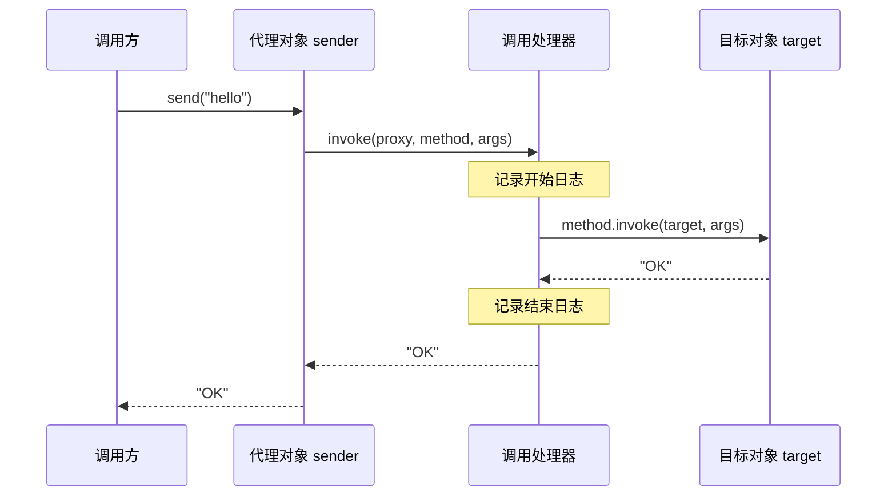

一个消息服务已经能发送消息，如果需要在每次调用前后记录日志，可以让调用方先经过另一个对象，由它记录日志，再调用原服务。

这个中间对象称为 **代理对象**，实际执行发送操作的对象称为 **目标对象**。示例中，代理与目标实现相同的接口，调用方仍通过原接口使用服务。

## 通过静态代理记录日志

### 定义服务接口与实现

定义发送接口和实现类，用控制台输出表示发送成功：

```java
// MessageSender.java
public interface MessageSender {
    String send(String text);
}

// ConsoleSender.java
public class ConsoleSender implements MessageSender {
    @Override
    public String send(String text) {
        if (text.isBlank()) {
            throw new IllegalArgumentException("消息不能为空");
        }
        System.out.println("发送：" + text);
        return "OK";
    }
}
```

### 编写日志代理

`LoggingSender` 实现相同接口，在转发调用前后记录日志：

```java
// LoggingSender.java
public class LoggingSender implements MessageSender {
    private final MessageSender target;

    public LoggingSender(MessageSender target) {
        this.target = target;
    }

    @Override
    public String send(String text) {
        System.out.println("开始：send");
        try {
            return target.send(text);
        } finally {
            System.out.println("结束：send");
        }
    }
}
```

`finally` 让正常返回和抛出异常的调用都会记录结束日志，返回值或异常继续交给调用方。

### 通过代理调用服务

在 `StaticProxyDemo.java` 中把代理交给调用方：

```java
public class StaticProxyDemo {
    public static void main(String[] args) {
        MessageSender target = new ConsoleSender();
        MessageSender sender = new LoggingSender(target);
        System.out.println(sender.send("hello"));
    }
}
```

输出为：

```text
开始：send
发送：hello
结束：send
OK
```

代理类预先写好并编译，这种方式称为 **静态代理**。

代理使用了[组合与委托](./composition.md)：持有目标对象，把接口调用转发给它。如果多个接口的许多方法都需要相同日志，手写代理就需要重复实现这些转发方法。

## 用 JDK 动态代理统一处理调用

JDK 动态代理在运行时生成实现指定接口的代理类，把方法调用交给 **调用处理器（`InvocationHandler`）**。这样就不必为每个接口方法手写转发代码。

### 创建代理：Proxy.newProxyInstance()

创建代理对象使用 `Proxy.newProxyInstance()`，方法签名为：

```java
public static Object newProxyInstance(
        ClassLoader loader,
        Class<?>[] interfaces,
        InvocationHandler h)
```

- `loader`：定义代理类的类加载器，需要能加载指定接口。这里使用 `MessageSender.class.getClassLoader()`。
- `interfaces`：代理要实现的接口，例如 `new Class<?>[]{MessageSender.class}`。
- `h`：调用处理器，代理收到方法调用后交给它处理。

返回值声明为 `Object`，实际对象实现了 `interfaces` 中的接口，因此可以转换为 `MessageSender`。

### 处理调用：InvocationHandler.invoke()

`InvocationHandler` 是函数式接口，需要实现的 `invoke()` 方法签名为：

```java
Object invoke(Object proxy, Method method, Object[] args) throws Throwable;
```

以 `sender.send("hello")` 为例，代理会调用处理器的 `invoke()`，传入：

- `proxy`：接收这次调用的代理对象，即 `sender`。
- `method`：表示 `MessageSender.send(String)` 的 `Method` 对象。
- `args`：实参数组，此处为 `new Object[]{"hello"}`；无参数调用时为 `null`。

处理器决定是否调用目标对象，返回值会作为 `sender.send("hello")` 的结果交给调用方。

`Method.invoke(target, args)` 可以把调用转发给目标对象；目标内部抛出的异常会被包装为 `InvocationTargetException`，需要取出原异常再抛出。这个反射调用过程见[反射](./reflection.md#区分查找失败与被调用方法抛错)。

### 用动态代理记录日志

在 `DynamicProxyDemo.java` 中复用 `MessageSender` 和 `ConsoleSender`，用 Lambda 实现 `invoke()`：

```java
import java.lang.reflect.InvocationHandler;
import java.lang.reflect.InvocationTargetException;
import java.lang.reflect.Proxy;

public class DynamicProxyDemo {
    public static void main(String[] args) {
        MessageSender target = new ConsoleSender();

        InvocationHandler handler = (proxy, method, methodArgs) -> {
            System.out.println("开始：" + method.getName());
            try {
                return method.invoke(target, methodArgs);
            } catch (InvocationTargetException e) {
                throw e.getCause();
            } finally {
                System.out.println("结束：" + method.getName());
            }
        };

        MessageSender sender = (MessageSender) Proxy.newProxyInstance(
                MessageSender.class.getClassLoader(),
                new Class<?>[]{MessageSender.class},
                handler
        );

        System.out.println(sender.send("hello"));
    }
}
```

输出与静态代理相同。

### 一次调用的流转过程

调用从代理对象 `sender` 经处理器转发到目标对象 `target`：



转发时若误写成 `method.invoke(proxy, methodArgs)`，调用会再次进入同一个处理器，造成无限递归。

动态代理自动生成的是实现接口、转交调用的代码。是否记录日志、调用本地对象或返回固定结果，由处理器决定；代理本身不要求一定存在一个本地目标对象。
