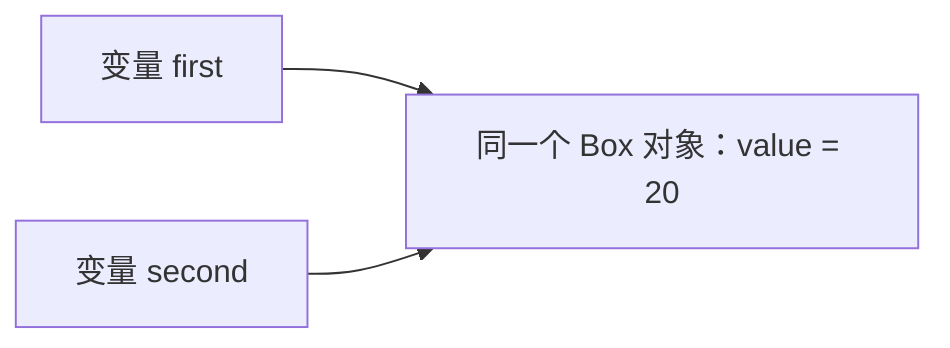

对象保存在变量之外，引用是变量用来访问对象的值。把一个引用变量赋给另一个变量，会让两个变量指向同一个对象，不会自动创建第二个对象。

下面的 `Box` 保存一个整数，`value` 是每个对象各自拥有的字段：

```java
class Box {
    int value;
}
```

## 复制变量与共享对象

```java
Box first = new Box();
first.value = 10;
Box second = first;

second.value = 20;
System.out.println(first.value); // 20
```

`new Box()` 创建对象，`first` 保存指向它的引用。`second = first` 复制这个引用，因此通过任一变量修改字段，访问的都是同一份数据。



基本类型变量的赋值则复制数值本身：

```java
int first = 10;
int second = first;
second = 20;
System.out.println(first); // 10
```

## 修改对象与重新赋值

`second.value = 20` 修改引用指向的对象；`second = new Box()` 改变变量指向的对象。

```java
Box first = new Box();
first.value = 10;
Box second = first;

second = new Box();
second.value = 30;
System.out.println(first.value);  // 10
System.out.println(second.value); // 30
```

`second` 重新赋值后指向新对象，`first` 仍指向原来的对象。变量之间不会因为曾经保存相同引用，就一直保持同步。

## null 表示没有对象

引用变量可以保存 `null`，表示当前没有指向对象。此时读取字段或调用对象方法会抛出 `NullPointerException`，即空指针异常。

```java
Box box = null;
// System.out.println(box.value); // 运行时发生空指针异常

if (box != null) {
    System.out.println(box.value);
}
```

如果某项操作要求对象一定存在，应由调用方保证或在操作入口检查。`null` 与“对象存在，但字段值为零”是两种不同状态。

## == 判断是否为同一个对象

```java
Box first = new Box();
Box second = new Box();
Box same = first;

System.out.println(first == second); // false
System.out.println(first == same);   // true
```

虽然 `first.value` 和 `second.value` 都是默认值 `0`，两个对象仍然不同。对引用使用 `==`，比较的是对象身份，不是字段内容。

`equals()` 是对象提供的比较方法，是否按内容比较由具体类定义。例如字符串的 `equals()` 比较文字内容；普通类没有自定义这个方法时，默认行为仍然是比较对象身份。

## final 引用与对象可变性

`final` 限制变量只能赋值一次，不限制通过这个变量修改对象。

```java
final Box box = new Box();
box.value = 20;    // 可以修改对象字段
// box = new Box(); // 编译错误：不能重新赋值
```

对象创建后还能改变状态，称为可变对象。对象创建后不再改变可观察状态，称为不可变对象。例如 `String` 的替换操作返回处理结果，原字符串内容保持不变：

```java
String original = "hello";
String changed = original.toUpperCase();
System.out.println(original); // hello
System.out.println(changed);  // HELLO
```

## 数组赋值与复制

数组也是对象。数组变量保存引用，所以赋值同样会共享原数组：

```java
int[] first = {1, 2, 3};
int[] second = first;
second[0] = 99;
System.out.println(first[0]); // 99
```

数组的 `clone()` 方法会创建新数组，并复制各个元素值。对于对象数组，复制的是元素中的引用，对象本身仍共享；这称为浅复制。

```java
Box box = new Box();
Box[] original = {box};
Box[] copied = original.clone();

System.out.println(original == copied);       // false：两个数组
System.out.println(original[0] == copied[0]); // true：同一个 Box
copied[0].value = 9;
System.out.println(original[0].value); // 9
```

如果复制结果需要拥有独立的 `Box`，就需要另行创建 `Box` 并复制其字段。是否复制到更深一层，应由需要独立修改哪些数据决定。

## 参考资料

- [Java SE 17 JLS：Reference Types and Values](https://docs.oracle.com/javase/specs/jls/se17/html/jls-4.html#jls-4.3)
- [Dev.java：Creating and Using Objects](https://dev.java/learn/classes-objects/creating-objects/)
