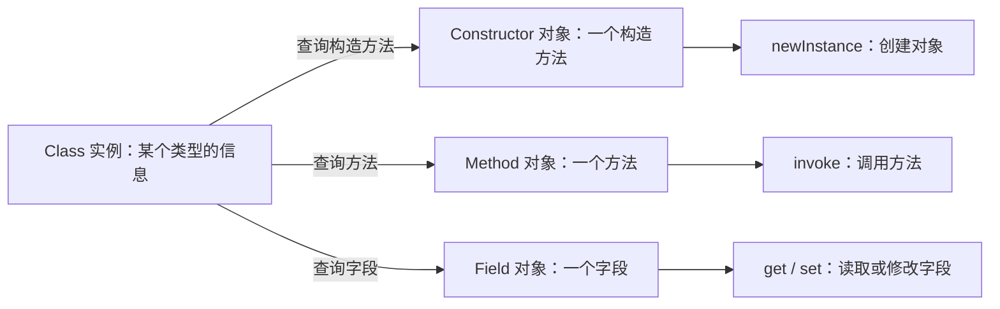

**反射（reflection）** 允许程序在运行时获取对象的类型信息，并据此创建对象、调用方法或读写字段。

## 只拿到 Object，如何调用它的方法

一个导出工具需要读取文章标题。文章类提供了 `getTitle()` 方法：

```java
public class Article {
    public String getTitle() {
        return "反射笔记";
    }
}
```

如果工具直接依赖 `Article`，读取标题很简单：

```java
String readTitle(Article article) {
    return article.getTitle();
}
```

但如果这个工具要作为独立的库使用，接收不同应用传来的对象，编写工具时并不知道应用里的 `Article` 类，就只能通过已有的公共类型接收参数。例如，使用 `Object`：

```java
String readTitle(Object value) {
    return value.getTitle(); // 编译错误：Object 没有 getTitle() 方法
}
```

传入的对象仍然可以是 `Article` 实例，`getTitle()` 方法也仍然存在。问题在于，编译器根据变量的声明类型 `Object` 检查方法调用，无法通过这个变量直接调用 `getTitle()`。

写成 `((Article) value).getTitle()` 可以通过编译，但工具又必须依赖 `Article` 类。如果所有应用对象都能实现一个约定的接口，通过接口调用即可；如果没有这样的共同接口，只有“对象提供公开的 `getTitle()` 方法”这一约定，就可以用反射在运行时查找并调用它。

## Class 类与 Class 实例

`java.lang.Class` 的实例表示 Java 类型，可以用来查询类型的名称、父类、方法和字段等信息。它由 JVM 创建，不能通过 `new Class()` 创建。

类型已知时使用 `.class`，已有对象时调用 [getClass()](./object-contract.md#运行时类型-getclass)，只有类名字符串时使用 `Class.forName()`：

```java
String text = "hello";
Class<String> type = String.class;
Class<?> fromObject = text.getClass();
Class<?> fromName = Class.forName("java.lang.String");

System.out.println(type == fromObject); // true
System.out.println(type == fromName);   // true

System.out.println(type.getName());                  // java.lang.String
System.out.println(type.getSuperclass().getName());  // java.lang.Object
```

这里三种方式取得的是同一个 `Class` 实例。`Class<String>` 指明所表示的类型是 `String`；类型不确定时使用 `Class<?>`。

`.class` 不触发类初始化；`Class.forName(String)` 会触发，见[类与对象的初始化](./initialization.md)。

## 反射相关类的分工

`Class` 提供查询整个类型的入口。查询到的构造方法、方法和字段，也各自用一个对象表示：

- `Constructor` 对象对应一个构造方法，可以读取参数类型，并调用构造方法创建对象。
- `Method` 对象对应一个方法，可以读取名称、参数和返回类型，并调用该方法。
- `Field` 对象对应一个字段，可以读取名称和字段类型，并读写对象上的字段值。



`Constructor`、`Method` 和 `Field` 位于 `java.lang.reflect` 包。取得这些对象只是查询信息，调用 `newInstance()`、`invoke()`、`get()` 或 `set()` 才会执行相应操作。

## 通过反射读取标题

`value.getClass()` 可以取得传入对象实际类型的 `Class` 实例，再通过它查找 `getTitle()` 方法。读取标题的代码只需要导入 `java.lang.reflect.Method`：

```java
String readTitle(Object value) throws ReflectiveOperationException {
    Class<?> type = value.getClass();
    Method getter = type.getMethod("getTitle");
    return (String) getter.invoke(value);
}
```

调用 `readTitle(new Article())` 返回 `"反射笔记"`。`readTitle()` 的实现没有引用 `Article`；传入其他公开类的对象时，只要它也有公开、无参数且返回 `String` 的 `getTitle()` 方法，就能使用同一段读取代码。

`getMethod()` 按名称查找方法，`invoke(value)` 在传入的对象上执行该方法。方法存在与否从编译期检查变成了运行时检查；如果对象没有这个方法，查找会抛出 `NoSuchMethodException`。

## Constructor：创建对象

一个问候服务包含字段 `prefix`、接收前缀的构造方法，以及 `greet(String)` 方法。在 `GreetingService.java` 中定义它：

```java
public class GreetingService {
    private String prefix;

    public GreetingService(String prefix) {
        this.prefix = prefix;
    }

    public String greet(String name) {
        if (name.isBlank()) {
            throw new IllegalArgumentException("姓名不能为空");
        }
        return prefix + name;
    }
}
```

`Constructor` 描述一个构造方法。通过 `Class.getConstructor()` 指定参数类型，找到对应的公开构造方法，再通过 `newInstance()` 传入实际参数：

```java
Class<?> type = Class.forName("GreetingService");
Constructor<?> constructor = type.getConstructor(String.class);
Object service = constructor.newInstance("你好，");
```

`GreetingService` 没有声明包，所以类名直接写作 `"GreetingService"`。`String.class` 表示要查找接收一个 `String` 的构造方法，`"你好，"` 是创建对象时传给它的值。这与 `new GreetingService("你好，")` 调用的是同一个构造方法。

`Constructor<?>` 对应的具体类型在编译时未知，所以创建结果用 `Object` 接收。查找无参数构造方法时写 `type.getConstructor()`，调用时写 `constructor.newInstance()`；目标类必须实际存在该构造方法。

## Method：调用方法

`Method` 描述一个方法。`getMethod()` 根据方法名和参数类型查找公开方法，`invoke()` 指定接收调用的对象和实际参数：

```java
Method method = type.getMethod("greet", String.class);
Object result = method.invoke(service, "小林");
System.out.println(result); // 你好，小林
```

`getMethod("greet", String.class)` 查找 `greet(String)`。`invoke(service, "小林")` 中的 `service` 是接收调用的对象，`"小林"` 才是传给 `greet()` 的参数；它执行的操作与 `service.greet("小林")` 相同，只是不要求调用处把变量声明为 `GreetingService` 类型。

返回值以 `Object` 接收，基本类型返回值会装箱，`void` 方法返回 `null`。

### 参数类型与重载

方法名不足以确定重载，还需要按顺序给出参数类型。例如，查找 `Math.max(int, int)`：

```java
Method max = Math.class.getMethod("max", int.class, int.class);
System.out.println(max.invoke(null, 3, 5)); // 5
```

静态方法不属于某个实例，所以 `invoke()` 的第一个参数可以传 `null`；实例方法则需要传入相应类型的对象。

查找时必须使用声明中的类型。`int.class` 和 `Integer.class` 不相同，不能通过自动装箱替换；如果参数声明为 `CharSequence`，就应传入 `CharSequence.class`，即使调用时准备传的是字符串。

## Field：读取和修改字段

`Field` 描述字段。`getDeclaredField()` 按名称查找当前类声明的字段，包括非公开字段；`get()` 和 `set()` 分别读取、修改指定对象上的字段值。`GreetingService.prefix` 是私有字段，从另一个类中直接反射读取会受到访问检查。

在 `FieldDemo.java` 中先尝试开放访问，再修改前缀：

```java
import java.lang.reflect.Field;

public class FieldDemo {
    public static void main(String[] args) throws ReflectiveOperationException {
        GreetingService service = new GreetingService("你好，");
        Field prefix = GreetingService.class.getDeclaredField("prefix");

        if (!prefix.trySetAccessible()) {
            throw new IllegalStateException("无法访问 prefix");
        }

        System.out.println(prefix.get(service));
        prefix.set(service, "欢迎，");
        System.out.println(service.greet("小林"));
    }
}
```

与 `GreetingService.java` 一起编译，运行 `java FieldDemo`，输出为：

```text
你好，
欢迎，小林
```

`trySetAccessible()` 尝试为当前 `Field` 对象关闭 Java 语言访问检查，无法开放访问时返回 `false`。它没有把原字段改为 `public`。

示例中的类位于普通 classpath 下，能够开放访问。跨 Java 模块访问私有成员时，目标包还需要向调用方模块开放；模块是 Java 用于组织包并控制可见性的边界。不能假定 JDK 或第三方库的私有字段总能访问。`setAccessible(true)` 同样受到这些限制，无法开放访问时会抛出 `InaccessibleObjectException`。

字段赋值不会自动执行 setter 中的校验逻辑。业务对象已有公开修改方法时，通过该方法修改才能保留其中的约束。

## 按类名创建对象并调用方法

`Class`、`Constructor` 和 `Method` 可以组合使用：由命令行传入类名，查询构造方法并创建对象，再查询 `greet(String)` 并调用。在 `ReflectionDemo.java` 中实现：

```java
import java.lang.reflect.Constructor;
import java.lang.reflect.Method;

public class ReflectionDemo {
    public static void main(String[] args) throws ReflectiveOperationException {
        Class<?> type = Class.forName(args[0]);

        Constructor<?> constructor = type.getConstructor(String.class);
        Object service = constructor.newInstance("你好，");

        Method method = type.getMethod("greet", String.class);
        Object result = method.invoke(service, "小林");
        System.out.println(result);
    }
}
```

将两个文件放在同一目录中，编译并运行：

```sh
javac -encoding UTF-8 GreetingService.java ReflectionDemo.java
java ReflectionDemo GreetingService
```

输出为：

```text
你好，小林
```

`ReflectionDemo` 不直接引用 `GreetingService` 类型，但约定了目标类必须有公开的 `String` 构造方法和 `greet(String)` 方法。如果类名或方法名写错，错误会在运行时暴露。

## 成员的查找范围

`getMethod()` 可以查找当前类及继承而来的公开方法。`getDeclaredMethod()` 查找当前类声明的方法，包括非公开方法，但不查父类。

| 查找目标 | 公开成员 | 本类声明的成员，包括非公开成员 |
| --- | --- | --- |
| 方法 | `getMethod(name, parameterTypes)` | `getDeclaredMethod(name, parameterTypes)` |
| 字段 | `getField(name)` | `getDeclaredField(name)` |
| 构造方法 | `getConstructor(parameterTypes)` | `getDeclaredConstructor(parameterTypes)` |

构造方法不会被继承，两种构造方法查询都只针对当前类。对应的复数形式，如 `getMethods()`、`getDeclaredFields()`，返回成员数组；返回顺序不保证与源码中的声明顺序一致。

> [!NOTE]
> `Declared` 只改变查找范围，不会自动开放访问权限。找到私有字段和获准读取它是两件事。

## 区分查找失败与被调用方法抛错

反射失败可能发生在不同阶段：

| 异常 | 含义 |
| --- | --- |
| `ClassNotFoundException` | 找不到指定名称的类 |
| `NoSuchMethodException` / `NoSuchFieldException` | 在指定查找范围内找不到匹配成员 |
| `IllegalAccessException` | 创建对象、调用方法或访问字段时没有相应权限 |
| `IllegalArgumentException` | 传给反射调用的对象、参数数量或参数类型不匹配 |
| `InvocationTargetException` | 已进入目标方法或构造方法，其内部抛出了异常 |

调用 `greet("")` 会触发服务自己的参数校验。通过反射调用时，原异常被包装在 `InvocationTargetException` 中，可以通过 `getCause()` 取得：

```java
import java.lang.reflect.InvocationTargetException;
import java.lang.reflect.Method;

public class FailureDemo {
    public static void main(String[] args) throws ReflectiveOperationException {
        GreetingService service = new GreetingService("你好，");
        Method method = GreetingService.class.getMethod("greet", String.class);

        try {
            method.invoke(service, "");
        } catch (InvocationTargetException e) {
            Throwable cause = e.getCause();
            System.out.println(cause.getClass().getSimpleName());
            System.out.println(cause.getMessage());
        }
    }
}
```

与 `GreetingService.java` 一起编译运行后输出：

```text
IllegalArgumentException
姓名不能为空
```

直接由 `invoke()` 抛出的参数不匹配异常，与目标方法内部抛出后被包装的异常，发生阶段不同。

`Class`、`Method` 和 `Field` 还可以读取附加在相应声明上的运行时注解，完整例子见[注解](./annotations.md#给类设置显示名称)。通过 `Method.invoke()` 把调用转交给另一个对象的用法见[静态代理与动态代理](./proxies.md)。
