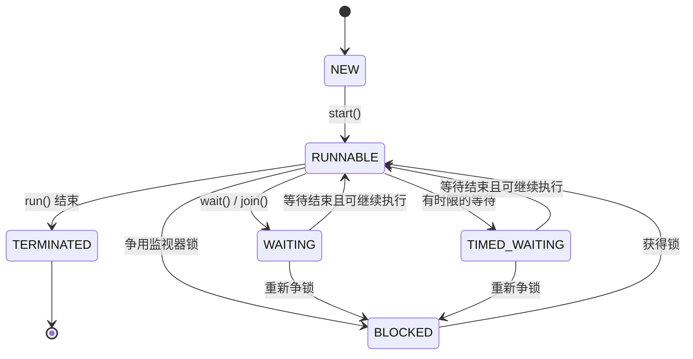

一个程序可以一边接收输入，一边执行耗时计算。要让这两部分工作分别向前推进，就需要不止一条执行流程。Java 用线程表示这样的执行流程，用 `Thread` 对象创建和控制线程。

## 程序、进程与线程

程序是写好的代码；进程是程序运行起来后，由操作系统管理的一次执行实例。运行 `java App`，通常会启动一个 Java 虚拟机进程，由其中的主线程执行 `main()`。虚拟机还会有自己的后台线程，所以只写一个 `main()` 不表示整个进程里只有一个线程。

一个进程可以包含多个线程。它们共享进程内的对象和资源，但各自有自己的方法调用过程。一个线程调用了哪个方法、执行到了哪一行，不会决定另一个线程当前执行到哪里。

例如主线程等待用户输入时，工作线程仍然可以计算结果。两条执行流程也可能同时访问同一个对象；后面要解决的线程安全问题，就来自这种共享。

### 并发与并行

**并发**表示多个任务在同一段时间内交错推进。即使只有一个 CPU 核心，也可以在多个线程之间切换，让它们轮流执行。

**并行**表示多个任务在同一时刻实际执行，需要相应的硬件执行能力，例如多个 CPU 核心。并发程序不保证每个时刻都在并行运行。

多线程可以让等待文件、网络等操作的时间与其他工作重叠，也可以让独立计算利用多个核心。但创建线程和切换执行都有成本，共享数据还需要协调，因此增加线程数量不一定让程序更快。

## 创建与启动线程

### 继承 Thread，定义执行入口

继承 `Thread`，重写 `run()`，就可以定义新线程要做的事：

```java
class PrintThread extends Thread {
    @Override
    public void run() {
        for (int i = 0; i < 3; i++) {
            System.out.println(Thread.currentThread().getName() + ": " + i);
        }
    }
}

public class ThreadDemo {
    public static void main(String[] args) {
        PrintThread worker = new PrintThread();
        worker.setName("worker");
        worker.start();

        for (int i = 0; i < 3; i++) {
            System.out.println(Thread.currentThread().getName() + ": " + i);
        }
    }
}
```

`Thread.currentThread()` 返回正在执行这行代码的线程，`getName()` 读取它的名称。`setName()` 只是方便区分输出，不影响执行顺序。

调用 `start()` 后，工作线程执行 `run()`，主线程则继续自己的循环。创建对象、启动线程、执行任务分别对应 `new`、`start()` 和 `run()`。

两组输出的交错顺序没有保证，也可能一组打印完才看到另一组。但每个线程内部仍按自己的程序顺序执行，因此同一线程的 `0`、`1`、`2` 不会颠倒。

### start() 与 run() 的区别

如果把 `worker.start()` 改为 `worker.run()`，就只是主线程调用了一个普通方法。两轮循环都在主线程中执行，第一轮方法调用结束后，才继续第二轮。

`new PrintThread()` 只创建线程对象，`start()` 才启动新线程。同一个 `Thread` 对象只能启动一次；即使它已经执行结束，再次调用 `start()` 也会抛出 `IllegalThreadStateException`，表示线程状态不允许这个操作。

`run()` 正常返回，或者因为没有被捕获的异常而退出，这个线程就结束了。一个工作线程因普通异常结束，不会自动终止其他线程；异常也不会经由 `start()` 传回启动它的线程。

### 实现 Runnable，把任务交给线程

继承 `Thread` 把任务代码写进了线程类。另一种方式是实现 `Runnable`：它只有一个 `run()` 方法，用来描述任务，再把任务交给 `Thread` 执行。

```java
class PrintTask implements Runnable {
    @Override
    public void run() {
        for (int i = 0; i < 3; i++) {
            System.out.println(Thread.currentThread().getName() + ": " + i);
        }
    }
}
```

```java
PrintTask task = new PrintTask();
Thread first = new Thread(task, "first");
Thread second = new Thread(task, "second");
first.start();
second.start();
```

这里创建了一个任务对象和两个线程对象。两个线程都会执行这个任务的 `run()`；循环中的局部变量 `i` 各属于一次方法调用，不会共用一个计数值。

如果把计数值放到任务对象的字段中，情况就不同了：

```java
class CountTask implements Runnable {
    int count = 0;

    @Override
    public void run() {
        count++;
    }
}

CountTask task = new CountTask();
Thread first = new Thread(task, "first");
Thread second = new Thread(task, "second");
first.start();
second.start();
```

两个线程拿到的是同一个 `task`，因此两次 `run()` 中的 `this` 都指向这个 `CountTask` 对象，修改的也是同一个 `count` 字段。创建两个 `Thread` 对象，不会把传入的任务对象复制成两份。

如果改为分别创建任务对象，字段也就各自独立：

```java
Thread first = new Thread(new CountTask(), "first");
Thread second = new Thread(new CountTask(), "second");
first.start();
second.start();
```

这里有两个 `CountTask` 对象，每个对象都有自己的 `count`。决定是否共享字段的是任务对象是否相同，而不是任务类是否相同。

共享字段时还要考虑修改冲突：`count++` 包含读取、计算和写回，两个线程可能同时读到旧值，再把对方的修改覆盖掉。因此第一个例子即使两个线程都执行完，也不保证最终计数一定为 `2`。

`Thread` 负责启动和控制执行，`Runnable` 负责说明要执行什么。直接调用 `task.run()` 同样不会启动新线程。

`Runnable` 把任务代码与线程管理分开，也保留了任务类继承其他父类的能力。调用方决定创建几个线程、如何命名和何时启动；以后改用复用工作线程的线程池，也可以继续提交这种任务对象。因此，只定义一项要执行的工作时，通常使用 `Runnable`；需要扩展线程类本身的行为时，再考虑继承 `Thread`。

共享任务对象是数据组织方式，不是 `Runnable` 独有的能力，也不自动保证线程安全。继承 `Thread` 的多个对象同样可以持有一个共享对象；两种写法都需要协调对共享可变数据的访问。

### 用 Lambda 简写任务

`Runnable` 是只有一个抽象方法的函数式接口，可以用 [Lambda](./lambda-and-method-references.md) 简写。箭头后面的代码就是 `run()` 的实现：

```java
Thread worker = new Thread(() -> {
    System.out.println(Thread.currentThread().getName());
}, "worker");
worker.start();
```

## 等待、暂停与中断

### 等待另一个线程完成：join()

`start()` 不会等待任务完成。主线程如果马上读取计算结果，可能读到工作线程尚未更新的值。

`join()` 可以让调用它的线程等待目标线程结束：

```java
class SumTask implements Runnable {
    int result;

    @Override
    public void run() {
        for (int i = 1; i <= 100; i++) {
            result += i;
        }
    }
}

public class JoinDemo {
    public static void main(String[] args) throws InterruptedException {
        SumTask task = new SumTask();
        Thread worker = new Thread(task, "calculator");
        worker.start();
        worker.join();
        System.out.println(task.result); // 5050
    }
}
```

执行 `worker.join()` 的是主线程，因此停下来等待的也是主线程。工作线程继续计算，直到 `run()` 结束，主线程才从 `join()` 返回并打印结果。成功等待线程结束后，该线程完成的写入对等待方可见，因此这里能读到最终结果 `5050`，`result` 不需要额外加锁。反过来，启动方在 `start()` 之前的写入，也对新线程可见。这两条可见性保证由 [JLS 17.4.5](https://docs.oracle.com/javase/specs/jls/se17/html/jls-17.html#jls-17.4.5) 规定。

调用 `join()` 的线程在等待期间可能收到中断请求，使 `join()` 抛出 `InterruptedException`。示例通过 `throws` 声明它，中断的处理方式在下方单独说明。

带时间参数的 `join(1000)` 为等待设置一秒的时限。它也可能因为时间到了而返回，所以返回后不一定意味着任务完成，需要结合 `worker.isAlive()` 判断目标线程是否仍在运行。这里的超时只结束等待，不会停止工作线程；`join(0)` 则表示不设超时。

### 暂停当前线程：sleep()

`Thread.sleep(100)` 表示让**当前执行这行代码的线程**暂停一段时间，参数单位是毫秒。

```java
public class SleepDemo {
    public static void main(String[] args) throws InterruptedException {
        System.out.println("开始");
        Thread.sleep(100);
        System.out.println("继续");
    }
}
```

两行之间有一次请求暂停 100 毫秒的操作，实际间隔受计时精度和调度影响。这里暂停的是主线程，时间到达后还要等待调度，不能把它当成精确的定时器。`sleep()` 是静态方法，应该通过 `Thread.sleep(...)` 调用；写成 `worker.sleep(...)` 也不会让指定的 `worker` 线程休眠。

等待另一个线程完成时，应使用 `join()`。用 `sleep()` 猜测“对方应该已经执行完了”，会让结果依赖机器速度和调度时机。

### 请求任务停止：interrupt()

一个任务需要提前停止时，可以调用它的 `interrupt()`。这个方法发出中断请求，不会在任意一行强行终止线程。

执行循环的线程可以通过 `isInterrupted()` 检查自己的中断标志；正在 `sleep()` 或 `join()` 中等待的线程，则会通过 `InterruptedException` 得知请求。后面的条件等待方法 `wait()` 也支持这种响应方式。

```java
class RepeatingTask implements Runnable {
    @Override
    public void run() {
        while (!Thread.currentThread().isInterrupted()) {
            try {
                Thread.sleep(1000);
            } catch (InterruptedException e) {
                Thread.currentThread().interrupt();
                break;
            }
        }
        System.out.println("任务退出");
    }
}
```

```java
Thread worker = new Thread(new RepeatingTask(), "worker");
worker.start();
worker.interrupt();
worker.join();
```

如果工作线程已经进入休眠，中断会使 `sleep()` 抛出异常；如果它还没进入循环，中断标志会使循环条件不成立。如果中断发生在循环检查之后、调用 `sleep()` 之前，`sleep()` 也会检测到已有的中断标志并抛出异常。这些情况都会结束任务，主线程等待结束后再继续。

`InterruptedException` 抛出时会清除中断标志，例子在捕获后重新设置标志并退出循环。`Runnable.run()` 不能直接声明向外抛出这个受检异常，因此这里自己响应停止请求；能够继续向调用方抛出的普通方法，也可以用 `throws InterruptedException` 交给调用方处理。

`isInterrupted()` 只读取标志；静态方法 `Thread.interrupted()` 则读取并清除**当前线程**的标志。两者名字相近，但效果不同。

任务如果完全不检查中断，也没有执行能响应中断的操作，就可能继续运行。`interrupt()` 的状态设置与异常行为见 [Java 17 Thread API](<https://docs.oracle.com/en/java/javase/17/docs/api/java.base/java/lang/Thread.html#interrupt()>)。

### 主线程结束与守护线程

`main()` 返回只表示主线程结束。新线程默认继承创建它的线程的守护属性，因此由主线程创建的线程默认是非守护线程。只要还有未结束的非守护线程，虚拟机通常会继续运行，等待它们结束。

守护线程用于不需要独立维持进程存活的后台工作。复用前面的 `PrintTask`，可以在启动前设置：

```java
Thread worker = new Thread(new PrintTask(), "background");
worker.setDaemon(true);
worker.start();
```

`setDaemon(true)` 必须在启动之前调用。当只剩守护线程时，虚拟机可以退出，不会保证它们完成后续任务或清理代码。因此不能依赖守护线程完成必须落盘的数据或其他不可丢失的收尾工作。

## 共享数据与同步

### 同一份数据上的竞争

两个线程使用同一个对象，不代表对这个对象的操作会自动排队。下面让两个线程分别给同一个计数器加一万次：

```java
class Counter {
    private int value;

    void increment() {
        value++;
    }

    int value() {
        return value;
    }
}

public class CounterDemo {
    public static void main(String[] args) throws InterruptedException {
        Counter counter = new Counter();
        Runnable task = () -> {
            for (int i = 0; i < 10_000; i++) {
                counter.increment();
            }
        };

        Thread first = new Thread(task);
        Thread second = new Thread(task);
        first.start();
        second.start();
        first.join();
        second.join();
        System.out.println(counter.value());
    }
}
```

预期结果是 `20000`，实际结果却可能更小，也可能某次碰巧等于 `20000`。这里已经等待了两个线程结束，问题出在它们运行期间的修改互相覆盖。

`value++` 包含读取旧值、计算新值、写回三个步骤。例如 `value` 为 `10` 时，可能发生下面的交错：

| 顺序 | 第一个线程     | 第二个线程     |
| ---- | -------------- | -------------- |
| 1    | 读到 10        |                |
| 2    |                | 也读到 10      |
| 3    | 算出 11 并写回 |                |
| 4    |                | 算出 11 并写回 |

两个线程都执行了加一，最终却只增加了一次。操作结果依赖执行时机，这就是这里的竞争问题。多线程调用下仍能遵守预期的数据规则，才称得上线程安全。

### 用 synchronized 保护一次完整操作

要保证计数正确，就需要让一个线程完成整次“读、改、写”后，另一个线程才能修改同一份数据。

给 `Counter` 的方法加上 `synchronized`：

```java
class Counter {
    private int value;

    synchronized void increment() {
        value++;
    }

    synchronized int value() {
        return value;
    }
}
```

保留上面的 `CounterDemo`，只替换计数器类，结果就稳定为 `20000`。

每个 Java 对象都可以作为一把监视器锁，可以把锁理解为进入受保护代码的许可。同一时刻只有一个线程能持有同一把锁，其他线程需要等待。实例同步方法使用当前对象 `this` 作为锁，所以两个线程操作同一个 `counter` 时，会相互排队。

同一把锁还保证了前一个线程在释放锁前的修改，能够被后来获得锁的线程看到。避免一次操作被其他使用同一把锁的操作插入，称为保证这次操作的**原子性**；让后续读取看见已完成的修改，称为保证**可见性**。

前面的 `join()` 只保证结束后的读取能看到写入，不会让两个工作线程运行期间的 `value++` 自动排队。这里给读取方法也加锁，是为了支持其他线程在计数尚未结束时读取；如果只在两个 `join()` 成功等待线程结束后读取，读取方的可见性已由 `join()` 保证。

### 同步代码块与锁对象

只保护方法中的一部分代码时，可以使用同步代码块。下面的加锁对象同样是 `this`，与上面的实例同步方法使用同一把锁：

```java
void increment() {
    synchronized (this) {
        value++;
    }
}
```

需要协调同一份数据的代码，必须使用同一把锁。把 `new Object()` 写在每次调用的 `synchronized (...)` 里，会让每次操作获得不同的锁，线程之间就无法相互约束。

`static synchronized` 方法使用声明该方法的类对应的 `Class` 对象作为锁，例如 `Counter.class`。它与某个实例的 `this` 是不同对象，也就是不同的锁。

退出同步块或同步方法时，会自动解除本次加锁，异常退出也一样。同一线程可以再次获取自己已持有的锁，这称为**可重入**；只有针对同一把锁的最外层持锁范围也退出后，其他线程才能获得这把锁。

争用 `synchronized` 锁时，`interrupt()` 不会让线程放弃等待。`sleep()` 则不会释放已经持有的监视器锁，所以在同步块中休眠，会让其他等待同一把锁的线程继续等下去。

### 多把锁与死锁

如果第一个线程持有锁 A、等待锁 B，而第二个线程持有锁 B、等待锁 A，双方都无法继续，这称为死锁。

涉及多把锁时，让所有路径按同一个顺序获取锁，可以避免这种相互等待。例如始终先获取 A，再获取 B。持有某把锁时，也不能随意 `join()` 一个需要这把锁才能结束的线程，否则同样可能相互等待。

## 等待条件成立：wait() 与 notifyAll()

锁能让线程轮流修改数据，但有时当前根本没有工作可做。例如一个只能存放一条消息的信箱：信箱为空时，接收方需要等消息；信箱已有消息时，发送方需要等它被取走。

接收方如果一直拿着锁循环检查，发送方就进不来。`wait()` 可以让当前线程等待，并释放调用对象的监视器锁，让其他线程有机会改变条件。

```java
class Mailbox {
    private String message;

    public synchronized void put(String value) throws InterruptedException {
        if (value == null) {
            throw new IllegalArgumentException("message must not be null");
        }
        while (message != null) {
            wait();
        }
        message = value;
        notifyAll();
    }

    public synchronized String take() throws InterruptedException {
        while (message == null) {
            wait();
        }
        String result = message;
        message = null;
        notifyAll();
        return result;
    }
}
```

`message == null` 表示信箱为空。主线程发送消息，另一个线程接收：

```java
public class MailboxDemo {
    public static void main(String[] args) throws InterruptedException {
        Mailbox mailbox = new Mailbox();
        Thread receiver = new Thread(() -> {
            try {
                System.out.println("收到：" + mailbox.take());
            } catch (InterruptedException e) {
                Thread.currentThread().interrupt();
            }
        });

        receiver.start();
        mailbox.put("hello");
        receiver.join();
    }
}
```

如果接收线程先进入 `take()`，它会在 `wait()` 处释放信箱的锁并等待。主线程进入 `put()` 后写入消息，调用 `notifyAll()` 通知等待者，再退出方法释放锁；接收线程重新拿到锁、重新检查条件，随后取走消息。

如果主线程先发送，消息已经保存在字段里，接收线程检查到信箱非空，就直接取走。因此程序不依赖谁先执行，也不需要用休眠猜测对方是否准备好了。

`wait()`、`notify()`、`notifyAll()` 都是 `Object` 的方法，调用时必须持有对应对象的监视器锁，否则抛出 `IllegalMonitorStateException`。上面省略对象名称的 `wait()` 实际是 `this.wait()`，与同步方法所用的锁一致。

通知不会立即交出锁。`notify()` 选择一个等待线程，`notifyAll()` 通知所有等待线程，它们都要等持锁方释放锁后再竞争。条件必须写在 `while` 中，因为线程可能在没有对应通知时被唤醒（**虚假唤醒**），也可能在重新获得锁前，条件已经被其他线程改变。

`wait()` 只释放调用对象的监视器锁，不释放当前线程可能持有的其他锁。这与 `sleep()` 保留监视器锁的行为不同。即使因中断而退出等待，`wait()` 也要重新获得该锁后，才会抛出 `InterruptedException`。这些规则见 [Java 17 Object.wait API](<https://docs.oracle.com/en/java/javase/17/docs/api/java.base/java/lang/Object.html#wait(long,int)>)。

实际需要在线程间传递任务或消息时，可以使用封装了等待逻辑的 [BlockingQueue](../standard-library/collections/queue-and-deque.md#队列与并发)。

## 线程的生命周期

线程对象刚创建时还没有执行，调用 `start()` 后才进入可运行状态。运行期间，它可能因为休眠、等待另一个线程结束、等待条件或争用锁而暂停。`run()` 执行结束后，线程进入终止状态，不能再次启动。



有时限的等待包括 `sleep(t)`、`wait(t)` 和 `join(t)`，其中 `t` 为正的等待时长。等待可能因计时结束、目标线程结束、通知或中断等原因结束，具体取决于调用的方法。

`wait()` 结束等待后必须重新获得监视器锁，才能返回或抛出中断异常；若锁仍被占用，线程会进入 `BLOCKED`，而不是立即继续执行。

Java 用 [`Thread.State`](https://docs.oracle.com/en/java/javase/17/docs/api/java.base/java/lang/Thread.State.html) 表达这些情况，`getState()` 可以读取状态：

| 状态            | 对应情况                                                                   |
| --------------- | -------------------------------------------------------------------------- |
| `NEW`           | 已创建线程对象，尚未调用 `start()`                                         |
| `RUNNABLE`      | 可以运行，可能正在执行，也可能等待操作系统调度                             |
| `BLOCKED`       | 等待获得监视器锁，包括进入 `synchronized` 或 `wait()` 结束等待后重新获取锁 |
| `WAITING`       | 没有超时时间的等待，例如 `wait()`、`join()`                                |
| `TIMED_WAITING` | 带等待时限，例如 `sleep()`、`wait(1000)`、`join(1000)`                     |
| `TERMINATED`    | `run()` 已结束，或因未捕获异常退出                                         |

这里是 Java 线程状态，不能直接等同于操作系统的全部线程状态；例如 Java 没有单独区分“就绪”和“正在 CPU 上运行”，都归在 `RUNNABLE` 中。

```java
Thread worker = new Thread(() -> System.out.println("执行任务"));
System.out.println(worker.getState());
worker.start();
worker.join();
System.out.println(worker.getState());
```

第一次读取状态发生在 `start()` 之前，第二次发生在 `join()` 等待线程结束之后，对应 `NEW` 和 `TERMINATED`。

`getState()` 只是观察那一刻的状态，读取以后可能马上变化。因此不要靠反复检查状态来安排线程先后关系，应使用前面的 `join()` 或条件等待。

## API 速查

### 常用构造方法

`target` 是要执行的 `Runnable` 任务，`name` 是用于辨认线程的名称。

| 构造方法                               | 作用                       |
| -------------------------------------- | -------------------------- |
| `Thread()`                             | 不指定任务，自动生成线程名 |
| `Thread(String name)`                  | 只指定线程名               |
| `Thread(Runnable target)`              | 指定任务，自动生成线程名   |
| `Thread(Runnable target, String name)` | 同时指定任务和线程名       |

构造方法只创建对象，调用 `start()` 才启动线程。没有传入任务时，通常由 `Thread` 子类重写 `run()` 提供执行内容。

### 等待与中断作用于谁

| 调用                     | 作用对象与结果                                      |
| ------------------------ | --------------------------------------------------- |
| `worker.start()`         | 启动 `worker`，调用方继续执行                       |
| `worker.join()`          | 当前线程等待 `worker` 结束                          |
| `Thread.sleep(ms)`       | 当前线程暂停，不释放已持有的监视器锁                |
| `obj.wait()`             | 当前线程等待，释放 `obj` 的锁，继续执行前重新获取它 |
| `obj.notifyAll()`        | 通知在 `obj` 上等待的线程，调用方仍持有锁           |
| `worker.interrupt()`     | 向 `worker` 发出中断请求                            |
| `worker.isInterrupted()` | 读取 `worker` 的中断标志，不清除                    |
| `Thread.interrupted()`   | 读取并清除当前线程的中断标志                        |

### 调度提示

`Thread.yield()` 只是提示调度器当前线程愿意让出执行机会，调度器可以忽略它。线程优先级也不能用来保证谁先执行；需要先后关系时，要用明确的等待或同步机制。
