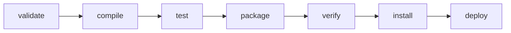

Maven 把构建过程拆成有顺序的阶段，但阶段本身不包含编译器或测试框架。真正的工作由插件目标完成，Maven 根据项目的打包类型和 POM 配置，把目标绑定到相应阶段。

## 从命令看执行模型

```shell
mvn clean package
```

这条命令包含两个阶段：

1. 执行 `clean` 生命周期直到 `clean` 阶段，删除上次构建产生的 `target`。
2. 执行 `default` 生命周期，从起点一直运行到 `package` 阶段。

`package` 不是只执行打包。Maven 到达它之前，会依次完成资源处理、主代码编译、测试代码编译和单元测试。



调用较后的阶段会包含此前阶段。因此日常完整检查通常使用 `verify`，而不是依次执行 `compile test package verify`。

## 生命周期、阶段、插件与目标

这四个概念处在不同层次：

| 概念 | 示例 | 作用 |
| --- | --- | --- |
| 生命周期 | `default` | 定义阶段的顺序 |
| 阶段 | `compile` | 表示构建进行到哪个位置 |
| 插件 | `maven-compiler-plugin` | 提供一组可执行能力 |
| 目标 | `compiler:compile` | 插件中的一个具体操作 |

目标可以直接调用：

```shell
mvn dependency:tree
```

其中 `dependency` 是插件前缀，`tree` 是目标。直接目标适合查询或一次性操作；项目的稳定构建流程应尽量把目标绑定到生命周期阶段，然后由 `verify` 等阶段统一触发。

## 三套内置生命周期

### default

`default` 负责生成和发布项目产物。常用阶段如下：

| 阶段 | 含义 |
| --- | --- |
| `validate` | 检查项目模型和构建前提 |
| `compile` | 编译主代码 |
| `test` | 运行单元测试，不要求产物已经打包 |
| `package` | 生成 JAR、WAR 等产物 |
| `verify` | 执行集成测试结果检查和其他质量校验 |
| `install` | 把产物和 POM 写入本地仓库 |
| `deploy` | 把产物发布到远程仓库 |

完整生命周期还包含 `process-resources`、`test-compile`、`pre-integration-test`、`integration-test`、`post-integration-test` 等阶段。配置插件时应绑定语义最接近的阶段，而不是统一塞到 `package`。

### clean

`clean` 生命周期负责清理构建输出，常用阶段是 `clean`。它和 `default` 是两套独立生命周期，所以经常组合为 `mvn clean verify`。

### site

`site` 生命周期生成项目站点和报告。它不是编译、测试所必需的主流程。

## packaging 决定默认绑定

POM 未声明 `<packaging>` 时默认为 `jar`。`jar` 打包会提供一组默认绑定，例如：

```text
process-resources       -> resources:resources
compile                 -> compiler:compile
process-test-resources  -> resources:testResources
test-compile            -> compiler:testCompile
test                    -> surefire:test
package                 -> jar:jar
install                 -> install:install
deploy                  -> deploy:deploy
```

`war`、`pom` 等打包类型具有不同绑定。`pom` 通常用于父 POM 或聚合项目，本身没有需要编译的 Java 代码。

## 配置插件

下面把 Enforcer 插件的 `enforce` 目标绑定到 `validate`，在正式编译前检查 Maven 和 Java 版本：

```xml
<build>
  <plugins>
    <plugin>
      <groupId>org.apache.maven.plugins</groupId>
      <artifactId>maven-enforcer-plugin</artifactId>
      <version>3.6.3</version>
      <executions>
        <execution>
          <id>check-build-environment</id>
          <phase>validate</phase>
          <goals>
            <goal>enforce</goal>
          </goals>
          <configuration>
            <rules>
              <requireMavenVersion>
                <version>[3.9,4.0)</version>
              </requireMavenVersion>
              <requireJavaVersion>
                <version>[17,18)</version>
              </requireJavaVersion>
            </rules>
          </configuration>
        </execution>
      </executions>
    </plugin>
  </plugins>
</build>
```

插件是否需要显式 `<phase>`，取决于目标是否已经声明默认阶段以及项目是否使用默认绑定。显式绑定能表达项目意图，但不应重复配置已有的默认行为。

## 构建插件不是项目依赖

`dependencies` 中的库进入项目的编译、测试或运行类路径，例如 JUnit、数据库驱动和日志 API。

`build/plugins` 中的插件运行在 Maven 的构建环境中，例如编译器、测试运行器和打包插件。插件依赖不会自动成为应用依赖，应用依赖也不会自动获得插件能力。

## 单元测试与集成测试

Surefire 插件通常在 `test` 阶段运行单元测试。测试失败会立即使构建失败。

Failsafe 插件用于集成测试：

```xml
<plugin>
  <groupId>org.apache.maven.plugins</groupId>
  <artifactId>maven-failsafe-plugin</artifactId>
  <version>3.5.5</version>
  <executions>
    <execution>
      <goals>
        <goal>integration-test</goal>
        <goal>verify</goal>
      </goals>
    </execution>
  </executions>
</plugin>
```

Failsafe 把测试执行和最终结果校验分开，使 `post-integration-test` 有机会清理测试环境。运行集成测试时应调用：

```shell
mvn verify
```

不要把 `mvn integration-test` 当作完整入口，否则后续清理和结果校验阶段可能不会执行。

## 常用命令的边界

| 命令 | 适合的用途 |
| --- | --- |
| `mvn test` | 快速运行单元测试 |
| `mvn package` | 生成本地可检查的产物 |
| `mvn verify` | 完成集成测试和质量校验 |
| `mvn install` | 让本机其他项目可解析当前产物 |
| `mvn deploy` | 在发布流程中上传远程仓库 |
| `mvn clean verify` | 排除旧输出影响后完成全量检查 |

## 参考资料

- [Introduction to the Build Lifecycle](https://maven.apache.org/guides/introduction/introduction-to-the-lifecycle.html)
- [Guide to Configuring Plug-ins](https://maven.apache.org/guides/mini/guide-configuring-plugins.html)
- [Maven Failsafe Plugin](https://maven.apache.org/surefire/maven-failsafe-plugin/)
- [Maven Enforcer Plugin](https://maven.apache.org/enforcer/maven-enforcer-plugin/)
