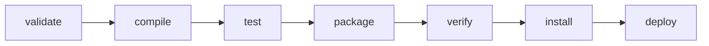

Maven 用项目根目录的 `pom.xml` 描述项目、依赖和构建配置，再调用插件完成编译、测试和打包。POM 是项目对象模型（Project Object Model），不是按 XML 书写顺序执行的脚本。

## 从一个项目完成构建

Maven 默认识别以下目录：

```text
hello-maven/
├── pom.xml
└── src/
    ├── main/
    │   ├── java/com/example/App.java
    │   └── resources/
    └── test/
        ├── java/
        └── resources/
```

`main` 保存应用代码和资源，`test` 保存测试代码和资源；编译结果、测试报告和最终产物写入 `target/`。

`pom.xml`：

```xml
<project xmlns="http://maven.apache.org/POM/4.0.0"
         xmlns:xsi="http://www.w3.org/2001/XMLSchema-instance"
         xsi:schemaLocation="http://maven.apache.org/POM/4.0.0 https://maven.apache.org/xsd/maven-4.0.0.xsd">
  <modelVersion>4.0.0</modelVersion>
  <groupId>com.example</groupId>
  <artifactId>hello-maven</artifactId>
  <version>1.0.0-SNAPSHOT</version>

  <properties>
    <maven.compiler.release>17</maven.compiler.release>
    <project.build.sourceEncoding>UTF-8</project.build.sourceEncoding>
  </properties>

  <build>
    <plugins>
      <plugin>
        <groupId>org.apache.maven.plugins</groupId>
        <artifactId>maven-compiler-plugin</artifactId>
        <version>3.16.0</version>
      </plugin>
      <plugin>
        <groupId>org.apache.maven.plugins</groupId>
        <artifactId>maven-surefire-plugin</artifactId>
        <version>3.5.5</version>
      </plugin>
    </plugins>
  </build>
</project>
```

`groupId:artifactId:version` 构成项目的基本坐标，这里是 `com.example:hello-maven:1.0.0-SNAPSHOT`。`groupId` 表示组织或命名空间，`artifactId` 表示项目名，`version` 表示版本。`packaging` 决定打包类型，省略时为 `jar`。

`properties` 保存可复用的配置值。`maven.compiler.release` 同时约束 Java 语法、标准库 API 和 class 文件目标版本，不决定运行 Maven 自身的 JDK。

`src/main/java/com/example/App.java`：

```java
package com.example;

public class App {
    public static void main(String[] args) {
        System.out.println("Hello, Maven");
    }
}
```

在项目根目录执行：

```shell
mvn clean verify
java -cp target/hello-maven-1.0.0-SNAPSHOT.jar com.example.App
```

构建成功后生成 JAR，运行输出 `Hello, Maven`。项目依赖的声明见 [依赖与仓库管理](./dependency-management.md)。

## 生命周期与阶段

`mvn clean verify` 先清理旧输出，再执行默认生命周期直到 `verify`。生命周期是一组有顺序的阶段，调用后面的阶段会包含前面的阶段。

默认生命周期的主要阶段如下，图中省略了资源处理等中间阶段：


```mermaid
flowchart LR
    V[validate] --> C[compile]
    C --> T[test]
    T --> P[package]
    P --> VE[verify]
    VE --> I[install]
    I --> D[deploy]
```

| 阶段 | 作用 |
| --- | --- |
| `validate` | 执行构建前的校验目标 |
| `compile` | 编译主代码 |
| `test` | 运行单元测试 |
| `package` | 生成 JAR、WAR 等产物 |
| `verify` | 执行已配置的集成测试结果检查和质量校验 |
| `install` | 把产物和 POM 写入本地仓库 |
| `deploy` | 把产物发布到远程仓库 |

因此 `mvn package` 也会编译、运行单元测试；日常完整检查可直接使用 `mvn verify`，无需重复写 `compile test package verify`。集成测试和额外校验需要配置对应插件，不是执行 `verify` 就自动具备。

`clean` 属于独立的清理生命周期，不会在 `package`、`verify` 前自动执行。另有生成项目站点的 `site` 生命周期，普通构建通常不涉及。

## 插件如何参与构建

阶段决定执行顺序，插件目标执行具体工作。例如 Compiler 插件提供 `compiler:compile` 和 `compiler:testCompile` 两个目标。`jar` 项目的部分默认绑定是：

| 阶段 | 插件目标 |
| --- | --- |
| `process-resources` | `resources:resources` |
| `compile` | `compiler:compile` |
| `test-compile` | `compiler:testCompile` |
| `test` | `surefire:test` |
| `package` | `jar:jar` |

前面的 POM 固定了编译器和测试插件版本，它们的目标已有默认绑定。其他插件可通过 `<executions>` 指定目标及绑定阶段；不同 `packaging` 的默认绑定也不同。

目标也可以直接调用，例如查看依赖树：

```shell
mvn dependency:tree
```

`dependencies` 中的库供项目代码使用，`build/plugins` 中的插件供构建过程使用。声明一个依赖不会自动执行插件，声明一个插件也不会把它作为应用库打包。

## 查看实际生效的配置

Maven 会合并 Super POM 的默认值、父 POM 和当前 POM 等配置，形成有效 POM。配置从哪里来、最终采用哪个插件版本，可以用以下命令确认：

```shell
mvn -version
mvn help:effective-pom
```

`mvn -version` 同时显示 Maven 和运行它的 Java。IDE、终端与 CI 构建不一致时，先比较这些信息。

测试失败时先查看 `target/surefire-reports/`；配置了 Failsafe 的集成测试报告位于 `target/failsafe-reports/`。普通日志不足时，可用 `mvn -e verify` 查看异常堆栈。

## 项目自带的 Maven Wrapper

仓库中已有 `mvnw`、`mvnw.cmd` 和 `.mvn/wrapper/` 时，使用项目自带的 Wrapper，按仓库记录的 Maven 版本构建：

```shell
./mvnw clean verify
```

Windows 使用 `mvnw.cmd clean verify`。Wrapper 固定 Maven 版本，使用的 JDK 仍由启动环境决定。
