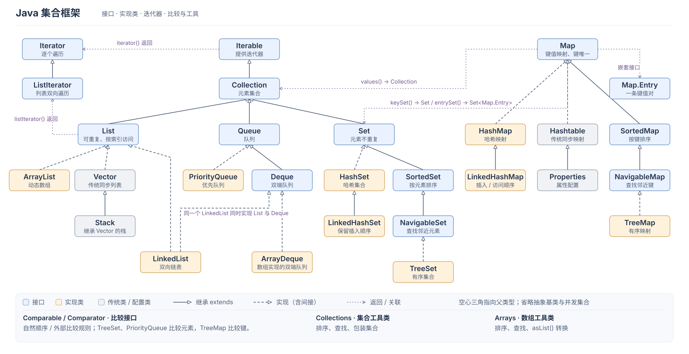

Java 集合框架提供保存和操作一组对象的接口、实现类与工具方法。列表、去重集合、键值映射和队列分别表达不同的数据关系；接口约定可用操作，实现类决定数据如何存储、访问，以及相应的性能特点。

例如，`List<String> names = new ArrayList<>()` 中，`List` 表达按位置访问的序列，`ArrayList` 则用可扩容数组实现它。

图中的容器分为两条主线：

- **`Collection`：保存元素。** [List](./list.md) 保留元素的位置并允许重复，[Set](./set.md) 表达不重复的元素，[Queue 与 Deque](./queue-and-deque.md) 通过队首或首尾两端存取元素。它们继承 `Iterable`，可以用增强 `for` 循环遍历。
- **`Map`：保存键值映射。** 每个键最多对应一个值，适合按编号等唯一键查找数据。[Map](./map.md) 不继承 `Collection`，但能通过 `keySet()`、`values()`、`entrySet()` 分别取得键、值和键值对的集合视图。

`Collection` 是容器接口，`Collections` 是排序、查找、包装等操作的工具类。遍历和排序规则见[遍历、比较与排序](./iteration-and-comparison.md)，筛选、转换和汇总见 [Stream 与集合数据处理](./stream-processing.md)，集合共享与复制的边界见[不可修改集合与防御性复制](./immutable-collections.md)。
