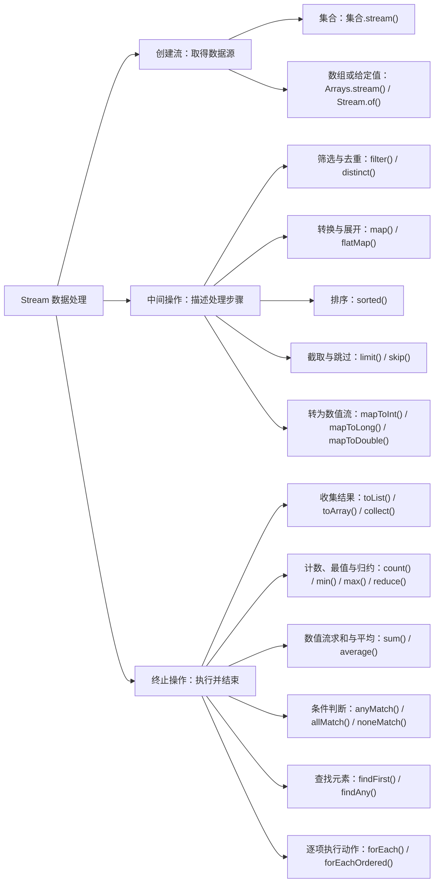

从订单列表中筛选已支付订单，再提取编号，可以把处理步骤连成一条 Stream 流水线。集合保存数据，Stream 描述如何处理这些数据；操作中的判断和转换由 [Lambda 与方法引用](../language/lambda-and-method-references.md) 提供。

## 常用方法总览

一条流水线从创建流开始，经过零个或多个**中间操作**描述筛选、转换等步骤，最后由一个**终止操作**触发计算，得到结果或执行动作。中间操作返回流，可以继续串联；终止操作结束这条处理链。



## 从订单列表得到处理结果

下面的例子共用这组订单，金额以分为单位：

```java
import java.util.ArrayList;
import java.util.Arrays;
import java.util.Comparator;
import java.util.List;
import java.util.Map;
import java.util.stream.Collectors;
import java.util.stream.LongStream;
import java.util.stream.Stream;

record Order(String id, String customer, long totalCents,
             boolean paid, List<String> items) {}

List<Order> orders = List.of(
        new Order("A001", "Alice", 1200, true, List.of("book", "pen")),
        new Order("A002", "Bob", 800, false, List.of("pen")),
        new Order("A003", "Alice", 2000, true, List.of("notebook", "pen")),
        new Order("A004", "Carol", 1500, true, List.of("book")));

List<String> paidIds = orders.stream()
        .filter(Order::paid)
        .map(Order::id)
        .toList();

System.out.println(paidIds); // [A001, A003, A004]
```

这条处理链由三部分组成：

| 部分 | 示例 | 作用 |
| --- | --- | --- |
| 数据源 | `orders.stream()` | 从订单列表创建流 |
| 中间操作 | `filter()`、`map()` | 筛选订单，再把每个订单转换成编号 |
| 终止操作 | `toList()` | 执行处理并生成结果列表 |

`filter()` 保留满足条件的元素，`map()` 将每个元素转换成另一个值，因此这里从 `Stream<Order>` 变成了 `Stream<String>`。原来的 `orders` 不会因为筛选而删除未支付订单。

## 创建流：取得数据源

集合通过 `stream()` 创建流；数组使用 `Arrays.stream()`，几个直接给出的值可以用 `Stream.of()`：

```java
Stream<Order> orderStream = orders.stream();

String[] names = {"book", "pen"};
Stream<String> arrayStream = Arrays.stream(names);
Stream<String> valueStream = Stream.of("book", "pen");
```

这些调用建立数据源与流的关联，后续再串联处理方法。每次需要重新处理同一批数据时，都应重新创建流。

## 中间操作：描述处理步骤

### 筛选与去重：filter、distinct

`filter()` 根据返回 `boolean` 的条件保留元素，`distinct()` 按元素的 `equals()` 语义去重：

```java
List<String> uniqueNames = Stream.of("book", "pen", "book", "notebook")
        .filter(name -> name.length() > 3)
        .distinct()
        .toList();

System.out.println(uniqueNames); // [book, notebook]
```

如果流中是订单对象，`distinct()` 比较的就是订单对象，不会自动按某个业务字段去重。要得到不重复的客户名，可以先用 `map(Order::customer)` 提取客户名，再调用 `distinct()`。

### 转换与展开：map、flatMap

`map()` 将每个元素转换成一个值，例如前面的 `map(Order::id)` 把订单转换成编号。转换后也可以仍是同一种类型，例如把字符串转换成大写。

每个订单包含多个商品。提取所有订单涉及的商品名，并去重：

```java
List<String> itemNames = orders.stream()
        .flatMap(order -> order.items().stream())
        .distinct()
        .toList();

System.out.println(itemNames); // [book, pen, notebook]
```

`map(Order::items)` 得到的是 `Stream<List<String>>`，每个元素仍是一整个列表。`flatMap()` 让每个订单先产生商品流，再把这些流展开成一个 `Stream<String>`。

### 排序：sorted

`sorted()` 按自然顺序排序，例如字符串的字典顺序；传入比较器时按比较器指定的规则排序。按金额从高到低排列已支付订单：

```java
List<String> sortedPaidIds = orders.stream()
        .filter(Order::paid)
        .sorted(Comparator.comparingLong(Order::totalCents).reversed())
        .map(Order::id)
        .toList();

System.out.println(sortedPaidIds); // [A003, A004, A001]
```

### 截取与跳过：limit、skip

`limit(n)` 最多保留前 `n` 个元素，`skip(n)` 跳过前 `n` 个元素。两者可以组合起来选取一段结果，例如按金额降序跳过最高的一笔，再取两笔：

```java
List<String> nextPaidIds = orders.stream()
        .filter(Order::paid)
        .sorted(Comparator.comparingLong(Order::totalCents).reversed())
        .skip(1)
        .limit(2)
        .map(Order::id)
        .toList();

System.out.println(nextPaidIds); // [A004, A001]
```

操作顺序影响结果。先排序再 `limit(2)`，得到金额最高的两笔已支付订单；先 `limit(2)` 再排序，只会对最先遇到的两笔已支付订单排序。这里的“前几项”依赖流的顺序，无序数据源不能直接用来表达稳定的分页。

### 转为数值流：mapToInt、mapToLong、mapToDouble

这三个方法分别把元素转换成 `int`、`long`、`double`，返回对应的 `IntStream`、`LongStream`、`DoubleStream`。例如提取已支付订单的金额：

```java
LongStream paidAmounts = orders.stream()
        .filter(Order::paid)
        .mapToLong(Order::totalCents);
```

此时得到的仍是流，尚未求和。基本类型流直接处理数值，无需把每个数值包装成对象，并提供 `sum()`、`average()` 等终止操作。使用 `map(Order::totalCents)` 则会得到 `Stream<Long>`。

## 终止操作：执行并结束

### 收集结果：toList、toArray、collect

`toList()` 收集成列表，`toArray()` 收集成数组，`collect()` 则按收集规则构造结果。建立 Map、分组和组内汇总都属于收集结果。

#### 列表与数组

```java
String[] paidIdArray = orders.stream()
        .filter(Order::paid)
        .map(Order::id)
        .toArray(String[]::new);

System.out.println(Arrays.toString(paidIdArray)); // [A001, A003, A004]
```

无参数的 `toArray()` 返回 `Object[]`；传入 `String[]::new` 可以得到 `String[]`。

`Stream.toList()` 返回不可修改列表。需要继续添加、删除元素时，可以指定结果容器：

```java
List<String> editableIds = orders.stream()
        .filter(Order::paid)
        .map(Order::id)
        .collect(Collectors.toCollection(ArrayList::new));

editableIds.add("A005");
System.out.println(editableIds); // [A001, A003, A004, A005]
```

`collect()` 按收集规则构造结果；`Collectors` 提供常见规则。另一种常见写法 `collect(Collectors.toList())` 不保证返回列表的具体类型或可修改性，需要可变结果时使用上面的明确形式。集合与元素的可变性区别见 [不可修改集合与防御性复制](./immutable-collections.md)。

#### 按订单编号建立索引

```java
Map<String, Order> ordersById = orders.stream()
        .collect(Collectors.toMap(Order::id, order -> order));

System.out.println(ordersById.get("A003").customer()); // Alice
```

`toMap()` 的两个函数分别生成键和值。这个例子要求订单编号唯一；两参数形式遇到重复键会抛出 `IllegalStateException`。如果一个键需要对应多条记录，应使用分组。

#### 分组与组内汇总

按客户把已支付订单分组：

```java
Map<String, List<Order>> paidByCustomer = orders.stream()
        .filter(Order::paid)
        .collect(Collectors.groupingBy(Order::customer));

System.out.println(paidByCustomer.get("Alice").size()); // 2
```

`groupingBy()` 用客户名作为键，将同一客户的订单收集成列表。如果只关心每位客户的总金额，可以为每个组指定汇总规则：

```java
Map<String, Long> paidTotals = orders.stream()
        .filter(Order::paid)
        .collect(Collectors.groupingBy(
                Order::customer,
                Collectors.summingLong(Order::totalCents)));

System.out.println(paidTotals.get("Alice")); // 3200
System.out.println(paidTotals.get("Carol")); // 1500
```

第二个参数在每个组内执行，因此结果从 `Map<String, List<Order>>` 变成 `Map<String, Long>`。这些默认 Map 收集器不保证键的遍历顺序，输出顺序有要求时应另行排序或指定 Map 实现。

### 计数、最值与归约：count、min、max、reduce

`count()` 返回元素数量，`min()`、`max()` 按比较规则寻找最小或最大元素：

```java
long paidCount = orders.stream().filter(Order::paid).count();

String largestPaidId = orders.stream()
        .filter(Order::paid)
        .max(Comparator.comparingLong(Order::totalCents))
        .map(Order::id)
        .orElse("none");

System.out.println(paidCount);     // 3
System.out.println(largestPaidId); // A003
```

`min()`、`max()` 可能找不到元素，因此返回 `Optional<Order>`。`Optional` 表示可能有值，也可能为空；这里在有值时提取编号，无值时由 `orElse("none")` 提供默认值。终止操作后的 `map()` 是 `Optional` 的方法，处理的是这个可选结果。

“归约”是按规则把多个元素合成一个结果。`reduce()` 用于指定合并规则，例如累加金额：

```java
long reducedTotal = orders.stream()
        .filter(Order::paid)
        .map(Order::totalCents)
        .reduce(0L, Long::sum);

System.out.println(reducedTotal); // 4700
```

`0L` 是加法的单位值，与任意金额相加都不改变该金额，也作为空流的结果。合并函数必须满足结合律，即改变分组方式不能改变结果；加法适合这里的整数金额，减法则不适合。单纯求和也可以使用数值流的 `sum()`。

### 数值流求和与平均：sum、average

```java
long paidTotal = orders.stream()
        .filter(Order::paid)
        .mapToLong(Order::totalCents)
        .sum();

double averageCents = orders.stream()
        .filter(Order::paid)
        .mapToLong(Order::totalCents)
        .average()
        .orElse(0.0);

System.out.println(paidTotal); // 4700
System.out.println(Math.round(averageCents)); // 1567，平均金额四舍五入到分
```

`sum()` 对空流返回 `0`；`average()` 返回 `OptionalDouble`，表示可能没有平均值。这里约定没有已支付订单时用 `0.0` 作为默认值。数值流的 `min()`、`max()` 也不需要比较器，直接按数值比较，并用相应的 Optional 类型表达空结果。

### 条件判断：anyMatch、allMatch、noneMatch

只需要判断条件是否成立时，可以直接返回 `boolean`：`anyMatch()` 判断是否至少一个元素满足条件，`allMatch()` 判断是否全部满足，`noneMatch()` 判断是否全部不满足。

```java
boolean hasUnpaid = orders.stream().anyMatch(order -> !order.paid());
boolean allPaid = orders.stream().allMatch(Order::paid);
boolean noUnpaid = orders.stream().noneMatch(order -> !order.paid());

System.out.println(hasUnpaid); // true
System.out.println(allPaid);   // false
System.out.println(noUnpaid);  // false
```

这些操作在结果确定后可以提前结束，不必收集整个结果列表。空流的 `anyMatch()` 返回 `false`，`allMatch()` 和 `noneMatch()` 都返回 `true`。

### 查找元素：findFirst、findAny

`findFirst()` 返回流中遇到的第一个元素；`findAny()` 允许返回任意一个元素，不保证多次执行选中同一项。两者都用 `Optional` 表达可能为空的结果。

```java
String firstPaidId = orders.stream()
        .filter(Order::paid)
        .map(Order::id)
        .findFirst()
        .orElse("none");

System.out.println(firstPaidId); // A001
```

这里的流来自有序的 `List`，因此“第一个”对应列表中的先后顺序；如果数据源没有顺序，`findFirst()` 也可以返回任意元素。只要求找到一个匹配项、不关心先后时，可以使用 `findAny()`。

### 逐项执行动作：forEach、forEachOrdered

需要打印等动作时，可以用 `forEach()`；它返回 `void`，不生成结果集合。下面的顺序流按列表顺序打印三个已支付订单编号：

```java
orders.stream()
        .filter(Order::paid)
        .map(Order::id)
        .forEach(System.out::println);
// 依次输出 A001、A003、A004，各占一行
```

并行流会把处理工作分给多个任务，`forEach()` 在并行执行时不保证动作的先后顺序。对于有序流，`forEachOrdered()` 保证按流的顺序执行动作；它不会为无序数据源建立业务顺序。

## 惰性执行与一次性消费

创建流、调用中间操作时，只是在描述处理步骤；终止操作才触发结果计算：

```java
Stream<Order> paidOrders = orders.stream().filter(Order::paid);
// 尚未执行筛选

List<String> selectedIds = paidOrders.map(Order::id).toList();
System.out.println(selectedIds); // [A001, A003, A004]
```

终止操作完成后，这条流就已经消费，不能再对 `paidOrders` 求和或计数。需要再次处理同一批数据时，从 `orders.stream()` 创建新的流，而不是保存一个 Stream 反复使用。

惰性执行也不意味着所有操作都能提前结束。筛选后查找第一个结果可以只处理部分数据；排序通常需要先取得全部输入，不能因为后面有 `limit(2)` 就认为只读取了两个元素。

## 与普通循环的取舍

筛选、转换、分组和汇总能清楚地表达成一条数据处理链时，Stream 可以减少手动维护中间集合的代码。处理过程中有复杂分支、多个相互影响的变量、逐项异常恢复或外部 I/O 时，普通循环往往更直接。

不要在处理链中增删正在遍历的源集合，也不要为了收集结果，在 `forEach()` 中不断向外部列表追加；使用 `toList()` 或 `collect()` 表达结果的构造。Stream 本身也不会让集合中的元素变成不可变对象。
