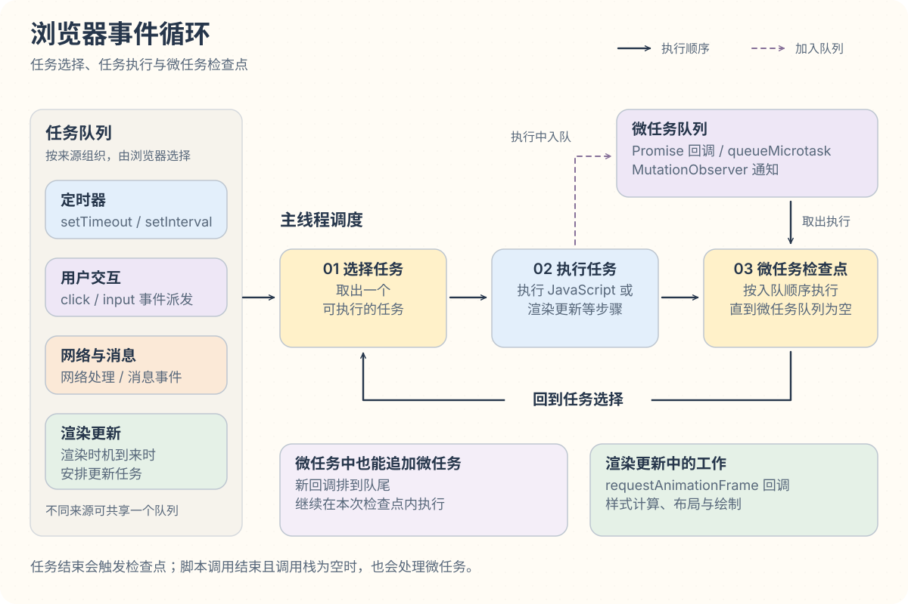
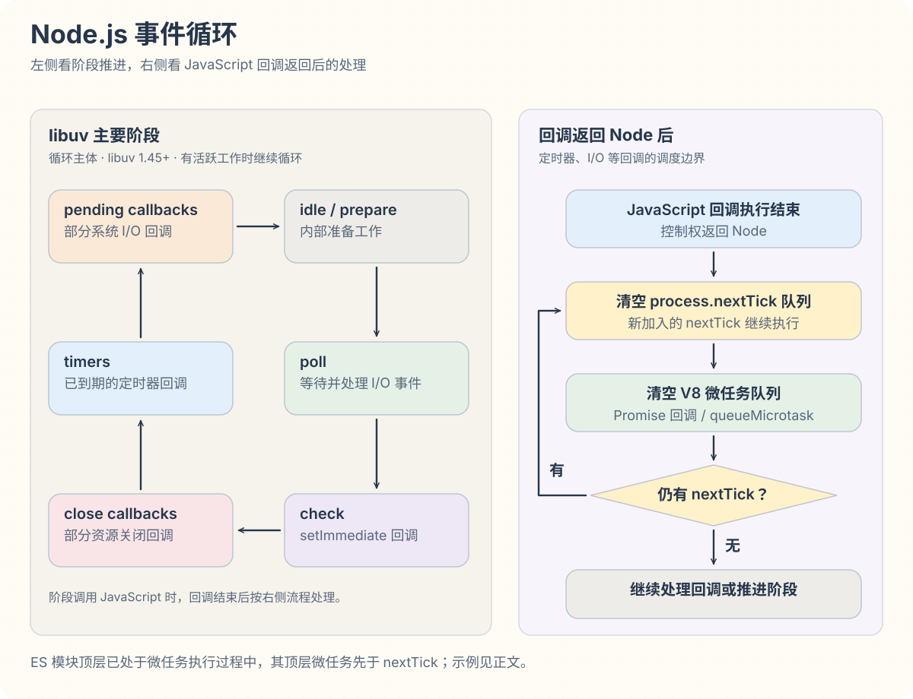

定时器到期、网络请求完成、用户点击按钮后，相应的 JavaScript 回调仍要等待合适的执行时机。**事件循环负责协调这些待执行的工作，让它们依次获得执行机会。** 浏览器和 Node.js 都有事件循环，具体的调度规则由各自的运行环境决定。

## 回调为什么要等待

浏览器主线程一次执行一段 JavaScript。函数调用进入调用栈，返回时退出调用栈；当前同步代码执行期间，定时器回调需要等待。

```js
console.log('开始')

setTimeout(() => {
  console.log('定时器回调')
}, 0)

console.log('结束')
```

输出：

```txt
开始
结束
定时器回调
```

调用 `setTimeout()` 时，浏览器登记定时器，然后立即继续执行后面的语句。延迟时间满足后，定时器回调进入等待执行的队列。即使延迟设为 `0`，回调也要等当前代码执行结束。

网络请求也是类似的分工：浏览器负责网络通信，JavaScript 可以继续执行其他代码；结果就绪后，再按相应接口的规则安排后续处理。调用栈的执行过程见 [执行上下文](./execution-context.md)。

## 浏览器中的任务与微任务

浏览器把定时器回调、用户交互事件的派发等工作组织成 **任务（task，也常称宏任务）**。事件循环每次选择一个可执行任务，执行其中的步骤。

**微任务（microtask）** 用于安排当前同步代码结束后的后续处理。Promise 的 `then()` 回调和 `queueMicrotask()` 回调都通过微任务执行。浏览器会在规定的检查点处理微任务，其中一个检查点就在任务结束后、选择下一个任务之前。

```js
console.log('A')

setTimeout(() => {
  console.log('B')
}, 0)

Promise.resolve().then(() => {
  console.log('C')
})

console.log('D')
```

输出：

```txt
A
D
C
B
```

执行这段脚本时，先输出 `A`、`D`。`Promise.resolve()` 已经成功完成，因此注册的 `then()` 回调会进入微任务队列；当前同步代码结束后执行它，输出 `C`。定时器回调属于后续任务，输出 `B`。

### 任务执行与微任务检查点

**微任务检查点**是浏览器集中执行微任务的时机。处理时按入队顺序逐个执行，执行过程中新增的微任务也会追加到队尾，直到队列为空。



任务结束会触发检查点；浏览器调用脚本结束且调用栈为空时，也会触发检查点。因此，在浏览器派发的事件中，某个监听器结束后可能先执行微任务，再继续调用其他监听器。脚本直接调用 `dispatchEvent()` 时，外层脚本仍在调用栈中，微任务要等同步调用返回后才有机会执行。相关规则见 [HTML：脚本执行后的清理](https://html.spec.whatwg.org/multipage/webappapis.html#clean-up-after-running-script)。

### 常见的调度来源

| 回调或事件来源 | 类型 | 如何安排后续执行 |
| --- | --- | --- |
| `setTimeout()`、`setInterval()` 的回调 | 任务（宏任务） | 延迟条件满足后安排定时器任务 |
| 用户点击、输入的事件派发 | 任务（宏任务） | 浏览器安排事件派发任务，在派发过程中调用监听器 |
| `postMessage()`、`MessageChannel` 的消息处理 | 任务（宏任务） | 通过消息任务调用相应处理函数 |
| Promise 的 `then()`、`catch()`、`finally()` 回调 | 微任务 | Promise 状态确定后，安排相应的回调执行 |
| `queueMicrotask()` 的回调 | 微任务 | 将回调加入微任务队列 |
| `MutationObserver` 的通知回调 | 微任务 | 在微任务中通知 DOM 变化 |

**任务（宏任务）**按来源归类，例如用户交互、定时器、网络。浏览器可以维护多个任务队列，并从中选择可执行任务；同一任务源的顺序受到规范约束，不同来源之间的相对顺序取决于具体接口和浏览器调度策略。

**微任务**进入单独的微任务队列，在微任务检查点集中执行，清空后再继续处理后续任务。两类队列的调度规则见 [HTML：事件循环](https://html.spec.whatwg.org/multipage/webappapis.html#event-loops)。

## 微任务何时入队

### Promise 链的后续回调

调用 `then()` 会注册回调。若 Promise 还在等待结果，回调也继续等待；当 Promise 成功或失败后，才安排对应的回调执行。已经确定状态的 Promise 则在注册回调时安排微任务。

```js
console.log('script start')

Promise.resolve()
  .then(() => console.log('promise1'))
  .then(() => console.log('promise2'))

queueMicrotask(() => console.log('queueMicrotask'))

console.log('script end')
```

输出：

```txt
script start
script end
promise1
queueMicrotask
promise2
```

同步代码执行结束时，微任务队列中依次是 `promise1` 和 `queueMicrotask`。第一个 `then()` 的回调执行完后，该 `then()` 返回的 Promise 才完成，`promise2` 随之排到队尾。浏览器会在同一次微任务检查点中继续执行它。

### `async/await` 的暂停与恢复

`async` 函数从调用处开始同步执行，到 `await` 时暂停当前函数，将控制权交回调用方。等待的值准备好后，函数从暂停处通过微任务继续执行。

```js
async function run() {
  console.log('A')
  await 1
  console.log('B')
}

console.log('C')
run()
console.log('D')
```

输出：

```txt
C
A
D
B
```

`await 1` 等待的是一个立即可用的值，后面的 `B` 仍会延后执行，因此调用方先输出 `D`。等待尚未完成的 Promise 时，函数要等它完成后才能继续；失败则在 `await` 处抛出异常。

`new Promise(executor)` 中的 `executor` 会在创建 Promise 时同步执行。下面的例子同时包含同步执行和两处微任务：

```js
async function async1() {
  console.log('async1 start')
  await async2()
  console.log('async1 end')
}

async function async2() {
  console.log('async2')
}

console.log('script start')
async1()

new Promise((resolve) => {
  console.log('promise1')
  resolve()
}).then(() => console.log('promise2'))

console.log('script end')
```

输出：

```txt
script start
async1 start
async2
promise1
script end
async1 end
promise2
```

`async2()` 同步打印并返回已完成的 Promise，随后安排 `async1()` 的继续执行。`promise1` 是创建 Promise 时的同步输出；`promise2` 对应的微任务稍后入队，所以排在 `async1 end` 之后。

## 渲染与主线程响应

JavaScript 修改 DOM 后，浏览器还要计算样式、布局并绘制，用户才能看到更新。渲染更新会根据屏幕刷新节奏、页面可见性等条件调度；两个相邻的 JavaScript 任务之间可能没有绘制。HTML 规范在渲染时机到来时安排渲染更新任务，见 [事件循环处理模型](https://html.spec.whatwg.org/multipage/webappapis.html#event-loop-processing-model)。

例如，点击回调把按钮文字改成“处理中”，随后通过 `Promise.then()` 执行一段耗时计算。文字虽然已经写入 DOM，微任务中的计算仍会占用主线程，页面可能直到计算结束后才显示新文字。

`requestAnimationFrame()` 的回调在渲染更新过程中、下一次重绘前执行，适合更新动画状态。回调中的耗时计算同样会推迟这一帧的显示。需要让页面继续响应时，可以把计算拆成较小的任务，或交给 [Web Worker](../../frontend/browser/web-worker.md) 在独立线程执行。

微任务适合短小的后续处理。连续创建微任务会让当前检查点一直无法结束，其他任务和渲染更新就得不到执行机会。把工作排入后续任务，可以让浏览器重新调度；具体何时绘制仍由浏览器决定。

## Node.js 事件循环

Node.js 使用 **libuv** 处理事件循环和输入输出（I/O）等底层工作。网络通信通常由操作系统提供的机制驱动，文件操作等部分工作使用线程池；相应的 JavaScript 回调由 Node 调度执行。

### 阶段与回调

Node 在执行入口脚本后，按阶段处理待执行的工作。各阶段承担不同职责：

| 阶段 | 主要工作 |
| --- | --- |
| `timers` | 执行已达到延迟条件的 `setTimeout()`、`setInterval()` 回调 |
| `pending callbacks` | 执行部分延迟处理的系统 I/O 回调 |
| `idle, prepare` | 执行内部准备工作 |
| `poll` | 获取 I/O 事件、执行相应回调；没有就绪工作时可在此等待 |
| `check` | 执行 `setImmediate()` 回调 |
| `close callbacks` | 执行部分关闭回调，例如套接字的 `'close'` 回调 |

阶段循环推进。以 `poll` 为例，有待处理回调时会依次执行，直到处理完或达到实现限制；等待时长则受定时器和其他待处理工作的影响。



libuv 1.45.0 起（随 Node 20 系列引入），循环中的定时器处理调整到 `poll` 之后。分析 `timers`、`poll`、`check` 的相对时机时，需要结合 Node 与 libuv 版本。阶段说明见 [Node：事件循环](https://nodejs.org/en/learn/asynchronous-work/event-loop-timers-and-nexttick)，底层流程见 [libuv：I/O 循环](https://docs.libuv.org/en/v1.x/design.html#the-i-o-loop)。

### `process.nextTick()` 与微任务

Node 另外维护 `process.nextTick()` 队列。Promise 回调和 `queueMicrotask()` 则由 V8（Node 使用的 JavaScript 引擎）的微任务队列处理。

在 CommonJS 入口脚本执行结束，或定时器、I/O 等回调返回 Node 的调度边界时，Node 先处理 `nextTick` 队列，再处理微任务。这些后续回调完成后，才继续阶段中的其他工作。

将下面的代码保存为 `.cjs` 文件运行：

```js
console.log('start')

process.nextTick(() => console.log('nextTick'))
Promise.resolve().then(() => console.log('promise'))
queueMicrotask(() => console.log('microtask'))

console.log('end')
```

输出：

```txt
start
end
nextTick
promise
microtask
```

处理微任务期间新注册的 `nextTick` 回调，会等本次微任务队列处理完成后再执行。若两类队列继续产生新工作，Node 会继续处理，再返回阶段调度。因此，同一阶段的两个 I/O 回调之间，也可能执行前一个回调创建的 `nextTick` 和微任务。

ES 模块（ESM）的顶层代码本身通过异步模块执行流程运行。执行下面的 `.mjs` 文件时，Node 已经在处理微任务，因此先执行新加入的微任务，再执行 `nextTick`：

```js
import { nextTick } from 'node:process'

Promise.resolve().then(() => console.log('promise'))
queueMicrotask(() => console.log('microtask'))
nextTick(() => console.log('nextTick'))
```

输出：

```txt
promise
microtask
nextTick
```

模块格式影响的是这里的顶层执行顺序。定时器或 I/O 回调返回 Node 后，仍按相应的回调调度规则处理队列。参见 [Node：queueMicrotask 与 process.nextTick](https://nodejs.org/api/process.html#when-to-use-queuemicrotask-vs-processnexttick)。

### 定时器与 `setImmediate()`

`setTimeout(callback, delay)` 给出回调等待的延迟条件。到期后仍要等待 JavaScript 执行机会，实际延迟可能更长。Node 对小于 `1`、大于 `2147483647` 或为 `NaN` 的延迟按 `1` 毫秒处理，见 [Node：setTimeout](https://nodejs.org/api/timers.html#settimeoutcallback-delay-args)。

`setImmediate()` 的回调在 `check` 阶段执行。它与 `setTimeout(fn, 0)` 的相对顺序取决于注册位置：主模块顶层同时注册时，顺序不固定；在 I/O 回调内同时注册时，`setImmediate()` 先执行。

下面的示例保存为 `.cjs` 文件运行：

```js
const fs = require('node:fs')

fs.readFile(__filename, () => {
  setTimeout(() => console.log('timeout'), 0)
  setImmediate(() => console.log('immediate'))
})
```

输出：

```txt
immediate
timeout
```

文件读取回调执行后，循环会进入 `check` 阶段执行 `setImmediate()`，随后才有机会处理这里新注册的定时器。

## 按执行目标选择调度方式

| 目标 | 调度方式 |
| --- | --- |
| 当前同步代码结束后做短小的收尾处理 | `queueMicrotask()`，或已有 Promise 流程的后续回调 |
| 浏览器更新下一帧的动画状态 | `requestAnimationFrame()` |
| 浏览器分批处理计算，给其他工作执行机会 | 将每批工作放到后续任务，例如通过 `setTimeout()` 调度 |
| Node 分批处理计算，给 I/O 执行机会 | 通过 `setImmediate()` 安排后续批次 |
| 把耗时计算移出主线程 | 浏览器使用 Web Worker，Node 使用 Worker Threads |

`process.nextTick()` 适用于需要其特定执行顺序的 Node 接口。持续追加 `nextTick` 或微任务会延迟 I/O 和定时器；需要让事件循环继续推进时，应把工作分到后续任务或阶段。

## 参考

- [MDN：JavaScript 执行模型](https://developer.mozilla.org/en-US/docs/Web/JavaScript/Reference/Execution_model)
- [MDN：微任务](https://developer.mozilla.org/en-US/docs/Web/API/HTML_DOM_API/Microtask_guide)
- [HTML Standard：事件循环](https://html.spec.whatwg.org/multipage/webappapis.html#event-loops)
- [Node.js：事件循环](https://nodejs.org/en/learn/asynchronous-work/event-loop-timers-and-nexttick)
- [Node.js：queueMicrotask 与 process.nextTick](https://nodejs.org/api/process.html#when-to-use-queuemicrotask-vs-processnexttick)
