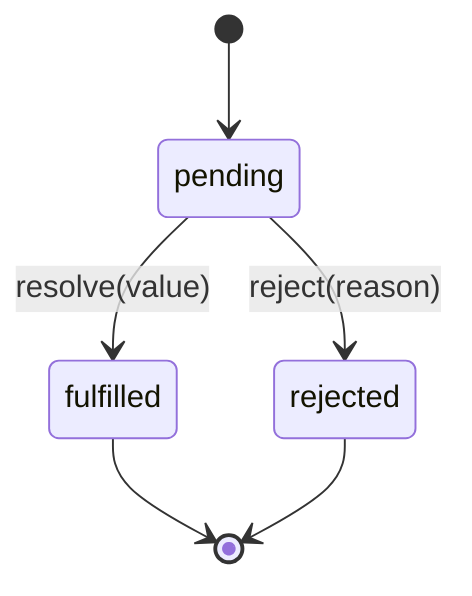

`Promise` 用来表示一个暂时还拿不到的结果。网络请求、读取文件和计时器都可能稍后才完成，函数可以先返回 Promise，调用方再决定成功、失败和完成后分别做什么。

下面是一个可以直接运行的最小例子：

```js
function getUserName() {
  return new Promise((resolve) => {
    setTimeout(() => resolve('Ada'), 100)
  })
}

console.log('开始读取')

getUserName().then((name) => {
  console.log(`用户名：${name}`)
})

console.log('请求已经发出')

// 输出：
// 开始读取
// 请求已经发出
// 用户名：Ada
```

`getUserName()` 不必等计时器结束才返回。它立即返回 Promise；100 毫秒后，`resolve('Ada')` 把结果交给 `then()` 中的函数。

## 一个 Promise 的完整流程

Promise 把一次异步操作分成三个角色：

1. 创建 Promise 的代码启动操作。
2. 操作成功时调用 `resolve(value)`，失败时调用 `reject(error)`。
3. 调用方使用 `then()`、`catch()` 或 `await` 读取结果。

```js
function divideLater(a, b) {
  return new Promise((resolve, reject) => {
    setTimeout(() => {
      if (b === 0) {
        reject(new Error('除数不能为 0'))
        return
      }

      resolve(a / b)
    }, 100)
  })
}

divideLater(12, 3)
  .then((result) => console.log(result))
  .catch((error) => console.log(error.message))

// 100 毫秒后输出：
// 4
```

把调用改成 `divideLater(12, 0)`，输出为：

```text
除数不能为 0
```

## 三种状态

Promise 创建后只可能处于以下三种状态：



| 状态        | 中文说明 | 保存的内容       |
| ----------- | -------- | ---------------- |
| `pending`   | 等待中   | 暂时没有最终结果 |
| `fulfilled` | 已兑现   | 成功值           |
| `rejected`  | 已拒绝   | 失败原因         |

`fulfilled` 和 `rejected` 合称 settled（已敲定）。状态只能从 `pending` 改变一次，之后再调用 `resolve()` 或 `reject()` 不会改写结果。

```js
const promise = new Promise((resolve, reject) => {
  resolve('第一次结果')
  reject(new Error('这次调用无效'))
  resolve('这次调用也无效')
})

promise.then(console.log)

// 输出：
// 第一次结果
```

## 执行器同步运行，处理函数异步运行

传给 `new Promise()` 的函数称为 executor（执行器）。执行器在创建 Promise 时立即同步运行；传给 `then()` 的处理函数则要等当前同步代码结束后运行。

```js
console.log('A')

const promise = new Promise((resolve) => {
  console.log('B')
  resolve('D')
})

promise.then(console.log)
console.log('C')

// 输出：
// A
// B
// C
// D
```

这个例子可以先记住两个结论：

- `new Promise(executor)` 不会让 `executor` 自动变成异步代码。
- 即使 Promise 已经成功，`then()` 中的函数也不会插入当前同步调用栈执行。

## `then()` 如何形成链

`then(onFulfilled, onRejected)` 最重要的性质是：**每次调用都会返回一个新的 Promise**。因此可以把多个异步步骤连接起来。

```js
Promise.resolve(2)
  .then((value) => value * 3)
  .then((value) => value + 1)
  .then((value) => console.log(value))

// 输出：
// 7
```

上一环处理函数的结果决定下一环收到什么：

| 处理函数的行为 | 下一环的结果                     |
| -------------- | -------------------------------- |
| `return 10`    | fulfilled，值为 `10`             |
| 没写 `return`  | fulfilled，值为 `undefined`      |
| `throw error`  | rejected，原因为 `error`         |
| 返回 Promise   | 等待这个 Promise，再采用它的结果 |

### 返回普通值

```js
Promise.resolve(5)
  .then((value) => value * 2)
  .then((value) => console.log(value))

// 输出：
// 10
```

### 返回另一个 Promise

```js
function doubleLater(value) {
  return new Promise((resolve) => {
    setTimeout(() => resolve(value * 2), 100)
  })
}

Promise.resolve(5)
  .then(doubleLater)
  .then((value) => console.log(value))

// 100 毫秒后输出：
// 10
```

第二个 `then()` 会等待 `doubleLater()` 返回的 Promise，而不是直接收到一个 Promise 对象。

### 返回值不能漏掉

```js
function saveLater() {
  return new Promise((resolve) => {
    setTimeout(() => {
      console.log('保存完成')
      resolve()
    }, 100)
  })
}

Promise.resolve()
  .then(() => {
    return saveLater()
  })
  .then(() => console.log('流程结束'))

// 输出：
// 保存完成
// 流程结束
```

如果删掉 `return`，外层链就不知道 `saveLater()` 何时完成，输出会变成：

```text
流程结束
保存完成
```

这种没有被外层链等待的 Promise 称为 floating promise（悬空 Promise）。它的完成时间和错误都更难管理。

## `catch()` 处理错误

`catch(onRejected)` 用来处理此前链上的拒绝，相当于 `then(undefined, onRejected)`。

```js
Promise.resolve(4)
  .then((value) => {
    if (value === 4) {
      throw new Error('不接受 4')
    }
    return value
  })
  .then((value) => console.log(value))
  .catch((error) => console.log(error.message))

// 输出：
// 不接受 4
```

执行器抛出的同步异常也会令 Promise rejected：

```js
new Promise(() => {
  throw new Error('创建失败')
}).catch((error) => console.log(error.message))

// 输出：
// 创建失败
```

### 捕获后是否继续报错

`catch()` 本身也会返回新 Promise。如果处理函数正常返回，链会恢复为 fulfilled：

```js
Promise.reject(new Error('读取失败'))
  .catch((error) => {
    console.log(error.message)
    return '默认值'
  })
  .then((value) => console.log(value))

// 输出：
// 读取失败
// 默认值
```

如果当前层只能记录错误、不能真正处理，就应重新抛出：

```js
Promise.reject(new Error('读取失败'))
  .catch((error) => {
    console.log(`记录日志：${error.message}`)
    throw error
  })
  .catch((error) => console.log(`上层收到：${error.message}`))

// 输出：
// 记录日志：读取失败
// 上层收到：读取失败
```

### `then(success, failure)` 的边界

同一个 `then(success, failure)` 中，`failure` 只能处理进入这个 `then()` 之前已有的拒绝，不能捕获同级 `success` 内新抛出的错误。

```js
Promise.resolve('data')
  .then(
    () => {
      throw new Error('处理失败')
    },
    () => console.log('同级 failure 不会执行')
  )
  .catch((error) => console.log(error.message))

// 输出：
// 处理失败
```

一般把统一的 `catch()` 放在链尾会更清楚。

## `finally()` 执行清理

`finally()` 无论成功还是失败都会执行，适合关闭加载状态、释放锁或清理临时资源。

```js
Promise.resolve('用户数据')
  .then((value) => console.log(value))
  .finally(() => console.log('关闭加载状态'))

// 输出：
// 用户数据
// 关闭加载状态
```

`finally()` 不接收原来的值。只要它正常结束，原来的成功值或失败原因就会继续传递：

```js
Promise.resolve(10)
  .finally(() => 999)
  .then((value) => console.log(value))

// 输出：
// 10
```

如果 `finally()` 抛出新异常或返回 rejected Promise，新错误会取代原结果。

## 组合多个 Promise

多个互不依赖的操作可以一起启动，再通过组合方法统一等待。

```js
function delay(ms, value, shouldReject = false) {
  return new Promise((resolve, reject) => {
    setTimeout(() => {
      if (shouldReject) {
        reject(new Error(String(value)))
      } else {
        resolve(value)
      }
    }, ms)
  })
}
```

上面的 `delay()` 只是后续示例使用的辅助函数，调用 `delay(100, 'A')` 会在约 100 毫秒后得到 `'A'`。

### `Promise.all()`：必须全部成功

```js
const values = await Promise.all([delay(30, 'A'), delay(10, 'B'), 3])

console.log(values)

// 输出：
// ['A', 'B', 3]
```

虽然 `'B'` 更早完成，但结果仍按输入顺序排列。任意一项失败时，`Promise.all()` 会立即变成 rejected：

```js
try {
  await Promise.all([delay(30, 'A'), delay(10, 'B 失败', true)])
} catch (error) {
  console.log(error.message)
}

// 输出：
// B 失败
```

快速失败只会改变 `Promise.all()` 的结果，不会自动取消其他已经开始的任务。

### `Promise.allSettled()`：收集每一项结果

```js
const results = await Promise.allSettled([delay(10, 'A'), delay(20, 'B 失败', true)])

console.log(results[0])
console.log(results[1].status, results[1].reason.message)

// 输出：
// { status: 'fulfilled', value: 'A' }
// rejected B 失败
```

它适合批量操作：某一项失败时，仍然需要知道其他项的结果。

### `Promise.race()`：采用最先结束的一项

```js
const value = await Promise.race([delay(30, '慢'), delay(10, '快')])

console.log(value)

// 输出：
// 快
```

“最先结束”既可能是 fulfilled，也可能是 rejected。空的 `Promise.race([])` 会一直保持 `pending`。

### `Promise.any()`：采用最先成功的一项

```js
const value = await Promise.any([delay(10, '第一个失败', true), delay(20, '第二个成功')])

console.log(value)

// 输出：
// 第二个成功
```

只有所有输入都失败时，`Promise.any()` 才会 rejected，拒绝原因是包含所有错误的 `AggregateError`。

### 组合方法对比

| 方法                   | 什么时候 fulfilled | 什么时候 rejected       | 空输入结果       |
| ---------------------- | ------------------ | ----------------------- | ---------------- |
| `Promise.all()`        | 全部成功           | 任意一项失败            | `[]`             |
| `Promise.allSettled()` | 全部结束           | 不因单项失败而 rejected | `[]`             |
| `Promise.race()`       | 最先结束项成功     | 最先结束项失败          | 一直 pending     |
| `Promise.any()`        | 任意一项成功       | 全部失败                | `AggregateError` |

这些方法接收可迭代对象。普通值会先按 `Promise.resolve(value)` 处理。

## `Promise.resolve()` 与 `Promise.reject()`

`Promise.resolve(value)` 把普通值、Promise 或 thenable 统一转换为可等待的 Promise。`Promise.reject(reason)` 创建一个 rejected Promise。

```js
const value = await Promise.resolve(42)
console.log(value)

Promise.reject(new Error('失败')).catch((error) => console.log(error.message))

// 输出：
// 42
// 失败
```

## `async` / `await`

`async` 和 `await` 建立在 Promise 之上。`async` 函数调用后总是返回 Promise：返回普通值相当于调用 `resolve()`，抛出异常相当于调用 `reject()`。

```js
async function getNumber() {
  return 8
}

async function fail() {
  throw new Error('计算失败')
}

getNumber().then(console.log)
fail().catch((error) => console.log(error.message))

// 输出：
// 8
// 计算失败
```

`await` 会等待 Promise。成功时得到值，失败时在当前位置抛出异常，因此可以配合 `try...catch`：

```js
async function main() {
  try {
    const value = await Promise.resolve(6)
    console.log(value * 2)
    await Promise.reject(new Error('后续失败'))
  } catch (error) {
    console.log(error.message)
  }
}

await main()

// 输出：
// 12
// 后续失败
```

`await` 只暂停当前 `async` 函数的后续代码，不会阻塞整个 JavaScript 线程。

### 串行与并发

连续 `await` 会形成串行依赖：

```js
const start = Date.now()

await delay(100, 'A')
await delay(100, 'B')

console.log(Date.now() - start >= 190)

// 输出：
// true
```

互不依赖的任务可以先一起启动：

```js
const start = Date.now()

await Promise.all([delay(100, 'A'), delay(100, 'B')])

console.log(Date.now() - start < 190)

// 通常输出：
// true
```

这里的并发表示两个等待区间重叠，不表示两段 JavaScript 同时在一个线程上执行。CPU 密集型并行计算需要 Web Worker 或 Node.js Worker Threads 等机制。

## Promise 与微任务

在 ECMAScript 规范中，`then()`、`catch()` 和 `finally()` 的处理过程属于 Promise Job；浏览器和 Node.js 会通过微任务机制调度这些工作。

```js
console.log('同步 1')

Promise.resolve().then(() => console.log('Promise 微任务'))
queueMicrotask(() => console.log('显式微任务'))
setTimeout(() => console.log('计时器任务'), 0)

console.log('同步 2')

// 浏览器中输出：
// 同步 1
// 同步 2
// Promise 微任务
// 显式微任务
// 计时器任务
```

当前 task 结束后会清空可执行的微任务，然后事件循环才进入后续 task。更完整的浏览器与 Node.js 差异见[事件循环](./event-loop.md)。

## Promise 本身不能取消任务

Promise 只表示结果，没有通用的 `promise.cancel()`。如果底层 API 支持 `AbortSignal`，应取消底层工作，而不是只停止等待。

```js
function wait(ms, signal) {
  return new Promise((resolve, reject) => {
    if (signal.aborted) {
      reject(signal.reason ?? new DOMException('Aborted', 'AbortError'))
      return
    }

    const timer = setTimeout(() => {
      signal.removeEventListener('abort', onAbort)
      resolve()
    }, ms)

    function onAbort() {
      clearTimeout(timer)
      reject(signal.reason ?? new DOMException('Aborted', 'AbortError'))
    }

    signal.addEventListener('abort', onAbort, { once: true })
  })
}

const controller = new AbortController()
const pending = wait(1000, controller.signal)

setTimeout(() => controller.abort(), 10)

try {
  await pending
} catch (error) {
  console.log(error.name)
}

// 输出：
// AbortError
```

`fetch(url, { signal })` 也使用同一套取消方式。只用 `Promise.race([request, timeout])` 实现超时，会让调用方停止等待，但不会自动终止原请求。

## 常见错误

### 已返回 Promise 时再包一层

```js
function loadValue() {
  return Promise.resolve(10)
}

// 多余写法
function wrappedLoadValue() {
  return new Promise((resolve, reject) => {
    loadValue().then(resolve, reject)
  })
}

// 直接返回即可
function directLoadValue() {
  return loadValue()
}

console.log(await directLoadValue())

// 输出：
// 10
```

### 使用 `forEach()` 等待异步回调

`forEach()` 不收集回调返回的 Promise，也不会等待它们：

```js
const values = []

await [1, 2].forEach(async (value) => {
  await delay(10, value)
  values.push(value)
})

console.log(values)

// 输出：
// []
```

依次执行使用 `for...of`：

```js
const values = []

for (const value of [1, 2]) {
  values.push(await delay(10, value))
}

console.log(values)

// 输出：
// [1, 2]
```

全部并发并等待则使用 `map()` 和 `Promise.all()`：

```js
const values = await Promise.all([1, 2].map((value) => delay(10, value)))

console.log(values)

// 输出：
// [1, 2]
```

任务很多或服务端有限流要求时，应使用有并发上限的调度器，完整演进见[异步任务并发与有序消费](./ordered-concurrent-processing.md)。

### 把 `async` 函数作为 Promise 执行器

```js
// 避免这种写法
const outer = new Promise(async () => {
  throw new Error('异步执行器失败')
})

outer.catch(() => console.log('不会执行'))

// 运行时会报告未处理的拒绝：
// Error: 异步执行器失败
// outer 自身仍然是 pending
```

Promise 构造器只会捕获执行器同步抛出的异常。`async` 执行器隐式返回的另一个 Promise 不会被构造器自动采用。已经能使用 `async` 函数时，直接返回结果即可：

```js
async function load() {
  throw new Error('读取失败')
}

load().catch((error) => console.log(error.message))

// 输出：
// 读取失败
```

### 忘记检查 HTTP 状态

`fetch()` 只在网络错误、中止等情况下 rejected。服务器返回 `404` 或 `500` 时，Promise 通常仍会 fulfilled，需要检查 `response.ok`：

```js
async function requestJson(url) {
  const response = await fetch(url)

  if (!response.ok) {
    throw new Error(`HTTP ${response.status}`)
  }

  return response.json()
}

// 假设服务器返回 404：
requestJson('/missing').catch((error) => console.log(error.message))

// 输出：
// HTTP 404
```

## 进阶：Promise 解析过程

基础使用只需要理解三种状态。实现 Promise 或处理第三方对象时，还需要区分“已解析”和“已兑现”。

### thenable

thenable 是具有可调用 `then` 属性的对象，不要求它由原生 `Promise` 创建。`Promise.resolve()` 会尝试接纳它的最终结果：

```js
const thenable = {
  then(resolve) {
    resolve(42)
  }
}

console.log(await Promise.resolve(thenable))

// 输出：
// 42
```

### resolved 不一定已经 fulfilled

外层 Promise 可以先锁定为跟随另一个仍在等待的 Promise。此时它已经 resolved（解析过程不可再改变），但仍然是 `pending`；只有内层 Promise 成功后，它才变成 `fulfilled`。

```js
let finish

const inner = new Promise((resolve) => {
  finish = resolve
})

const outer = new Promise((resolve, reject) => {
  resolve(inner)
  reject(new Error('无效：outer 已锁定为跟随 inner'))
})

setTimeout(() => finish('完成'), 10)
console.log(await outer)

// 输出：
// 完成
```

因此，`resolve(value)` 更准确的含义是“启动解析过程”：普通值会直接兑现，Promise 或 thenable 则会被接纳。

## 较新的便捷方法

| 方法                             | 作用                                       | 注意事项                               |
| -------------------------------- | ------------------------------------------ | -------------------------------------- |
| `Promise.withResolvers()`        | 返回 `{ promise, resolve, reject }`        | 适合解析函数必须保存在执行器外部的场景 |
| `Promise.try(callback, ...args)` | 统一包装回调的同步返回、同步异常和异步结果 | 较新的 API，使用前检查目标运行时       |

```js
const { promise, resolve } = Promise.withResolvers()

resolve(42)
console.log(await promise)

// 输出：
// 42
```

多数业务函数仍应在内部控制状态，只把 Promise 返回给调用方。不要仅为了少写几行代码而到处暴露 `resolve` 和 `reject`。

## API 选择

| 目标                 | 使用方式                   |
| -------------------- | -------------------------- |
| 处理单个成功结果     | `then()` 或 `await`        |
| 处理链上的失败       | `catch()` 或 `try...catch` |
| 无论成功失败都清理   | `finally()`                |
| 所有任务必须成功     | `Promise.all()`            |
| 收集每项成功或失败   | `Promise.allSettled()`     |
| 取得最先结束的结果   | `Promise.race()`           |
| 取得最先成功的结果   | `Promise.any()`            |
| 包装旧回调 API       | `new Promise()`            |
| 限制大量任务同时运行 | 并发调度器                 |

## 参考

- [ECMA-262: Promise Objects](https://tc39.es/ecma262/multipage/control-abstraction-objects.html#sec-promise-objects)
- [MDN: How to use promises](https://developer.mozilla.org/en-US/docs/Learn_web_development/Extensions/Async_JS/Promises)
- [MDN: Using promises](https://developer.mozilla.org/en-US/docs/Web/JavaScript/Guide/Using_promises)
- [MDN: Promise](https://developer.mozilla.org/en-US/docs/Web/JavaScript/Reference/Global_Objects/Promise)
- [JavaScript.info: Promise](https://javascript.info/promise-basics)
