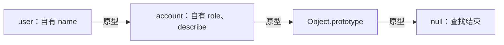
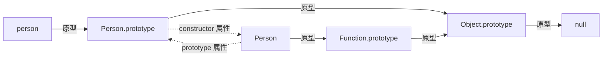

**原型是对象在查找自身不存在的属性时，会继续查询的另一个对象；原型链是这些对象沿原型关系连接起来的查找路径。** 继承方法依靠这条路径，不需要把方法复制到每个对象上。

## 属性查找与原型链

对象直接持有的属性称为**自有属性**，沿原型链找到的属性称为**继承属性**。`Object.create(proto)` 创建一个新对象，并以 `proto` 作为它的直接原型：

```js
const account = {
  role: 'reader',
  describe() {
    return `${this.name}:${this.role}`
  }
}

const user = Object.create(account)
user.name = 'Lin'

console.log(user.name) // 'Lin'
console.log(user.role) // 'reader'
console.log(user.describe()) // 'Lin:reader'
console.log(user.missing) // undefined
console.log(Object.hasOwn(user, 'role')) // false
```

读取 `user.role` 时，先检查 `user`，再检查 `account`。读取 `user.missing` 时，整条链都没有这个属性，结果才是 `undefined`：



`Object.prototype` 是普通对象字面量的默认原型，它的原型为 `null`。**查找终点是 `null`，并非所有对象都必须经过 `Object.prototype`**，例如 `Object.create(null)` 创建的对象就没有原型。

找到同名属性后便停止查找，即使它的值为 `undefined`。这个过程与属性是否可枚举无关；可枚举性控制属性是否参与某些遍历操作，不决定属性能否读取。

上面的 `describe` 是普通方法。通过 `user.describe()` 调用时，`this` 是 `user`，不会因为方法存放在 `account` 上而变成 `account`。其他调用形式见 [this 指向](./this-binding.md)。

## `[[Prototype]]`、`prototype` 与 `__proto__`

`[[Prototype]]` 是规范描述普通对象内部原型链接的记号，内部槽表示由引擎维护、不能像普通属性一样直接访问的内部状态。读取直接原型使用 `Object.getPrototypeOf(obj)`；`obj['[[Prototype]]']` 只会读取一个同名普通属性。

`prototype` 则是普通属性名。对通常的构造函数 `Person` 而言，`Person.prototype` 保存供新实例使用的原型对象，**它不是 `Person` 函数对象自身的原型**。

`__proto__` 通常来自 `Object.prototype` 上的历史访问器，即通过取值、赋值触发函数来读取或修改原型的属性。它可以被同名自有属性遮蔽，无原型对象也不会继承它。代码中使用 `Object.getPrototypeOf()` 表达读取意图更明确。规范仍保留这一历史接口，并未删除它。

| 写法 | 含义 | 读取或使用方式 |
| --- | --- | --- |
| 对象的 `[[Prototype]]` | 对象自身的内部原型链接 | `Object.getPrototypeOf(obj)` |
| `Person.prototype` | 通常用作 `new Person()` 所创建实例的原型 | 直接读取普通属性 |
| `obj.__proto__` | 通常是继承来的原型访问器，也可能是同名普通属性 | 不作为通用的原型读取方式 |

“隐式原型”通常指 `[[Prototype]]`，“显式原型”通常指构造函数的 `prototype` 属性。这些俗称描述的是两种不同关系，不能互换。

对象字面量中的 `{ __proto__: proto }` 是另一种情况：它是创建对象时设置原型的标准语法，不是调用上述历史访问器；`{ ['__proto__']: proto }` 则创建普通自有属性。参见 [MDN 对两种写法的区分](https://developer.mozilla.org/en-US/docs/Web/JavaScript/Guide/Inheritance_and_the_prototype_chain#objects_created_with_syntax_constructs)。

## 构造函数、实例与 `constructor`

构造函数是可以通过 `new` 调用来创建对象的函数。以下普通构造函数把状态保存在实例上，把共享方法保存在原型上：

```js
function Person(name) {
  this.name = name
}

Person.prototype.sayName = function () {
  return this.name
}

const person = new Person('Lin')

console.log(Object.getPrototypeOf(person) === Person.prototype) // true
console.log(Object.getPrototypeOf(Person) === Function.prototype) // true
console.log(Person.prototype.constructor === Person) // true
console.log(Object.hasOwn(person, 'sayName')) // false
console.log(person.sayName()) // 'Lin'
```

实线表示内部原型关系，虚线表示普通属性引用。虽然 `constructor` 指回了函数，但它不属于原型链，不会造成原型链循环：



在这个例子中，`new Person('Lin')` 创建对象、将其原型设为当前的 `Person.prototype`，再以该对象为 `this` 执行函数。构造函数没有显式返回另一个对象，因此最终得到新实例。返回对象等情况见 [手写 new 操作符](./implement-new.md)。

`constructor` 是普通属性，通常由实例从原型继承而来。它可以被修改或遮蔽，不是引擎保存的“创建者记录”，`new Person()` 也不是通过 `Person.prototype.constructor` 决定执行哪个函数。

### 并非每个函数都有 `prototype`

普通函数声明和 `class` 有自身的 `prototype` 属性；箭头函数、简写方法和 `async` 函数默认没有，也不能使用 `new` 调用。手动给箭头函数添加 `prototype` 不会让它获得构造能力。

反过来，生成器函数（使用 `function*` 声明、调用后返回可逐步产生值的生成器对象）有 `prototype`，却不能使用 `new`；`bind()` 返回的绑定函数没有自身的 `prototype`，但绑定目标可构造时，它也可以使用 `new`。因此不能用“有没有 `prototype`”作为是否可构造的判断。参见 [MDN：Function 的 prototype 属性](https://developer.mozilla.org/en-US/docs/Web/JavaScript/Reference/Global_Objects/Function/prototype)。

## 赋值、遮蔽与共享引用

### 同名属性不会自动改写原型

对象上的自有属性优先于原型上的同名属性，这称为**属性遮蔽**。对可扩展的普通对象，如果原型上的同名属性是可写数据属性，直接赋值通常会创建自有属性：

```js
const defaults = { theme: 'light' }
const settings = Object.create(defaults)

settings.theme = 'dark'
console.log(settings.theme) // 'dark'
console.log(defaults.theme) // 'light'

settings.theme = undefined
console.log(settings.theme) // undefined
console.log(Object.hasOwn(settings, 'theme')) // true

delete settings.theme
console.log(settings.theme) // 'light'
```

删除自有属性后，继承属性重新可见。`delete settings.theme` 不会沿原型链删除 `defaults.theme`。

“赋值一定产生自有属性”并不成立：原型上的 setter（赋值时执行的函数）会接管赋值；不可写的数据属性或只有 getter（读取时执行的函数）的访问器属性会阻止普通赋值。严格模式下这类失败会抛出 `TypeError`，非严格模式下通常静默失败。属性特性见 [对象属性](./object-properties.md)，对应规则见 [ECMAScript：OrdinarySetWithOwnDescriptor](https://tc39.es/ecma262/multipage/ordinary-and-exotic-objects-behaviours.html#sec-ordinarysetwithowndescriptor)。

### 修改引用指向的对象不会产生遮蔽

```js
const shared = { tags: [] }
const first = Object.create(shared)
const second = Object.create(shared)

first.tags.push('js')
console.log(second.tags) // ['js']
console.log(Object.hasOwn(first, 'tags')) // false

first.tags = ['private']
console.log(first.tags) // ['private']
console.log(second.tags) // ['js']
```

`push()` 先沿原型链取得数组，再修改该数组；`first.tags = ...` 才是在 `first` 上创建同名属性。需要每个实例独立维护的数组或对象，应在构造函数或实例字段中创建。组合方式见 [创建对象](./creating-objects.md)。

## 修改原型对象与替换 `prototype`

修改原型对象的属性会影响仍沿该原型查找的实例；给构造函数重新赋值 `prototype`，只改变后续通常的 `new` 调用使用的原型，不会把旧实例的原型链接一起改掉：

```js
function Item() {}

const oldItem = new Item()
const oldPrototype = Item.prototype
oldPrototype.label = 'old'
console.log(oldItem.label) // 'old'

Item.prototype = { label: 'new' }
const newItem = new Item()

console.log(Object.getPrototypeOf(oldItem) === oldPrototype) // true
console.log(newItem.label) // 'new'
console.log(oldItem instanceof Item) // false
console.log(newItem instanceof Item) // true
console.log(newItem.constructor === Object) // true
```

新的对象字面量没有自有 `constructor`，所以 `newItem.constructor` 沿链找到的是 `Object.prototype.constructor`。需要维持该属性约定时，可以在新原型上显式定义 `constructor`，但它不会重新连接旧实例。

此处使用普通函数演示替换操作；`class` 的 `prototype` 属性不可重新赋值，但该属性指向的原型对象仍可修改。

### `instanceof` 检查当前关系

对上述普通构造函数，`obj instanceof Ctor` 检查的是当前 `Ctor.prototype` 是否出现在 `obj` 的原型链上，不检查 `obj.constructor`，也不证明执行过 `Ctor`：

```js
function Record() {}
const record = Object.create(Record.prototype)
console.log(record instanceof Record) // true
```

这个解释有适用范围：`Symbol.hasInstance` 是可自定义实例判断逻辑的方法入口；绑定函数有额外处理，不同窗口也可能持有不同的内置原型对象。详见 [判断数据类型](./type-checking.md) 和 [MDN：instanceof](https://developer.mozilla.org/en-US/docs/Web/JavaScript/Reference/Operators/instanceof)。

## `class extends` 建立的两条关系

`class` 的普通实例方法放在类的 `prototype` 对象上，实例字段属于实例本身，`static` 静态方法属于类这个函数对象。`extends` 同时连接实例方法所在的原型对象与类本身：

```js
class Person {
  sayName() { return this.name }
  static kind() { return 'person' }
}

class Student extends Person {
  name = 'Lin'
}

const student = new Student()
console.log(Object.getPrototypeOf(Student.prototype) === Person.prototype) // true
console.log(Object.getPrototypeOf(Student) === Person) // true
console.log(student.sayName()) // 'Lin'
console.log(Student.kind()) // 'person'
console.log(Object.hasOwn(student, 'name')) // true
```

实例方法查找沿 `student → Student.prototype → Person.prototype` 进行；静态方法查找沿 `Student → Person` 进行。两条关系的作用不同。类语法细节见 [类](./class.md)，构造函数继承方案见 [继承](./inheritance.md)，规范关系的说明见 [MDN：extends](https://developer.mozilla.org/en-US/docs/Web/JavaScript/Reference/Classes/extends#description)。

## 原型操作与属性检查速查

`Object.create(null)` 创建没有原型的对象，因此也不会继承 `toString`、`hasOwnProperty` 等方法。检查这类对象的自有属性可以使用 `Object.hasOwn()`：

```js
const dictionary = Object.create(null)
dictionary.name = 'Lin'

console.log(Object.getPrototypeOf(dictionary)) // null
console.log('toString' in dictionary) // false
console.log(Object.hasOwn(dictionary, 'name')) // true
```

`Object.hasOwn()` 在 ECMAScript 2022 中加入；旧环境可使用 `Object.prototype.hasOwnProperty.call(obj, key)`。

| 操作 | 是否沿原型链 | 用途与边界 |
| --- | --- | --- |
| `Object.getPrototypeOf(obj)` | 只取一层 | 返回直接原型或 `null` |
| `Object.create(proto)` | 不复制属性 | 创建以对象或 `null` 为原型的新对象 |
| `Object.setPrototypeOf(obj, proto)` | 修改直接链接 | 改变已有对象的原型；普通对象不能形成循环，改变不可扩展对象的原型会失败 |
| `Object.hasOwn(obj, key)` | 否 | 检查自有属性，包括不可枚举属性 |
| `key in obj` | 是 | 检查属性是否存在，不要求值非 `undefined` |
| `Object.keys(obj)` | 否 | 返回自有、可枚举的字符串键 |
| `for...in` | 是 | 遍历可枚举字符串键，包含继承属性；不枚举符号键 |
| `proto.isPrototypeOf(obj)` | 是 | 判断 `proto` 是否出现在链上；无原型对象可用 `Object.prototype.isPrototypeOf.call(proto, obj)` |

这些查找和赋值说明以普通对象为范围；`Proxy` 是可以拦截对象操作的代理对象，其行为还取决于设置的拦截函数。需要指定原型时，可以在创建对象时确定；修改已有对象的原型可能影响引擎优化，相关限制见 [MDN：Object.setPrototypeOf](https://developer.mozilla.org/en-US/docs/Web/JavaScript/Reference/Global_Objects/Object/setPrototypeOf)。

## 规范与参考

- [ECMAScript：普通对象的内部方法与内部槽](https://tc39.es/ecma262/multipage/ordinary-and-exotic-objects-behaviours.html#sec-ordinary-object-internal-methods-and-internal-slots)：属性查找、赋值与原型关系。
- [ECMAScript：Object 的静态方法](https://tc39.es/ecma262/multipage/fundamental-objects.html#sec-properties-of-the-object-constructor)：创建对象、获取原型与检查自有属性。
- [ECMAScript：Object.prototype.__proto__](https://tc39.es/ecma262/multipage/fundamental-objects.html#sec-object.prototype.__proto__)：历史访问器的定义。
- [MDN：继承与原型链](https://developer.mozilla.org/en-US/docs/Web/JavaScript/Guide/Inheritance_and_the_prototype_chain)：对象关系与属性访问示例。
