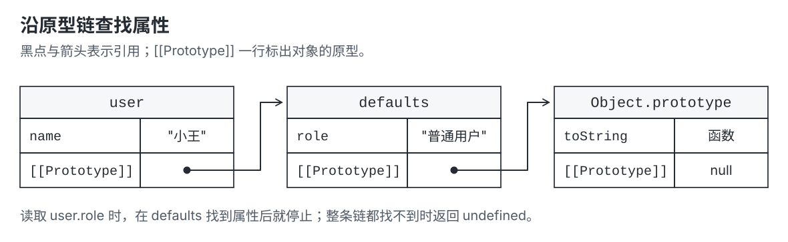
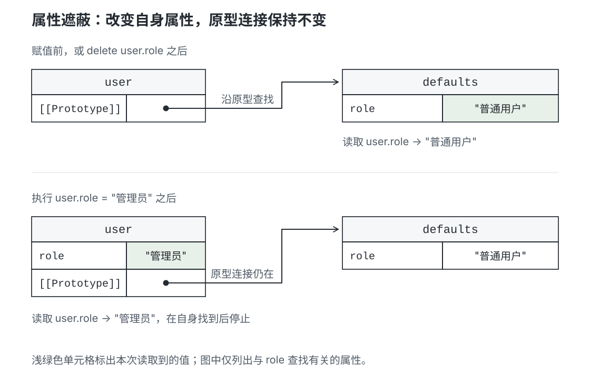
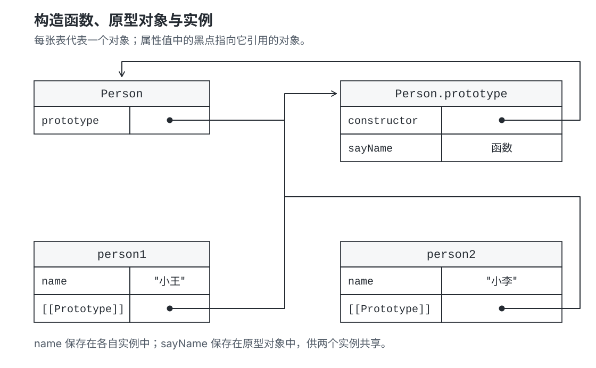

下面的对象只定义了 `name`，却可以调用 `toString()`：

```js
const user = { name: '小王' }

console.log(user.name) // '小王'
console.log(user.toString()) // '[object Object]'
```

`name` 保存在 `user` 自身，`toString` 方法则保存在另一个对象 `Object.prototype` 上。JavaScript 在 `user` 中找不到这个方法，就去那个对象上找。

**这个供继续查找属性的对象，就是 `user` 的原型。** 对象可以通过原型使用已有的属性和方法，不必把它们全部保存一份到自身。

## 原型链：沿着对象关系查找属性

原型本身也是对象，也可以有自己的原型。把这些关系连起来，就形成了**原型链**。

使用 `Object.create()` 可以为新对象指定原型。例如，把默认角色放在 `defaults` 上，让 `user` 使用它：

```js
const defaults = { role: '普通用户' }
const user = Object.create(defaults)
user.name = '小王'

console.log(user.name) // '小王'
console.log(user.role) // '普通用户'
console.log(user.age) // undefined
```

`Object.create(defaults)` 创建一个新对象，并把它的原型设为 `defaults`。`role` 仍保存在 `defaults` 上，读取 `user.role` 时才沿原型关系找到它。



这三个读取操作走过的路径不同：

- `user.name`：在 `user` 自身找到，直接返回。
- `user.role`：自身没有，继续到 `defaults`，找到后返回。
- `user.age`：`user`、`defaults`、`Object.prototype` 都没有，查找到 `null` 时结束，返回 `undefined`。

`Object.prototype` 是普通对象字面量的默认原型，它自己的原型为 `null`。也可以用 `Object.create(null)` 创建没有原型的对象，这类对象只在自身查找属性。

## 自身属性优先于原型属性

在对象自身定义同名属性后，读取时会先找到自身的值。这称为**属性遮蔽**。

```js
const defaults = { role: '普通用户' }
const user = Object.create(defaults)

user.role = '管理员'
console.log(user.role) // '管理员'
console.log(defaults.role) // '普通用户'

delete user.role
console.log(user.role) // '普通用户'
```

这里的赋值在 `user` 上创建了 `role`，原型中的 `role` 保持不变。删除 `user` 自身的 `role` 后，查找又会走到 `defaults`。



查找依据是“有没有这个属性”。即使自身属性的值为 `undefined`，也会停在自身，不再继续向原型查找。

原型上的 setter 可以接管赋值，不可写属性也会限制赋值。这些规则见 [对象属性](./object-properties.md)。上例使用的是普通可写数据属性。

## 构造函数如何让实例共享方法

创建多个同类对象时，每个对象需要保存自己的数据，但可以共用一份方法。例如，两个人各有自己的姓名，都使用同一个 `sayName` 方法：

```js
function Person(name) {
  this.name = name
}

Person.prototype.sayName = function () {
  return this.name
}

const person1 = new Person('小王')
const person2 = new Person('小李')

console.log(person1.sayName()) // '小王'
console.log(person2.sayName()) // '小李'
console.log(person1.sayName === person2.sayName) // true
```

`Person` 是构造函数，`person1`、`person2` 是通过它创建的实例。**`Person.prototype` 是一个对象，`new Person()` 创建的实例会以它作为原型。**

因此，每个实例自身保存 `name`，共享的 `sayName` 则保存在 `Person.prototype` 上。两个实例调用的是同一个函数；通过 `person1.sayName()` 调用时，函数里的 `this` 指向 `person1`，所以读到的是小王的姓名。



图中的 `[[Prototype]]` 表示对象内部的原型连接，`prototype` 和 `constructor` 是普通属性，黑点与箭头表示它们引用的对象。这个例子中的 `new` 主要完成三件事：创建实例、连接 `Person.prototype`、执行构造函数给实例设置 `name`。完整行为见 [手写 new 操作符](./implement-new.md)。

## 三种原型写法分别指什么

读取一个对象的原型，可以使用 `Object.getPrototypeOf()`。对上面的普通构造函数，关系可以直接验证：

```js
function Person() {}
const person = new Person()

console.log(Object.getPrototypeOf(person) === Person.prototype) // true
```

阅读资料时，经常还会遇到 `[[Prototype]]` 和 `__proto__`。它们与 `prototype` 的用途如下：

| 写法 | 对应的含义 |
| --- | --- |
| `person` 的 `[[Prototype]]` | 规范中表示“person 的原型连接”的记号，也就是图中的原型箭头 |
| `Person.prototype` | 构造函数上的属性，指向供实例使用的原型对象 |
| `person.__proto__` | 旧代码中常见的原型访问方式；读取原型使用 `Object.getPrototypeOf(person)` 更可靠 |

`__proto__` 是一个访问器属性，可能被同名属性覆盖。它与内部的原型连接不是同一回事。一些资料把 `[[Prototype]]` 称为“隐式原型”，把构造函数的 `prototype` 属性称为“显式原型”。

`Person` 函数本身也是对象：`Object.getPrototypeOf(Person)` 取得的是函数自身的原型，`Person.prototype` 则是提供给实例的原型对象。

普通构造函数默认创建的原型对象上，还有一个 `constructor` 属性指回构造函数，即 `Person.prototype.constructor === Person`。实例通常沿原型链访问到它；它是可以修改的普通属性，修改它不会改变实例的原型连接。

## 原型上的对象和数组会被共享

共享方法通常正是期望的行为；共享可修改的数据则需要留意。例如，两个对象都通过原型访问同一个数组：

```js
const shared = { tags: [] }
const first = Object.create(shared)
const second = Object.create(shared)

first.tags.push('JavaScript')
console.log(second.tags) // ['JavaScript']

first.tags = ['个人笔记']
console.log(first.tags) // ['个人笔记']
console.log(second.tags) // ['JavaScript']
```

`first.tags.push()` 先找到原型上的数组，再修改那个数组，因此 `second` 也能看到变化。`first.tags = ...` 则在 `first` 上创建自己的属性，此后它使用新数组。

需要每个实例独立维护的数据，可以在构造函数中用 `this.tags = []` 创建；公共方法放在原型上。组合方式见 [创建对象](./creating-objects.md)。

## 查看属性属于自身还是原型

直接定义在对象上的属性称为**自有属性**，通过原型访问到的称为**继承属性**。`Object.hasOwn()` 只检查自身，`in` 同时检查原型链：

```js
const defaults = { role: '普通用户' }
const user = Object.create(defaults)
user.name = '小王'

console.log(Object.hasOwn(user, 'name')) // true
console.log(Object.hasOwn(user, 'role')) // false
console.log('role' in user) // true
```

## 参考

- [MDN：对象原型](https://developer.mozilla.org/en-US/docs/Learn_web_development/Extensions/Advanced_JavaScript_objects/Object_prototypes)
- [ECMAScript：普通对象的属性查找](https://tc39.es/ecma262/multipage/ordinary-and-exotic-objects-behaviours.html#sec-ordinaryget)
- [MDN：函数的 prototype 属性](https://developer.mozilla.org/en-US/docs/Web/JavaScript/Reference/Global_Objects/Function/prototype)：不同函数类型的原型属性与构造能力。
