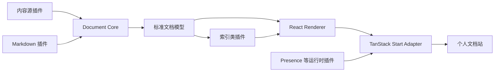

# 个人文档引擎 PRD

## Problem Statement

现有知识库以 VuePress 和 VuePress Theme Hope 为运行基础，已经积累 401 个 Markdown 页面、约 12.5 万词和 556 条可解析的内部链接。框架提供了导航、搜索、标签、博客等现成功能，但同时决定了内容模型、页面结构、主题扩展方式和构建流程。继续改造主题可以增加知识图谱或博客首页，却不能解决核心能力受第三方文档框架约束的问题。

目标产品不是另一个通用博客模板，也不是对 Obsidian、VuePress、Fumadocs 或 Mix Space 的复刻。它应当是一套以个人文档为核心的可扩展系统：文档加载、标准化和插件生命周期构成最小内核；博客、知识图谱、搜索、订阅、主题和实时个人状态均通过插件组装。第一版服务于当前知识库，同时为可信的本地插件和后续第三方接入保留稳定边界。

迁移还需要满足以下约束：

- 现有 VuePress 站在新系统达到切换条件前继续运行。
- 迁移期间只有一份 Markdown 内容源，避免新旧仓库双向同步。
- 现有相对链接、图片、目录页和主要 URL 应尽量保持有效。
- 文档内核不绑定 React、TanStack Start、Next.js 或具体主题。
- 第一版只实现 TanStack Start Adapter，不为了证明可移植性同时维护多个 Adapter。
- 插件架构必须由知识图谱和实时 Presence 两类不同能力共同验证。

## Solution

新建独立 monorepo，构建框架无关的 Document Core、公开的 Plugin API、React Renderer 和首个 TanStack Start Adapter。迁移阶段通过文件系统内容源插件只读加载现有 Markdown；完成全量兼容和验收后，再将内容归属切换到新项目并归档 VuePress 实现。

系统采用“最小内核、默认能力也通过插件实现”的原则。内核只负责配置、文档规范化、插件生命周期、注册表和确定性构建。Markdown、VuePress 兼容、分类、博客、知识图谱、搜索、Feed、Presence 和主题均为独立插件。第一方插件与未来第三方插件使用相同公开接口，不允许依赖私有内核状态。

首发产品包含两个相互连接但职责不同的表面：

- 文档表面：主题目录、长文阅读、局部知识图谱、搜索和 Feed。
- 个人空间表面：技术博客、项目、短动态以及可选的实时个人状态。

文档是基础数据，其他表面均是对文档、索引或运行时状态的不同投影。

## Product Principles

1. **文档优先**：Markdown 文件和稳定文档标识是系统的事实来源。
2. **最小内核**：Core 不包含博客、图谱、搜索、主题或框架逻辑。
3. **插件优先**：默认能力也通过公开 Plugin API 实现。
4. **框架隔离**：Core 和构建期插件不导入 React 或任何 Web 框架。
5. **单一内容源**：任何迁移阶段都避免维护两份可编辑内容。
6. **确定性构建**：相同配置、内容和插件版本应产生相同索引与页面模型。
7. **渐进开放**：先支持本地可信插件；出现真实外部使用者后再提供包分发能力。
8. **可退出性**：TanStack Start 只作为首发 Adapter，内容模型不能依赖其路由或运行时类型。
9. **隐私默认关闭**：Presence 默认只公开经过白名单和脱敏的状态。
10. **兼容而不继承**：迁移层兼容 VuePress 内容，但不把 VuePress 语义写入 Core。

## User Stories

1. 作为知识库作者，我希望继续使用 Markdown 写作，以便保留现有编辑习惯和 Git 历史。
2. 作为知识库作者，我希望新站能够读取现有全部文档，以便迁移不依赖手工复制正文。
3. 作为知识库作者，我希望迁移期间旧站继续发布，以便新引擎开发不会影响线上访问。
4. 作为知识库作者，我希望只有一份可编辑内容源，以便避免新旧仓库内容分叉。
5. 作为知识库作者，我希望文档 URL 尽量保持稳定，以便旧链接、收藏和搜索结果继续有效。
6. 作为知识库作者，我希望系统在构建时报告断链和无效元数据，以便在发布前发现知识库错误。
7. 作为知识库作者，我希望目录页和普通文章使用同一文档模型，以便不再维护独立导航配置作为事实来源。
8. 作为知识库作者，我希望能够给内容声明文章、笔记、指南、项目、阅读记录、动态和主题入口等类型，以便同一知识库支持不同呈现方式。
9. 作为知识库作者，我希望内容类型由插件解释，以便 Core 不绑定某一种博客或知识管理方法。
10. 作为知识库作者，我希望首页能够展示最近文章、项目和个人状态，以便网站不仅是目录树。
11. 作为知识库作者，我希望技术文章能够进入独立博客流，以便读者按发布时间发现完整文章。
12. 作为知识库作者，我希望短笔记仍可被搜索和图谱引用，但不必进入博客流，以便区分知识沉淀和公开写作。
13. 作为知识库作者，我希望文章右侧显示当前文章的一跳局部图谱，以便读者理解前置、引用和相关知识。
14. 作为知识库作者，我希望图谱优先使用正文链接和反向链接，以便关系具有明确来源。
15. 作为知识库作者，我希望能够显式声明前置知识、后续阅读和相关文档，以便补充正文链接无法表达的关系。
16. 作为知识库作者，我希望推导关系与显式关系在图谱上具有不同样式，以便读者辨别事实连接和系统推荐。
17. 作为移动端读者，我希望局部图谱以可折叠面板呈现，以便不压缩正文阅读区域。
18. 作为键盘或屏幕阅读器用户，我希望图谱关系同时提供普通链接列表，以便不依赖 Canvas 交互访问相关文档。
19. 作为读者，我希望可以通过标题、正文和标签搜索中文内容，以便快速定位知识。
20. 作为读者，我希望可以通过 RSS 或 JSON Feed 订阅新文章，以便不必定期访问首页。
21. 作为读者，我希望文章包含更新时间、阅读时间和所属系列，以便判断内容状态和阅读成本。
22. 作为读者，我希望深色模式、移动端布局和减少动画偏好得到支持，以便在不同设备和无障碍设置下阅读。
23. 作为访客，我希望在站点页头或首页看到站长当前是否在线以及经过脱敏的活动，以便网站具有持续在线的个人空间感。
24. 作为站点所有者，我希望可以暂停 Presence 上报，以便在私密工作或休息时不公开活动。
25. 作为站点所有者，我希望应用白名单、敏感应用黑名单和自动过期默认启用，以便避免泄露窗口标题、文件名或通信内容。
26. 作为站点所有者，我希望 macOS、Windows 或 CLI Reporter 使用同一个版本化协议，以便未来增加采集端时不修改网站核心。
27. 作为插件作者，我希望通过稳定的生命周期和注册表扩展内容处理，以便不修改 Core 源码。
28. 作为插件作者，我希望声明插件名称、API 版本和依赖，以便系统能够检测缺失依赖和不兼容版本。
29. 作为插件作者，我希望插件拥有命名空间隔离的配置和构建数据，以便多个插件不会意外覆盖彼此状态。
30. 作为插件作者，我希望能够注册内容源、转换器、索引、路由描述、构建产物和 UI 扩展，以便常见能力可以独立实现。
31. 作为插件作者，我希望构建阶段和运行时阶段具有明确边界，以便静态索引插件不依赖线上服务器。
32. 作为插件作者，我希望使用与第一方插件相同的公开 API，以便外部扩展不是能力受限的二等实现。
33. 作为主题作者，我希望主题只消费标准页面模型和 React 插槽，以便不重新解析 Markdown 或知识索引。
34. 作为主题作者，我希望可以替换页面布局而不改变内容 URL，以便视觉升级不破坏知识库结构。
35. 作为维护者，我希望移除博客、图谱或 Presence 插件后基础文档站仍能构建，以便插件故障不会破坏 Core。
36. 作为维护者，我希望每个深模块能够通过内存输入独立测试，以便定位构建、插件和 Adapter 问题。
37. 作为维护者，我希望插件执行顺序明确且可诊断，以便避免依赖隐式导入顺序的构建结果。
38. 作为维护者，我希望构建输出包含插件耗时和失败来源，以便分析大型知识库的性能问题。
39. 作为维护者，我希望 TanStack Start Adapter 只消费标准页面模型，以便未来可以增加 Next.js Adapter 而不迁移内容。
40. 作为未来的 Next.js Adapter 作者，我希望复用 React Renderer、主题和构建期插件，以便只实现框架相关的路由、元数据和运行时绑定。
41. 作为自动化工具作者，我希望可以读取稳定的内容索引和图谱索引 JSON，以便生成导航、分析或 AI 上下文。
42. 作为搜索引擎，我希望站点输出 Sitemap、规范链接和结构化元数据，以便正确索引内容。
43. 作为现有链接访问者，我希望无法直接保留的旧 URL 获得明确重定向，以便迁移后不落入 404。
44. 作为知识库作者，我希望 README 目录页能够映射为目录根路径，以便保留当前内容组织方式。
45. 作为知识库作者，我希望 VuePress 容器语法在迁移阶段被兼容或给出明确转换诊断，以便 75 个相关页面可批量迁移。
46. 作为知识库作者，我希望 Mermaid、图片、表格、代码高亮和标题锚点保持可用，以便技术内容不因换引擎降级。
47. 作为维护者，我希望新项目在切换前对全部现有文档执行构建和断链检查，以便上线基于可验证结果。
48. 作为维护者，我希望旧仓库在完成切换后被明确归档，而不是无限期承担双重构建职责。

## Implementation Decisions

### Repository and migration boundary

- 新系统在独立 monorepo 中开发，不直接重写当前 VuePress 仓库，也不在旧仓库内创建长期存在的新版子项目。
- 迁移阶段通过文件系统内容源插件只读加载旧仓库的 Markdown；旧仓库仍是唯一可编辑内容源。
- 新系统通过全量兼容验收后，内容一次性转移到新 monorepo，旧 VuePress 实现随后归档。
- 内容迁移需要保留可追溯的 Git 历史；具体历史迁移方式在执行阶段确定，不影响文档引擎接口。

### Document Core

- Core 是框架无关的 TypeScript 深模块，输入为站点配置、内容源和插件集合，输出为标准文档模型、索引和构建诊断。
- Core 不直接处理 Markdown，不包含 React 组件，不认识博客、标签、知识图谱、Presence 或具体部署平台。
- 标准文档模型至少包含稳定 ID、源标识、目标路径、原始元数据、规范化元数据、可序列化内容树、标题结构和内部链接。
- 文档 ID 与公开 URL 分离；更改路由策略不应改变知识图谱中的文档身份。
- Core 的构建阶段固定为配置、发现、解析、规范化、转换、索引、路由描述、渲染准备和产物输出。
- 相同输入必须产生稳定排序的页面模型和索引，避免文件系统遍历顺序影响构建结果。

### Plugin Runtime

- Plugin API 是独立深模块，负责插件声明、API 版本、依赖关系、执行顺序、生命周期 Hook、命名空间状态和诊断。
- 第一方插件必须只使用公开 Plugin API；禁止通过内部导入获得额外能力。
- 第一版插件被视为可信代码，可访问构建进程权限。插件沙箱和权限系统不在本期范围内。
- 第一版只支持配置中显式加载的仓库内插件；npm、Git 和插件市场属于后续扩展。
- 插件依赖必须显式声明，循环依赖、缺失依赖、重复名称和 API 版本不兼容均应在构建开始前失败。
- 插件只能通过注册表贡献内容源、转换器、索引、路由描述和构建产物，不允许依赖隐式全局可变状态。
- 构建期插件、React UI 插件和 Adapter 运行时扩展属于不同能力域，避免 UI 类型泄漏到 Core。

### Content pipeline

- 文件系统内容源是首个内容源插件，支持外部根目录、排除规则和稳定路径规范化。
- Markdown 插件基于成熟的 AST 工具组合实现，不自研 Markdown 语法解析器。
- VuePress 兼容插件负责 `:::` 容器、现有 frontmatter 别名、README 目录路由和其他迁移期语义。
- VuePress 兼容逻辑不得进入标准文档模型；兼容插件输出规范化结果和可定位诊断。
- 内部链接解析同时支持相对 Markdown 链接、目录链接、锚点和现有少量 Wikilink。
- 内容 Schema 允许插件扩展元数据，但核心字段的冲突规则必须明确。

### React Renderer

- React Renderer 是首个 UI Renderer，负责将标准页面模型映射为 React 文档组件、布局插槽和主题令牌。
- React Renderer 不读取文件系统、不解析 Markdown，也不负责生成知识关系。
- UI 插件通过受控插槽贡献文章侧栏、正文前后区域、页头、页脚和浮层能力。
- 首发主题是第一方插件，并使用与未来第三方主题相同的 React Renderer 接口。
- 图谱分为框架无关的关系索引插件和 React 可视化插件；前者可在没有 UI 的构建中独立运行。

### TanStack Start Adapter

- TanStack Start 是唯一首发 Adapter，负责把标准页面模型绑定到文件路由、预渲染、元数据、错误页面和运行时接口。
- Adapter 不参与 Markdown 解析和知识索引，不改变标准文档模型。
- 动态文章路径必须由内容索引显式提供给预渲染流程，不能只依赖链接爬取发现全部页面。
- TanStack Start 当前阶段的框架成熟度风险通过 Adapter 隔离控制；Core 和内容插件不得引用其类型。
- Next.js Adapter 只保留为未来可能性，第一版不实现、不建立双 Adapter 测试矩阵。

### First-party plugins

- 基础发行版至少包含文件系统内容源、Markdown、VuePress 兼容、基础路由描述和首发主题。
- 博客插件根据内容类型、发布日期和发布状态生成博客流，不改变文档本身是否可访问。
- 分类插件生成标签、分类、系列和主题入口索引。
- 知识图谱索引以显式内部链接、反向链接和人工关系为主，目录与标签相似度只用于节点不足时的弱关系补充。
- 局部图谱默认显示一跳关系并限制节点数量；全局图谱不是首发必需功能。
- 搜索插件使用适合中文静态站点的构建后索引方案，并保持搜索 UI 与索引实现可替换。
- Feed 插件输出 RSS、Atom 或 JSON Feed 中至少两种标准格式，具体首发组合在实现阶段确定。
- Sitemap 和规范 URL 作为输出插件提供，不写入 Core。

### Presence

- Presence 是运行时插件，不属于静态文档 Core。
- Presence 协议独立于 Web Adapter，至少包含鉴权上报、只读查询、状态过期和版本字段。
- 第一版可先采用定时拉取实现近实时状态；WebSocket 或 Server-Sent Events 在需求验证后加入，不作为文档迁移阻塞项。
- Reporter 默认只上报白名单应用的规范化名称和抽象活动，不上报窗口标题、文件路径、项目名称或通信内容。
- Presence 必须支持暂停、隐藏、空闲和自动离线状态；超过 TTL 未收到心跳时不得继续展示在线。

### External integration

- 首发即输出稳定的 Sitemap、Feed、内容索引和图谱索引，以支持搜索引擎、阅读器和自动化工具。
- 插件协议从第一版开始版本化，但外部 npm/Git 安装流程在出现第二个真实使用者前不实现。
- 产品目标是插件驱动的个人文档系统，不是多租户 CMS、托管平台或插件市场。

## Testing Decisions

### Test philosophy

- 测试只验证模块的公开输入、输出、诊断和可观察副作用，不断言私有函数、内部数据结构或具体调用次数。
- 深模块优先使用内存内容源、临时目录和固定夹具测试，减少对完整 Web 应用的依赖。
- 构建结果需要稳定排序和可复现，索引、路由与诊断适合使用经过审查的结构化快照。
- UI 测试验证可访问名称、键盘路径、移动端降级和用户可观察交互，不依赖 CSS 类名或组件内部状态。

### Modules to test

- **Document Core**：阶段顺序、确定性输出、文档 ID 与 URL 分离、诊断聚合和失败传播。
- **Plugin Runtime**：依赖排序、循环检测、重复名称、API 版本、Hook 顺序、命名空间隔离和插件失败定位。
- **Filesystem Source**：外部目录、排除规则、路径规范化、README 识别和跨平台路径。
- **Markdown Pipeline**：frontmatter、标题、链接、图片、代码块、Mermaid、表格和中文锚点。
- **VuePress Compatibility**：现有容器类型、frontmatter 别名、目录路由和不支持语法的可定位诊断。
- **Link Resolver**：相对链接、目录链接、锚点、Wikilink、资源链接、断链和重定向映射。
- **Graph Index**：显式边、反向边、人工关系、弱关系、节点上限、稳定排序和孤立文档。
- **React Renderer**：标准页面模型渲染、插槽组合、无插件降级、可访问链接列表和减少动画偏好。
- **TanStack Start Adapter**：全量静态路径、元数据、404、旧 URL 重定向和生产构建。
- **Presence Contract**：鉴权失败、敏感字段过滤、暂停、TTL 过期、离线转换和只读查询。

### Migration fixtures

- 从现有知识库选择覆盖普通文章、目录页、VuePress 容器、Mermaid、本地图片、多级相对链接、Wikilink、长代码块和复杂 frontmatter 的代表性文档作为固定迁移夹具。
- 全量验收必须读取全部 401 个 Markdown 页面，不允许只凭代表性夹具判断迁移完成。
- 现有 556 条可解析内部链接形成迁移基线；新系统需要报告成功解析、重定向、刻意忽略和真实断链的数量。

### Required validation gates

- 单元测试和类型检查通过。
- 代表性迁移夹具全部通过。
- 全量内容构建成功且没有未分类的解析错误。
- 核心功能插件逐一禁用后，基础文档构建仍能完成。
- 生产构建重复执行得到相同的页面和图谱索引。
- 移动端文章、桌面文章、键盘导航和减少动画模式通过人工验收。

## Delivery Plan

### Phase 0: Architecture spike

- 初始化独立 monorepo。
- 建立标准文档模型、Plugin API 和内存测试工具。
- 使用少量代表性文档跑通最小构建流水线。
- 验证 Core 不依赖 React 或 TanStack Start。

**Exit criteria**：内容源、Markdown 和最小页面模型可独立测试；插件依赖错误能在构建前报告。

### Phase 1: Readable document site

- 完成 React Renderer 和 TanStack Start Adapter。
- 实现基础主题、文档正文、目录、代码高亮和静态路径生成。
- 建立旧 URL 到新 URL 的映射报告。

**Exit criteria**：代表性文档能在生产构建中生成可阅读页面，旧站保持不变。

### Phase 2: Full VuePress compatibility

- 完成 VuePress 容器和 frontmatter 兼容。
- 全量加载 401 个 Markdown 页面。
- 修复或记录断链、资源路径和不支持语法。

**Exit criteria**：全量构建无未分类错误，主要旧 URL 有保留或重定向方案。

### Phase 3: Plugin architecture proof

- 实现博客、分类、知识图谱、搜索、Feed 和 Sitemap 插件。
- 验证插件禁用、依赖排序、诊断和确定性输出。
- 完成桌面局部图谱与移动端关系列表。

**Exit criteria**：知识图谱和博客均可从配置移除，移除后基础文档站仍可构建。

### Phase 4: Personal space runtime

- 实现 Presence Contract、脱敏策略和首个 Reporter 接入。
- 在首页和全局页头增加可选实时状态 UI。
- 根据实际需要选择轮询、SSE 或 WebSocket。

**Exit criteria**：状态能自动过期、手动暂停且不会公开禁止字段；Presence 服务不可用时文档阅读不受影响。

### Phase 5: Cutover

- 对比旧站与新站的内容数量、URL、Feed、搜索和关键页面。
- 完成内容归属迁移和部署切换。
- 归档 VuePress 实现并更新维护文档。

**Exit criteria**：新站成为唯一发布目标，旧链接具有明确处理结果，内容只在一个位置继续维护。

## Success Metrics

- 401 个现有 Markdown 页面均被读取，并具有构建成功或明确排除原因。
- 现有内部链接均被归类为有效、重定向、外部资源、刻意忽略或真实断链，不存在静默丢失。
- Core、Plugin API 和图谱索引不依赖 React 或 TanStack Start。
- 第一方插件全部通过公开 Plugin API 工作。
- 禁用博客、知识图谱、搜索和 Presence 后，基础文档站仍可构建和阅读。
- 桌面文章具有局部图谱，移动端和辅助技术具有等价关系列表。
- Presence 超过 TTL 自动离线，且默认不上报窗口标题、文件路径和通信内容。
- 切换后不存在需要人工双向同步的第二份 Markdown 内容。

## Out of Scope

- 第一版不实现 Next.js、Astro、Vue 或纯 HTML Adapter。
- 第一版不实现非 React Renderer。
- 第一版不实现插件市场、在线安装、热更新或沙箱权限系统。
- 第一版不发布通用 npm 框架，不承诺第三方兼容性矩阵。
- 第一版不实现多用户、团队空间、租户隔离和在线协作编辑。
- 第一版不构建完整 CMS、数据库写作后台或 Mix Space 兼容层。
- 第一版不使用向量数据库或 Embedding 自动建立知识关系。
- 第一版不要求全局知识图谱、三维图谱或移动端 Canvas 图谱。
- 第一版不要求 WebSocket Presence；可靠的过期轮询可以先满足产品验证。
- 本 PRD 不重写现有六个月成长计划，其中关于 Next.js 的旧选型需要在项目启动后单独更新。

## Further Notes

- TanStack Start 当前仍处于快速演进阶段。首发使用它是产品与学习方向选择，Adapter 隔离是对应的风险控制，不是同时建设多框架的理由。
- 该项目借鉴 Pi 的最小核心和扩展优先理念，但插件分类、生命周期和安全模型需要服务文档构建，不复制 Agent 扩展 API。
- Antfu 的个人站证明了组合底层工具可以获得更强的个人表达，但其大量定制构建逻辑也说明需要把内容管线沉淀为可测试深模块，而不是集中在单一构建配置中。
- Fumadocs 可作为交互和内容 API 的参考，不作为 Core 依赖。若后续某个独立插件复用其无头能力，需要证明不会把文档模型反向绑定到 Fumadocs。
- 出现第二个真实站点或外部插件作者后，再评估包分发、外部配置、兼容策略和 Next.js Adapter。
