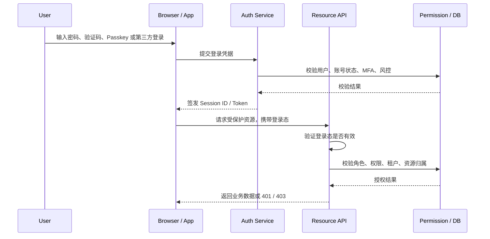

登录鉴权不是 JWT 一个点，而是一套从“用户如何证明自己是谁”到“系统如何判断用户能做什么”的体系。JWT 只是登录态承载方式之一，和 Session、Opaque Token、OAuth2/OIDC、Passkey、RBAC 等概念处在不同层级。

这个目录先作为认证与授权的总入口，用来区分常见方案，并把后续笔记拆到独立页面。

## 登录链路

前端路由守卫只能改善交互体验，不能作为安全边界。真正的认证和授权都必须在服务端完成。

## 层级拆分

| 层级 | 解决的问题 | 常见内容 |
| --- | --- | --- |
| 认证 | 用户如何证明自己是谁 | 密码、短信验证码、邮箱验证码、Passkey、OAuth2/OIDC、MFA |
| 登录态 | 后续请求如何证明已经登录 | Session ID、JWT、Opaque Token、Access Token、Refresh Token |
| 授权 | 已登录用户能做什么 | RBAC、ABAC、ACL、Scope、资源归属、租户隔离 |
| 会话治理 | 登录态如何续期、撤销和审计 | 过期时间、刷新、登出、多设备、踢下线、风险登录 |

## 认证方式区别

| 方式 | 用户体验 | 服务端关注点 | 适合场景 |
| --- | --- | --- | --- |
| 用户名密码 | 最常见，输入成本高 | 密码哈希、撞库防护、重试限制、找回密码 | 自有账号体系 |
| 短信 / 邮箱验证码 | 低门槛，依赖外部通道 | 验证码有效期、频率限制、通道成本、 SIM swap 风险 | 轻量登录、找回账号 |
| Passkey / WebAuthn | 免密码，安全性高 | 设备注册、公钥校验、账号恢复 | 安全要求高的 Web / App |
| OAuth2 / OIDC | 借助第三方或企业身份 | 授权码流程、PKCE、用户映射、租户绑定 | 第三方登录、企业 SSO |
| MFA | 在主认证后增加一道证明 | 备用恢复、风险策略、设备信任 | 管理后台、资金、敏感操作 |

## 登录态方案区别

| 方案 | 服务端状态 | 撤销能力 | 适合场景 | 主要代价 |
| --- | --- | --- | --- | --- |
| Session + Cookie | 需要 Session Store | 强 | 同源 Web、SSR、管理后台 | 横向扩展要共享会话存储 |
| JWT Access Token | 可本地验签 | 弱，通常依赖短过期 | 多服务、本地验签、OAuth2/OIDC 资源服务 | 撤销和权限变更不即时 |
| Opaque Token | 需要查 token 表或 introspection | 强 | 需要细粒度撤销、权限频繁变化 | 每次校验可能查库或查缓存 |
| BFF + Cookie | 浏览器只持有 Cookie | 强 | SPA + 自有 API | 多一层 BFF，架构更重 |

简单同源 Web 应用不必为了“无状态”强行使用 JWT。需要踢设备、封号立即生效、权限频繁变化时，Session 或 Opaque Token 往往更直接。JWT 更适合资源服务需要本地验签、服务数量较多、或接入 OAuth2/OIDC 的场景。

## 目录

- [JWT](./jwt.md)

## 后续可补

- Session 与 Cookie 登录
- OAuth2 / OIDC / SSO
- Passkey 与 WebAuthn
- RBAC、ABAC 与资源级鉴权
- Refresh Token 轮换与多设备会话
- 前端登录态存储与 CSRF / XSS

## 相关入口

- [浏览器存储](../../frontend/browser/web-storage.md)
- [跨域](../../frontend/browser/cross-origin.md)
- [401 和 403 状态码](../../computer-science/networking/401-vs-403.md)
