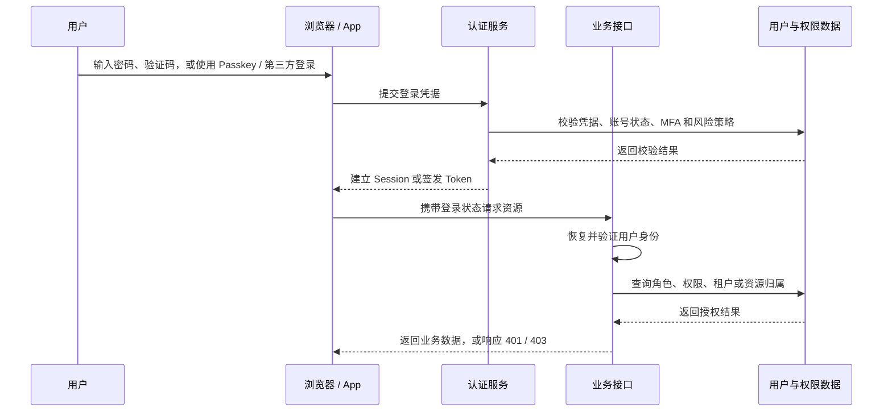

登录后的身份确认会延续到每次业务请求。完整链路包括身份认证、登录态建立、接口授权和会话管理；各环节解决的问题不同，采用的方案和安全约束也不同。

## 一次登录请求经过哪些环节

前端路由守卫适合控制页面跳转和展示状态。接口是否允许访问，仍由服务端根据请求携带的登录状态和当前权限判断。

## 概念拆分

| 环节 | 需要确认的问题 | 常见方案 |
| --- | --- | --- |
| 身份认证 | 这次登录由谁发起，凭据是否可信 | 密码、短信或邮箱验证码、Passkey、OIDC、MFA |
| 登录态 | 下一次请求如何带回已经确认的身份 | Session ID、JWT Access Token、Opaque Token |
| 接口授权 | 当前用户能否执行操作或访问资源 | RBAC、ABAC、ACL、Scope、资源归属、租户隔离 |
| 会话管理 | 登录状态如何续期、撤销和审计 | 过期、刷新、登出、多设备会话、踢下线、风险登录 |

JWT、Session 和 Opaque Token 用来表达或查找登录状态；密码、Passkey 和 OIDC 用来完成身份认证；RBAC、ABAC 处理的是登录之后的权限判断。按环节区分后，方案之间的关系会清楚很多。

## 登录方式的差别

| 方式 | 需要关注的内容 | 常见用法 |
| --- | --- | --- |
| 用户名密码 | 密码哈希、重试限制、撞库防护和找回流程 | 自有账号体系 |
| 短信 / 邮箱验证码 | 验证码有效期、发送频率、通道故障和账号恢复 | 低门槛登录、验证联系方式 |
| Passkey / WebAuthn | 设备注册、跨设备使用和凭据恢复 | 免密码登录、敏感账号 |
| OIDC | Authorization Code + PKCE、回调校验、用户映射和账号绑定 | 第三方登录、企业 SSO |
| MFA | 第二因素、可信设备和备用恢复方式 | 管理后台、资金操作、风险登录 |

MFA 通常是在主要登录方式之后再增加一次验证，不单独承担完整的账号登录流程。第三方登录通常使用 OIDC 获取用户身份；OAuth2 更关注客户端获得访问资源的授权。

## 登录态怎么选

| 方案 | 服务端如何确认身份 | 撤销方式 | 常见考虑 |
| --- | --- | --- | --- |
| Session ID | 根据 ID 查询 Session Store | 删除或禁用服务端会话 | 同源 Web、SSR、管理后台，需要立即踢下线 |
| JWT Access Token | 根据公钥或共享密钥本地验签 | 短过期，必要时增加 denylist 或会话检查 | 多个资源服务需要独立验证请求 |
| Opaque Token | 查询 Token 记录或调用 introspection | 禁用对应 Token 或会话 | 权限变化频繁，需要集中控制有效性 |

Session + HttpOnly Cookie 常见于同源 Web 应用：服务端管理会话，浏览器按 Cookie 规则自动携带凭据。多个资源服务需要独立验签时，可以使用短时效 JWT Access Token；封号、权限变化或设备下线需要立即生效时，则需要保留服务端会话记录，或者使用 Opaque Token 集中校验。

Cookie 是浏览器携带凭据的机制，JWT 是 Token 格式，两者可以组合使用。把 JWT 放进 HttpOnly Cookie 后，仍然要处理 Cookie 场景下的 CSRF；让 JavaScript 直接持有 Token，则要重点考虑 XSS 和刷新并发。

## 已整理的笔记

- [JWT](./jwt.md)：Token 结构、签发与校验、前端拦截器、刷新并发和服务端验证。

## 相关入口

- [浏览器存储](../../frontend/browser/web-storage.md)
- [跨域](../../frontend/browser/cross-origin.md)
- [401 和 403 状态码](../../computer-science/networking/401-vs-403.md)
