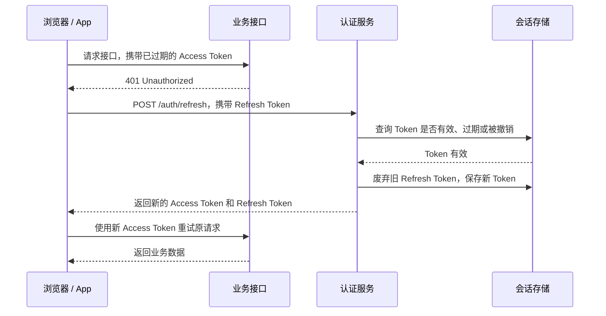
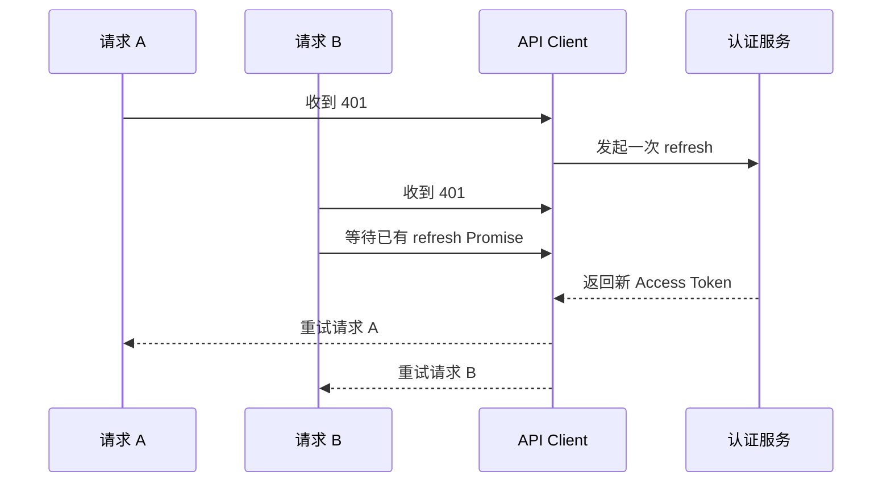

用户通常只在登录时提交一次密码，但服务端需要在之后的每个请求中继续确认用户身份。常见做法有两种：

- Session：服务端保存登录数据，客户端只保存一个 Session ID。请求到达后，服务端使用这个 ID 查询登录数据。
- JWT：服务端把用户 ID、有效期等数据写进 Token 并签名。客户端每次带回 Token，接口通过签名检查内容是否可信。

两种方式的差别不在于能否登录，而在于后续请求如何恢复身份：

| 方式 | 客户端保存 | 接口如何确认身份 | 立即失效 |
| --- | --- | --- | --- |
| Session | 随机的 Session ID | 根据 ID 查询服务端 Session | 删除 Session 即可失效 |
| JWT | 带签名的用户和有效期等数据 | 验证签名并读取 Token | 通常要等待过期，或增加服务端撤销状态 |

JWT（JSON Web Token）是一种紧凑的 Token 格式。在登录系统中，它常被用作 Access Token，也就是调用业务接口时携带的访问凭据。

## JWT 在一次请求中的位置

```mermaid
sequenceDiagram
  participant U as 用户
  participant B as 浏览器 / App
  participant A as 认证服务
  participant R as 业务接口

  U->>B: 输入账号和密码
  B->>A: POST /login
  A->>A: 校验账号和密码
  A-->>B: 返回 Access Token（JWT）
  B->>R: GET /orders<br/>Authorization: Bearer &lt;token&gt;
  R->>R: 验证签名、有效期和访问范围
  R-->>B: 返回订单，或响应 401 / 403
```

这段流程包含几个容易混在一起的概念：

| 概念 | 在流程中的作用 |
| --- | --- |
| 登录凭据 | 密码或验证码，用于完成登录；不会在之后的每次请求中重复发送 |
| Token | 客户端持有的一段凭据，用于后续请求 |
| Access Token | 用来访问业务接口的 Token；它可以采用 JWT 格式，也可以是不透明的随机字符串 |
| JWT | Token 的一种格式，内部可以携带用户 ID、过期时间和访问范围等字段 |
| Bearer | HTTP `Authorization` 头中的携带方式；持有该 Token 的一方可以使用它，因此 Token 泄漏后可以被冒用 |

接口没有收到有效 Token，或者 Token 已过期时，通常返回 `401 Unauthorized`。Token 有效但没有当前操作所需权限时，返回 `403 Forbidden`。

## 拆开一个 JWT

常见的 JWT 是一行由两个点分隔的字符串：

```txt
<Header>.<Payload>.<Signature>
```

例如：

```txt
eyJhbGciOiJSUzI1NiIsInR5cCI6IkpXVCJ9.eyJzdWIiOiJ1c2VyXzEyMyIsInNjb3BlIjoib3JkZXJzOnJlYWQiLCJpYXQiOjE3NTIwMDAwMDAsImV4cCI6MTc1MjAwMDkwMH0.<signature>
```

前两段解码后是 JSON。

Header：说明这个 Token 使用什么签名算法。

```json
{
  "alg": "RS256",
  "typ": "JWT"
}
```

Payload：保存 Token 携带的字段。

```json
{
  "sub": "user_123",
  "scope": "orders:read",
  "iat": 1752000000,
  "exp": 1752000900
}
```

这里的每个字段称为一个 Claim，即 Token 对某件事作出的声明：

- `sub` 表示这个 Token 对应的主体，此处是用户 `user_123`。
- `scope` 表示允许执行的操作，此处是读取订单。
- `iat` 表示签发时间。
- `exp` 表示过期时间。

Header 和 Payload 使用 Base64URL 编码。Base64URL 只是把内容转换成适合放进 URL 和 HTTP 的字符，任何人都能还原，不能提供保密性。密码、身份证号、手机号等敏感信息不应放进 Payload。

Signature 是签名。签发方使用密钥对前两段计算签名，接口收到 JWT 后再验证：

```txt
signature = sign(base64url(header) + "." + base64url(payload), key)
```

如果有人把 `scope` 从 `orders:read` 改成 `orders:write`，重新编码 Payload 并不困难，但原签名将不再匹配。攻击者没有签名密钥，无法生成能通过验证的新签名。

## 解码不等于验证

解码只需要对 Header 和 Payload 做 Base64URL 还原，不需要密钥。前端可以通过解码读取过期时间或展示信息，但不能据此判断 Token 可信。

验证需要使用可信密钥检查签名，并检查签发方、接收方和有效期。业务接口必须验证 Token，不能只调用 `decode()` 后直接使用其中的用户 ID 或权限。

## Access Token 与 Refresh Token

Access Token 和 Refresh Token 描述的是 Token 的用途，JWT 描述的是格式。Access Token 可以是 JWT，Refresh Token 也可能是 JWT，但 Refresh Token 更常被当作不可解析的不透明字符串使用。

| Token | 用途 | 通常发送到 | 有效期 | 泄漏后的影响 |
| --- | --- | --- | --- | --- |
| Access Token | 调用业务接口 | 各个资源 API | 较短 | 在过期前可以调用其权限范围内的接口 |
| Refresh Token | 换取新的 Access Token | 认证服务的刷新接口 | 较长 | 可以持续换取新的 Access Token |

Access Token 设置较短有效期，可以缩短泄漏后的可用时间。它过期后，如果 Refresh Token 仍然有效，客户端可以在不要求用户重新输入密码的情况下续期。



每次刷新都签发新的 Refresh Token，并立即废弃旧 Token，这种做法称为 Refresh Token Rotation（轮换）。如果已经使用过的旧 Token 再次出现，认证服务可以把同一次登录派生出的整组 Refresh Token 全部撤销，并要求重新登录。

Refresh Token 是否采用 JWT 格式并不重要。为了支持注销、设备下线、轮换和重用检测，认证服务通常仍会保存会话 ID、Token 哈希、过期时间和撤销状态。

## 浏览器端的保存方式

浏览器端设计主要面对两类攻击：

- XSS：攻击脚本在当前页面中执行，可以读取 JavaScript 可访问的存储，也可以直接调用页面已有的接口。
- CSRF：其他网站诱导浏览器发起请求，浏览器会自动附带符合条件的 Cookie。

| 保存位置 | JavaScript 可读 | 浏览器自动发送 | 主要约束 |
| --- | --- | --- | --- |
| 内存变量 | 是 | 否 | 刷新页面后丢失；发生 XSS 时仍可能被读取或利用 |
| `sessionStorage` | 是 | 否 | XSS 可以读取；只在当前标签页生命周期内保留 |
| `localStorage` | 是 | 否 | XSS 可以读取；关闭浏览器后仍长期保留 |
| `HttpOnly` Cookie | 否 | 是 | JavaScript 不能读取；需要处理 CSRF 和 Cookie 作用域 |

一种常见组合是：

- Access Token 只放在内存中。
- Refresh Token 放进 `HttpOnly; Secure` Cookie，并把 `Path` 限制到刷新接口。
- 页面重新加载后调用刷新接口，重新取得 Access Token。

```http
Set-Cookie: refresh_token=<random-token>; Path=/auth/refresh; HttpOnly; Secure; SameSite=Lax; Max-Age=2592000
```

`HttpOnly` 阻止 JavaScript 读取 Cookie，`Secure` 要求 Cookie 只通过 HTTPS 发送，`SameSite` 控制跨站请求是否携带 Cookie，`Max-Age` 设置 Cookie 的存活秒数。前端和认证服务处于跨站环境时，Cookie 配置以及 CSRF 防护需要根据部署域名单独设计，不能直接照搬上述示例。

## Axios 拦截器处理刷新

Axios 拦截器是在请求发送前或响应返回后统一执行的函数。请求拦截器适合添加 Access Token；响应拦截器可以在收到 `401` 后刷新 Token，并重试原请求。

多个请求可能同时遇到 Token 过期。假设页面并发请求用户、订单和消息接口，三个接口都返回 `401`，如果分别刷新三次，Refresh Token Rotation 可能导致后两个请求使用已经失效的旧 Token。解决方法是让所有请求等待同一个刷新 Promise。



简化的 Axios 实现：

```ts
let accessToken: string | null = null
let refreshPromise: Promise<string> | null = null

api.interceptors.request.use((config) => {
  if (accessToken) {
    config.headers.Authorization = `Bearer ${accessToken}`
  }

  return config
})

async function refreshAccessToken() {
  if (!refreshPromise) {
    refreshPromise = authApi
      .post('/auth/refresh', null, { withCredentials: true })
      .then((response) => response.data.accessToken)
      .finally(() => {
        refreshPromise = null
      })
  }

  return refreshPromise
}

api.interceptors.response.use(
  (response) => response,
  async (error) => {
    const originalRequest = error.config
    const status = error.response?.status
    const isAuthRequest = ['/login', '/auth/refresh'].includes(originalRequest.url)

    if (status !== 401 || originalRequest.__retry || isAuthRequest) {
      throw error
    }

    originalRequest.__retry = true

    try {
      accessToken = await refreshAccessToken()
      originalRequest.headers.Authorization = `Bearer ${accessToken}`
      return api(originalRequest)
    } catch (refreshError) {
      accessToken = null
      redirectToLogin()
      throw refreshError
    }
  }
)
```

代码中的几个限制不能省略：

- 刷新接口使用独立的 `authApi`，避免它自己的 `401` 再进入同一个刷新逻辑。
- `__retry` 标记保证原请求最多重试一次，避免死循环。
- `withCredentials: true` 允许跨源请求携带 Refresh Token Cookie；服务端还需要返回匹配的跨源资源共享（CORS）响应头。
- Refresh 失败后清理内存中的 Access Token，并进入未登录状态。
- `403` 表示 Token 已通过认证但权限不足，不触发刷新。

Access Token 只放内存时，每个浏览器标签页都有独立副本。多标签页可以使用浏览器的跨标签页通信 API `BroadcastChannel` 同步退出事件；是否同步新 Access Token，取决于是否允许 Token 在标签页之间传递，也可以让其他标签页各自调用刷新接口恢复登录状态。

## 服务端验证顺序

JWT 应交给成熟的库验证，不应自行拼接字符串或实现密码算法。业务接口可以按以下顺序处理：

1. 从 `Authorization: Bearer <token>` 读取 Access Token。没有 Token 时返回 `401`。
2. 使用固定的算法和可信密钥验证签名。算法由服务端配置，不接受 Token 临时指定的任意算法。
3. 检查 `iss`、`aud`、`exp`、`nbf` 等 Claim。
4. 确认这是 Access Token，避免把 ID Token 或 Refresh Token 用于业务接口。ID Token 是 OpenID Connect（OIDC）登录流程返回给客户端的身份说明，不是调用业务 API 的凭据。
5. 根据 `scope`、角色、租户和资源归属做授权判断。权限不足时返回 `403`。
6. 业务要求立即失效时，再查询会话、撤销列表或用户的 Token 版本。

签名算法常见两类：

| 算法 | 签发和验证方式 | 约束 |
| --- | --- | --- |
| HS256 | 签发方和验证方共享同一个密钥 | 拿到验证密钥的服务也能签发 Token，适合边界简单的系统 |
| RS256 / ES256 | 私钥签发，公钥验证 | 业务服务只持有公钥，适合多个资源服务分别验证 |

多把公钥并存时，Header 中的 `kid`（Key ID）用于指出当前 Token 对应哪一把密钥。JWKS（JSON Web Key Set）是认证服务发布的公钥集合，业务接口按 `kid` 从可信 JWKS 中选择公钥。Token Header 中出现的任意 URL 不能直接作为密钥下载地址，否则可能引入服务端请求伪造或恶意密钥问题。

常见 Claim：

| Claim | 校验内容 |
| --- | --- |
| `iss` | Issuer，签发方必须是配置中的可信认证服务 |
| `sub` | Subject，Token 对应的用户或主体 ID |
| `aud` | Audience，Token 必须签发给当前 API |
| `exp` | Expiration Time，当前时间不能晚于过期时间 |
| `nbf` | Not Before，当前时间不能早于生效时间 |
| `iat` | Issued At，Token 的签发时间 |
| `jti` | JWT ID，Token 的唯一标识，可用于审计或撤销列表 |
| `scope` | 允许执行的粗粒度操作，例如 `orders:read` |
| `sid` | Session ID，把同一次登录签发的多个 Token 关联到一个会话 |

签名通过只说明这些 Claim 由可信签发方写入且没有被修改。用户可能已被封禁、订单可能属于其他用户、角色也可能在 Token 签发后发生变化，因此资源归属和需要实时生效的权限仍要查询当前业务状态。

## 注销与立即失效

JWT 可以由业务接口独立验证，但这也意味着一个已签发的 JWT 通常会持续有效到 `exp`。客户端删除 Token 只能结束当前客户端的登录状态，无法让已经泄漏的副本失效。

常见处理方式包括：

- 缩短 Access Token 有效期，限制泄漏后的可用窗口。
- 注销时撤销 Refresh Token，阻止继续续期。
- 在 Token 中放入 `sid` 或 `tokenVersion`（用户级 Token 版本号），业务接口查询服务端状态后决定是否接受。
- 对少量高风险 Token 保存 `jti` 撤销列表，直到对应 Token 过期。
- 资金、封禁和资源归属等实时要求高的判断始终查询业务数据，不只依赖 JWT 中的 Claim。

这些方案都会重新引入一定的服务端状态。系统如果需要频繁踢设备、立即撤销和实时权限，Session 或 Opaque Token（客户端只持有随机 ID，服务端保存并查询 Token 状态）往往比完全依赖自包含 JWT 更直接。

## 相关笔记

- [认证与授权](./)
- [浏览器存储](../../frontend/browser/web-storage.md)
- [跨域](../../frontend/browser/cross-origin.md)
- [401 和 403 状态码](../../computer-science/networking/401-vs-403.md)
- [登录失败 HTTP 状态码](../../computer-science/networking/auth-status-codes.md)

## 参考

- [阮一峰：JSON Web Token 入门教程](https://www.ruanyifeng.com/blog/2018/07/json_web_token-tutorial.html)
- [JavaGuide：JWT 基础概念详解](https://javaguide.cn/system-design/security/jwt-intro.html)
- [JWT.io: Introduction to JSON Web Tokens](https://www.jwt.io/introduction)
- [RFC 7519: JSON Web Token](https://datatracker.ietf.org/doc/html/rfc7519)
- [RFC 8725: JSON Web Token Best Current Practices](https://datatracker.ietf.org/doc/html/rfc8725)
- [RFC 9700: Best Current Practice for OAuth 2.0 Security](https://www.rfc-editor.org/rfc/rfc9700.html)
- [Auth0: Access Tokens](https://auth0.com/docs/secure/tokens/access-tokens)
- [Auth0: Refresh Token Rotation](https://dev.auth0.com/docs/secure/tokens/refresh-tokens/refresh-token-rotation)
- [OWASP: JSON Web Token Cheat Sheet](https://cheatsheetseries.owasp.org/cheatsheets/JSON_Web_Token_for_Java_Cheat_Sheet.html)
- [Axios: Interceptors](https://axios-http.com/docs/interceptors)
