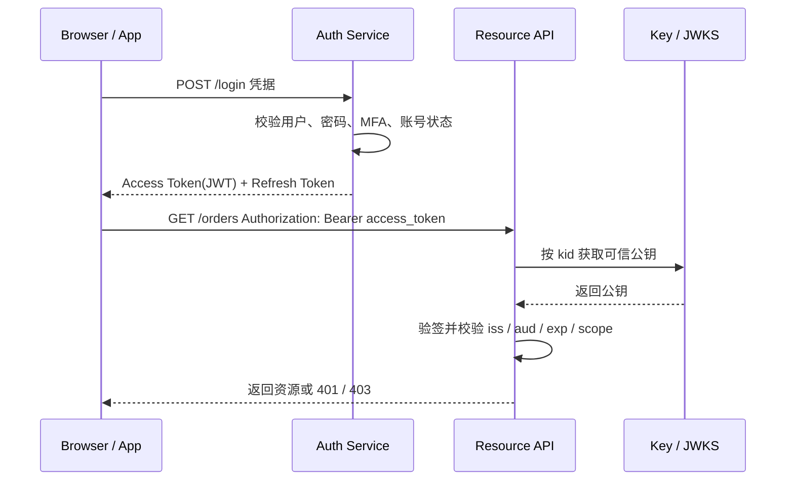
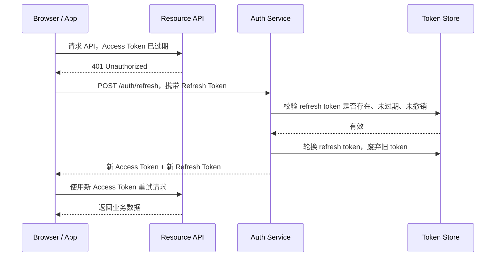
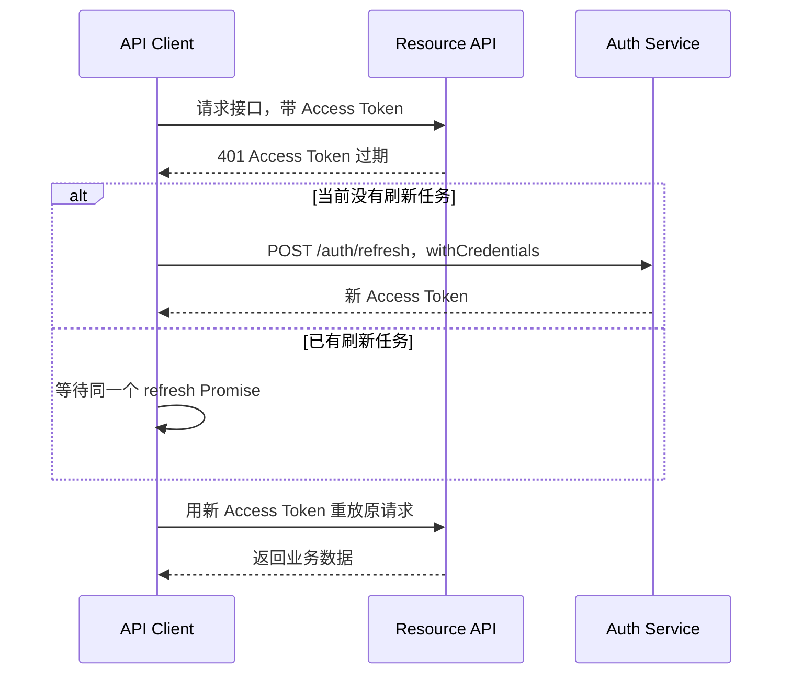

JWT（JSON Web Token）是一种 token 格式，不是一套完整登录系统。它适合表达一组可验签的 claims，例如用户 ID、签发方、受众、过期时间和权限 scope。

在登录体系里，JWT 常用于 Access Token。它能让资源服务本地验签，减少对认证服务的同步依赖；代价是撤销、权限变更和会话治理会更复杂。

## 结构

JWT 常见形态是 JWS，由三段 Base64URL 字符串组成：

```txt
base64url(header).base64url(payload).base64url(signature)
```

- `header`：声明类型、签名算法、密钥 ID 等信息，例如 `alg`、`typ`、`kid`。
- `payload`：保存 claims，例如 `sub`、`iss`、`aud`、`exp`、`nbf`、`iat`、`jti`、`scope`。
- `signature`：对 header 和 payload 做签名或 MAC，用于防篡改。

签名不提供保密性。普通 JWS 的 payload 只是编码，任何拿到 token 的人都能读取内容。不要把密码、手机号、身份证号、内部成本、细粒度权限明细等敏感信息放进 JWT。

## 登录与访问流程



JWT 的关键点不是“登录时生成一个字符串”，而是资源服务每次收到请求时都要验证签名和 claims。只 decode payload 不算验证。

## 刷新流程

Access Token 通常设置较短过期时间。Refresh Token 用来换新的 Access Token，并且更适合保存在服务端可撤销状态中。



Refresh Token 泄漏后可以换取新的 Access Token，因此它比 Access Token 更敏感。常见做法是保存 refresh token 的哈希、设备 ID、会话 ID、过期时间和最近使用时间，刷新时执行 rotation。

## 前端刷新与拦截器

如果 Access Token 放在内存，前端需要处理两个动作：请求前附带 Access Token，请求返回 401 后尝试刷新并重放原请求。Refresh Token 如果放在 HttpOnly Cookie，刷新请求必须允许携带 Cookie。



拦截器要避免并发刷新和死循环：

- 请求拦截器只负责附加当前内存里的 Access Token。
- 响应拦截器只处理受保护 API 的 401，不处理登录接口和刷新接口自身的 401。
- 原请求需要标记 `retry`，刷新后只重放一次，避免无限循环。
- 多个请求同时收到 401 时，只发起一次 refresh，其他请求等待同一个 Promise。
- refresh 失败后清理内存 token，跳转登录页或进入未登录状态。
- 403 表示认证有效但权限不足，不应该触发 refresh。

一个简化的 Axios 形态：

```ts
let accessToken: string | null = null
let refreshPromise: Promise<string> | null = null

api.interceptors.request.use((config) => {
  if (accessToken) {
    config.headers.Authorization = `Bearer ${accessToken}`
  }

  return config
})

api.interceptors.response.use(
  (response) => response,
  async (error) => {
    const originalRequest = error.config
    const status = error.response?.status

    if (status !== 401 || originalRequest.__retry || originalRequest.url === '/auth/refresh') {
      throw error
    }

    originalRequest.__retry = true

    refreshPromise =
      refreshPromise ??
      authApi
        .post('/auth/refresh', null, { withCredentials: true })
        .then((response) => response.data.accessToken)
        .finally(() => {
          refreshPromise = null
        })

    try {
      accessToken = await refreshPromise
      originalRequest.headers.Authorization = `Bearer ${accessToken}`
      return api(originalRequest)
    } catch (refreshError) {
      accessToken = null
      redirectToLogin()
      throw refreshError
    }
  }
)
```

多标签页场景还要考虑同步问题。Access Token 如果只存在内存，每个标签页都有自己的副本；一个标签页刷新成功后，可以用 `BroadcastChannel` 通知其他标签页更新或重新拉取登录态。退出登录也要广播，避免某个标签页继续拿旧 token 调接口。

## 后端验证 JWT

后端不能只做“能 decode 出 payload”这种检查。JWT 验证至少包括：

- 只允许预期算法，例如只接受 `RS256` / `ES256`，拒绝 `alg=none`，不要让 token 自己决定算法。
- 验证签名或 MAC。微服务里优先使用非对称签名，资源服务只拿公钥，避免所有服务共享可签发 token 的密钥。
- 校验 `iss`，确认 token 来自可信签发方。
- 校验 `aud`，确认 token 是发给当前 API 或服务的。
- 校验 `exp`、`nbf`、`iat`，允许很小的 clock skew，但不要无限放宽。
- 区分 token 类型，避免把 ID Token 当 Access Token，把 Refresh Token 当 Access Token。
- 校验 `jti`、`sid`、`tokenVersion` 等撤销状态，如果业务需要即时失效。
- 对 `kid` 只做受控密钥查找，不把 `jku`、`x5u` 这类 header 当成可任意访问的 URL。
- 失败时默认拒绝，返回 401；认证有效但权限不足时返回 403。

伪代码：

```ts
function verifyAccessToken(token: string) {
  const { header, payload } = verifyJwtSignature(token, {
    algorithms: ['RS256'],
    issuer: 'https://auth.example.com',
    audience: 'api.example.com',
    jwks: trustedJwks
  })

  assert(header.typ === 'at+jwt' || payload.token_use === 'access')
  assert(payload.exp > now())
  assert(payload.nbf === undefined || payload.nbf <= now())
  assert(!isRevoked(payload.jti, payload.sid, payload.sub))

  return {
    userId: payload.sub,
    tenantId: payload.tid,
    scopes: parseScopes(payload.scope)
  }
}
```

## Claim 设计

JWT 适合携带稳定、粗粒度、短期可接受的声明，例如用户 ID、租户 ID、客户端 ID、基础 scope。它不适合承载频繁变化的权限矩阵，也不适合保存隐私数据。

常见 claims：

| Claim | 含义 |
| --- | --- |
| `iss` | 签发方 |
| `sub` | 主体，通常是用户 ID |
| `aud` | 受众，表示 token 发给哪个 API 或服务 |
| `exp` | 过期时间 |
| `nbf` | 不早于该时间生效 |
| `iat` | 签发时间 |
| `jti` | token 唯一 ID，可用于撤销和审计 |
| `scope` | 粗粒度权限范围 |
| `sid` | 会话 ID，用于关联多 token 和登出 |

不要因为 JWT 已签名就把 payload 当作最终业务事实。签名只能说明声明由可信签发方发出，不能说明声明在当前时刻仍然符合业务策略。

## 存储位置

浏览器端没有完美的 token 存储位置，只是在 XSS、CSRF、持久化和开发复杂度之间取舍。

| 存储位置 | JS 可读 | 自动随请求发送 | 主要风险 | 常见用法 |
| --- | --- | --- | --- | --- |
| HttpOnly Cookie | 否 | 是 | CSRF、Cookie 作用域配置错误 | Refresh Token、Session ID |
| 内存变量 | 是 | 否 | 页面刷新丢失、XSS 可在页面内调用接口 | SPA Access Token |
| sessionStorage | 是 | 否 | XSS 可读，关闭标签页清除 | 临时 token |
| localStorage | 是 | 否 | XSS 可长期读取，跨标签页持久存在 | 不建议保存高价值凭据 |

一个常见组合是 Access Token 放内存，Refresh Token 放 `HttpOnly; Secure; SameSite=Lax` Cookie。刷新页面后调用 `/auth/refresh` 获取新的短期 Access Token。

```http
Set-Cookie: refresh_token=<opaque-or-jwt>; Path=/auth/refresh; HttpOnly; Secure; SameSite=Lax; Max-Age=2592000
```

## 风险

- `alg=none` 或算法混淆：固定算法 allowlist，不让 token 自己决定验证算法。
- 权限滞后：Access Token 短 TTL，必要时加入 `tokenVersion`、黑名单或 introspection。
- Token 重放：使用 HTTPS、短过期、Refresh Token rotation，高风险场景考虑 DPoP / mTLS。
- `kid` / `jku` 注入：只从可信 JWKS 查 key，不根据 token header 任意请求 URL。
- XSS 窃取：不要把长期高价值 token 放 localStorage，配合 CSP、输出转义和依赖治理。
- CSRF：如果 token 放 Cookie，需要 SameSite、CSRF Token 或 `Origin` / `Referer` 校验。

## 何时不用 JWT

- 单体或同源 Web 应用：Session + Cookie 更容易注销和踢设备。
- 权限实时性要求高：Opaque Token 或服务端 Session 更容易即时撤销。
- Token 中需要保存敏感数据：普通 JWS 不加密，应该换设计或使用服务端状态。
- 服务很少、没有本地验签收益：JWT 带来的撤销复杂度可能不值得。

## 相关笔记

- [认证与授权](./)
- [浏览器存储](../../frontend/browser/web-storage.md)
- [跨域](../../frontend/browser/cross-origin.md)
- [401 和 403 状态码](../../computer-science/networking/401-vs-403.md)
- [登陆失败 HTTP 状态码](../../computer-science/networking/auth-status-codes.md)

## 参考

- [RFC 7519: JSON Web Token](https://datatracker.ietf.org/doc/html/rfc7519)
- [RFC 8725: JSON Web Token Best Current Practices](https://www.rfc-editor.org/info/rfc8725/)
- [IETF draft: RFC 8725bis](https://datatracker.ietf.org/doc/draft-ietf-oauth-rfc8725bis/)
- [OWASP REST Security Cheat Sheet: JWT](https://cheatsheetseries.owasp.org/cheatsheets/REST_Security_Cheat_Sheet.html#jwt)
- [OWASP Session Management Cheat Sheet](https://cheatsheetseries.owasp.org/cheatsheets/Session_Management_Cheat_Sheet.html)
- [OWASP Testing for Cookies Attributes](https://owasp.org/www-project-web-security-testing-guide/latest/4-Web_Application_Security_Testing/06-Session_Management_Testing/02-Testing_for_Cookies_Attributes)
